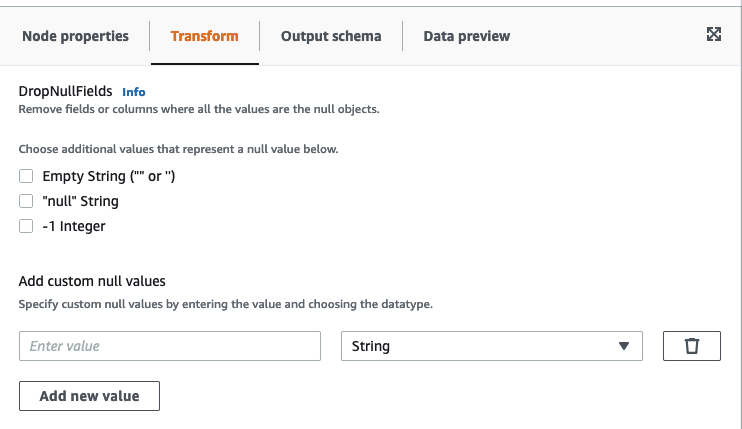

# Using DropNullFields to remove fields with null

values

Use the _DropNullFields_ transform to remove fields
from the dataset if all values in the field are ‘null’. By default, AWS Glue Studio
will recognize null objects, but some values such as empty strings, strings that are “null”,
-1 integers or other placeholders such as zeros, are not automatically recognized as nulls.

###### To use the DropNullFields

1. Add a DropNullFields node to the job diagram.
2. On the **Node properties** tab, choose additional values that
   represent a null value. You can choose to select none or all of the values:

    * Empty String ("" or '') - fields that contain empty strings will be removed
    * "null string" - fields that contain the string with the word 'null' will be
     removed
    * -1 integer - fields that contain a -1 (negative one) integer will be removed

3. If needed, you can also specify custom null values. These are null values that may
   be unique to your dataset. To add a custom null value, choose **Add new
   value**.
4. Enter the custom null value. For example, this can zero, or any value that is being
   used to represent a null in the dataset.
5. Choose the data type in the drop-down field. Data types can either be String or
   Integer.

###### Note

Custom null values and their data types must match exactly in order for the
fields to be recognized as null values and the fields removed. Partial matches where
only the custom null value matches but the data type does not will not result in the
fields being removed.
