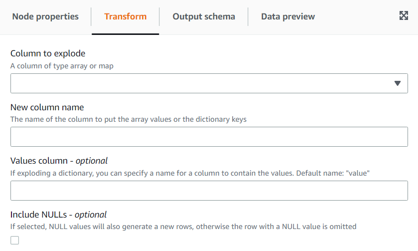

# Using the Explode Array or Map Into Rows transform

The **Explode** transform allows you to extract values from a nested structure into individual rows that are easier to
manipulate. In the case of an array, the transform will generate a row for each value of the array, replicating the values for the other
columns in the row. In the case of a map, the transform will generate a row for each entry with the key and value as columns plus any other
columns in the row.

For example, if we have this dataset which has a “category” array column with multiple values.

| product_id | category                  |
| ---------- | ------------------------- |
| 1          | [sports, winter]          |
| 2          | [garden, tools]           |
| 3          | [videogames]              |
| 4          | [game, boardgame, social] |
| 5          | []                        |

If you explode the 'category' column into a column with the same name, you will override the column. You can select that you want NULLs
included to get the following (ordered for illustration purposes):

| product_id | category   |
| ---------- | ---------- |
| 1          | sports     |
| 1          | winter     |
| 2          | garden     |
| 2          | tool       |
| 3          | videogames |
| 4          | game       |
| 4          | boardgame  |
| 4          | social     |
| 5          |            |

###### To add a Explode Array Or Map Into Rows transform:

1. Open the Resource panel and then choose
   **Explode Array Or Map Into Rows** to add a new transform to your job diagram. The node selected at the time of adding
   the node will be its parent.
2. (Optional) On the **Node properties** tab, you can enter a name for the node in the job diagram. If a node parent is
   not already selected, then choose a node from the Node parents list to use as the input source for the transform.
3. On the **Transform** tab, choose the column to explode (it must be an array or map type). Then enter a name for the
   column for the items of the array or the names of the columns for the keys and values if you are exploding a map.
4. (Optional) On the **Transform** tab, by default if the column to explode is NULL or has an empty structure, it will be
   omitted on the exploded dataset. If you want to keep the row (with the new columns as NULL) then check “Include NULLs”.

