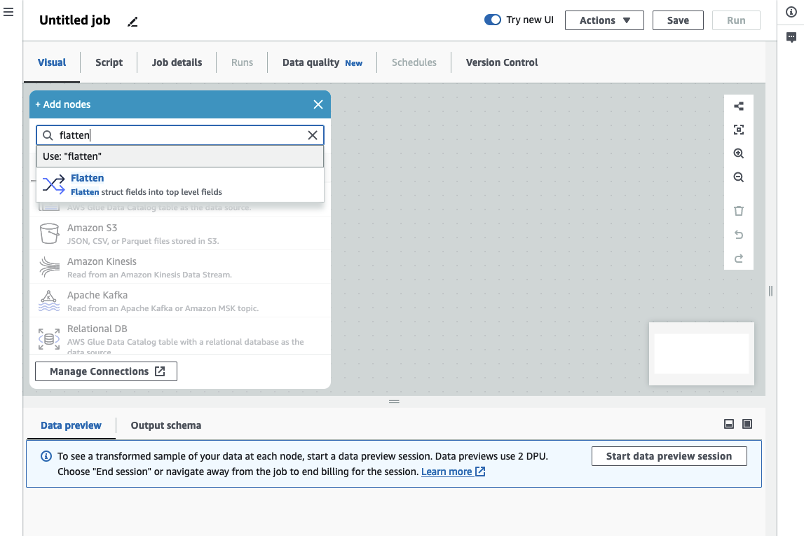

# Flatten nested structs

_Flatten_ the fields of nested structs in the data, so they become top level fields.
The new fields are named using the field name prefixed with the names of the struct fields to reach it, separated by dots.

For example, if the data has a field of type Struct named “phone_numbers”,
which among other fields has one of type “Struct” named “home_phone” with two fields: “country_code” and “number”.
Once flattened, these two fields will become top level fields named: “phone_numbers.home_phone.country_code” and “phone_numbers.home_phone.number” respectively.

###### To add a _Flatten_ transform node in your job diagram

1. Open the Resource panel and then choose the **Transforms** tab, then **Flatten** to add a new
   transform to your job diagram. You can also use the search bar by entering 'Flatten', then clicking the Flatten node.
   The node selected at the time of adding the node will be its parent.

 2. (Optional) On the **Node properties** tab, you can enter a name for the node in
the job diagram. If a node parent is not already selected, then choose a node from the
**Node parents** list to use as the input source for the
transform. 3. (Optional) On the **Transform** tab, you can limit the maximum nesting level to flatten. For instance,
setting that value to 1 means that only top-level structs will be flattened. Setting the max to 2 will flatten the top level and the structs directly under it.
