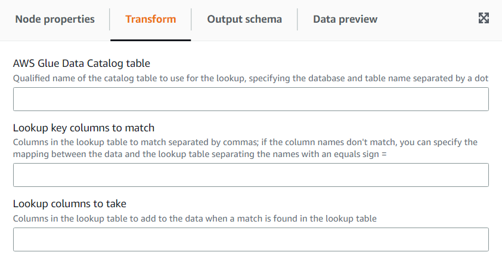

# Using the Lookup transform to add matching data from a catalog table

The **Lookup** transform allows you to add columns from a defined catalog table when the keys match the defined
lookup columns in the data. This is equivalent to doing a left outer join between the data and the lookup table using as condition
matching columns.

###### To add a Lookup transform:

1. Open the Resource panel and then choose
   **Lookup** to add a new transform to your job diagram. The node selected at the time of adding the node will be
   its parent.
2. (Optional) On the **Node properties** tab, you can enter a name for the node in the job diagram.
   If a node parent is not already selected, then choose a node from the Node parents list to use as the input source for the transform.
3. On the **Transform** tab, enter the fully qualified catalog table name to use to perform the lookups. For example,
   if your database is “mydb” and your table “mytable” then enter “mydb.mytable”. Then enter the criteria to find a match in the lookup table,
   if the lookup key is composed. Enter the list of key columns separated by commas. If one or more of the key columns don’t have the
   same name then you need to define the match mapping.

For example, if the data columns are “user_id” and “region” and in the users table the corresponding columns are named
“id” and “region“, then in the **Columns to match** field, enter: ”user_id=id, region“. You could do region=region but
it’s not needed since they are the same. 4. Finally, enter the columns to bring from the row matched in the lookup table to incorporate them into the data. If no match was found
those columns will be set to NULL.

###### Note

Underneath the **Lookup** transform, it is using a left join in order to be efficient. If the lookup table has a
composite key, ensure the columns to match are setup to match all the key columns so that only one match can occur. Otherwise, multiple
lookup rows will match and this will result in extra rows added for each of those matches.

