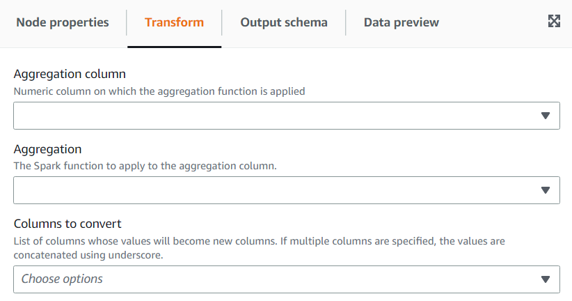

# Using the Pivot Rows to Columns transform

The **Pivot Rows to Columns** transform allows you to aggregate a numeric column by rotating unique values on
selected columns which become new columns (if multiple columns are selected, the values are concatenated to name the new columns).
That way rows are consolidated while having more columns with partial aggregations for each unique value.
For example, if you have this dataset of sales by month and country (sorted to be easier to illustrate):

| year | month | country | amount |
| ---- | ----- | ------- | ------ |
| 2020 | Jan   | uk      | 32     |
| 2020 | Jan   | de      | 42     |
| 2020 | Jan   | us      | 64     |
| 2020 | Feb   | uk      | 67     |
| 2020 | Feb   | de      | 4      |
| 2020 | Feb   | de      | 7      |
| 2020 | Feb   | us      | 6      |
| 2020 | Feb   | us      | 12     |
| 2020 | Jan   | us      | 90     |

If you pivot **amount** and **country** as the
aggregation columns, new columns are created from the original **country**
column. In the table below, you have new columns for **de**,
**uk**, and **us** instead of the
**country** column.

| year | month | de  | uk  | us  |
| ---- | ----- | --- | --- | --- |
| 2020 | Jan   | 42  | 32  | 64  |
| 2020 | Jan   | 11  | 67  | 18  |
| 2021 | Jan   |     |     | 90  |

If instead you want to pivot both the month and county, you get a column for each combination of the values of those columns:

| year | Jan_de | Jan_uk | Jan_us | Feb_de | Feb_uk | Feb_us |
| ---- | ------ | ------ | ------ | ------ | ------ | ------ |
| 2020 | 42     | 32     | 64     | 11     | 67     | 18     |
| 2021 |        |        | 90     |        |        |        |

###### To add a Pivot Rows To Columns transform:

1. Open the Resource panel and then choose
   **Pivot Rows To Columns** to add a new transform to your job diagram. The node selected at the time of adding the
   node will be its parent.
2. (Optional) On the **Node properties** tab, you can enter a name for the node in the job diagram.
   If a node parent is not already selected, then choose a node from the Node parents list to use as the input source for the transform.
3. On the **Transform** tab, choose the numeric column which will be aggregated to produce the values for the new
   columns, the aggregation function to apply and the column(s) to convert its unique values into new columns.

