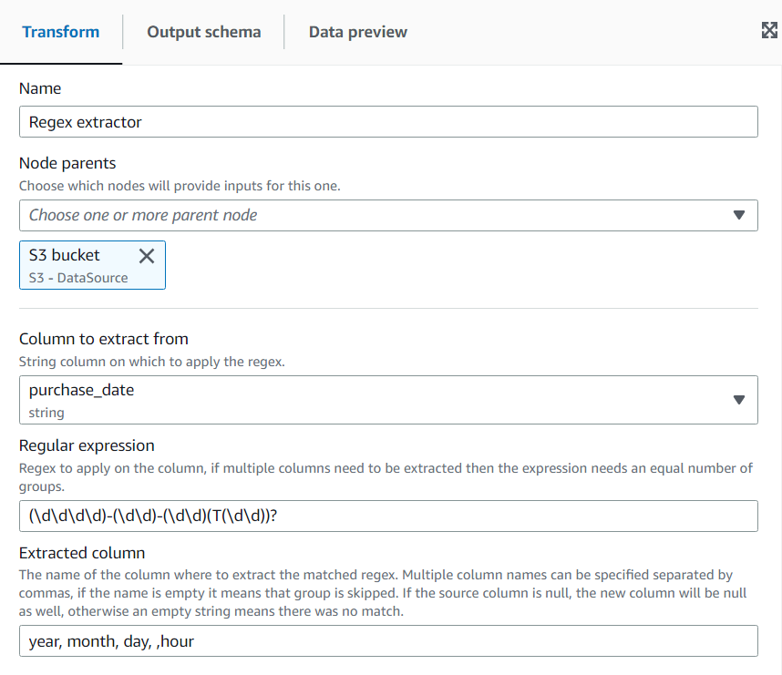
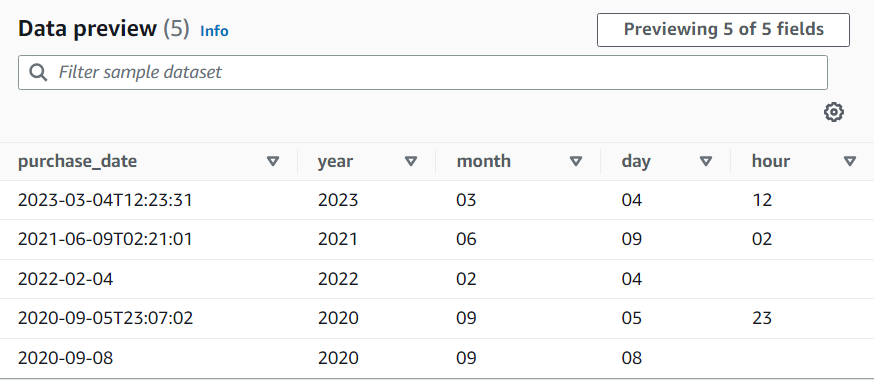

# Extracting string fragments using a regular expression

This transform extracts string fragments using a regular expression and creates a new column out of it, or multiple columns if using regex groups.

###### To add a Regex Extractor transform node to your job diagram

1. Open the Resource panel, and then choose **Regex Extractor** to add a new
   transform to your job diagram. The node selected at the time of adding the node will be its parent.
2. In the node properties panel, you can enter a name for the node in
   the job diagram. If a node parent isn't already selected, choose a node from the
   **Node parents** list to use as the input source for the
   transform.
3. On the **Transform** tab, enter the regular expression and the column on which it needs to be applied. Then enter the name of the new column on which to store the matching string. The new column will be null only if the source column is null, if the regex doesn’t match the column will be empty.

If the regex uses groups, there has be a corresponding column name separated by comma but you can skip groups by leaving the column name empty.

For example, if you have a column "purchase_date" with a string using both long and short ISO date formats, then you want to extract the year, month, day and hour, when available. Notice the hour group is optional, otherwise in the rows where not available, all the extracted groups would be empty strings (because the regex didn’t match). In this case, we don't want the group to make the time optional but the inner one, so we leave the name empty and it doesn’t get extracted (that group would include the T character).

Resulting in the data preview:

