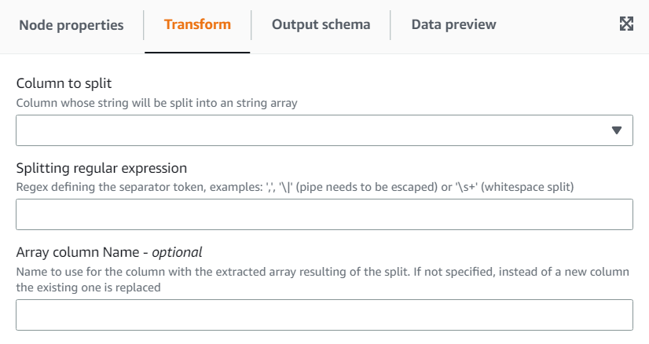

# Using the Split String transform to break up a string column

The Split String transform allows you to break up a string into an array of tokens using a regular expression to define how the split is done.
You can then keep the column as an array type or apply an **Array To Columns** transform after this one, to extract the array
values onto top level fields, assuming that each token has a meaning we know beforehand. Also, if the order of
the tokens is irrelevant (for instance, a set of categories), you can use the **Explode** transform to generate a separate row
for each value.

For example, you can split a the column “categories” using a comma as a pattern to add a column “categories_arr”.

| product_id | categories            | categories_arr            |
| ---------- | --------------------- | ------------------------- |
| 1          | sports,winter         | [sports, winter]          |
| 2          | garden,tools          | [garden, tools]           |
| 3          | videogames            | [videogames]              |
| 4          | game,boardgame,social | [game, boardgame, social] |

###### To add a Split String transform:

1. Open the Resource panel and then choose Split String to add a new
   transform to your job diagram. The node selected at the time of adding the node will be its parent.
2. (Optional) On the Node properties tab, you can enter a name for the node in the job diagram. If a node parent is not already selected,
   then choose a node from the Node parents list to use as the input source for the transform.
3. On the **Transform** tab, choose the column to split and enter the pattern to use to split the string. In most cases
   you can just enter the character(s) unless it has a special meaning as a regular expression and needs to be escaped. The characters that
   need escaping are: `\.[]{}()<>*+-=!?^$|` by adding a backslash in front of the character.
   For instance if you want to separate by a dot ('.') you need to enter `\.`. However, a comma doesn’t have a special meaning and
   can just be specified as is: `,`.

 4. (Optional) If you want to keep the original string column, then you can enter a name for a new array column, this way keeping both the
original string column and the new tokenized array column.
