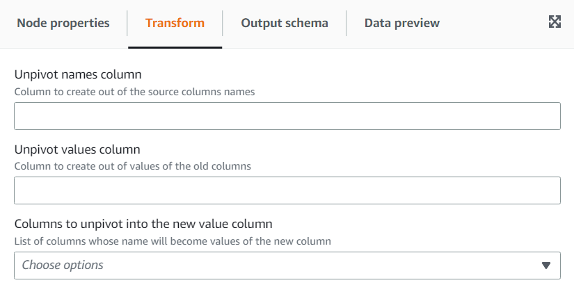

# Using the Unpivot Columns To Rows transform

The **Unpivot** transform allows you convert columns into values of new columns generating a row for each unique value.
It’s the opposite of pivot but note that it’s not equivalent since it cannot separate rows with identical values that were aggregated or
split combinations into the original columns (you can do that later using a Split transform).
For example, if you have the following table:

| year | month | de  | uk  | us  |
| ---- | ----- | --- | --- | --- |
| 2020 | Jan   | 42  | 32  | 64  |
| 2020 | Feb   | 11  | 67  | 18  |
| 2021 | Jan   |     |     | 90  |

You can unpivot the columns: “de”, “uk” and “us” into a column “country” with the value “amount”, and get the following (sorted here for
illustration purposes):

| year | month | country | amount |
| ---- | ----- | ------- | ------ |
| 2020 | Jan   | uk      | 32     |
| 2020 | Jan   | de      | 42     |
| 2020 | Jan   | us      | 64     |
| 2020 | Feb   | uk      | 67     |
| 2020 | Feb   | de      | 11     |
| 2020 | Feb   | us      | 18     |
| 2021 | Jan   | us      | 90     |

Notice the columns that have a NULL value (“de” and “uk of Jan 2021) don’t get generated by default. You can enable that option to get:

| year | month | country | amount |
| ---- | ----- | ------- | ------ |
| 2020 | Jan   | uk      | 32     |
| 2020 | Jan   | de      | 42     |
| 2020 | Jan   | us      | 64     |
| 2020 | Feb   | uk      | 67     |
| 2020 | Feb   | de      | 11     |
| 2020 | Feb   | us      | 18     |
| 2021 | Jan   | us      | 90     |
| 2021 | Jan   | de      |        |
| 2021 | Jan   | uk      |        |

###### To add a Unpivot Columns to Rows transform:

1. Open the Resource panel and then choose
   **Unpivot Columns to Rows** to add a new transform to your job diagram. The node selected at the time of adding the
   node will be its parent.
2. (Optional) On the **Node properties** tab, you can enter a name for the node in the job diagram. If a node parent is
   not already selected, then choose a node from the Node parents list to use as the input source for the transform.
3. On the **Transform** tab, enter the new columns to be created to hold the names and values of the columns chosen
   to unpivot.

