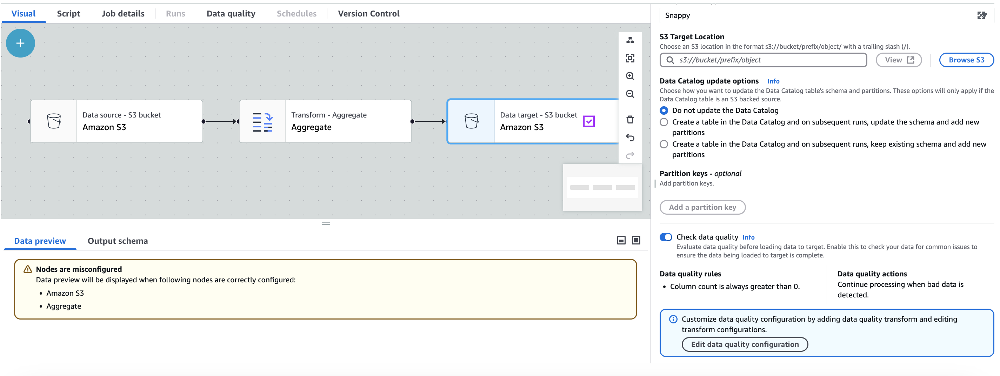
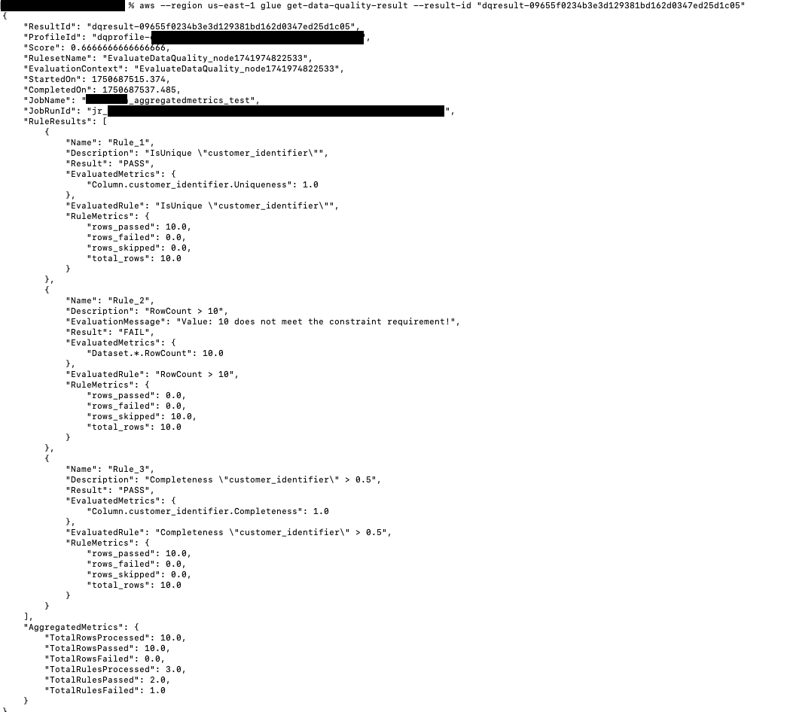

# Evaluating

data
quality
for ETL jobs in AWS Glue Studio

In
this tutorial, you get
started with AWS Glue Data Quality in AWS Glue Studio.
You
will learn how to:

- Create rules using the
  Data Quality
  Definition Language
  (DQDL)
  rule builder.
- Specify data quality actions, data to output, and the output location of the data quality results.
- Review data quality results.

To
practice with an example, review
the blog post
[**Getting
started with AWS Glue Data Quality for ETL
pipelines**](https://aws.amazon.com/blogs/big-data/getting-started-with-aws-glue-data-quality-for-etl-pipelines/ "https://aws.amazon.com/blogs/big-data/getting-started-with-aws-glue-data-quality-for-etl-pipelines/").

## Step 1: Add the Evaluate Data Quality

transform node
to the visual job

In this step, you add the Evaluate Data Quality
node
to the visual job editor.

###### To add the data quality node

1. In
   the AWS Glue Studio console, choose **Visual with a source and target**
   from the **Create job**
   section,
   and then
   choose
   **Create**.
2. Choose a node
   that
   you
   want
   to apply the data quality
   transform
   to. Typically, this will be a transform
   node or a data source.
3. Open the resource panel on the left
   by
   choosing
   the "+"
   icon.
   Then
   search for **Evaluate Data Quality** in the search bar and
   choose **Evaluate Data Quality** from the search results.
4. The visual job editor
   showsthe
   **Evaluate Data Quality** transform node branching from the
   node you selected. On the right side of the console, the
   **Transform** tab is automatically opened. If you need to
   change the parent node, choose the **Node properties** tab,
   and
   then choose the node parent from the
   dropdown
   menu.

When you choose a new node parent, a new connection is made between the parent node and the
**Evaluate Data Quality** node. Remove any unwanted parent nodes. Only one parent node can
be connected to one **Evaluate Data Quality** node. 5. The
Evaluate
Data Quality transform supports multiple parents
so
you
can
validate data quality rules across multiple datasets. Rules
that support multiple datasets include
ReferentialIntegrity,
DatasetMatch, SchemaMatch,
RowCountMatch,
and AggregateMatch.

When you add multiple inputs to the Evaluate Data Quality
transform,
you need to select your “primary” input. Your primary input is the dataset that
you want to validate data quality for. All other nodes or inputs are treated as
references.

You
can use the Evaluate Data Quality transform
to
identify specific records that failed data quality checks.
We recommend
that
you
choose your primary dataset because new columns
that
flag bad records are added to the primary dataset. 6. You can specify aliases for input data sources. Aliases provide another way
to reference the input source when
you're
using the ReferentialIntegrity rule.
Becauseonly
one data source can be designated as the primary source, each additional data
source
that you add will require an alias.

In the following example, the ReferentialIntegrity rule
specifies
the input data source by the alias name and
performs
a
one-to-one
comparison to the primary data source.

```
Rules = [
	ReferentialIntegrity “Aliasname.name” = 1
]

```

## Step 2: Create a rule using DQDL

In this step, you create a rule using DQDL. For this tutorial, you
create a
single rule using the **Completeness** rule type. This rule type
checks
the percentage of complete (non-null) values in a column against a given expression. For
more information
about
using DQDL, see [DQDL](dqdl.md "dqdl.md").

1. On
   the **Transform** tab, add a **Rule type** by choosing
   the
   **Insert**
   button. This adds the rule type to the rule
   editor,
   where you can enter the parameters for the rule.

###### Note

When
you're
editing rules, ensure that
the
rules are within the brackets and
that
the rules are separated by commas. For example, a complete rule expression
will look
like
the following:

```
Rules= [
    Completeness "year">0.8, Completeness "month">0.8
]

```

This example specifies the parameter for
completeness
for the columns named 'year' and 'month'.
For
the rule to pass,
these
columns must be greater than 80% 'complete', or
must
have data in over 80% of instances for each respective
column.

In this example, search for and insert the **Completeness**
rule type. This
adds
the rule type to the rule editor. This rule type has the following syntax:
`Completeness <COL_NAME> <EXPRESSION>`.

Most rule types require that you provide an expression as a
parameter in order to create a
Boolean
response. For more information on supported DQDL expressions, see
[DQDL
expressions](dqdl.md#dqdl-syntax "dqdl.md#dqdl-syntax").
Next,
you'll
add the column name. 2. In the DQDL rule builder,
choose
the **Schema** tab. Use the search bar to locate the column
name in the input schema. The input schema displays the column name and data
type. 3. In the rule editor, click to the right of the rule type to insert the cursor
where the column will be inserted. Alternately, you can
enter
in the name of the column in the rule.

For example, from the list of columns in the input schema list,
choose
the
**Insert**
button next to the column (in this example, **year**). This
adds
the column to the rule. 4. Then, in the rule editor, add an expression to evaluate the rule.
Because
the **Completeness** rule type checks the percentage of
complete (non-null) values in a column against a given expression, enter an
expression such as `> 0.8`. This rule
checks
the column if
it's
greater than 80% complete (non-null) values.

## Step 3: Configure

data
quality
outputs

After creating data quality rules, you can select additional options to specify data quality node output.

1.  In **Data quality transform output**, choose from the following options:
    - **Original data**
      –
      Choose to output original input data. When you choose this
      option,
      a new child node “rowLevelOutcomes”
      is
      added to the job. The schema
      matches
      the schema of the primary dataset
      that
      was passed as input to the transform. This option is useful if you just
      want to pass the data through and fail the job when quality issues
      occur.

    Another use
    case is when you want to detect bad records that
    failed
    data
    quality
    checks. To detect bad records, choose the option
    **Add
    new columns to indicate data quality
    errors**.
    This action adds four new columns to the schema of the
    “rowLevelOutcomes” transform.

        + **DataQualityRulesPass**
         (string array) –
         Provides
         an array of rules that passed
         data
         quality
         checks.
        + **DataQualityRulesFail** (string array)
         –
         Provides
         an array
         of
         rules that failed
         data
         quality
         checks.
        + **DataQualityRulesSkip** (string array)
         –
         Provides
         an array
         of
         rules that were skipped. The following rules cannot identify
         error records
         because
         they're
         applied at
         the
         dataset level.


        	- AggregateMatch
        	- ColumnCount
        	- ColumnExists
        	- ColumnNamesMatchPattern
        	- CustomSql
        	- RowCount
        	- RowCountMatch
        	- StandardDeviation
        	- Mean
        	- ColumnCorrelation
        + **DataQualityEvaluationResult** –
         Provides
         “Passed” or “Failed” status at
         the
         row level. Note that your overall results can
         be FAIL, but a certain record
         might
         pass. For example, the RowCount rule
         might
         have failed, but all other rules might
         have
         been successful. In such instances, this field status is
         'Passed'.

2.  **Data quality results**
    –
    Choose to output configured rules and their pass or fail status. This option is
    useful if you want to write your results to Amazon S3 or other databases.
3.  **Data quality output settings**
    (Optional) – Choose **Data quality output
    settings** to reveal the **Data quality result
    location** field. Then, choose **Browse** to
    search for an Amazon S3 location to set as the data quality output target.

## Step 4. Configure

data
quality
actions

You can use
actions
to publish metrics to CloudWatch or
to
stop jobs based on specific criteria. Actions are only available after
you create a rule. When you choose this option, the same metrics are also published to
Amazon EventBridge. You can use these options to [create alerts for
notification](data-quality-alerts.md "data-quality-alerts.md").

- **On ruleset failure** – You can choose what to do if a
  ruleset fails while the job is running. If you want the job to fail if data
  quality fails, choose when the job should fail by selecting one of the
  following
  options.
  By default, this action is not
  selected,
  and the job
  completes
  its run even if data quality rules fail.
  - **None**
    –
    If you choose **None** (default), the
    job
    does
    not
    fail and
    continues
    to run despite ruleset failures.
  - **Fail job after loading data to target** –
    The
    job
    fails
    and no data is saved. In order to save the results, choose an Amazon S3
    location where the data quality results will be saved.
  - **Fail job without loading to target data** –
    This option
    fails
    the job immediately when
    a
    data quality error
    occurs. It
    does
    not load any data targets, including the results from the data quality
    transform.

## Step 5: View data quality results

After running the job, view the data quality results by
choosing
the **Data quality** tab.

1. For each job run, view the
   data
   quality results. Each node displays a data quality status and status detail.
   Choose
   a node to view all rules and the status of each rule.
2. Choose
   **Download results** to download a CSV file that contains
   information about the job run and data quality results.
3. If you have more than one job run with data quality results, you can filter the results by date and time range. Choose
   _Filter by a date and time range_ to expand the filter window.
4. Choose a relative range or absolute range. For absolute ranges, use the
   calendar to select a
   date,
   and enter values for start time and end time. When
   you're
   done, choose **Apply**.

## Automatic Data Quality

When you create a AWS Glue ETL job with Amazon S3 as the target, AWS Glue ETL automatically enables a Data Quality rule that checks if
the data being loaded has at least one column. This rule is designed to ensure that the data being loaded is not
empty or corrupted. However, if this rule fails, the job will not fail; instead, you will notice a reduction in your data
quality score. Additionally, Anomaly Detection is enabled by default, which monitors the number of columns in the data. If
there are any variations or abnormalities in the column count, AWS Glue ETL will inform you about these anomalies. This feature
helps you identify potential issues with the data and take appropriate actions. To view the Data Quality rule and its
configuration, you can click on the Amazon S3 target in your AWS Glue ETL job. The rule's configuration will be displayed, as shown in
the provided screenshot.



You can add additional data quality rules by selecting **Edit data quality configuration**.

## Aggregated Metrics

You may require aggregated metrics such as number of records that passed, failed, skipped at a rule level or at the ruleset level to build dashboards. In order to get the Aggregated Metrics and Rule Metrics for each rule, first, enable Aggregated Metrics by adding the `publishAggregatedMetrics` option to your `EvaluateDataQuality` function.

The possible options for `additional_options` `publishAggregatedMetrics` are `ENABLED` and `DISABLED`. As an example:

```
EvaluateDataQualityMultiframe = EvaluateDataQuality().process_rows(
    frame=medicare_dyf,
    ruleset=EvaluateDataQuality_ruleset,
    publishing_options={
        "dataQualityEvaluationContext": "EvaluateDataQualityMultiframe",
        "enableDataQualityCloudWatchMetrics": False,
        "enableDataQualityResultsPublishing": False,
    },
    additional_options={"publishAggregatedMetrics.status": "ENABLED"},
)
```

If not specified, the `publishAggregatedMetrics.status` is `DISABLED` by default and the ruleMetrics and aggregated metrics would now be computed. This feature is currently supported in AWS Glue Interactive Sessions and in Glue ETL jobs. This is not supported in Glue Catalog Data Quality APIs.

### Retrieving aggregated metrics results

When `additionalOptions` `"publishAggregatedMetrics.status": "ENABLED"`, you can get the results in two places:

1. `AggregatedMetrics` and `RuleMetrics` are returned through the `GetDataQualityResult()` when providing the `resultId` where `AggregatedMetrics` and `RuleMetrics` include:

**Aggregated Metrics:**

    * Total rows processed
    * Total rows passed
    * Total rows failed
    * Total Rules Processed
    * Total Rules Passed
    * Total Rules Failed



Also, at a rule level, the following metrics are provided:

**Rule Metrics:**

    * Rows Passed
    * Rows Failed
    * Row Skipped
    * Total Rows Processed

2. `AggregatedMetrics` is returned as an additional data frame and `RuleOutcomes` data frame is augmented to include `RuleMetrics`.

### Example implementation

The following example shows how to implement aggregated metrics in Scala:

```
// Script generated for node Evaluate Data Quality
val EvaluateDataQuality_node1741974822533_ruleset = """
  # Example rules: Completeness "colA" between 0.4 and 0.8, ColumnCount > 10
  Rules = [
      IsUnique "customer_identifier",
      RowCount > 10,
      Completeness "customer_identifier" > 0.5
  ]
"""

val EvaluateDataQuality_node1741974822533 = EvaluateDataQuality.processRows(frame=ChangeSchema_node1742850392012, ruleset=EvaluateDataQuality_node1741974822533_ruleset, publishingOptions=JsonOptions("""{"dataQualityEvaluationContext": "EvaluateDataQuality_node1741974822533", "enableDataQualityCloudWatchMetrics": "true", "enableDataQualityResultsPublishing": "true"}"""), additionalOptions=JsonOptions("""{"compositeRuleEvaluation.method":"ROW","observations.scope":"ALL","performanceTuning.caching":"CACHE_NOTHING", "publishAggregatedMetrics.status": "ENABLED"}"""))

println("--------------------------------ROW LEVEL OUTCOMES--------------------------------")
val rowLevelOutcomes_node = EvaluateDataQuality_node1741974822533("rowLevelOutcomes")

rowLevelOutcomes_node.show(10)

 println("--------------------------------RULE LEVEL OUTCOMES--------------------------------")

val ruleOutcomes_node = EvaluateDataQuality_node1741974822533("ruleOutcomes")

ruleOutcomes_node.show()

 println("--------------------------------AGGREGATED METRICS--------------------------------")

val aggregatedMetrics_node = EvaluateDataQuality_node1741974822533("aggregatedMetrics")

aggregatedMetrics_node.show()
```

### Sample results

Results are returned as follows:

```
{
    "Rule": "IsUnique \"customer_identifier\"",
    "Outcome": "Passed",
    "FailureReason": null,
    "EvaluatedMetrics": {
        "Column.customer_identifier.Uniqueness": 1
    },
    "EvaluatedRule": "IsUnique \"customer_identifier\"",
    "PassedCount": 10,
    "FailedCount": 0,
    "SkippedCount": 0,
    "TotalCount": 10
}
{
    "Rule": "RowCount > 10",
    "Outcome": "Failed",
    "FailureReason": "Value: 10 does not meet the constraint requirement!",
    "EvaluatedMetrics": {
        "Dataset.*.RowCount": 10
    },
    "EvaluatedRule": "RowCount > 10",
    "PassedCount": 0,
    "FailedCount": 0,
    "SkippedCount": 10,
    "TotalCount": 10
}
{
    "Rule": "Completeness \"customer_identifier\" > 0.5",
    "Outcome": "Passed",
    "FailureReason": null,
    "EvaluatedMetrics": {
        "Column.customer_identifier.Completeness": 1
    },
    "EvaluatedRule": "Completeness \"customer_identifier\" > 0.5",
    "PassedCount": 10,
    "FailedCount": 0,
    "SkippedCount": 0,
    "TotalCount": 10
}
```

Aggregated Metrics are as follows:

```
{ "TotalRowsProcessed": 10, "PassedRows": 10, "FailedRows": 0, "TotalRulesProcessed": 3, "RulesPassed": 2, "RulesFailed": 1 }
```
