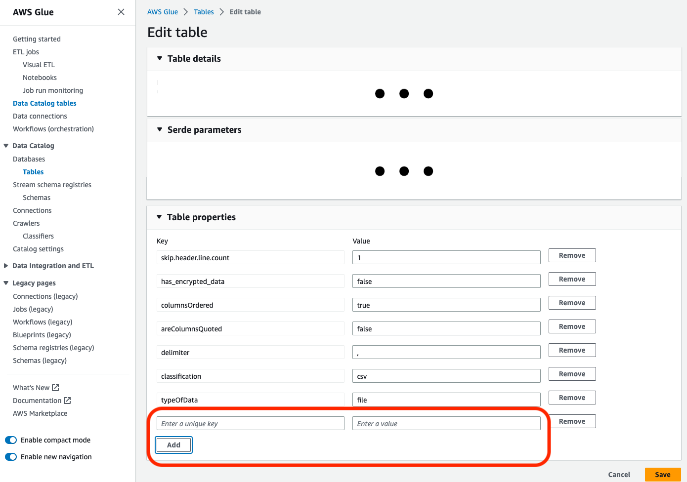

# Updating the schema, and adding new partitions in the Data Catalog using

AWS Glue ETL jobs

Your extract, transform, and load (ETL) job might create new table partitions in the target
data store. Your dataset schema can evolve and diverge from the AWS Glue Data Catalog schema over
time. AWS Glue ETL jobs now provide several features that you can use within your ETL script to
update your schema and partitions in the Data Catalog. These features allow you to see the
results of your ETL work in the Data Catalog, without having to rerun the crawler.

## New partitions

If you want to view the new partitions in the AWS Glue Data Catalog, you can do one of the following:

- When the job finishes, rerun the crawler, and view the new partitions on the
  console when the crawler finishes.
- When the job finishes, view the new partitions on the console right away, without
  having to rerun the crawler. You can enable this feature by adding a few lines of
  code to your ETL script, as shown in the following examples. The code uses the
  `enableUpdateCatalog` argument to indicate that the Data Catalog is to be
  updated during the job run as the new partitions are created.

**Method 1**

Pass `enableUpdateCatalog` and `partitionKeys` in an
options argument.

Python

```
additionalOptions = {"enableUpdateCatalog": True}
additionalOptions["partitionKeys"] = ["region", "year", "month", "day"]


sink = glueContext.write_dynamic_frame_from_catalog(frame=last_transform, database=`<target_db_name>`,
                                                    table_name=`<target_table_name>`, transformation_ctx="write_sink",
                                                    additional_options=additionalOptions)
```

Scala

```
val options = JsonOptions(Map(
    "path" -> `<S3_output_path>`,
    "partitionKeys" -> Seq("region", "year", "month", "day"),
    "enableUpdateCatalog" -> true))
val sink = glueContext.getCatalogSink(
    database = `<target_db_name>`,
    tableName = `<target_table_name>`,
    additionalOptions = options)sink.writeDynamicFrame(df)
```

**Method 2**

Pass `enableUpdateCatalog` and `partitionKeys` in
`getSink()`, and call `setCatalogInfo()` on the
`DataSink` object.

Python

```
sink = glueContext.getSink(
    connection_type="s3",
    path="`<S3_output_path>`",
    enableUpdateCatalog=True,
    partitionKeys=["region", "year", "month", "day"])
sink.setFormat("json")
sink.setCatalogInfo(catalogDatabase=`<target_db_name>`, catalogTableName=`<target_table_name>`)
sink.writeFrame(last_transform)
```

Scala

```
val options = JsonOptions(
   Map("path" -> `<S3_output_path>`,
       "partitionKeys" -> Seq("region", "year", "month", "day"),
       "enableUpdateCatalog" -> true))
val sink = glueContext.getSink("s3", options).withFormat("json")
sink.setCatalogInfo(`<target_db_name>`, `<target_table_name>`)
sink.writeDynamicFrame(df)
```

Now, you can create new catalog tables, update existing tables with modified schema, and add new table partitions in the Data Catalog using an AWS Glue ETL job itself, without the need to re-run crawlers.

## Updating table schema

If you want to overwrite the Data Catalog table’s schema you can do one of the following:

- When the job finishes, rerun the crawler and make sure your crawler is configured to update the table definition as well. View the new partitions on the console along with any schema updates, when the crawler finishes. For more information, see [Configuring a Crawler Using the API](crawler-configuration.md#crawler-configure-changes-api "crawler-configuration.md#crawler-configure-changes-api").
- When the job finishes, view the modified schema on the console right away, without having to rerun the crawler. You can enable this feature by adding a few lines of code to your ETL script, as shown in the following examples. The code uses `enableUpdateCatalog` set to true, and also `updateBehavior` set to `UPDATE_IN_DATABASE`, which indicates to overwrite the schema and add new partitions in the Data Catalog during the job run.

Python

```
additionalOptions = {
    "enableUpdateCatalog": True,
    "updateBehavior": "UPDATE_IN_DATABASE"}
additionalOptions["partitionKeys"] = ["partition_key0", "partition_key1"]

sink = glueContext.write_dynamic_frame_from_catalog(frame=last_transform, database=`<dst_db_name>`,
    table_name=`<dst_tbl_name>`, transformation_ctx="write_sink",
    additional_options=additionalOptions)
job.commit()
```

Scala

```
val options = JsonOptions(Map(
    "path" -> outputPath,
    "partitionKeys" -> Seq("partition_0", "partition_1"),
    "enableUpdateCatalog" -> true))
val sink = glueContext.getCatalogSink(database = nameSpace, tableName = tableName, additionalOptions = options)
sink.writeDynamicFrame(df)
```

You can also set the `updateBehavior` value to `LOG` if you want to prevent your table schema from being overwritten, but still want to add the new partitions. The default value of `updateBehavior` is `UPDATE_IN_DATABASE`, so if you don’t explicitly define it, then the table schema will be overwritten.

If `enableUpdateCatalog` is not set to true, regardless of whichever option selected for `updateBehavior`, the ETL job will not update the table in the Data Catalog.

## Creating new tables

You can also use the same options to create a new table in the Data Catalog. You can specify the database and new table name using `setCatalogInfo`.

Python

```
sink = glueContext.getSink(connection_type="s3", path="s3://path/to/data",
    enableUpdateCatalog=True, updateBehavior="UPDATE_IN_DATABASE",
    partitionKeys=["partition_key0", "partition_key1"])
sink.setFormat("<format>")
sink.setCatalogInfo(catalogDatabase=`<dst_db_name>`, catalogTableName=`<dst_tbl_name>`)
sink.writeFrame(last_transform)
```

Scala

```
val options = JsonOptions(Map(
    "path" -> outputPath,
    "partitionKeys" -> Seq("<partition_1>", "<partition_2>"),
    "enableUpdateCatalog" -> true,
    "updateBehavior" -> "UPDATE_IN_DATABASE"))
val sink = glueContext.getSink(connectionType = "s3", connectionOptions = options).withFormat("<format>")
sink.setCatalogInfo(catalogDatabase = “`<dst_db_name>`”, catalogTableName = “`<dst_tbl_name>`”)
sink.writeDynamicFrame(df)
```

## Restrictions

Take note of the following restrictions:

- Only Amazon Simple Storage Service (Amazon S3) targets are supported.
- The `enableUpdateCatalog` feature is not supported for governed tables.
- Only the following formats are supported: `json`, `csv`,
  `avro`, and `parquet`.
- To create or update tables with the `parquet` classification, you must utilize the
  AWS Glue optimized parquet writer for DynamicFrames. This can be achieved with one of the
  following:
  - If you're updating an existing table in the catalog with `parquet` classification, the
    table must have the `"useGlueParquetWriter"` table property set to `true` before you update
    it. You can set this property via the AWS Glue APIs/SDK, via the console or via an Athena DDL statement.

  

  Once the catalog table property is set, you can use the following snippet of code to update the catalog table with the new data:

  ```
  glueContext.write_dynamic_frame.from_catalog(
      frame=`frameToWrite`,
      database="`dbName`",
      table_name="`tableName`",
      additional_options={
          "enableUpdateCatalog": True,
          "updateBehavior": "UPDATE_IN_DATABASE"
      }
  )
  ```

  - If the table doesn't already exist within catalog, you can utilize the `getSink()` method in your
    script with `connection_type="s3"` to add the table and its partitions to the catalog, along with
    writing the data to Amazon S3. Provide the appropriate `partitionKeys` and `compression` for your workflow.

  ```
  s3sink = glueContext.getSink(
      path="s3://`bucket/folder/`",
      connection_type="s3",
      updateBehavior="UPDATE_IN_DATABASE",
      partitionKeys=[],
      compression="snappy",
      enableUpdateCatalog=True
  )

  s3sink.setCatalogInfo(
      catalogDatabase="`dbName`", catalogTableName="`tableName`"
  )

  s3sink.setFormat("parquet", useGlueParquetWriter=True)
  s3sink.writeFrame(`frameToWrite`)
  ```

  - The `glueparquet` format value is a legacy method of enabling the AWS Glue parquet writer.

- When the `updateBehavior` is set to `LOG`, new partitions will be added only if the `DynamicFrame` schema is equivalent to or contains a subset of the columns defined in the Data Catalog table's schema.
- Schema updates are not supported for non-partitioned tables (not using the "partitionKeys" option).
- Your partitionKeys must be equivalent, and in the same order, between your parameter passed in your ETL script and the partitionKeys in your Data Catalog table schema.
- This feature currently does not yet support updating/creating tables in which the updating schemas are nested (for example, arrays inside of structs).

For more information, see [Programming Spark scripts](aws-glue-programming.md "aws-glue-programming.md").
