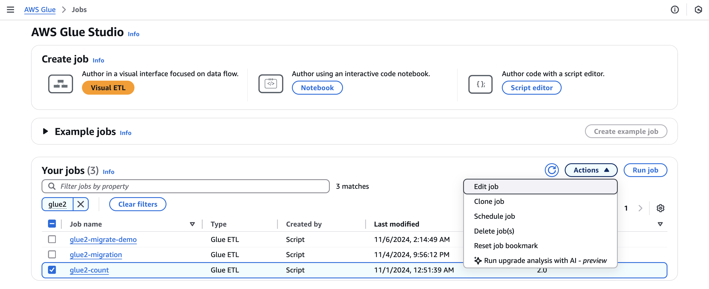
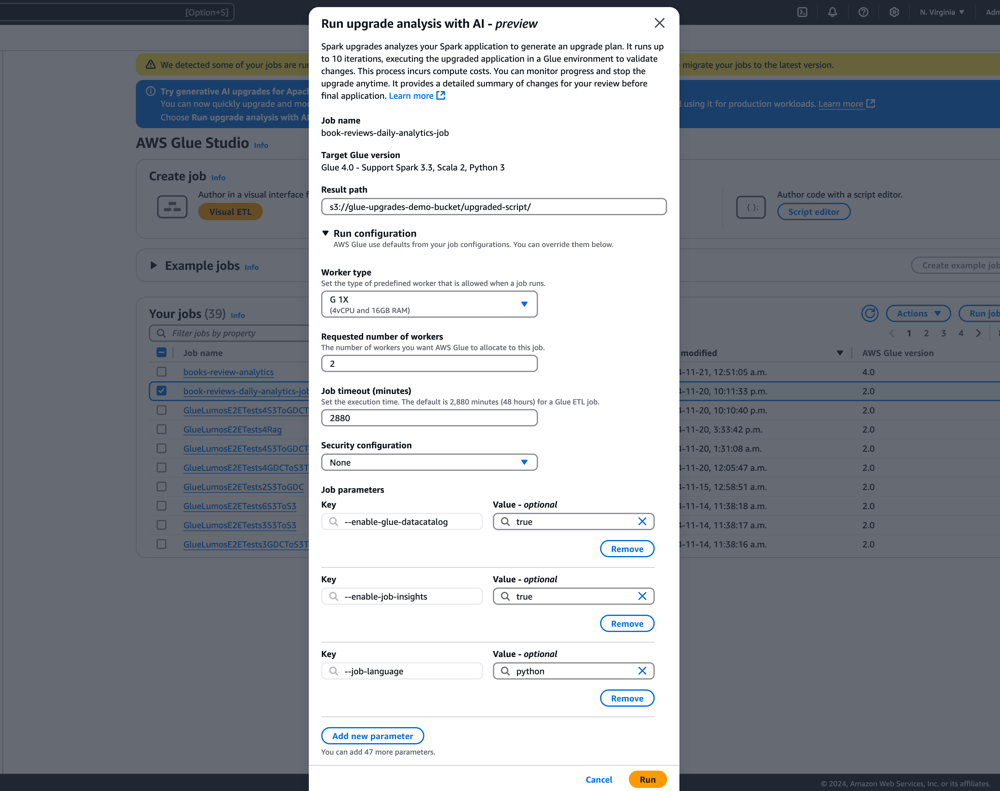
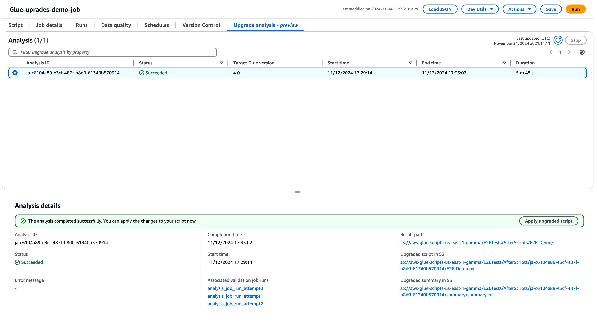
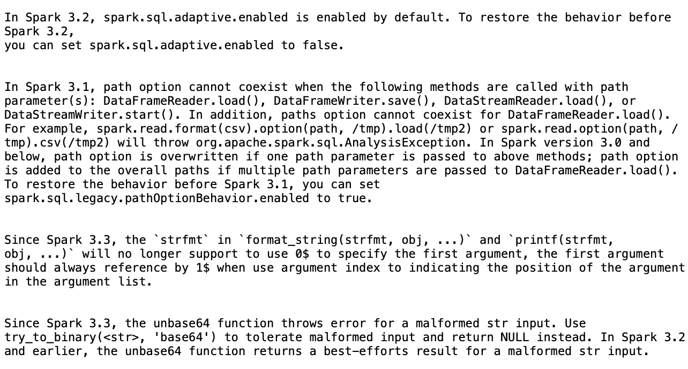
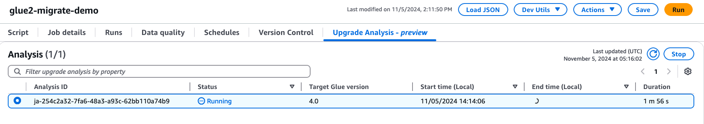

# Generative AI upgrades for Apache Spark in AWS Glue

Spark Upgrades in AWS Glue enables data engineers and developers to upgrade and migrate their existing AWS Glue Spark jobs to the latest Spark
releases using generative AI. Data engineers can use it to scan their AWS Glue Spark jobs, generate upgrade plans, execute plans, and validate outputs.
It reduces the time and cost of Spark upgrades by automating the undifferentiated work of identifying and updating Spark scripts,
configurations, dependencies, methods, and features.


## How it works

When you use upgrade analysis, AWS Glue identifies
differences between versions and configurations in your job's code to generate an upgrade plan.
The upgrade plan details all code changes, and required migration steps. Next, AWS Glue builds and runs the upgraded application in an
environment to validate changes and generates a list of code changes for you to migrate your job. You can view the updated
script along with the summary that details the proposed changes. After running your own tests, accept the changes and the AWS Glue
job will be updated automatically to the latest version with the new script.

The upgrade analysis process can take some time to complete, depending on the complexity of the job and the workload. The results of
the upgrade analysis will be stored in the specified Amazon S3 path, which can be reviewed to understand the upgrade and any
potential compatibility issues. After reviewing the upgrade analysis results, you can decide whether to proceed with the actual
upgrade or make any necessary changes to the job before upgrading.

## Prerequisites

The following prerequisites are required to use generative AI to upgrade jobs in AWS Glue:

- AWS Glue 2 PySpark jobs – only AWS Glue 2 jobs can be upgraded to AWS Glue 5.
- IAM permissions are required to start the analysis, review the results and upgrade your job.
  For more information, see the examples in the [Permissions](#auto-upgrade-permissions "#auto-upgrade-permissions") section below.
- If using AWS KMS to encrypt analysis artifacts, then additional AWS AWS KMS
  permissions are needed. For more information, see the examples in the [AWS KMS policy](#auto-upgrade-kms-policy "#auto-upgrade-kms-policy") section below.

### Permissions

1. Update the IAM policy of the caller with the following permission:

JSON

```
`{
 "Version":"2012-10-17",
 "Statement": [
 {
 "Effect": "Allow",
 "Action": [
 "glue:StartJobUpgradeAnalysis",
 "glue:StartJobRun",
 "glue:GetJobRun",
 "glue:GetJob",
 "glue:BatchStopJobRun"
 ],
 "Resource": [
 "arn:aws:glue:`us-east-1`:`111122223333`:job/jobName"
 ]
 },
 {
 "Effect": "Allow",
 "Action": [
 "s3:GetObject"
 ],
 "Resource": [
 "arn:aws:s3:::`amzn-s3-demo-bucket`/script-location/*"
 ]
 },
 {
 "Effect": "Allow",
 "Action": [
 "s3:PutObject",
 "s3:GetObject"
 ],
 "Resource": [
 "arn:aws:s3:::`amzn-s3-demo-bucket`/results/*"
 ]
 },
 {
 "Effect": "Allow",
 "Action": [
 "kms:Decrypt",
 "kms:GenerateDataKey"
 ],
 "Resource": "arn:aws:kms:`us-east-1`:`111122223333`:key/`key-id`"
 }
 ]
}`

```

2. Update the Execution role of the job you are upgrading to include the following in-line policy:

```
    {
      "Effect": "Allow",
      "Action": ["s3:GetObject"],
      "Resource": [
        "ARN of the Amazon S3 path provided on API",
        "ARN of the Amazon S3 path provided on API/*"
      ]
    }
```

For example, if you are using the Amazon S3 path `s3://amzn-s3-demo-bucket/upgraded-result`, then the policy
will be:

```
{
      "Effect": "Allow",
      "Action": ["s3:GetObject"],
      "Resource": [
        "arn:aws:s3:::amzn-s3-demo-bucket/upgraded-result/",
        "arn:aws:s3:::amzn-s3-demo-bucket/upgraded-result/*"
      ]
    }
```

JSON

```
`{
 "Version":"2012-10-17",
 "Statement": [
 {
 "Effect": "Allow",
 "Action": [
 "glue:GetJobUpgradeAnalysis"
 ],
 "Resource": [
 "arn:aws:glue:`us-east-1`:`111122223333`:job/jobName"
 ]
 }
 ]
}`

```

JSON

```
`{
 "Version":"2012-10-17",
 "Statement": [
 {
 "Effect": "Allow",
 "Action": [
 "glue:StopJobUpgradeAnalysis",
 "glue:BatchStopJobRun"
 ],
 "Resource": [
 "arn:aws:glue:`us-east-1`:`111122223333`:job/jobName"
 ]
 }
 ]
}`

```

JSON

```
`{
 "Version":"2012-10-17",
 "Statement": [
 {
 "Effect": "Allow",
 "Action": [
 "glue:ListJobUpgradeAnalyses"
 ],
 "Resource": [
 "arn:aws:glue:`us-east-1`:`111122223333`:job/jobName"
 ]
 }
 ]
}`

```

### AWS KMS policy

To pass your own custom AWS KMS key when starting an analysis, please refer to the following section to configure
appropriate permissions on the AWS KMS keys.

This policy ensures that you have both the encryption and decryption permissions on the AWS KMS key.

```
{
    "Effect": "Allow",
    "Principal":{
        "AWS": "<IAM Customer caller ARN>"
    },
    "Action": [
      "kms:Decrypt",
      "kms:GenerateDataKey",
    ],
    "Resource": "<key-arn-passed-on-start-api>"
}
```

## Running an upgrade analysis and applying the upgrade script

You can run an upgrade analysis, which will generate an upgrade plan on a job you select from the **Jobs**
view.

1. From **Jobs**, select a AWS Glue 2.0 job, then choose **Run upgrade analysis** from the
   **Actions** menu.

 2. In the modal, select a path to store your generated upgrade plan in the **Result path**. This must be an Amazon S3
bucket you can access and write to.

 3. Configure additional options, if needed:

    * **Run configuration** – optional: The run configuration is an optional setting that
     allows you to customize various aspects of the validation runs performed during the upgrade analysis.
     This configuration is utilized to execute the upgraded script and allows you to select the compute environment
     properties (worker type, number of workers, etc). Note you should use your non-production developer accounts to
     run the validations on sample datasets before reviewing, accepting the changes and applying them to production
     environments. The run configuration includes the following customizable parameters:


    	+ Worker type: You can specify the type of worker to be used for the validation runs, allowing you to
    	 choose appropriate compute resources based on your requirements.
    	+ Number of workers: You can define the number of workers to be provisioned for the validation runs,
    	 enabling you to scale resources according to your workload needs.
    	+ Job timeout (in minutes): This parameter allows you to set a time limit for the validation runs, ensuring that
    	 the jobs terminate after a specified duration to prevent excessive resource consumption.
    	+ Security configuration: You can configure security settings, such as encryption and access control, to ensure
    	 the protection of your data and resources during the validation runs.
    	+ Additional job parameters: If needed, you can add new job parameters to further customize the execution
    	 environment for the validation runs.

     By leveraging the run configuration, you can tailor the validation runs to suit your specific requirements.
     For example, you can configure the validation runs to use a smaller dataset, which allows the analysis to complete more
     quickly and optimizes costs. This approach ensures that the upgrade analysis is performed efficiently while minimizing
     resource utilization and associated costs during the validation phase.
    * **Encryption configuration** – optional:


    	+ **Enable upgrade artifacts encryption**: Enable at-rest encryption when writing
    	 data to the result path. If you don't want to encrypt your upgrade artifacts, leave this option unchecked.

4. Choose **Run** to start the upgrade analysis. While the analysis is running, you can view the results
   on the **Upgrade analysis** tab. The analysis details window will show you information about the
   analysis as well as links to the upgrade artifacts.
   - **Result path** – this is where the results summary and upgrade script are stored.
   - **Upgraded script in Amazon S3** – the location of the upgrade script in Amazon S3. You can
     view the script prior to applying the upgrade.
   - **Upgrade summary in Amazon S3** – the location of the upgrade summary in Amazon S3. You can
     view the upgrade summary prior to applying the upgrade.

5. When the upgrade analysis is completed successfully, you can apply the upgrade script to automatically upgrade your job by
   choosing **Apply upgraded script**.

Once applied, the AWS Glue version will be updated to 4.0. You can view the new script in the **Script** tab.



## Understanding your upgrade summary

This example demonstrates the process of upgrading a AWS Glue job from version 2.0 to version 4.0. The sample job reads product data
from an Amazon S3 bucket, applies several transformations to the data using Spark SQL, and then saves the transformed results back to an
Amazon S3 bucket.

```
from awsglue.transforms import *
from pyspark.context import SparkContext
from awsglue.context import GlueContext
from pyspark.sql.types import *
from pyspark.sql.functions import *
from awsglue.job import Job
import json
from pyspark.sql.types import StructType

sc = SparkContext.getOrCreate()
glueContext = GlueContext(sc)
spark = glueContext.spark_session
job = Job(glueContext)

gdc_database = "s3://aws-glue-scripts-us-east-1-gamma/demo-database/"
schema_location = (
    "s3://aws-glue-scripts-us-east-1-gamma/DataFiles/"
)

products_schema_string = spark.read.text(
    f"{schema_location}schemas/products_schema"
).first()[0]

product_schema = StructType.fromJson(json.loads(products_schema_string))

products_source_df = (
    spark.read.option("header", "true")
    .schema(product_schema)
    .option(
        "path",
        f"{gdc_database}products/",
    )
    .csv(f"{gdc_database}products/")
)

products_source_df.show()
products_temp_view_name = "spark_upgrade_demo_product_view"
products_source_df.createOrReplaceTempView(products_temp_view_name)

query = f"select {products_temp_view_name}.*, format_string('%0$s-%0$s', category, subcategory) as unique_category from {products_temp_view_name}"
products_with_combination_df = spark.sql(query)
products_with_combination_df.show()

products_with_combination_df.createOrReplaceTempView(products_temp_view_name)
product_df_attribution = spark.sql(
    f"""
SELECT *,
unbase64(split(product_name, ' ')[0]) as product_name_decoded,
unbase64(split(unique_category, '-')[1]) as subcategory_decoded
FROM {products_temp_view_name}
"""
)
product_df_attribution.show()


product_df_attribution.write.mode("overwrite").option("header", "true").option(
    "path", f"{gdc_database}spark_upgrade_demo_product_agg/"
).saveAsTable("spark_upgrade_demo_product_agg", external=True)

spark_upgrade_demo_product_agg_table_df = spark.sql(
    f"SHOW TABLE EXTENDED in default like 'spark_upgrade_demo_product_agg'"
)
spark_upgrade_demo_product_agg_table_df.show()
job.commit()
```

```
from awsglue.transforms import *
from pyspark.context import SparkContext
from awsglue.context import GlueContext
from pyspark.sql.types import *
from pyspark.sql.functions import *
from awsglue.job import Job
import json
from pyspark.sql.types import StructType

sc = SparkContext.getOrCreate()
glueContext = GlueContext(sc)
spark = glueContext.spark_session
# change 1
spark.conf.set("spark.sql.adaptive.enabled", "false")
# change 2
spark.conf.set("spark.sql.legacy.pathOptionBehavior.enabled", "true")
job = Job(glueContext)

gdc_database = "s3://aws-glue-scripts-us-east-1-gamma/demo-database/"
schema_location = (
    "s3://aws-glue-scripts-us-east-1-gamma/DataFiles/"
)

products_schema_string = spark.read.text(
    f"{schema_location}schemas/products_schema"
).first()[0]

product_schema = StructType.fromJson(json.loads(products_schema_string))

products_source_df = (
    spark.read.option("header", "true")
    .schema(product_schema)
    .option(
        "path",
        f"{gdc_database}products/",
    )
    .csv(f"{gdc_database}products/")
)

products_source_df.show()
products_temp_view_name = "spark_upgrade_demo_product_view"
products_source_df.createOrReplaceTempView(products_temp_view_name)

# change 3
query = f"select {products_temp_view_name}.*, format_string('%1$s-%1$s', category, subcategory) as unique_category from {products_temp_view_name}"
products_with_combination_df = spark.sql(query)
products_with_combination_df.show()

products_with_combination_df.createOrReplaceTempView(products_temp_view_name)
# change 4
product_df_attribution = spark.sql(
    f"""
SELECT *,
try_to_binary(split(product_name, ' ')[0], 'base64') as product_name_decoded,
try_to_binary(split(unique_category, '-')[1], 'base64') as subcategory_decoded
FROM {products_temp_view_name}
"""
)
product_df_attribution.show()


product_df_attribution.write.mode("overwrite").option("header", "true").option(
    "path", f"{gdc_database}spark_upgrade_demo_product_agg/"
).saveAsTable("spark_upgrade_demo_product_agg", external=True)

spark_upgrade_demo_product_agg_table_df = spark.sql(
    f"SHOW TABLE EXTENDED in default like 'spark_upgrade_demo_product_agg'"
)
spark_upgrade_demo_product_agg_table_df.show()
job.commit()
```



Based on the summary, there are four changes proposed by AWS Glue in order to successfully upgrade the script from AWS Glue 2.0 to
AWS Glue 4.0:

1. **Spark SQL configuration (spark.sql.adaptive.enabled)**: This change is to restore the
   application behavior as a new feature for Spark SQL adaptive query execution is introduced starting Spark 3.2. You can
   inspect this configuration change and can further enable or disable it as per their preference.
2. **DataFrame API change**: The path option cannot coexist with other DataFrameReader
   operations like `load()`. To retain the previous behavior, AWS Glue updated the script to add a new SQL
   configuration **(spark.sql.legacy.pathOptionBehavior.enabled)**.
3. **Spark SQL API change**: The behavior of `strfmt` in
   `format_string(strfmt, obj, ...)` has been updated to disallow `0$` as the first argument. To ensure
   compatibility, AWS Glue has modified the script to use `1$` as the first argument instead.
4. **Spark SQL API change**: The `unbase64` function does not allow malformed string
   inputs. To retain the previous behavior, AWS Glue updated the script to use the `try_to_binary` function.

## Stopping an upgrade analysis in progress

You can cancel an upgrade analysis in progress or just stop the analysis.

1. Choose the **Upgrade Analysis** tab.
2. Select the job that is running, then choose **Stop**. This will stop the analysis. You can then run another
   upgrade analysis on the same job.



## Considerations

As you begin using Spark Upgrades during the preview period, there are several important aspects to consider for optimal
usage of the service.

- **Service Scope and Limitations**: The preview release focuses on PySpark code upgrades from
  AWS Glue versions 2.0 to version 5.0. At this time, the service handles PySpark code that doesn't rely on additional library
  dependencies. You can run automated upgrades for up to 10 jobs concurrently in an AWS account, allowing you to efficiently
  upgrade multiple jobs while maintaining system stability.
  - Only PySpark jobs are supported.
  - Upgrade analysis will time out after 24 hours.
  - Only one active upgrade analysis can be run at a time for one job. On the account-level, up to 10 active upgrade analysis
    can be run at the same time.

- **Optimizing Costs During Upgrade Process**: Since Spark Upgrades use generative AI to validate
  the upgrade plan through multiple iterations, with each iteration running as a AWS Glue job in your account, it’s essential to
  optimize the validation job run configurations for cost efficiency. To achieve this, we recommend specifying a Run Configuration
  when starting an Upgrade Analysis as follows:
  - Use non-production developer accounts and select sample mock datasets that represent your production data but are smaller
    in size for validation with Spark Upgrades.
  - Using right-sized compute resources, such as G.1X workers, and selecting an appropriate number of workers for processing
    your sample data.
  - Enabling AWS Glue job auto-scaling when applicable to automatically adjust resources based on workload.

For example, if your production job processes terabytes of data with 20 G.2X workers, you might configure the upgrade job to
process a few gigabytes of representative data with 2 G.2X workers and auto-scaling enabled for validation.

- **Preview Best Practices**: During the preview period, we strongly recommend starting your
  upgrade journey with non-production jobs. This approach allows you to familiarize yourself with the upgrade workflow,
  and understand how the service handles different types of Spark code patterns.
- **Alarms and notifications**: When utilizing the Generative AI upgrades feature on a job, ensure that alarms/notifications for failed job runs are turned off.
  During the upgrade process, there may be up to 10 failed job runs in your account before the upgraded artifacts are provided.
- **Anomaly detection rules**: Turn off any anomaly detection rules on the Job that is being upgraded as well,
  as the data written to output folders during intermediate job runs might not be in the expected format while the upgrade
  validation is in progress.
- **Use upgrade analysis with idempotent jobs**: Use upgrade analysis with idempotent jobs to ensure each subsequent validation job run attempt is
  similar to the previous one, and doesn't run into issues. Idempotent jobs are jobs that can be run multiple times with the same input data, and they
  will produce the same output each time. When using the Generative AI upgrades for Apache Spark in AWS Glue, the service will run multiple iterations of
  your job as part of the validation process. During each iteration, it will make changes to your Spark code and configurations to validate the upgrade
  plan. If your Spark job is not idempotent, running it multiple times with the same input data could lead to issues.

## Supported regions

Generative AI upgrades for Apache Spark is available in the following regions:

- **Asia Pacific**: Tokyo (ap-northeast-1), Seoul (ap-northeast-2), Mumbai (ap-south-1), Singapore (ap-southeast-1), and Sydney (ap-southeast-2)
- **North America**: Canada (ca-central-1)
- **Europe**: Frankfurt (eu-central-1), Stockholm (eu-north-1), Ireland (eu-west-1), London (eu-west-2), and Paris (eu-west-3)
- **South America**: São Paulo (sa-east-1)
- **United States**: North Virginia (us-east-1), Ohio (us-east-2), and Oregon (us-west-2)

## Cross-region inference in Spark Upgrades

Spark Upgrades is powered by Amazon Bedrock and leverages cross-region inference (CRIS). With CRIS, Spark Upgrades will
automatically select the optimal region within your geography (as described in more detail
[here](../../../bedrock/latest/userguide/cross-region-inference.md "../../../bedrock/latest/userguide/cross-region-inference.md")) to process your
inference request,
maximizing available compute resources and model availability, and providing the best customer experience. There's no additional
cost for using cross-region inference.

Cross-region inference requests are kept within the AWS Regions that are part of the geography where the data originally resides.
For example, a request made within the US is kept within the AWS Regions in the US. Although the data remains stored only in the
primary region, when using cross-region inference, your input prompts and output results may move outside of your primary region.
All data will be transmitted encrypted across Amazon's secure network.
