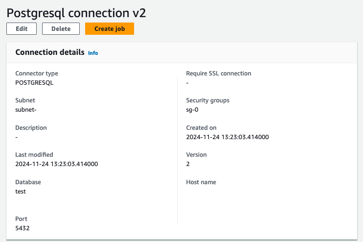
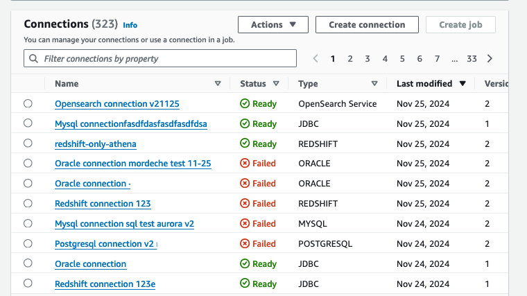
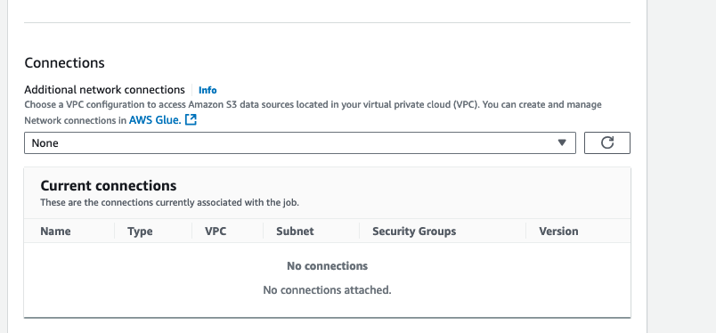

# Unified connections

AWS recently introduced a new feature called "SageMaker LakeHouse Connections" or "AWS Glue Unified Connections." This feature allows you to create
connections that can be used by multiple AWS services, such as AWS Glue and Amazon Athena. When you create a data source in Amazon Athena,
you'll notice a section that refers to AWS Glue connection inputs. In this case, Amazon Athena will create a AWS Glue connection for you, including any
Amazon Athena-specific properties in the `AthenaProperties` section of the connection.

On the other hand, if you create a connection directly in AWS Glue, you'll only be prompted to enter properties specific to AWS Glue and Apache Spark, which will
be stored in the `ConnectionProperties` and `SparkProperties` sections of the connection.

Both of these scenarios result in the creation of a "unified connection," but the connections created in Amazon Athena are only configured for use
within Amazon Athena, while the connections created in AWS Glue are only configured for use within AWS Glue. However, it's possible to update these
connections with the missing properties (either Amazon Athena or Spark properties) so that they can be used by both services. Amazon SageMaker AI
Unified Studio takes care of this automatically by filling in all necessary properties (`ConnectionProperties`, `AthenaProperties`, and `SparkProperties`) on
the AWS Glue connection, ensuring that the connection can be used by both AWS Glue and Amazon Athena.

It's important to note that although we refer to these as "unified connections," the connections created in AWS Glue or Amazon Athena individually are
not truly unified unless they are properly configured for use by both services. Only the connections created through SageMaker Unified Studio are truly
unified and usable by multiple services out of the box.

Additionally, connections created in AWS Glue are not visible in Amazon Athena because Amazon Athena displays data sources, which include a
reference to a AWS Glue connection but are not the AWS Glue connection itself. Similarly, connections created in Amazon Athena are not visible in
AWS Glue Studio because AWS Glue Studio filters out any connection that hasn't been configured with the necessary settings for AWS Glue.

AWS Glue Studio creates unified connections by default. In the AWS Glue console, you can see the version of the connection in the
connections table on the connections page, on the connections detail page, and the connections table in the job details page.

The connection version is visible on Connection details:

The connection version is also visible when viewing all your Connections.

Finally, connection version is visible in the Job details tab for a job.

With version 2 connections, you have the following expanded data connectivity capabilities:

- **Connection type discovery**: Support for creating connections using standardized
  templates. AWS Glue automatically discovers the connection types accessible by you and the required and optional inputs for
  a given connection type.
- **Reusability**: Connection definitions that are reusable across AWS data processing
  engines and tools like AWS Glue, Amazon Athena, and Amazon SageMaker AI. Connections now contain
  AthenaProperties, SparkProperties, PythonProperties which allow to specify compute environment/service specific
  connection properties in addition to the common properties stored in ConnectionProperties. Athena now creates
  Connections in AWS Glue by specifying Athena specific properties in the AthenaProperties property map.
- **Data preview**: Ability to browse metadata and preview data from connected sources.
- **Connector metadata**: Reusable connections may be used in order to discover table
  metadata.
- **Service linked secrets**: Users may provide necessary OAuth, basic or custom
  authentication credentials in the `CreateConnection` request. The CreateConnection API creates a
  Service Linked Secret in your account and stores the credentials on your behalf.

## Supported authentication types

Unified connections supports the following authentication types:

- **BASIC** – Most database connection types and existing AWS Glue connection types support basic
  authentication, which is a username and password. Previously, the naming of the keys in SecretsManager were connector specific
  and, for example, may have been user, username, userName, opensearch.net.http.auth.user, etc. This is where unified connections standardized basic
  authentication connection types on USERNAME and PASSWORD keys.
- **OAUTH2** – The majority of newly launched SaaS connection types support OAuth2 protocol.
- **CUSTOM** – A few connection types have some other authentication mechanism such as Google
  BigQuery where users are expected to provide the JSON which they get from Google BigQuery.

## Considerations

When you create a unified connection for data sources, consider the following differences:

- When creating a unified connection via AWS Glue Studio, user credentials are stored in AWS Secrets Manager
  instead of the connection itself. This means jobs now need access to Secrets Manager.
- If jobs run in a VPC, they require either a VPC endpoint or NAT gateway to access AWS Secrets Manager
  and Secure Token Service (STS), which incurs additional costs.
- For certain data sources (Redshift, SQL Server, MySQL, Oracle, PostgreSQL), creating a unified connection via
  AWS Glue Studio requires access to AWS STS and AWS Secrets Manager.
  This is necessary to establish a secure connection and retrieve the required credentials for accessing these
  data sources within your Virtual Private Cloud (VPC).
- Creating a unified connection via AWS Glue Studio requires an IAM role with permissions to access AWS Secrets Manager
  and manage VPC resources (if using a VPC):
  - secretsmanager:GetSecretValue
  - secretsmanager:PutSecretValue
  - secretsmanager:DescribeSecret
  - ec2:CreateNetworkInterface
  - ec2:DeleteNetworkInterface
  - ec2:DescribeNetworkInterfaces
  - ec2:DescribeSubnets
