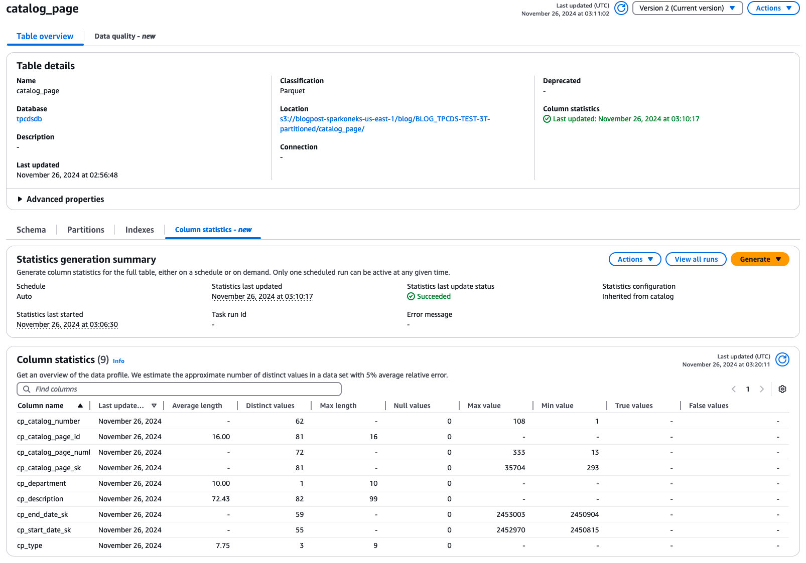

# Viewing automated table-level settings

When catalog-level statistics collection is enabled, anytime an Apache Hive table or Apache Iceberg table is created or updated
via the `CreateTable` or `UpdateTable` APIs through AWS Management Console, SDK, or AWS Glue crawler,
an equivalent table level setting is created for that table.

Tables with automatic statistics generation enabled must follow one of following properties:

- Use an `InputSerdeLibrary` that begins with org.apache.hadoop and `TableType` equals `EXTERNAL_TABLE`
- Use an `InputSerdeLibrary` that begins with `com.amazon.ion` and `TableType` equals `EXTERNAL_TABLE`
- Contain table_type: "ICEBERG" in it’s parameters structure.

After you create or update a table, you can verify the table details to confirm the statistics generation.
The `Statistics generation summary` shows the `Schedule` property set as `AUTO` and `Statistics configuration` value is `Inherited from catalog`. Any table setting with the following setting would be automatically triggered by Glue internally.

