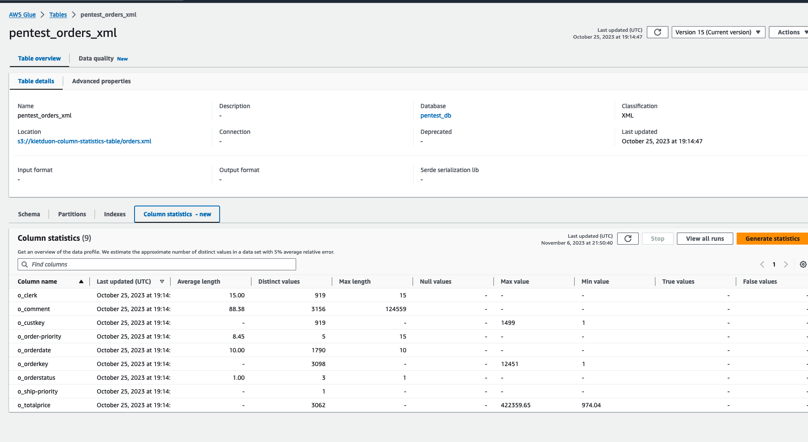

# Viewing column statistics

After generating the statistics successfully, Data Catalog stores this information for the
cost-based optimizers in Amazon Athena and Amazon Redshift to make optimal choices when
running queries. The statistics varies based on the type of the column.

AWS Management Console

###### To view column statistics for a table

- After running column statistics task, the **Column statistics** tab on the **Table details** page shows the statistics for the table.



The following statistics are available:

    + Column name: Column name used to generate statistics
    + Last updated: Data and time when the statistics were generated
    + Average length: Average length of values in the column
    + Distinct values: Total number of distinct values in the column. We estimate the number of
     distinct values in a column with 5% relative error.
    + Max value: The largest value in the column.
    + Min value: The smallest value in the column.
    + Max length: The length of the highest value in the column.
    + Null values: The total number of null values in the column.
    + True values: The total number of true values in the column.
    + False values: The total number of false values in the column.
    + numFiles: The total number of files in the table. This
     value is available under the **Advanced properties** tab.

AWS CLI
The following example shows how to retrieve column statistics using
AWS CLI.

```
aws glue get-column-statistics-for-table \
    --database-name `database_name` \
    --table-name `table_name` \
    --column-names `<column_name>`
```

You can also view the column statistics using the [GetColumnStatisticsForTable](../webapi/API_GetColumnStatisticsForTable.md "../webapi/API_GetColumnStatisticsForTable.md") API operation.
