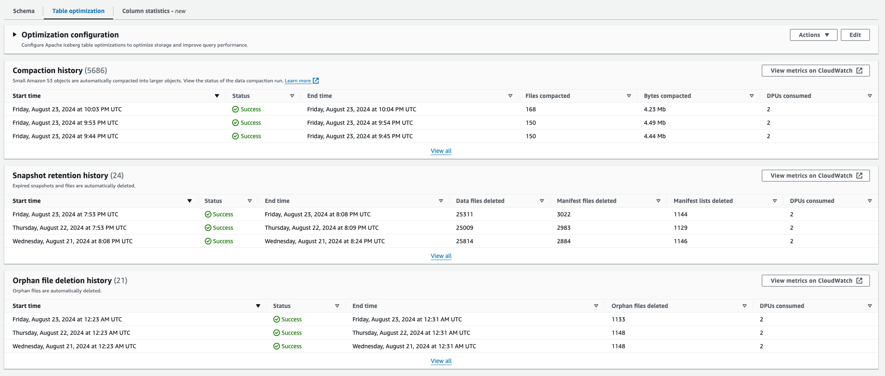

# Viewing optimization details

You can view the optimization status for Apache Iceberg tables in the AWS Glue console,
AWS CLI, or using AWS API operations.

Console

###### To view the optimization status for Iceberg tables (console)

- You can view optimization status for Iceberg tables on the AWS Glue console by
  choosing an Iceberg table from the **Tables** list under
  **Data Catalog**. Under **Table optimization**.
  Choose the **View all**



AWS CLI

You can view the optimization details using AWS CLI.

In the following examples, replace the account ID with a
valid AWS account ID, the database name, and table name with actual Iceberg table
name. For `type`, provide and optimization type. Acceptable values are `compaction`, `retention`, and `orphan-file-deletion`.

- **To get the last compaction run details for a table**

```
aws get-table-optimizer \
  --catalog-id `123456789012` \
  --database-name `iceberg_db` \
  --table-name `iceberg_table` \
  --type `compaction`
```

- Use the following example to retrieve the history of an optimizer for a specific table.

```
aws list-table-optimizer-runs \
  --catalog-id `123456789012` \
  --database-name `iceberg_db` \
  --table-name `iceberg_table` \
  --type `compaction`
```

- The following example shows how to retrieve the optimization run and
  configuration details for multiple optimizers. You can specify a maximum of 20
  optimizers.

```
aws glue batch-get-table-optimizer \
--entries '[{"catalogId":"`123456789012`", "databaseName":"`iceberg_db`", "tableName":"`iceberg_table`", "type":`"compaction"`}]'

```

API

- Use `GetTableOptimizer` operation to retrieve the last run details of an optimizer.
- Use `ListTableOptimizerRuns` operation to retrieve history of a given optimizer on a specific table. You can specify 20 optimizers in a single API call.
- Use the [BatchGetTableOptimizer](aws-glue-api-table-optimizers.md#aws-glue-api-table-optimizers-BatchGetTableOptimizer "aws-glue-api-table-optimizers.md#aws-glue-api-table-optimizers-BatchGetTableOptimizer") operation to retrieve configuration
  details for multiple optimizers in your account.
