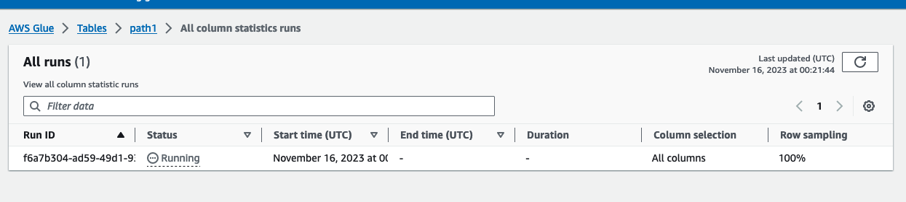

# Viewing column statistics task runs

After you run a column statistics task, you can explore the task run details for a table using AWS Glue console, AWS CLI or using
[GetColumnStatisticsTaskRuns](aws-glue-api-crawler-column-statistics.md#aws-glue-api-crawler-column-statistics-GetColumnStatisticsTaskRun "aws-glue-api-crawler-column-statistics.md#aws-glue-api-crawler-column-statistics-GetColumnStatisticsTaskRun") operation.

Console

###### To view column statistics task run details

1. On AWS Glue console, choose **Tables** under Data Catalog.
2. Select a table with column statistics.
3. On the **Table details** page, choose **Column statistics**.
4. Choose **View runs**.

You can see information about all runs associated with the specified table.



AWS CLI
In the following example, replace values for `DatabaseName` and `TableName` with the actual database and table name.

```
aws glue get-column-statistics-task-runs --input-cli-json file://input.json
{
    "DatabaseName": "`database_name`",
    "TableName": "`table_name`"
}

```
