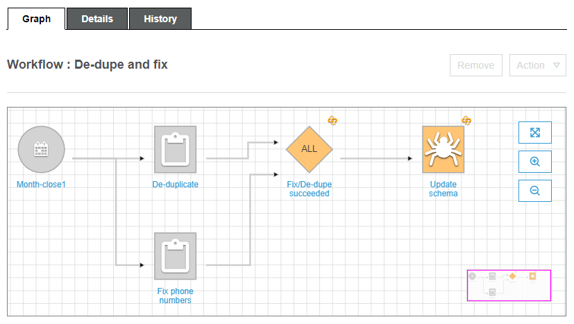

# Overview of workflows in AWS Glue

In AWS Glue, you can use workflows to create and visualize complex extract, transform, and
load (ETL) activities involving multiple crawlers, jobs, and triggers. Each workflow manages
the execution and monitoring of all its jobs and crawlers. As a workflow runs each
component, it records execution progress and status. This provides you with an overview of
the larger task and the details of each step. The AWS Glue console provides a visual
representation of a workflow as a graph.

You can create a workflow from an AWS Glue blueprint, or you can manually build a workflow
a component at a time using the AWS Management Console or the AWS Glue API. For more information about
blueprints, see [Overview of blueprints in AWS Glue](blueprints-overview.md "blueprints-overview.md").

_Triggers_ within workflows can start both jobs and
crawlers and can be fired when jobs or crawlers complete. By using triggers, you can create
large chains of interdependent jobs and crawlers. In addition to triggers within a workflow
that define job and crawler dependencies, each workflow has a _start
trigger_. There are three types of start triggers:

- Schedule – The workflow is started according
  to a schedule that you define. The schedule can be daily, weekly, monthly, and so
  on, or can be a custom schedule based on a `cron` expression.
- On demand – The workflow is started manually
  from the AWS Glue console, API, or AWS CLI.
- EventBridge event – The workflow is started upon
  the occurrence of a single Amazon EventBridge event or a batch of Amazon EventBridge events. With this
  trigger type, AWS Glue can be an event consumer in an event-driven architecture. Any
  EventBridge event type can start a workflow. A common use case is the arrival of a new
  object in an Amazon S3 bucket (the S3 `PutObject` operation).

Starting a workflow with a batch of events means waiting until a specified number
of events have been received or until a specified amount of time has passed. When
you create the EventBridge event trigger, you can optionally specify batch conditions. If
you specify batch conditions, you must specify the batch size (number of events),
and can optionally specify a batch window (number of seconds). The default and
maximum batch window is 900 seconds (15 minutes). The batch condition that is met
first starts the workflow. The batch window starts when the first event arrives. If
you don't specify batch conditions when creating a trigger, the batch size defaults
to 1.

When the workflow starts, the batch conditions are reset and the event trigger
begins watching for the next batch condition to be met to start the workflow
again.

The following table shows how batch size and batch window operate together to
trigger a workflow.

| Batch size | Batch window | Resulting triggering condition                                                                                                                                                                                          |
| ---------- | ------------ | ----------------------------------------------------------------------------------------------------------------------------------------------------------------------------------------------------------------------- |
| 10         |              | The workflow is triggered upon the arrival of 10 EventBridge events, or 15 minutes after the arrival of the first event, whichever occurs first. (If windows size isn't specified, it defaults to 15 minutes.) |
| 10         | 2 mins       | The workflow is triggered upon the arrival of 10 EventBridge events, or 2 minutes after the arrival of the first event, whichever occurs first.                                                                   |
| 1          |              | The workflow is triggered upon the arrival of the first event. Window size is irrelevant. The batch size defaults to 1 if you don't specify batch conditions when you create the EventBridge event trigger.    |

The `GetWorkflowRun` API operation returns the batch condition that
triggered the workflow.
Regardless of how a workflow is started, you can specify the maximum number of concurrent
workflow runs when you create the workflow.

If an event or batch of events starts a workflow run that eventually fails, that event or
batch of events is no longer considered for starting a workflow run. A new workflow run is
started only when the next event or batch of events arrives.

###### Important

Limit the total number of jobs, crawlers, and triggers within a workflow to 100 or
less. If you include more than 100, you might get errors when trying to resume or stop
workflow runs.

A workflow run will not be started if it would exceed the concurrency limit set for the
workflow, even though the event condition is met. It's advisable to adjust workflow
concurrency limits based on the expected event volume. AWS Glue does not retry workflow runs
that fail due to exceeded concurrency limits. Likewise, it's advisable to adjust concurrency
limits for jobs and crawlers within workflows based on expected event volume.

###### Workflow run properties

To share and manage state throughout a workflow run, you can define default workflow
run properties. These properties, which are name/value pairs, are available to all the
jobs in the workflow. Using the AWS Glue API, jobs can retrieve the workflow run properties
and modify them for jobs that come later in the workflow.

###### Workflow graph

The following image shows the graph of a very basic workflow on the AWS Glue console.
Your workflow could have dozens of components.

This workflow is started by a schedule trigger, `Month-close1`, which starts
two jobs, `De-duplicate` and `Fix phone numbers`. Upon successful
completion of both jobs, an event trigger, `Fix/De-dupe succeeded`, starts a
crawler, `Update schema`.

###### Static and dynamic workflow views

For each workflow, there is the notion of _static view_ and
_dynamic view_. The static view indicates the design of the
workflow. The dynamic view is a runtime view that includes the latest run information
for each of the jobs and crawlers. Run information includes success status and error
details.

When a workflow is running, the console displays the dynamic view, graphically indicating
the jobs that have completed and that are yet to be run. You can also retrieve a dynamic
view of a running workflow using the AWS Glue API. For more information, see [Querying workflows using the AWS Glue API](workflows_api_concepts.md "workflows_api_concepts.md").

###### See also

- [Creating a workflow from a blueprint in
  AWS Glue](creating_workflow_blueprint.md "creating_workflow_blueprint.md")
- [Creating and building out a workflow manually
  in AWS Glue](creating_running_workflows.md "creating_running_workflows.md")
- [Workflows](aws-glue-api-workflow.md "aws-glue-api-workflow.md")
  (for the workflows API)
