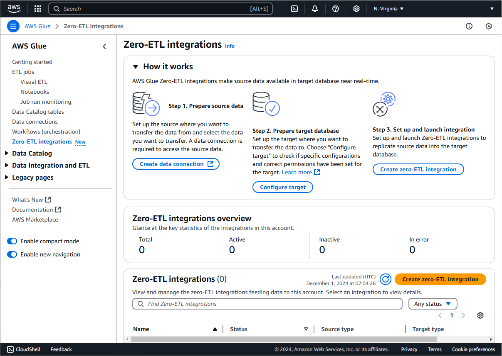

# Common integration tasks

## Creating an integration

This sections describes the general steps to create an integration. This example uses Amazon DynamoDB as a source.

1. On the AWS Glue console home page, select **Zero-ETL integrations**.
2. You can view all you integrations on the Zero ETL integration home page. To create a new integration, select **Create zero-ETL integration**.

 3. You are prompted to select a **Source Type**. Select your source and click **Next**. Refer to the the source configuration sections for SaaS integration sources. 4. In the **Configure source and target** page, select the tables or entities to replicate. For Amazon DynamoDB make sure the PITR and RBAC policy is configured. 5. Specify your integration target:

    * For an AWS Glue Data Catalog target, select the AWS Glue database you want to replicate the data to.
    * For an Amazon Redshift data warehouse target, select the Redshift cluster namespace or Redshift Serverless workgroup namespace.

For more information, see [Configuring the integration with your target](zero-etl-target.md#zero-etl-config-target-configuring-the-integration "zero-etl-target.md#zero-etl-config-target-configuring-the-integration"). 6. Provide the **Target IAM Role** that you created in the prerequisites. 7. If you want to configure an optional **Target KMS Key** for your data being stored in the target, provide an enabled KMS Key. Likewise, if you want to configure a target network connection, select an AWS Glue connection. 8. The **Fix Target** button configures some of the steps in the Prerequisite section of this documentation. Namely it will 1) provide a Catalog RBAC Policy and 2) if no Amazon S3 URI is provided it will generate one for you, otherwise it will use the provided URI. 9. For integrations with a Redshift data warehouse target: 10. In the **Output setting** section of the **Configure source and target** page, select a schema unnesting option that you want for your data in the target. If you want to use customer partition keys for your data, select **Specify custom partition keys** and provide up to 10 keys. Otherwise, you can simply use the partition keys that are assigned to your DynamoDB table being replicated. 11. In the **Security and data encryption** section, you can provide a KMS key that will be used in the intermediary process of replicating your data to the target. Otherwise, an AWS managed KMS key will be used. Currently we only support a 15 minute replication setting. Enter a name for the Zero ETL integration in **Integration details**. 12. Review and make sure that all the provided details are correct. Click **Create and launch integration** once everything has been confirmed. 13. In the Zero ETL home page, you can select the integration you created and the details for your integrations will appear. The "Status" indicates the state of your integration.

## Modifying an integration

You can modify an existing integration.

1. Select **Edit** in the top right corner of your integration details page.
2. On the **Edit source and target** page you can change the Target IAM role and Target network connection. The other fields are not editable after integration creation. Click **Next**.
3. You can also edit the name and description of the integration in the **Edit integration and configuration** page. Click **Next**.
4. Review your edits and once confirmed, click **Update integration**.

## Deleting an integration

Delete is a terminal state for an integration. Once deleted, the integration cannot be revived. Deleting an integration clears up all internal metadata and any intermediate stored data.

During this process any running tasks which are writing data to a target table are terminated. AWS Glue will not delete or cleanup the target AWS Glue database (in the Data Catalog) and the associated data in the Amazon S3 bucket in your account. You need to explicitly clean those up if required.

To delete an integration:

1. In the integration details page, click **Delete**.
2. Enter "Delete" and click **Delete**. Note: This is an irreversible action.
3. In the integration details page, the status shows "Deleting". Once the integration is actually deleted, it will no longer appear on the the Zero ETL integration home page.
