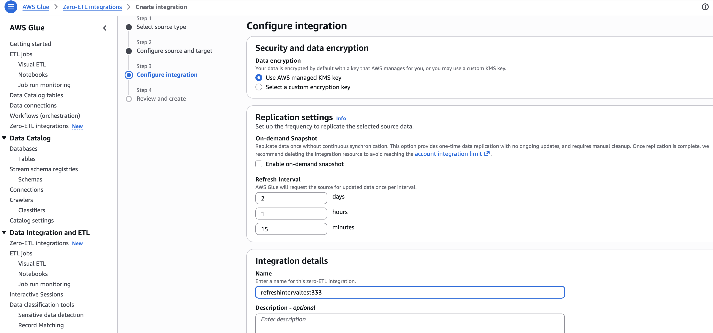

# Configuring an integration

When setting up a zero-ETL integration, you can configure various parameters to control how data is synchronized between your source and target systems. This section describes key configuration options that affect the data extraction and loading process.

## On-demand Snapshot setting

The On-demand Snapshot setting allows you to choose whether to continuously synchronize data source updates to your data target. When disabled (the default), the integration provides continuous synchronization as changes occur in source systems. When enabled, the integration performs a one-time data replication without ongoing updates.

###### Note

The On-demand Snapshot setting cannot be modified after the integration is created. Choose this option carefully based on your data synchronization requirements.

## RefreshInterval setting

The `RefreshInterval` parameter specifies the frequency at which change data capture (CDC) pulls or incremental loads will be triggered. This parameter provides flexibility to align the CDC rate with your specific data update patterns, system load considerations, and performance optimization goals. The refresh interval cannot be modified after the integration is created when the target is Redshift. For other targets, the refresh interval can be modified after integration creation. For DynamoDB sources with refresh intervals of 24 hours or more, see [Sequential daily batches for DynamoDB sources](#zero-etl-config-refresh-interval-ddb-batches "#zero-etl-config-refresh-interval-ddb-batches") for details about sequential daily batch processing.

The time increment can be set from 15 minutes to 8640 minutes (six days), allowing you to balance between data freshness and system resource utilization. Currently, the refresh interval is customizable for both DynamoDB and SaaS sources:

- **Minimum interval:** 15 minutes
- **Maximum interval:** 8640 minutes (6 days)
- **Default value:** 15 minutes for DynamoDB source and 60 minutes for SaaS source

Factors to consider when choosing a refresh interval:

- **Data volatility:** How frequently your source data changes
- **Business requirements:** How current your analytics data needs to be
- **Cost considerations:** More frequent updates may result in higher processing and storage costs

###### Note

RefreshInterval parameter defines frequency of trigger of CDC. The actual refresh frequency may be affected by the volume of changes in your source data and the processing capacity of the target system. Monitor your integration performance and adjust the refresh interval as needed to optimize for your specific use case.

To modify the refresh interval programmatically, you can use the [ModifyIntegration API](../webapi/API_ModifyIntegration.md#API_ModifyIntegration_RequestSyntax "../webapi/API_ModifyIntegration.md#API_ModifyIntegration_RequestSyntax") with the IntegrationConfig parameter.

### Sequential daily batches for DynamoDB sources

For zero-ETL integrations with an Amazon DynamoDB source, when you configure a refresh interval of 1440 minutes (24 hours) or greater, the integration uses sequential daily batch processing instead of a single export operation. This behavior is due to the [DynamoDB export window limitation](../../../amazondynamodb/latest/developerguide/ServiceQuotas.md#:~:text=Incremental%20export%3A%20DynamoDB%20Incremental%20Export%20to%20Amazon%20S3%20can%20support%20up%20to%20300%20concurrent%20export%20jobs%20or%20up%20to%20a%20total%20of%20100TB%20from%20all%20in%2Dflight%20table%20exports.%20The%20export%20period%20window%20limits%20are%2015%20minutes%20minimum%20and%2024%20hours%20maximum. "../../../amazondynamodb/latest/developerguide/ServiceQuotas.md#:~:text=Incremental%20export%3A%20DynamoDB%20Incremental%20Export%20to%20Amazon%20S3%20can%20support%20up%20to%20300%20concurrent%20export%20jobs%20or%20up%20to%20a%20total%20of%20100TB%20from%20all%20in%2Dflight%20table%20exports.%20The%20export%20period%20window%20limits%20are%2015%20minutes%20minimum%20and%2024%20hours%20maximum."), which has a maximum export period of 24 hours.

When the refresh interval exceeds 24 hours, the integration operates as follows:

1. The CDC process waits for the full refresh interval duration (for example, 6 days for a 8640-minute interval).
2. After the refresh interval elapses, the integration performs multiple sequential DynamoDB exports, each covering up to a 24-hour window.
3. The CDC jobs process each batch sequentially to capture all changes that occurred during the refresh interval period.

For example, if you set a refresh interval of 8640 minutes (6 days), the integration will wait 6 days and then execute 6 or 7 sequential exports (1 tail export covering extra time spent on export operations) and CDC jobs to synchronize all changes from that period.
