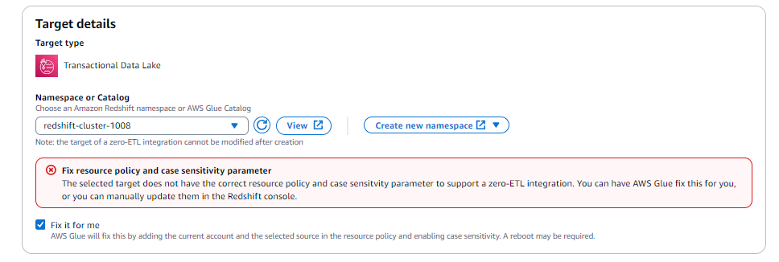

# Configuring a zero-ETL integration target

There are several options offered by AWS when configuring a target for a zero-ETL integration. The target may be an encrypted Amazon Redshift data warehouse or an Amazon SageMaker Lakehouse catalog.

Before selecting the target for the zero-ETL integration, you need to configure one of the following target resources.

The configuration options for a target in a zero-ETL integration include:

- An Amazon SageMaker Lakehouse catalog and database configured with regular Amazon S3 storage. See [Configuring an Amazon SageMaker Lakehouse catalog with regular S3 storage](#zero-etl-config-target-regular-s3 "#zero-etl-config-target-regular-s3").
- An Amazon SageMaker Lakehouse catalog configured with Amazon S3 Tables bucket. See [Configuring Amazon S3 tables as a target](#zero-etl-config-target-s3-tables "#zero-etl-config-target-s3-tables").
- An Amazon SageMaker Lakehouse catalog configured with Amazon Redshift managed storage. See [Configuring an Amazon SageMaker Lakehouse catalog with Amazon Redshift managed storage](#zero-etl-config-target-redshift-managed-storage "#zero-etl-config-target-redshift-managed-storage").
- An Amazon Redshift data warehouse identified by a Redshift namespace. See [Configuring an Amazon Redshift data warehouse target](#zero-etl-config-target-redshift-data-warehouse "#zero-etl-config-target-redshift-data-warehouse").

###### Note

You cannot modify the target of a zero-ETL integration after creation.

## Configuring an Amazon SageMaker Lakehouse catalog with regular S3 storage

This section describes the prerequisites and setup steps for configuring a regular Amazon S3 bucket as storage for your Amazon SageMaker Lakehouse catalog target in a zero-ETL integration.

### Prerequisites for setting up an integration

Before creating a zero-ETL integration with an Amazon SageMaker Lakehouse catalog using regular S3 storage, you need to complete the following setup tasks:

1. Set up an AWS Glue database
2. Provide Catalog RBAC policy
3. Create target IAM role

After configuring the Amazon SageMaker Lakehouse catalog with regular Amazon S3 storage, you can proceed to [Configuring the integration with your target](#zero-etl-config-target-configuring-the-integration "#zero-etl-config-target-configuring-the-integration") to complete the integration setup.

## Configuring Amazon S3 tables as a target

This section describes the prerequisites and setup steps for configuring Amazon S3 Tables as a target for your zero-ETL integration.

### Prerequisites for setting up an integration

Before creating a zero-ETL integration with Amazon S3 Tables as a target, you need to complete the following setup tasks:

1. Setup Amazon S3 tables bucket
2. Provide Catalog RBAC policy
3. Create target IAM role

### Setup Amazon S3 tables bucket

1. Create an S3 table bucket in your account by following the instructions at [Getting started with Amazon S3 Tables](../../../AmazonS3/latest/userguide/s3-tables-getting-started.md "../../../AmazonS3/latest/userguide/s3-tables-getting-started.md").
2. Enable Analytics integrations with your S3-Table bucket by following these instructions: [Integrating AWS services with Amazon S3 Tables](../../../AmazonS3/latest/userguide/s3-tables-integrating-aws.md#table-integration-procedures "../../../AmazonS3/latest/userguide/s3-tables-integrating-aws.md#table-integration-procedures").

### Provide Catalog RBAC Policy

The following permissions must be added to the Catalog RBAC Policy to allow for integrations between source and Amazon S3 tables catalog target.

Target AWS Glue Catalog resource policy needs to include Glue Service permissions to AuthorizeInboundIntegration. Additionally, CreateInboundIntegration permission is required either on the source principal creating the Integration or in the target AWS Glue resource policy.

###### Note

For cross-account scenario, both source principal as well as target AWS Glue Catalog resource policy need to include glue:CreateInboundIntegration permissions on the resource.

JSON

```
`{
 "Version":"2012-10-17",
 "Statement": [
 {
 "Principal": {
 "AWS": [
 "arn:aws:iam::`123456789012`:user/Alice"
 ]
 },
 "Effect": "Allow",
 "Action": [
 "glue:CreateInboundIntegration"
 ],
 "Resource": [
 "arn:aws:glue:`us-east-1`:`111122223333`:catalog/<s3tablescatalog>/*"
 ],
 "Condition": {
 "StringLike": {
 "aws:SourceArn": "arn:aws:dynamodb:`us-east-1`:`444455556666`:table/<table-name>"
 }
 }
 },
 {
 "Principal": {
 "Service": [
 "glue.amazonaws.com"
 ]
 },
 "Effect": "Allow",
 "Action": [
 "glue:AuthorizeInboundIntegration"
 ],
 "Resource": [
 "arn:aws:glue:`us-east-1`:`111122223333`:catalog/<s3tablescatalog>/*"
 ],
 "Condition": {
 "StringEquals": {
 "aws:SourceArn": "arn:aws:dynamodb:`us-east-1`:`444455556666`:table/<table-name>"
 }
 }
 }
 ]
}`

```

###### Note

Replace `<s3tablescatalog>` with the catalog name of your S3 tables.

### Create target IAM Role

Create a target IAM role with the following permissions and trust relationships:

Example IAM policy:

JSON

```
`{
 "Version":"2012-10-17",
 "Statement": [
 {
 "Action": [
 "s3tables:ListTableBuckets",
 "s3tables:GetTableBucket",
 "s3tables:GetTableBucketEncryption",
 "s3tables:GetNamespace",
 "s3tables:CreateNamespace",
 "s3tables:ListNamespaces",
 "s3tables:CreateTable",
 "s3tables:GetTable",
 "s3tables:GetTableEncryption",
 "s3tables:ListTables",
 "s3tables:GetTableMetadataLocation",
 "s3tables:UpdateTableMetadataLocation",
 "s3tables:GetTableData",
 "s3tables:PutTableData"
 ],
 "Resource": "arn:aws:s3tables:`us-east-1`:`111122223333`:bucket/*",
 "Effect": "Allow"
 },
 {
 "Action": [
 "cloudwatch:PutMetricData"
 ],
 "Resource": "*",
 "Condition": {
 "StringEquals": {
 "cloudwatch:namespace": "AWS/Glue/ZeroETL"
 }
 },
 "Effect": "Allow"
 },
 {
 "Action": [
 "logs:CreateLogGroup",
 "logs:CreateLogStream",
 "logs:PutLogEvents"
 ],
 "Resource": "*",
 "Effect": "Allow"
 }
 ]
}`

```

Add the following trust policy in the Target IAM role to allow AWS Glue Service to assume it:

JSON

```
`{
 "Version":"2012-10-17",
 "Statement": [
 {
 "Effect": "Allow",
 "Principal": {
 "Service": "glue.amazonaws.com"
 },
 "Action": "sts:AssumeRole"
 }
 ]
}`

```

###### Note

Make sure there is no explicit DENY statement for this target IAM role in the S3-Tables bucket resource policy. An explicit DENY would override any ALLOW permissions and prevent the integration from working properly.

## Configuring an Amazon SageMaker Lakehouse catalog with Amazon Redshift managed storage

This section describes the prerequisites and setup steps for configuring an Amazon SageMaker Lakehouse catalog with Amazon Redshift managed storage (RMS) as a target for your zero-ETL integration.

### Prerequisites for setting up an integration

Before creating a zero-ETL integration with an Amazon SageMaker Lakehouse catalog using Redshift managed storage, you need to complete the following setup tasks:

1. Set up an Amazon Redshift cluster or Serverless workgroup
2. Register the Amazon Redshift integration with Lake Formation
3. Create a managed catalog in Lake Formation
4. Configure IAM permissions

### Setting up Amazon Redshift managed storage

To set up Amazon Redshiftmanaged storage for your zero-ETL integration:

1. Create or use an existing Amazon Redshift cluster or Serverless workgroup. Make sure the target Amazon Redshift workgroup or cluster has the `enable_case_sensitive_identifier` parameter turned on for the integration to be successful. For more information on enabling case sensitivity, see [Turn on case sensitivity for your data warehouse](../../../redshift/latest/mgmt/zero-etl-setting-up.md "../../../redshift/latest/mgmt/zero-etl-setting-up.md") in the Amazon Redshift management guide.
2. Register an integration from Redshift into the catalog in AWS Lake Formation. See [Registering Amazon Redshift clusters and namespaces to the AWS Glue Data Catalog](../../../redshift/latest/dg/iceberg-integration-register.md "../../../redshift/latest/dg/iceberg-integration-register.md").
3. Create a federated or managed catalog in AWS Lake Formation. For more information, see:
   - [Bringing Amazon Redshift data into the AWS Glue Data Catalog](../../../lake-formation/latest/dg/managing-namespaces-datacatalog.md "../../../lake-formation/latest/dg/managing-namespaces-datacatalog.md")
   - [Creating an Amazon Redshift managed catalog in the AWS Glue Data Catalog](../../../lake-formation/latest/dg/create-rms-catalog.md "../../../lake-formation/latest/dg/create-rms-catalog.md")

4. Configure IAM permissions for the target role. The role needs permissions to access both Redshift and Lake Formation resources. At minimum, the role should have:
   - Permissions to access the Redshift cluster or workgroup
   - Permissions to access the Lake Formation catalog
   - Permissions to create and manage tables in the catalog
   - CloudWatch and CloudWatch Logs permissions for monitoring

After configuring the Amazon SageMaker Lakehouse catalog with Amazon Redshift managed storage, you can proceed to [Configuring the integration with your target](#zero-etl-config-target-configuring-the-integration "#zero-etl-config-target-configuring-the-integration") to complete the integration setup.

## Configuring an Amazon Redshift data warehouse target

This section describes the prerequisites and setup steps for configuring an Amazon Redshift data warehouse as a target for your zero-ETL integration.

### Prerequisites for setting up an integration

Before creating a zero-ETL integration with an Amazon Redshift data warehouse target, you need to complete the following setup tasks:

1. Set up an Amazon Redshift cluster or Serverless workgroup
2. Configure case sensitivity
3. Configure IAM permissions

### Setting up the Amazon Redshift data warehouse

To set up an Amazon Redshift data warehouse for your zero-ETL integration:

1. Navigate to the [Amazon Redshift console](https://console.aws.amazon.com/redshiftv2/home "https://console.aws.amazon.com/redshiftv2/home") and click **Create cluster** or use an existing cluster. For Amazon Redshift Serverless, click **Create workgroup**.
2. If creating a new cluster, choose an appropriate cluster size and ensure your cluster is encrypted. For Serverless, configure the workgroup settings according to your requirements.
3. Make sure the target Amazon Redshift workgroup or cluster has the `enable_case_sensitive_identifier` parameter turned on for the integration to be successful. For more information on enabling case sensitivity, see [Turn on case sensitivity for your data warehouse](../../../redshift/latest/mgmt/zero-etl-setting-up.md "../../../redshift/latest/mgmt/zero-etl-setting-up.md") in the Amazon Redshift management guide.
4. Configure IAM permissions to allow the zero-ETL integration to access your Amazon Redshift data warehouse. You'll need to create an IAM role with the following permissions:
   - Permissions to access the Amazon Redshift cluster or workgroup
   - Permissions to create and manage databases and tables in Amazon Redshift
   - CloudWatch and Amazon CloudWatch Logs permissions for monitoring

5. After the Amazon Redshift workgroup or cluster setup is complete, you need to configure your data warehouse for zero-ETL integrations. See [Getting started with zero-ETL integrations](../../../redshift/latest/mgmt/zero-etl-using.md "../../../redshift/latest/mgmt/zero-etl-using.md") in the Amazon Redshift Management Guide for more information.

###### Note

When using a Amazon Redshift data warehouse as a target, the integration creates a schema in the specified database to store the replicated data. The schema name is derived from the integration name.

After configuring the Amazon Redshift data warehouse, you can proceed to [Configuring the integration with your target](#zero-etl-config-target-configuring-the-integration "#zero-etl-config-target-configuring-the-integration") to complete the integration setup.

## Configuring the integration with your target

After you have configured your target resources and selected your connection and specified a source IAM role, follow these steps to complete the integration setup:

1. Specify the target you've configured in the previous steps.
2. Select the AWS Glue **Fix it for me** option. For the Amazon Redshift target, this will:
   - Apply an authorized service principal on the Amazon Redshift cluster or Serverless workgroup.
   - Apply an authorized AWS Glue source ARN to the Amazon Redshift cluster or Serverless workgroup.
   - Associate a new parameter group with `enable_case_sensitive_identifier = true`.

 3. Provide the integration name and choose **Create and launch Integration**. 4. Once your integration is in the active state, navigate to the integration details page and choose **Create a database from integration**. 5. Finally, you can navigate to the Redshift query editor, and connect to your database to validate the snapshot and incremental data.

###### Note

You can only use lowercase alphanumeric characters and underscores in the namespace or catalog name. This is different from what the AWS Glue Data Catalog allows to create a database with any name (including special characters).
