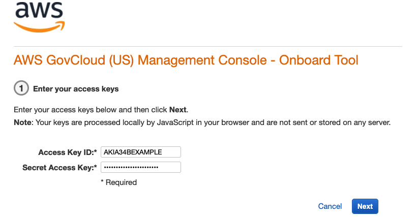
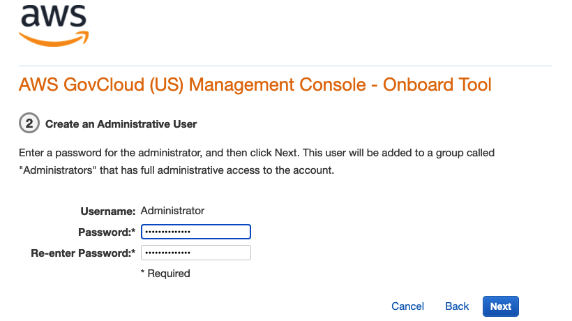
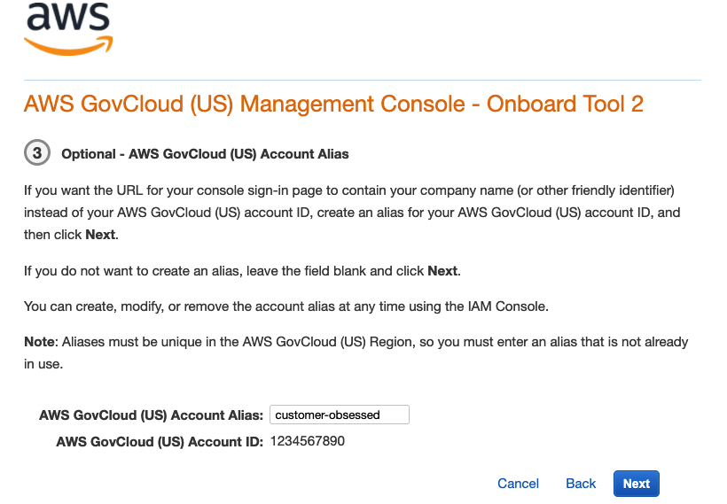
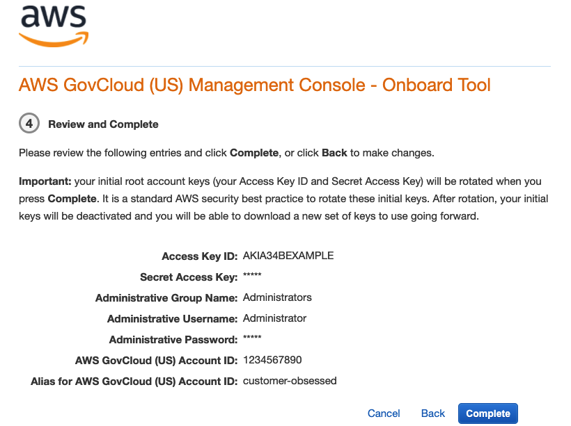
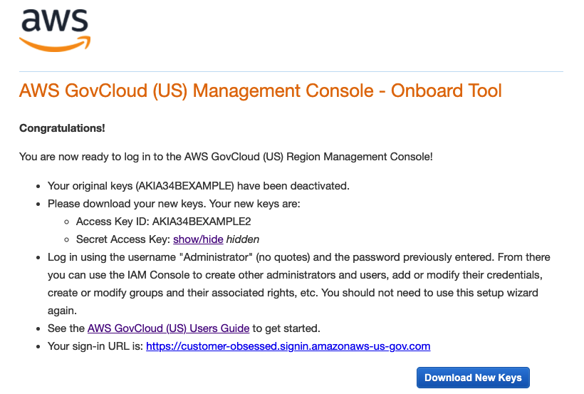

# Onboarding to AWS GovCloud (US) as a Solution

Provider reselling in AWS GovCloud (US)

If you are serving as a Solution Provider and reselling in AWS GovCloud (US), you
must create an IAM user to sign in to the AWS Management Console for the AWS GovCloud (US) Region. If you received your
account credentials through a Solution Provider, please contact your Solution Provider
to sign up.

###### To create your first administrative IAM user

1. Access the [AWS GovCloud (US) console onboard tool web application.](https://govcloud-onboarding-tool.us-east-1.amazonaws.com/ "https://govcloud-onboarding-tool.us-east-1.amazonaws.com/").
2. Type your access key ID and secret access key, and then choose
   **Next**.

 3. Type a password for the administrator, and then choose
**Next**.

 4. (Optional) If you want to create an account alias, type a name (all lowercase)
for your account, and then choose **Next**.

An account alias provides an easy-to-remember link for signing in to the
console. For more information about account aliases, see [Your AWS Account ID and Its
Alias](../../../IAM/latest/UserGuide/AccountAlias.md "../../../IAM/latest/UserGuide/AccountAlias.md") in the _IAM User Guide_. 5. Review your information, and then choose **Complete**.

You can choose **Back** to edit any information. 6. Review your new AWS GovCloud (US) credentials. Your original keys have been
deactivated.

 7. Choose **Download New Keys** and then save them in a secure
location. If you do not download them, you will not be able to retrieve them in
the future. 8. To access the AWS GovCloud (US) console, choose the link to your account's
sign-in URL.
You now have your first IAM user administrator, which you can use to sign in to the
AWS GovCloud (US) console. The administrator has full access to manage your
AWS GovCloud (US) resources. For example, as the administrator, you can use the
AWS GovCloud (US) console to create additional IAM users. You can then manage users
and their permissions by assigning them to groups. For more information, see [IAM users and
Groups](../../../IAM/latest/UserGuide/Using_WorkingWithGroupsAndUsers.md "../../../IAM/latest/UserGuide/Using_WorkingWithGroupsAndUsers.md") in _IAM User Guide_.
