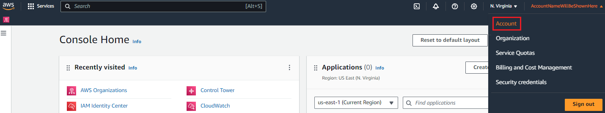
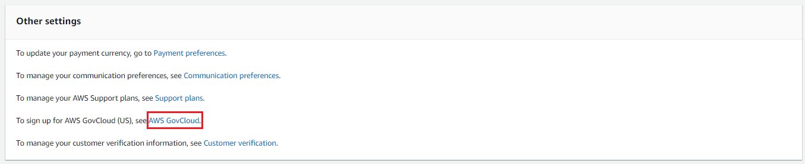

# AWS GovCloud (US) Sign Up

In order to sign up for an AWS GovCloud (US) account, you need to be an individual or
entity that meets the requirement of AWS GovCloud (US).

- The account holder must be a U.S. entity incorporated to do business in the
  United States and is based on U.S. soil.
- The account holder must be a U.S. Person defined as a U.S. Citizen or active
  Green Card holder.
- The account holder must be able to handle International Traffic and Arms
  Regulation (ITAR) export controlled data.
- In addition, AWS uses automated controls to prevent the creation of
  fraudulent accounts. This may cause new account creations to be denied. If you
  believe your request was denied in error, please contact AWS Customer Support
  for additional assistance in account creation.

## Create accounts as a direct

consumer

There are two options for creating an AWS GovCloud (US) account as a direct
consumer.

###### Option 1: Creating an AWS GovCloud (US) from a standalone AWS account

If you are a direct customer of AWS and do not purchase AWS through an
AWS Solution Provider or an AWS Reseller, follow the steps below. If you are
using AWS Organizations to manage accounts, we recommend using the AWS Organizations API.

1. Create a new AWS standard account by [signing up for a new
   account](https://aws.amazon.com/resources/create-account/ "https://aws.amazon.com/resources/create-account/").
2. Log in to the new AWS account with the root credentials. If you do not
   have the root credentials, create a support ticket to recover the
   credentials.
3. Navigate to the **Account** page at the top right of the
   AWS Management Console.

 4. On the **Account** page, scroll down to the
**Other settings** section. Choose the **AWS
GovCloud** link. If you do not see this link, ensure you logged
in with the root credentials otherwise, create a support ticket.

 5. This will navigate you to the AWS GovCloud (US) Sign Up Portal where you are
asked to accept the AWS GovCloud (US) legal agreement and provide additional
information, so we can verify your eligibility for an AWS GovCloud (US)
account.

###### Option 2: Creating an AWS GovCloud (US) with AWS Organizations

[AWS Organizations](https://aws.amazon.com/organizations/ "https://aws.amazon.com/organizations/") helps you
centrally govern your environment as you grow and scale your workloads on AWS.
AWS Organizations manages a set of accounts within each partition and can help create
accounts across partitions. For example, you can create an AWS organization
within the AWS US Standard Regions to manage accounts in those Regions. You
will need to create a separate AWS organization in AWS GovCloud (US) to manage
accounts in the AWS GovCloud (US) partition.

1. Follow the steps above to create a standalone AWS GovCloud (US) account that
   is mapped to your AWS Organizations management account.
2. Call the AWS Organizations [CreateGovCloudAccount](../../../organizations/latest/APIReference/API_CreateGovCloudAccount.md "../../../organizations/latest/APIReference/API_CreateGovCloudAccount.md") API from the AWS Standard account that
   is the management account of your Organization. This will create two
   accounts, one in the AWS Standard Region Organization and an associated
   AWS GovCloud (US) Account. This API will create roles for accessing the new
   AWS Standard account from the Standard Organization and will create roles
   in the AWS GovCloud (US) account that is mapped to your management account for
   accessing the new AWS GovCloud (US) account.
3. The API call will return success but is executed asynchronously and may
   take a few minutes to complete. For more information, visit the [AWS Organizations documentation](https://awscli.amazonaws.com/v2/documentation/api/latest/reference/organizations/create-gov-cloud-account.html "https://awscli.amazonaws.com/v2/documentation/api/latest/reference/organizations/create-gov-cloud-account.html").

In order to get the account numbers being created, please run the
describe-create-account-status command.

**Example**

describe-create-account-status --create-account-request-id [value].

aws organizations describe-create-account-status
--create-account-request-id car-examplecreateaccountrequestid111

See [here](../../../cli/latest/reference/organizations/describe-create-account-status.md "../../../cli/latest/reference/organizations/describe-create-account-status.md") for more information. 4. Once complete, you can log in to your AWS GovCloud (US) management account and
switch role into the new AWS GovCloud (US) account. 5. After creating the standalone account in the AWS GovCloud (US), you can invite
it to an organization in the AWS GovCloud (US) only.

## Creating an AWS GovCloud (US) account through a

Reseller or Solution Provider

Contact your AWS Solution Provider or AWS Reseller to sign up for an
AWS GovCloud (US) account.

### Solution Providers or

Resellers

If you are a **Solution Provider and wish to resell
Authorized Services in the AWS GovCloud (US) Regions** please contact
your AWS business representative by going to the AWS GovCloud (US) [Contact Us](https://aws.amazon.com/govcloud-us/contact/ "https://aws.amazon.com/govcloud-us/contact/") page
and completing the form to start the sign-up process.

### AWS Marketplace

Software vendors who want to be listed in the AWS Marketplace for AWS GovCloud (US) must
have a direct agreement with AWS. Software vendors who want to be listed in
the AWS GovCloud (US) Region should sign up as a Direct Customer whether they are
resellers or not.

## Close Account

For instructions on how to close an AWS GovCloud (US) account, see [Closing an AWS GovCloud (US) account](Closing-govcloud-account.md "Closing-govcloud-account.md").
