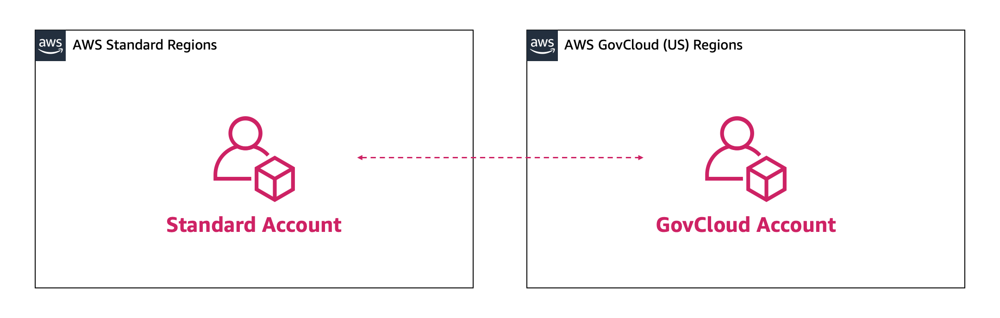
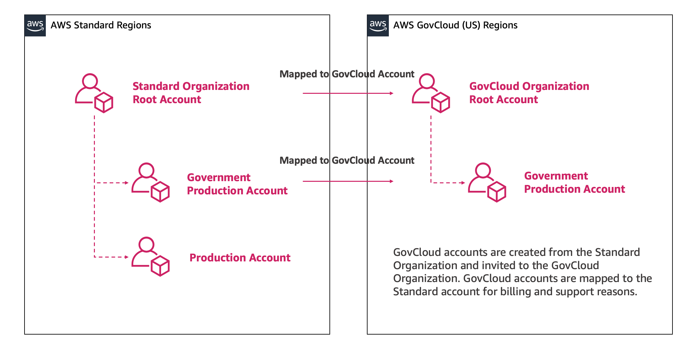

# AWS Standard Account

Linking

AWS GovCloud (US) accounts are associated 1:1 with standard AWS accounts for billing,
service, and support purposes. Customers are required to have an existing standard
account before signing up for an AWS GovCloud (US) account

###### Important

We recommend creating a new AWS account that will only be used for
AWS GovCloud (US) sign up and billing (i.e. do not deploy any AWS workloads into AWS
standard account). A dedicated AWS account for the new AWS GovCloud (US) account will
enable you to transfer the AWS GovCloud (US) account to another party in the future and
fully close the AWS GovCloud (US) accounts without affecting your other AWS workloads.

If you are using AWS Organizations to manage accounts within AWS standard regions, you can
create the new standard account from AWS Organizations console or using the [AWS Organizations API](https://awscli.amazonaws.com/v2/documentation/api/latest/reference/organizations/create-gov-cloud-account.html "https://awscli.amazonaws.com/v2/documentation/api/latest/reference/organizations/create-gov-cloud-account.html"). Your AWS Organization in your standard AWS account is
separate from the AWS Organizations in your AWS GovCloud (US) should you choose to create one, even
though the accounts are linked. You must manage each separately. Only the standard
AWS account will be managed by the existing Organization.

You can create a new AWS Organizations within the AWS GovCloud (US) partition by creating a set of
new accounts, creating a new AWS Organizations root within one of the new accounts, and inviting
the other AWS GovCloud (US) accounts to the new AWS Organization. Follow the steps for
[inviting accounts to an organization](../../../organizations/latest/userguide/orgs_manage_accounts_invites.md "../../../organizations/latest/userguide/orgs_manage_accounts_invites.md") here. This will result in separate
AWS Organization, one in each partition.

