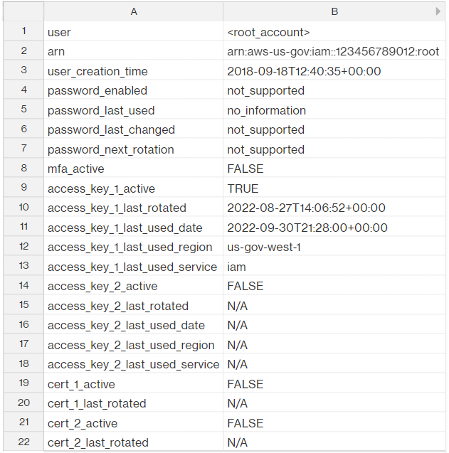
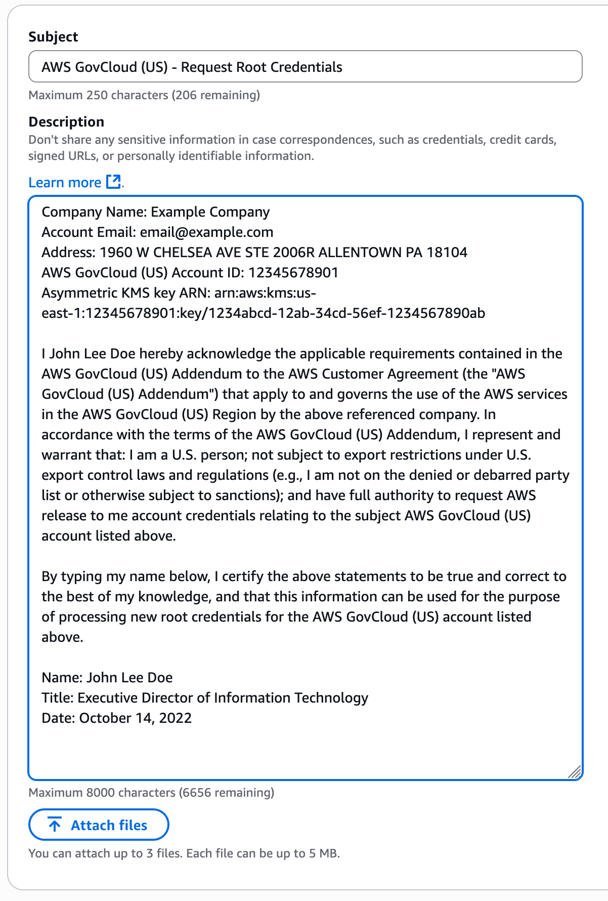
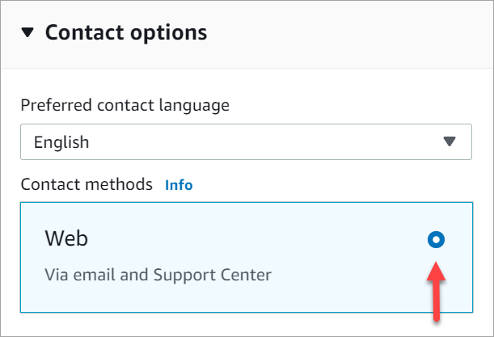
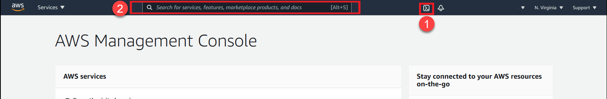
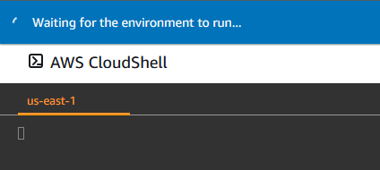
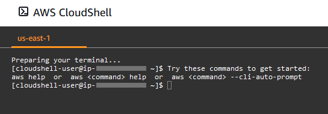

# AWS GovCloud (US) account root user

When you first create a standard AWS account (not an AWS GovCloud (US) account), you begin with one identity that has complete access to all AWS services and resources in the account. This identity is called the AWS account
root user. You can sign in as the root user using the email address and password that you used to create the account.

When you finish the [AWS GovCloud (US) Sign Up](getting-started-sign-up.md "getting-started-sign-up.md") process and your AWS GovCloud (US) account is created, the AWS GovCloud (US) account root user is also created at that time. Unlike the conclusion of the standard AWS account sign up process, you cannot sign-in to the AWS Management Console for AWS GovCloud (US) using your account email address and password. Depending on the method you used to sign up, you are provided initial console access to your AWS GovCloud (US) account via either an Administrator IAM user or the `OrganizationAccountAccessRole`
IAM role.

While AWS GovCloud (US) account root user console access is not supported, programmatic access keys are supported. Access keys are long-term credentials for an IAM user or the AWS account
root user. You can use access keys to sign programmatic requests to the AWS CLI or AWS API (directly or using the AWS SDK).

Anyone who has root user access keys for your AWS GovCloud (US) account has unrestricted access to all the resources in your account.

In this guide you will find…​

- How to identify if your AWS GovCloud (US) account has root access keys
- Step-by-step directions to request your AWS GovCloud (US) account root user access keys
- Information that will help you complete task that require the AWS GovCloud (US) account root user

###### Important

We strongly recommend that you do not use the root user for your everyday tasks, even the administrative ones. Instead, adhere to the best practice of using the root user only to create your first IAM user. Then securely lock away the root user access keys and use them to perform only a few account and service management tasks. To view the tasks that require root user access keys, see [Tasks in AWS GovCloud (US) Regions that require root user access keys](#govcloud-tasks-require-root-user "#govcloud-tasks-require-root-user")

###### Topics

- [Does my AWS GovCloud (US) account have existing root access keys?](#govcloud-account-existing-root "#govcloud-account-existing-root")
- [Requesting root access keys for an AWS GovCloud (US) account](#requesting-root-user-keys "#requesting-root-user-keys")
- [Configure AWS GovCloud (US) account root user access keys in the AWS CLI (AWS CloudShell)](#configure-root-user-access-keys-cli "#configure-root-user-access-keys-cli")
- [Tasks in AWS GovCloud (US) Regions that require root user access keys](#govcloud-tasks-require-root-user "#govcloud-tasks-require-root-user")
- [Restore IAM Administrator access to the AWS Management Console for AWS GovCloud (US)](#restore-root-user-keys "#restore-root-user-keys")
- [Edit or delete an Amazon S3 bucket policy for a bucket where I accidentally denied everyone access](#edit-s3-bucket-denied-access "#edit-s3-bucket-denied-access")
- [Remediation of AWS Security Hub CSPM findings](#remediate-security-findings "#remediate-security-findings")
- [Rotate my AWS GovCloud (US) account root user access keys](#rotate-access-keys "#rotate-access-keys")
- [Deleting my AWS GovCloud (US) account root user access keys](#delete-govcloud-root-access-key "#delete-govcloud-root-access-key")
- [Securing my AWS GovCloud (US) account root user access keys](#secure-govcloud-root-access-key "#secure-govcloud-root-access-key")
- [Transferring the root user owner](#trasnfer-root-user-owner "#trasnfer-root-user-owner")

## Does my AWS GovCloud (US) account have existing root access keys?

As an AWS GovCloud (US) account administrator, you may want to know if there are root access keys in your AWS GovCloud (US) account.

### Method 1

You can generate and download a credential report that lists all users in your account and the status of their various credentials, including passwords, access keys, and MFA device from your AWS GovCloud (US) account.

To get your credential report, see [Getting credential reports for your AWS account](../../../IAM/latest/UserGuide/id_credentials_getting-report.md "../../../IAM/latest/UserGuide/id_credentials_getting-report.md") in the _AWS Identity and Access Management User Guide_.

In the credential report CSV, the following columns will allow you to identify if you have root access keys in your account and if they are active.

- **user** – Identify the `root_account` row.
- **access_key_1_active** – When the root user has an access key and the access key’s status is Active, this value is `TRUE`. Otherwise it is `FALSE`.
- **access_key_1_last_rotated** – The date and time, in [ISO 8601 date-time format](https://en.wikipedia.org/wiki/ISO_8601 "https://en.wikipedia.org/wiki/ISO_8601"), when the root user's access key was created or last changed. If the root user does not have an active access key, the value in this field is `N/A` (not applicable).
- **access_key_2_active** – When the root user has a second access key and the second key’s status is Active, this value is `TRUE`. Otherwise it is `FALSE`.
- **access_key_2_last_rotated** – The date and time, [ISO 8601 date-time format](https://en.wikipedia.org/wiki/ISO_8601 "https://en.wikipedia.org/wiki/ISO_8601"), when the root user's second access key was created or last changed. If the root user does not have a second active access key, the value in this field is `N/A` (not applicable).

In this example, the root user has an active root access key in the account because the `access_key_1_last_rotated` field is not marked `N/A` and the `access_key_1_active` field is marked `TRUE`. You can also see there is not a second access key associated with the root user because `access_key_2_last_rotated` field is marked `N/A`. Since there is not a second access key `access_key_2_active` field is marked `FALSE`.



For info on removing root user access keys, see [Deleting my AWS GovCloud (US) account root user access keys](#delete-govcloud-root-access-key "#delete-govcloud-root-access-key").

### Method 2

If AWS Security Hub CSPM is enabled on your account, the following Security Hub CSPM controls have a Failed compliance status when root access keys exist in your AWS GovCloud (US) account.

- [CIS AWS Foundations Benchmark standard: 1.12 – Ensure no root user access key exists](../../../securityhub/latest/userguide/securityhub-cis-controls.md#securityhub-cis-controls-1.12 "../../../securityhub/latest/userguide/securityhub-cis-controls.md#securityhub-cis-controls-1.12")
- [Payment Card Industry Data Security Standard (PCI DSS): [PCI.IAM.1 IAMroot user access key should not exist](../../../securityhub/latest/userguide/securityhub-pci-controls.md#pcidss-iam-1 "../../../securityhub/latest/userguide/securityhub-pci-controls.md#pcidss-iam-1")]
- [AWS Foundational Security Best Practices standard: [IAM.4 IAMroot user access key should not exist](../../../securityhub/latest/userguide/securityhub-standards-fsbp-controls.md#fsbp-iam-4 "../../../securityhub/latest/userguide/securityhub-standards-fsbp-controls.md#fsbp-iam-4")]

For more information on AWS Security Hub CSPM, see the [AWS Security Hub CSPM User Guide](../../../securityhub/latest/userguide/index.md "../../../securityhub/latest/userguide/index.md").

To remediate these findings, see [Deleting my AWS GovCloud (US) account root user access keys](#delete-govcloud-root-access-key "#delete-govcloud-root-access-key").

## Requesting root access keys for an AWS GovCloud (US) account

AWS GovCloud (US) account root user access keys can be requested from Support. Once your request is processed and approved, any existing AWS GovCloud (US) account root user access keys in your AWS GovCloud (US) account will be deleted, followed by the creation of a single new access key. This new access key will stored as an encrypted secret with AWS Secrets Manager and AWS KMS in the **US East (N. Virginia)** Region. This secret is made available exclusively to the root user of the [standard AWS account](getting-started-standard-account-linking.md "getting-started-standard-account-linking.md") associated with your AWS GovCloud (US) account.

AWS managed account for this process: **536883072436**.

Use the following guide to request and retrieve a new AWS GovCloud (US) account root user access key.

###### Important

This process is for AWS GovCloud (US) customers who have already signed up for an AWS GovCloud (US) account and completed all onboarding steps. If you are having issues with onboarding into AWS GovCloud (US), see [AWS GovCloud (US) Sign Up](getting-started-sign-up.md "getting-started-sign-up.md") or [contact Support](https://console.aws.amazon.com/support/home#/case/create?issueType=customer-service&serviceCode=customer-account&categoryCode=aws-govcloud-us-onboarding "https://console.aws.amazon.com/support/home#/case/create?issueType=customer-service&serviceCode=customer-account&categoryCode=aws-govcloud-us-onboarding").

### Prerequisites

This task **requires root access** to the [standard AWS account](getting-started-standard-account-linking.md "getting-started-standard-account-linking.md") associated with your AWS GovCloud (US) account.

###### Important

The AWS GovCloud (US) account root user access keys provides unrestricted access to your AWS GovCloud (US) account. For security purposes Support will only process request for AWS GovCloud (US) root credentials when the requester is the root user of the [standard AWS account](getting-started-standard-account-linking.md "getting-started-standard-account-linking.md") associated with your AWS GovCloud (US) account.

If your AWS GovCloud (US) account is in an AWS GovCloud (US) Organization and has a service control policy (SCP) applied to the AWS GovCloud (US) account that [disallows actions as the root user](../../../controltower/latest/userguide/strongly-recommended-controls.md#disallow-root-auser-actions "../../../controltower/latest/userguide/strongly-recommended-controls.md#disallow-root-auser-actions") or [prevents the creation of root access keys](../../../controltower/latest/userguide/strongly-recommended-controls.md#disallow-root-access-keys "../../../controltower/latest/userguide/strongly-recommended-controls.md#disallow-root-access-keys"), your AWS GovCloud (US)
[Organization management account](../../../organizations/latest/userguide/orgs_getting-started_concepts.md "../../../organizations/latest/userguide/orgs_getting-started_concepts.md") will need to adjust the SCP before you can request AWS GovCloud (US) account root access keys. Specifically they will need to allow the following actions from the root user:

- [CreateAccessKey](https://console.aws.amazon.com/cloudtrail/home?region=us-gov-west-1#/events/0b68c53f-66cf-4b01-a0c5-c4012b0877e2 "https://console.aws.amazon.com/cloudtrail/home?region=us-gov-west-1#/events/0b68c53f-66cf-4b01-a0c5-c4012b0877e2")
- [DeleteAccessKey](https://console.aws.amazon.com/cloudtrail/home?region=us-gov-west-1#/events/dc0b9902-6938-4750-99e5-b80b3052a41d "https://console.aws.amazon.com/cloudtrail/home?region=us-gov-west-1#/events/dc0b9902-6938-4750-99e5-b80b3052a41d")
- [ListAccessKeys](https://console.aws.amazon.com/cloudtrail/home?region=us-gov-west-1#/events/bbeea4d0-f041-4d0c-969d-d59c7ef2aa19 "https://console.aws.amazon.com/cloudtrail/home?region=us-gov-west-1#/events/bbeea4d0-f041-4d0c-969d-d59c7ef2aa19")

### For AWS GovCloud (US) Organization Management Account Administrators

The following SCP meets the minimum requirements to process a request for AWS GovCloud (US) account root user access keys while disallowing all other actions from the AWS GovCloud (US) account root user.

This is useful in the situation where a member account may have forgot or lost their existing AWS GovCloud (US) account root user access keys and you would like to prevent them from being used to take actions against account resources until Support can process your request for new AWS GovCloud (US) account root user access keys.

###### Note

When a member account needs to perform administrative task as the root user after retrieving their new AWS GovCloud (US) account root access keys from Support, they may be blocked from completing the task. Move the member account to another OU with a less restrictive SCP applied or remove the policy completely to enable them to complete [Tasks in AWS GovCloud (US) Regions that require root user access keys](govcloud-account-root-user.md "govcloud-account-root-user.md").

This SCP will not affect the AWS GovCloud (US) Organizations Management account should you move that account into an OU with this SCP applied. To learn more, see [Tasks and entities not restricted by SCPs](../../../organizations/latest/userguide/orgs_manage_policies_scps.md#not-restricted-by-scp "../../../organizations/latest/userguide/orgs_manage_policies_scps.md#not-restricted-by-scp") in the _AWS Organizations User Guide_.

###### Step 1: Gather required information

Gather the following required information so you have it on hand when you open a support case in Step 2:

1. **Company Name** – This is the full legal name of a Company or Public Sector Organization associated with this account. If this AWS GovCloud (US) account is not associated with a Company or Public Sector Organization, provide Individual Account Owner as the Company Name.
2. **Account Email** – If you are not aware of your account email, see [I don’t know the email for my standard AWS account or AWS GovCloud (US) account](govcloud-troubleshooting.md#troubleshoot-forgot-email-account "govcloud-troubleshooting.md#troubleshoot-forgot-email-account") in the _AWS GovCloud (US) User Guide_. If you need to change your account email, see [How do I change the email address that’s associated with my AWS account?](https://aws.amazon.com/premiumsupport/knowledge-center/change-email-address/ "https://aws.amazon.com/premiumsupport/knowledge-center/change-email-address/")
3. **Address** – This is the mailing address for your Company, Public Sector Organization, or the Individual Account Holder.
4. **AWS GovCloud (US) Account ID** – If you are not aware of your AWS GovCloud (US) account ID, see [Finding your AWS GovCloud (US) account ID](govcloud-sign-in-issues.md#troubleshoot-need-account-id-alias "govcloud-sign-in-issues.md#troubleshoot-need-account-id-alias") in the _AWS GovCloud (US) User Guide_.
5. **Asymmetric KMS key** – You need to provide an asymmetric KMS key when requesting root access keys for an AWS GovCloud (US) account. Generate the key in the standard AWS account associated with the AWS GovCloud (US) account and in `us-east-1`.

To generate a KMS key, use the following AWS CLI command:

```
aws kms create-key \
    --region us-east-1 \
    --key-usage ENCRYPT_DECRYPT \
    --key-spec RSA_2048 \
    --description "Asymmetric KMS key for encryption and decryption" \
    --policy '{
        "Version": "2012-10-17",
        "Statement": [
            {
                "Sid": "Enable IAM User Permissions",
                "Effect": "Allow",
                "Principal": {"AWS": "arn:aws:iam::<your-account-ID>:root"},
                "Action": "kms:*",
                "Resource": "*"
            },
            {=
                "Sid": "Allow external account to encrypt",
                "Effect": "Allow",
                "Principal": {"AWS": "arn:aws:iam::536883072436:root"},
                "Action": "kms:Encrypt",
                "Resource": "*"
            }
        ]
    }'
```

6. **Account Owner** – This is the full legal name (First, Middle, Last Name) of the account owner who is requesting AWS GovCloud (US) account root user access keys. Account owner is the individual creating the support case that meets the requirements outlined in the template found in Step 2.

###### Step 2: Create a support case

In this step, you create a support case to the Accounts and Billing support team to request root credentials for your AWS GovCloud (US) account.

1. [Sign in to your standard AWS account](https://console.aws.amazon.com/ "https://console.aws.amazon.com/") associated with your AWS GovCloud (US) account as the root user. To learn about signing in as the root user, see [Sign in as the root user](../../../signin/latest/userguide/introduction-to-root-user-sign-in-tutorial.md "../../../signin/latest/userguide/introduction-to-root-user-sign-in-tutorial.md") in the _AWS Sign-In User Guide_.

If you are having issues signing in to your standard AWS account as the root user, see [Troubleshooting AWS sign-in or account issues](../../../signin/latest/userguide/troubleshooting-sign-in-issues.md "../../../signin/latest/userguide/troubleshooting-sign-in-issues.md") in the _AWS Sign-In User Guide_. 2. Navigate to [Support Center](https://console.aws.amazon.com/support/home#/case/create?issueType=customer-service&serviceCode=customer-account&categoryCode=aws-govcloud-us-request-root-credentials "https://console.aws.amazon.com/support/home#/case/create?issueType=customer-service&serviceCode=customer-account&categoryCode=aws-govcloud-us-request-root-credentials") by choosing the **?** icon in the navigation bar and then choose **Support Center** from the dropdown. 3. Choose **Create case** from the Open support cases section. 4. Choose **Account and billing**. 5. Use the dropdown box to choose **Account**. For **Category** choose **AWS GovCloud (US) – Request Root Credentials**, and then choose **Next step: Additional information**. 6. For **Subject** enter **AWS GovCloud (US) – Request Root Credentials**. 7. In the **Description** box, copy and paste the following template:

```
    Company Name: [Company Name From Step 1]
    Account Email: [Account Email  From Step 1]
    Address: [Address  From Step 1]
    {govcloud-us} Account ID: [{govcloud-us} Account ID From Step 1]
    Asymmetric {kms-key} ARN: [Asymmetric {kms-key} ARN from Step 1]

    I [Full Legal Name: First, Middle, Last Name of the Account Owner] hereby
    acknowledge the applicable requirements contained in the {govcloud-us}
    Addendum to the {aws} Customer Agreement (the "{govcloud-us} Addendum")
    that apply to and governs the use of the {aws-services} in the {govcloud-us}
    Region by the above referenced company. In accordance with the terms of the
    {govcloud-us} Addendum, I represent and warrant that: I am a U.S. person;
    not subject to export restrictions under U.S. export control laws and regulations
    (e.g., I am not on the denied or debarred party list or otherwise subject
    to sanctions); and have full authority to request {aws} release to me
    account credentials relating to the subject {govcloud-us} account listed above.

    By typing my name below, I certify the above statements to be true and correct
    to the best of my knowledge, and that this information can be used for the
    purpose of processing new root credentials for the {govcloud-us}
    account listed above.

    Name: [Full Legal Name: First, Middle, Last Name of the Account Owner]
    Title: [Your title related to the Company Name identified above]
    Date: [Enter the date]
```

8. Using the information collected in Step 1 fill out the required fields indicated by [brackets] in the template.

###### Important

Support will not process your request should the following be identified in your support case:

    * An incomplete template was provided.
    * There is missing information in the required fields.
    * The AWS GovCloud (US) Account ID field has an AWS GovCloud (US) account ID not associated with the [standard AWS account](getting-started-standard-account-linking.md "getting-started-standard-account-linking.md") that is creating this support case.
    * The Account Email field has an email that is not associated with the standard AWS account that creates this support case.
    * Multiple AWS GovCloud (US) account IDs were provided. Each AWS GovCloud (US) account requested will need its own support case from the associated [standard AWS account](getting-started-standard-account-linking.md "getting-started-standard-account-linking.md") as the root user.

The following image shows an example of a completed ticket:

 9. Choose **Next step**. 10. Choose **Contact us**, choose your **Preferred contact language**, and then choose **Web** as the contact method, if it’s not selected by default.

 11. Choose **Submit**. 12. Support will work with our internal service teams on your request and follow up with any additional questions.

Once approved and processed, Support will follow-up on the support case to provide the required information you need to continue onto Step 3.

###### Step 3: Retrieving your AWS GovCloud (US) account root user access keys

In this step, you will retrieve your new AWS GovCloud (US) account root user access keys.

1. [Sign in to your standard AWS account](https://console.aws.amazon.com/ "https://console.aws.amazon.com/") associated with your AWS GovCloud (US) account as the root user. To learn about signing in as the root user, see [Sign in as the root user](../../../signin/latest/userguide/introduction-to-root-user-sign-in-tutorial.md "../../../signin/latest/userguide/introduction-to-root-user-sign-in-tutorial.md") in the _AWS Sign-In User Guide_.

If you are having issues signing in to your [standard AWS account](getting-started-standard-account-linking.md "getting-started-standard-account-linking.md") as the root user, see [Troubleshooting AWS sign-in or account issues](../../../signin/latest/userguide/troubleshooting-sign-in-issues.md "../../../signin/latest/userguide/troubleshooting-sign-in-issues.md") in the _AWS Sign-In User Guide_. 2. Navigate to [Support Center](https://support.console.aws.amazon.com/support/home#/case/history "https://support.console.aws.amazon.com/support/home#/case/history") by choosing the **?** icon in the navigation bar and then choose **Support Center** from the dropdown. 3. In the **Support Center** navigation pane, choose **Your support cases**. 4. Open your support case created in Step 2 by choosing the **Case ID** or **Subject**. 5. Find the latest **Correspondence** from Support. 6. Use keyboard shortcuts or context (right-click) menu to copy the AWS CLI command provided by Support, which looks like this:

```
aws secretsmanager get-secret-value \
    --secret-id '<RCR secret ARN>' \
    --region 'us-east-1' \
    --version-stage 'AWSCURRENT' \
    --output 'text' \
    --query <'SecretString'> \
    --no-cli-pager
```

Then decrypt the output of `get-secret-value` for the credentials using this AWS CLI command:

```
aws kms decrypt \
    --key-id '<KMS ARN GENERATED IN STEP 1>' \
    --region 'us-east-1' \
    --encryption-algorithm RSAES_OAEP_SHA_256 \
    --ciphertext-blob '<OUTPUT FROM get-secret-value>' \
    --output text \
    --query Plaintext | base64 --decode
```

7. With the command copied, launch AWS CloudShell. You can launch CloudShell from the AWS Management Console using either one of the following two methods:
   - Choose the AWS CloudShell icon on the console navigation bar.
   - Start typing _cloudshell_ in the **Find Services** box and then choose the **CloudShell** option.

   

8. Your environment will take a few seconds to get started. Once ready you will see `[cloudshell-user@ip-xxx.xxx.xxx.xxx ~] $`.



 9. Paste the following commands into the AWS CloudShell terminal, then press Enter. Your AWS GovCloud (US) root access keys will be output to the terminal.

Example

```
SECRET_ID="arn:aws:secretsmanager:us-east-1:536883072436:secret:<rcr-example-02-0D3VUW>"
BLOB=$(aws secretsmanager get-secret-value \
    --secret-id "$SECRET_ID" \
    --region 'us-east-1' \
    --version-stage AWSCURRENT \
    --output text \
    --query 'SecretString' \
    --no-cli-pager)

KMS_ENCRYPTION_KEY='arn:aws:kms:us-east-1:536883072436:key/<12345678-90ab-cdef-0123-4567-8example>'
aws kms decrypt \
    --region 'us-east-1' \
    --key-id "$KMS_ENCRYPTION_KEY" \
    --encryption-algorithm RSAES_OAEP_SHA_256 \
    --ciphertext-blob "$(echo "$BLOB")" \
    --output text \
    --query Plaintext | base64 -d
```

###### Note

See the [Troubleshooting](#troubleshoot-get-root-user-access-keys "#troubleshoot-get-root-user-access-keys") section below should you experience any errors running the get-secret-value command. 10. Save your AWS GovCloud (US) account root user access keys in a safe location. To learn more, see [Securing my AWS GovCloud (US) account root user access keys](#secure-govcloud-root-access-key "#secure-govcloud-root-access-key") in this guide. 11. [Configure AWS GovCloud (US) account root user access keys in the AWS CLI (AWS CloudShell)](#configure-root-user-access-keys-cli "#configure-root-user-access-keys-cli") to complete [Tasks in AWS GovCloud (US) Regions that require root user access keys](#govcloud-tasks-require-root-user "#govcloud-tasks-require-root-user").

###### Important

The `aws secretsmanager``get-secret-value` command will fail any additional execution attempts after a single successful execution. If you closed the browser or cleared the terminal before saving your access key and secret access key, you will need to start this process over from the beginning. Support will not be able to re-enable access to the previous secret from the original support case.

### Troubleshooting

These are some of the most common issues you may face while retrieving your AWS GovCloud (US) account root user access keys.

#### Issue: DecryptionFailure

```
$ aws secretsmanager get-secret-value --secret-id arn:aws:secretsmanager:us-east-1:536883072436:secret:abcDEfgHiJKLMno-abcDeF
--region us-east-1 --version-stage AWSCURRENT --output text --query <'SecretString'>
An error occurred (DecryptionFailure) when calling the GetSecretValue operation:
Secrets Manager can't decrypt the secret value: arn:aws:kms:us-east-1:<536883072436:key/73947a77-ddbe-4dc7-bd8f-3fe0bc840778> is disabled.
(Service: AWSKMS; Status Code: 400; Error Code: DisabledException; Request ID: <cdc4b7ed-e171-4cef-975a-ad829d4123e8; Proxy: null>)
```

**Cause**

Your AWS GovCloud (US) account root user access key have been successfully retrieved once.

**Solution**

If you lost or forgot your AWS GovCloud (US) account root user access keys from Step 3, you will need to start from Step 1 and submit a new support case. Support will not be able to re-enable access to the access keys generated in the original support case.

#### Issue: AccessDeniedException

```
$ aws secretsmanager get-secret-value --secret-id arn:aws:secretsmanager:us-east-1:536883072436:secret:abcDEfgHiJKLMno-abcDeF
--region us-east-1 --version-stage AWSCURRENT --output text --query <'SecretString'>
An error occurred (AccessDeniedException) when calling the GetSecretValue operation: User: arn:aws:iam::123456789012:user/admin
is not authorized to perform: secretsmanager:GetSecretValue on resource: arn:aws:secretsmanager:us-east-1:536883072436:secret:abcDEfgHiJKLMno-abcDeF
because no resource-based policy allows the secretsmanager:GetSecretValue action
```

**Cause**

An IAM identity that was not the root user of the standard AWS account associated with your AWS GovCloud (US) account was used to run this command. For security purposes AWS will only allow the retrieval of your new AWS GovCloud (US) account root user access keys from the root user of the standard AWS account associated with your AWS GovCloud (US) account.

**Solution**

The AWS CLI in AWS CloudShell by default will assume the credentials of the user who is signed into the AWS Management Console. Sign in to the standard AWS account associated with your AWS GovCloud (US) account as the root user and run the provided command in AWS CloudShell.

###### Note

If you are signed in as the root user of the standard AWS account associated with your AWS GovCloud (US) account and you receive this error, your AWS CloudShell environment may have been altered from its default state. You can return AWS CloudShell to its default settings by [deleting your home directory](../../../cloudshell/latest/userguide/vm-specs.md#deleting-home-directory "../../../cloudshell/latest/userguide/vm-specs.md#deleting-home-directory").

## Configure AWS GovCloud (US) account root user access keys in the AWS CLI (AWS CloudShell)

Before completing [Tasks in AWS GovCloud (US) Regions that require root user access keys](#govcloud-tasks-require-root-user "#govcloud-tasks-require-root-user"), you will need to configure the AWS CLI with your AWS GovCloud (US) account root user access keys. If you do not have AWS GovCloud (US) account root user access keys, see [Requesting root access keys for an AWS GovCloud (US) account](#requesting-root-user-keys "#requesting-root-user-keys").

If you have just completed the steps to retrieve your AWS GovCloud (US) account root user access keys, you can continue to use AWS CloudShell in your standard AWS account as the AWS CLI is preinstalled. Alternatively, you can [download the AWS CLI](../../../cli/latest/userguide/cli-chap-getting-started.md "../../../cli/latest/userguide/cli-chap-getting-started.md") for local use.

A collection of settings in the AWS CLI is called a profile. By default, the AWS CLI uses the default profile. We recommend the creation and use of an additional named profile for storing these root access keys by specifying the `--profile` option and assigning a name.

The following example creates a profile named `govcloudroot` using sample values. This profile will be used in other examples throughout this guide.

**Example**

```
$ aws configure --profile govcloudroot
        {aws} Access Key ID [None]: <AKIAI44QH8DHBEXAMPLE>
        {aws} Secret Access Key [None]: <je7MtGbClwBF/2Zp9Utk/h3yCo8nvbEXAMPLEKEY>
        Default Region name [None]: <us-gov-west-1>
        Default output format [None]: json
```

###### Note

If using AWS CloudShell you must specify the region in each command using the `--region` option.

**Example**

```
$ aws sts get-caller-identity --profile govcloudroot --region us-gov-west-1
    {
        "UserId": <"123456789012">,
        "Account": <"123456789012">,
        "Arn": "arn:aws-us-gov:iam::<123456789012>:root"
    }
```

### AWS CLI security with AWS GovCloud (US) account root user access keys

The credentials used by the AWS CLI are stored in plaintext files and are **not** encrypted. The `$HOME/.aws/credentials` file stores long-term credentials required to access your AWS resources. These include your access key ID and secret access key.

### AWS CLI security with AWS GovCloud (US) account root user access keys

Once you have completed [Tasks in AWS GovCloud (US) Regions that require root user access keys](#govcloud-tasks-require-root-user "#govcloud-tasks-require-root-user"), [delete your AWS GovCloud (US) account root user access keys](govcloud-account-root-user.md#delete-govcloud-root-access-key "govcloud-account-root-user.md#delete-govcloud-root-access-key").

If you would like to retain your AWS GovCloud (US) account root user access keys, it is recommended to remove them from your AWS CLI credentials file. Store your access keys in a safe location until the next time you need them. To remove your root access keys from the credentials file, you can use the following methods.

- Directly edit the **credentials** files in a text editor. For more information, see [Where are configuration settings stored](../../../cli/latest/userguide/cli-configure-files.md#cli-configure-files-where "../../../cli/latest/userguide/cli-configure-files.md#cli-configure-files-where")?
- Run the following commands to remove your root user access keys from the govcloudroot profile.
  1.  Remove your access key ID.

  ```
  $ aws configure set aws_access_key_id "" --profile govcloudroot
  ```

  2.  Remove your secret access key.

  ```
  $ aws configure set aws_secret_access_key "" --profile govcloudroot
  ```

## Tasks in AWS GovCloud (US) Regions that require root user access keys

We recommend that you use an IAM user with appropriate permissions to [perform tasks and access AWS resources](../../../IAM/latest/UserGuide/best-practices.md#lock-away-credentials "../../../IAM/latest/UserGuide/best-practices.md#lock-away-credentials"). However, you can perform the tasks listed below only when you use the AWS GovCloud (US) account root user access keys. [Configure AWS GovCloud (US) account root user access keys in the AWS CLI (AWS CloudShell)](#configure-root-user-access-keys-cli "#configure-root-user-access-keys-cli") before starting these tasks.

###### Tasks

- [Restore IAM Administrator access to the AWS Management Console for AWS GovCloud (US)](#restore-root-user-keys "#restore-root-user-keys")
- [Edit or delete an Amazon S3 bucket policy for a bucket where I accidentally denied everyone access](#edit-s3-bucket-denied-access "#edit-s3-bucket-denied-access")
- [Remediation of AWS Security Hub CSPM findings](#remediate-security-findings "#remediate-security-findings")
- [Rotate my AWS GovCloud (US) account root user access keys](#rotate-access-keys "#rotate-access-keys")
- [Deleting my AWS GovCloud (US) account root user access keys](#delete-govcloud-root-access-key "#delete-govcloud-root-access-key")
- [Securing my AWS GovCloud (US) account root user access keys](#secure-govcloud-root-access-key "#secure-govcloud-root-access-key")
- [Transferring the root user owner](#trasnfer-root-user-owner "#trasnfer-root-user-owner")

## Restore IAM Administrator access to the AWS Management Console for AWS GovCloud (US)

The most common use of AWS GovCloud (US) account root user access keys is to restore administrator access to the [AWS GovCloud (US) console](https://console.amazonaws-us-gov.com "https://console.amazonaws-us-gov.com"). In this section, you will learn how to restore AWS Management Console access for the `Administrator`
IAM user in your AWS GovCloud (US) account using your AWS GovCloud (US) account root user access keys.

Any additional IAM administrative task not requiring AWS GovCloud (US) account root user access keys are recommended to be completed in the AWS GovCloud (US) console as the `Administrator`
IAM user.

To learn how to sign in to the AWS GovCloud (US) console as an IAM user, see [Sign in as an IAM user](signing-into-govcloud.md#sign-in-iam-govcloud "signing-into-govcloud.md#sign-in-iam-govcloud") in the _AWS GovCloud (US) User Guide_.

###### Important

Before completing [Tasks in AWS GovCloud (US) Regions that require root user access keys](#govcloud-tasks-require-root-user "#govcloud-tasks-require-root-user"), you will need to configure the AWS CLI with your AWS GovCloud (US) account root user access keys. To learn how, see [Configure AWS GovCloud (US) account root user access keys in the AWS CLI (AWS CloudShell)](#configure-root-user-access-keys-cli "#configure-root-user-access-keys-cli").

### Creating an Administrator IAM user and Administrators IAM group

Copy and paste the following AWS CLI commands into the terminal window to…​

- Create the `Administrators`
  IAM group.
- Attach the AWS managed `AdministratorAccess` policy to `Administrators`
  IAM group.
- Create the `Administrator`
  IAM user.
- Add the `Administrator`
  IAM user to the `Administrators`
  IAM group.

```
$ aws iam create-group --group-name Administrators --profile govcloudroot --region us-gov-west-1
                            $ aws iam attach-group-policy --group-name Administrators --policy-arn arn:aws-us-gov:iam::aws:policy/AdministratorAccess --profile govcloudroot --region us-gov-west-1
                            $ aws iam create-user --user-name Administrator --profile govcloudroot --region us-gov-west-1
                            $ aws iam add-user-to-group --user-name Administrator --group Administrators --profile govcloudroot --region us-gov-west-1
```

### Setting a new Administrator IAM user password

With the `Administrator`
IAM user created you can now set a new password to access the AWS GovCloud (US) console. It is recommended you set a temporary password when using the AWS CLI and require the password to be changed once you sign in to the AWS GovCloud (US) console.

Copy and paste the following AWS CLI command into your terminal window to set a new temporary password for the `Administrator`
IAM user. Sign in to the [AWS GovCloud (US) console](https://console.amazonaws-us-gov.com "https://console.amazonaws-us-gov.com") with the temporary password to set your new password for the `Administrator`
IAM user.

```
$ aws iam create-login-profile --user-name Administrator --password-reset-required
                            --profile govcloudroot --region us-gov-west-1 --password NewTempPasswordHere
```

###### Note

PasswordPolicyViolation errors may occur depending on the password policy applied to your account.

The default password policy enforces the following conditions:

- Minimum password length of 8 characters and a maximum length of 128 characters
- Minimum of three of the following mix of character types: uppercase, lowercase, numbers, and non-alphanumeric character (`! @ # $ % ^ & * ( ) _ + - = [ ] { } | '`)
- Not be identical to your AWS account name or email address
  Use the following command to review your account password policy.

```
$ aws iam get-account-password-policy --profile govcloudroot --region us-gov-west-1
```

To learn more about account password policies, see [Setting an account password policy for IAM users](../../../IAM/latest/UserGuide/id_credentials_passwords_account-policy.md "../../../IAM/latest/UserGuide/id_credentials_passwords_account-policy.md") in the _AWS Identity and Access Management Access Analyzer User Guide_.

### Disabling an MFA device associated with the Administrator IAM user password

Use these commands to disassociate an MFA device from the `Administrator`
IAM user and deactivate it. If the device is virtual, use the ARN of the virtual device as the serial number.

1. List MFA devices associated with the Administrator user. Note the `SerialNumber`.

```
$ aws iam list-mfa-devices --user-name Administrator --profile govcloudroot --region us-gov-west-1
```

2. Disassociate the MFA device from the Administrator IAM user and deactivate it. Serial number from the last step will be used in the `--serial-number` option.

```
aws iam deactivate-mfa-device --user-name Administrator --profile govcloudroot --region us-gov-west-1 --serial-number SerialNumberFromPreviousStepHere
```

## Edit or delete an Amazon S3 bucket policy for a bucket where I accidentally denied everyone access

During development or implementation of a new Amazon S3 bucket policy, you may accidentally deny access to the bucket for all IAM users in your AWS GovCloud (US) account. Use the following commands with your AWS GovCloud (US) account root user access keys to retrieve, replace, or delete the policy.

###### Important

Before completing [Tasks in AWS GovCloud (US) Regions that require root user access keys](#govcloud-tasks-require-root-user "#govcloud-tasks-require-root-user"), you will need to configure the AWS CLI with your AWS GovCloud (US) account root user access keys. To learn how, see [Configure AWS GovCloud (US) account root user access keys in the AWS CLI (AWS CloudShell)](#configure-root-user-access-keys-cli "#configure-root-user-access-keys-cli").

[aws s3api get-bucket-policy](../../../cli/latest/reference/s3api/get-bucket-policy.md#examples "../../../cli/latest/reference/s3api/get-bucket-policy.md#examples")

```
aws s3api get-bucket-policy --profile govcloudroot --region us-gov-west-1 --bucket my-bucket
```

[aws s3api put-bucket-policy](../../../cli/latest/reference/s3api/put-bucket-policy.md#example "../../../cli/latest/reference/s3api/put-bucket-policy.md#example")

```
aws s3api put-bucket-policy --profile govcloudroot --region us-gov-west-1
--bucket my-bucket --policy file://<policy.json>
```

###### Note

To learn how to work with files on your operating system in the AWS CLI, see [Loading AWS CLI parameters from a file](../../../cli/latest/userguide/cli-usage-parameters-file.md "../../../cli/latest/userguide/cli-usage-parameters-file.md").

[aws s3api delete-bucket-policy](../../../cli/latest/reference/s3api/delete-bucket-policy.md#examples "../../../cli/latest/reference/s3api/delete-bucket-policy.md#examples")

```
aws s3api delete-bucket-policy --profile govcloudroot --region us-gov-west-1 --bucket my-bucket
```

## Remediation of AWS Security Hub CSPM findings

The following AWS Security Hub CSPM findings can be remediated by deleting all root access keys in the AWS GovCloud (US) account. To learn how, see [Deleting my AWS GovCloud (US) account root user access keys](#delete-govcloud-root-access-key "#delete-govcloud-root-access-key").

- [CIS AWS Foundations Benchmark standard: 1.12 – Ensure no root user access key exists](../../../securityhub/latest/userguide/securityhub-cis-controls.md#securityhub-cis-controls-1.12 "../../../securityhub/latest/userguide/securityhub-cis-controls.md#securityhub-cis-controls-1.12")
- [Payment Card Industry Data Security Standard (PCI DSS): [PCI.IAM.1](../../../securityhub/latest/userguide/securityhub-pci-controls.md#pcidss-iam-1 "../../../securityhub/latest/userguide/securityhub-pci-controls.md#pcidss-iam-1")
  IAM
  root user access key should not exist]
- [AWS Foundational Security Best Practices standard: [IAM.4](../../../securityhub/latest/userguide/securityhub-standards-fsbp-controls.md#fsbp-iam-4 "../../../securityhub/latest/userguide/securityhub-standards-fsbp-controls.md#fsbp-iam-4")
  IAM
  root user access key should not exist]

## Rotate my AWS GovCloud (US) account root user access keys

It is recommended to not have AWS GovCloud (US) root access keys in your account. If you must keep one available, rotate (change) the access key regularly. You can rotate access keys from the AWS Command Line Interface using an active AAWS GovCloud (US) account root user access key.

###### Important

Before completing [Tasks in AWS GovCloud (US) Regions that require root user access keys](#govcloud-tasks-require-root-user "#govcloud-tasks-require-root-user"), you will need to configure the AWS CLI with your AWS GovCloud (US) account root user access keys. To learn how, see [Configure AWS GovCloud (US) account root user access keys in the AWS CLI (AWS CloudShell)](#configure-root-user-access-keys-cli "#configure-root-user-access-keys-cli").

1. While the first access key is still active, create a second access key, which is active by default. Run the following command:

```
$ aws iam create-access-key --profile govcloudroot --region us-gov-west-1
```

###### Note

At this point, the AWS GovCloud (US)
root user has two active access keys. 2. Update all applications and tools to use the new access key. This includes the AWS CLI you are currently using. Update to the new access keys by running the following command:

```
$ aws configure --profile govcloudroot
    {aws} Access Key ID [None]: AKIAI44QH8DHBEXAMPLE
    {aws} Secret Access Key [None]: je7MtGbClwBF/2Zp9Utk/h3yCo8nvbEXAMPLEKEY
    Default Region name [None]: us-gov-west-1
    Default output format [None]: json
```

3. Determine whether the first access key is still in use by using this command:

```
$ aws iam get-access-key-last-used --profile govcloudroot --region us-gov-west-1 --access-key-id FirstAccessKeyIdHere
```

###### Note

One approach is to wait several days and then check the old access key for any use before proceeding. 4. Even if step 3 indicates no use of the old key, we recommend that you do not immediately delete the first access key. Instead, change the state of the first access key to Inactive using this command:

```
$ aws iam update-access-key --status Inactive --profile govcloudroot --region us-gov-west-1 --access-key-id FirstAccessKeyIdHere
```

5. Use only the new access key to confirm that your applications are working. Any applications and tools that still use the original access key will stop working at this point because they no longer have access to AWS resources. If you find such an application or tool, you can switch its state back to Active to reenable the first access key. Then return to step 2 and update this application to use the new key.
6. After you wait some period of time to ensure that all applications and tools have been updated, you can delete the first access key with this command:

```
$ aws iam delete-access-key --profile govcloudroot --region us-gov-west-1 --access-key-id FirstAccessKeyIdHere
```

## Deleting my AWS GovCloud (US) account root user access keys

It is recommended to not have AWS GovCloud (US)) root access keys in your account. Use the following commands with your AWS GovCloud (US) account root user access keys to delete any additional root user access keys and itself.

###### Important

Before completing [Tasks in AWS GovCloud (US) Regions that require root user access keys](#govcloud-tasks-require-root-user "#govcloud-tasks-require-root-user"), you will need to configure the AWS CLI with your AWS GovCloud (US) account root user access keys. To learn how, see [Configure AWS GovCloud (US) account root user access keys in the AWS CLI (AWS CloudShell)](#configure-root-user-access-keys-cli "#configure-root-user-access-keys-cli").

1. List all root access keys with the following command:

```
$ aws iam list-access-keys --profile govcloudroot --region us-gov-west-1
```

2. List the root access key in use with the following command:

```
$ aws configure get aws_access_key_id --profile govcloudroot
```

3. (Optional) If there was a second root access key returned in the `list-access-keys` command that does not match the access key provided in the `configure get aws_access_key_id` command, delete that access key first. This will be the access key that is not currently in use by the AWS CLI. To delete that access key run the following command:

```
$ aws iam delete-access-key --profile govcloudroot --region us-gov-west-1 --access-key-id UnusedAccessKeyIdHere
```

###### Note

You can verify the unused access key was deleted by running the `list-access-keys` command again. 4. Delete the root user access key that is currently in use.

```
$ aws iam delete-access-key --profile govcloudroot --region us-gov-west-1 --access-key-id ConfiguredAccessKeyIdHere
```

## Securing my AWS GovCloud (US) account root user access keys

Safeguard your AWS GovCloud (US) account root user access keys the same way you would protect other sensitive personal information. We don’t recommend generating access keys for your root user, because they allow full access to all your resources for all AWS services. The root user in AWS GovCloud (US) does not support MFA. Don’t use your root user for everyday tasks. Use the root user to complete the tasks that only the root user can perform. For the complete list of these tasks, see [Tasks in AWS GovCloud (US) Regions that require root user access keys](#govcloud-tasks-require-root-user "#govcloud-tasks-require-root-user") in this guide. Listed here are best practices to secure your AWS GovCloud (US) account root access keys.

- If you don’t already have an access key for your AWS account
  root user, don’t create one unless you absolutely need to. Instead, use an IAM user that has administrative permissions.
- If you do have an access key for your root user, delete it. You can request another at any time by following the [Requesting root access keys for an AWS GovCloud (US) account](#requesting-root-user-keys "#requesting-root-user-keys") workflow in this guide.
- If you must keep one available, rotate (change) the access key regularly. To rotate your AWS GovCloud (US) account root user access keys, see [Rotate my AWS GovCloud (US) account root user access keys](#rotate-access-keys "#rotate-access-keys").

## Transferring the root user owner

The [associated standard AWS accountroot user](getting-started-standard-account-linking.md "getting-started-standard-account-linking.md") is the AWS GovCloud (US) account owner. To transfer ownership of your AWS GovCloud (US) account, you will transfer ownership of the related standard AWS account
root user, see [How do I transfer my AWS account to another person or business?](https://aws.amazon.com/premiumsupport/knowledge-center/transfer-aws-account/ "https://aws.amazon.com/premiumsupport/knowledge-center/transfer-aws-account/")

The method to provide the new owner access to the AWS GovCloud (US) account should be coordinated prior to the transfer of ownership and in accordance to the agreements between the individuals or organizations making the transfer.

If the previous owner has transferred the standard AWS account
root user to you without providing access to the related AWS GovCloud (US) account, you can request root access keys for the AWS GovCloud (US) account from Support, see [Requesting root access keys for an AWS GovCloud (US) account](#requesting-root-user-keys "#requesting-root-user-keys").
