# Setting Up Amazon Route 53 Zone Apex Support with an AWS GovCloud (US)Elastic Load Balancing Load Balancer

Additionally, Route 53 supports the alias resource record set, which lets you map your zone apex (e.g. example.com) DNS name to your load balancer DNS name. IP addresses associated with ELB can change at any time due to scaling or software updates. Route 53 responds to each request for an alias resource record set with one IP address for the load balancer. If a load balancer has more than one IP address, ELB selects one of the IP addresses in a round-robin fashion and returns it to Route 53; Route 53 then responds to the request with that IP address.

Alias resource record sets are virtual records that work like CNAME records. But they differ from CNAME records in that they are not visible to resolvers. Resolvers only see the A record and the resulting IP address of the target record. As such, unlike CNAME records, alias resource record sets are available to configure a zone apex (also known as a root domain or naked domain) in a dynamic environment.

This section provides a solution for Route 53 zone apex alias support by setting up an Amazon CloudFront distribution between Route 53 and an AWS GovCloud (US)
ELB load balancer. The solution demonstrates how to configure Route 53 with a zone apex alias resource record set that maps to a CloudFront web distribution DNS name. The CloudFront distribution in turn points to the AWS GovCloud (US) load balancer DNS name as a custom origin.

An additional benefit of this approach is that CloudFront can help improve the performance of your website, including both static and dynamic content. For more information about CloudFront, see the [CloudFront documentation](https://aws.amazon.com/documentation/cloudfront/ "https://aws.amazon.com/documentation/cloudfront/").

The following figure shows the various AWS services used to demonstrate this solution:

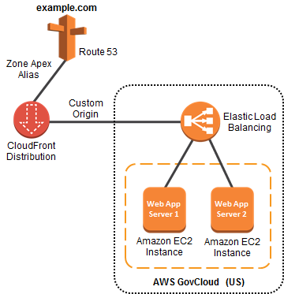

###### Important

This solution requires creating Route 53 public hosted zone in commercial AWS because alias records pointing to CloudFront is not available in AWS GovCloud (US). If your architecture does not include CloudFront, you can consider creating Route 53 public hosted zones in AWS GovCloud (US) Regions. For more information, see [Amazon Route 53 in AWS GovCloud (US)](govcloud-r53.md "govcloud-r53.md").

## Step 1: Sign Up for AWS GovCloud (US)

1. To use AWS services in the AWS GovCloud (US) Regions, you must have an AWS GovCloud (US) account. If you don’t have an account, see [AWS GovCloud (US) Sign Up](getting-started-sign-up.md "getting-started-sign-up.md") for more information.

## Step 2: Create Your Resources in the AWS GovCloud (US) Region

1. Create two web application Amazon EC2 servers via the [AWS GovCloud (US) console](https://console.amazonaws-us-gov.com/ec2/v2/home "https://console.amazonaws-us-gov.com/ec2/v2/home") and confirm that they are in a running state. Configuring the web servers on the Amazon EC2 instances is outside of the scope of this section.

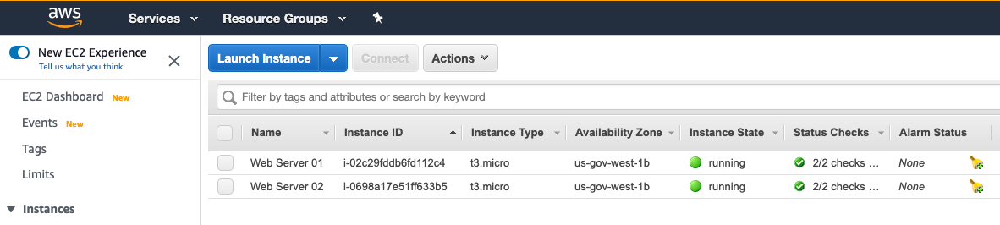 2. Create an ELB load balancer and add the two instances created in the previous step to a new target group. Confirm that the instances are healthy and registered. Note the DNS name of the newly created load balancer.

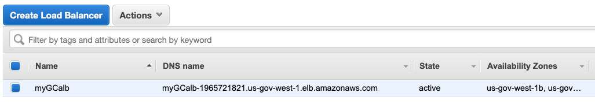

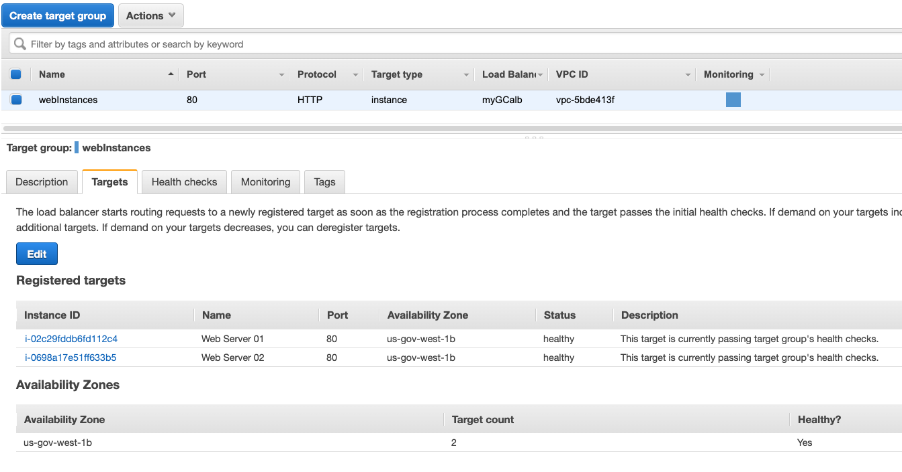 3. Test access to your website by entering the load balancer DNS name in a web browser. You can verify the load balancer is balancing traffic between the two instances by waiting at least one minute between requests.

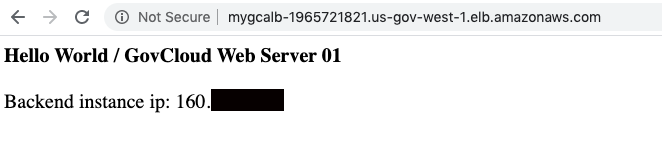

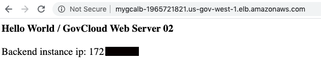

## Step 3: Create a CloudFront Custom Origin Web Distribution

Because AWS GovCloud (US) is not currently integrated into the CloudFront service, you must create a CloudFront distribution using your standard AWS account. Since the CloudFront service is hosted outside the AWS GovCloud (US) Regions, customers should ensure any content hosted in the CloudFront service does not contain export-controlled information.

1. Sign in to the [CloudFront console](https://console.aws.amazon.com/cloudfront/ "https://console.aws.amazon.com/cloudfront/") with your standard AWS account, and choose **Create Distribution**.

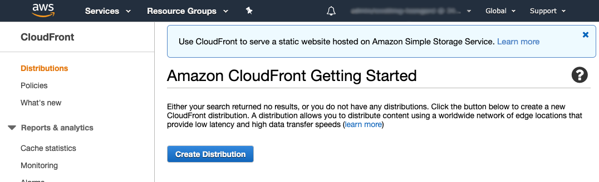 2. Select the **Get Started** under **Web** distribution delivery method, and then choose **Continue**.

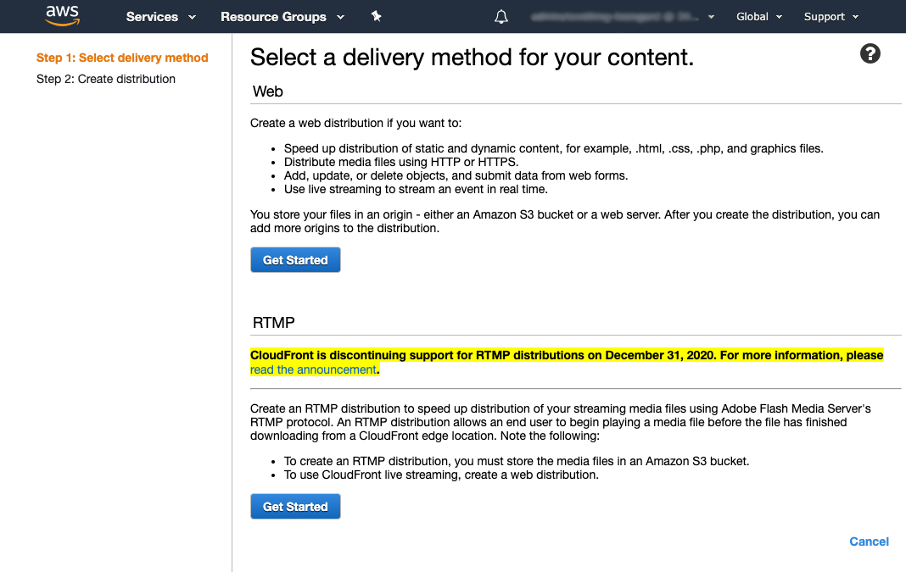 3. In **Origin Domain Name**, type the AWS GovCloud (US) load balancer DNS name to create a custom origin.

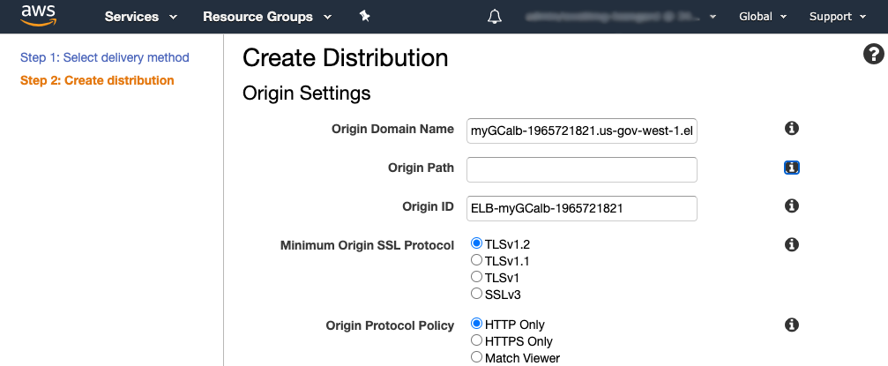 4. In **Alternate Domain Names (CNAMEs)**, add the zone apex name. Note you must attach a trusted certificate that validates your authorization to use the domain name.

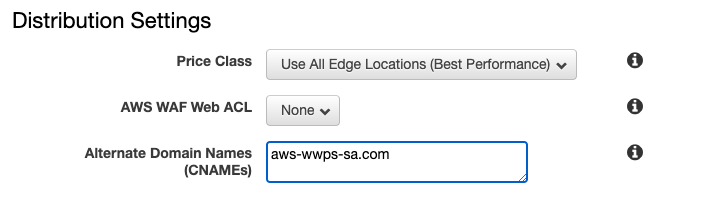 5. Choose **Create Distribution**.

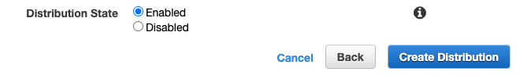 6. After the status for the new distribution changes to **Deployed**, make a note of the domain name. You will use this domain name when you set up Route 53 in the next step.

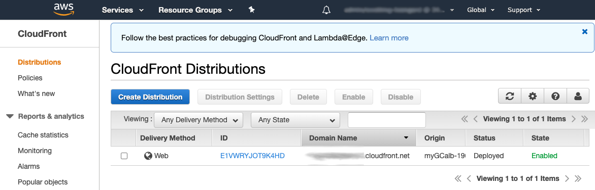

For information about how CloudFront processes and forwards requests to a customer origin server, such as an AWS GovCloud (US) load balancer, see the [CloudFront documentation](https://aws.amazon.com/documentation/cloudfront/ "https://aws.amazon.com/documentation/cloudfront/").

## Step 4: Configure a New Route 53 Alias Resource Record Set

1. Using your standard AWS account from the previous step, sign in to the [Route 53 console](https://console.aws.amazon.com/route53/ "https://console.aws.amazon.com/route53/").
2. Under your root domain, create a new record.
3. Under the routing policy, select Simple routing and click Next.

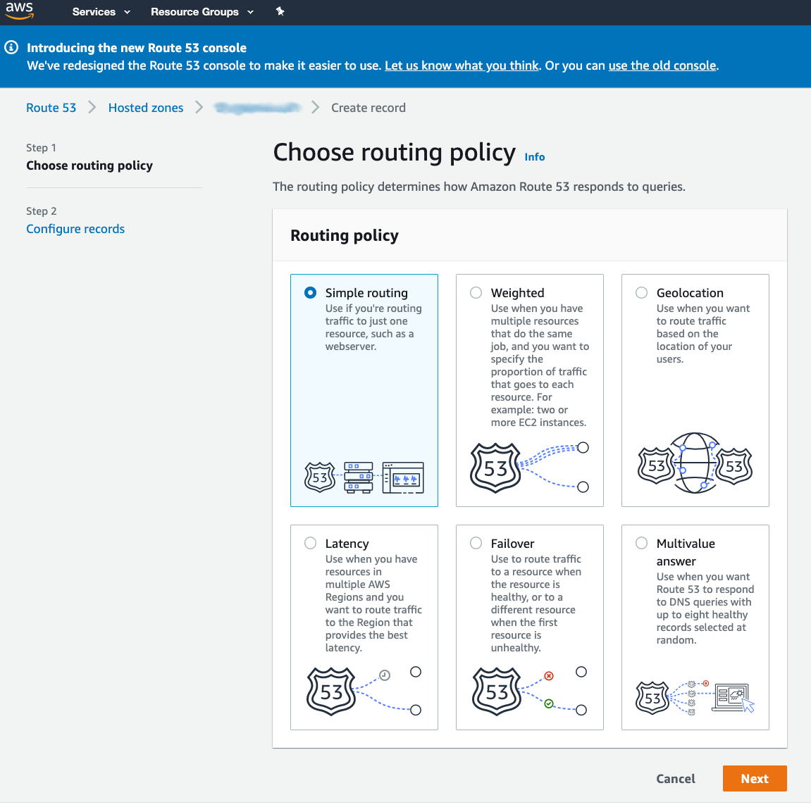 4. Choose Define simple record. In the "Value/Route traffic to" drop down, select "Alias to CloudFront distribution". Click in the "Choose Distribution" search box and select the distribution created in the prior step.

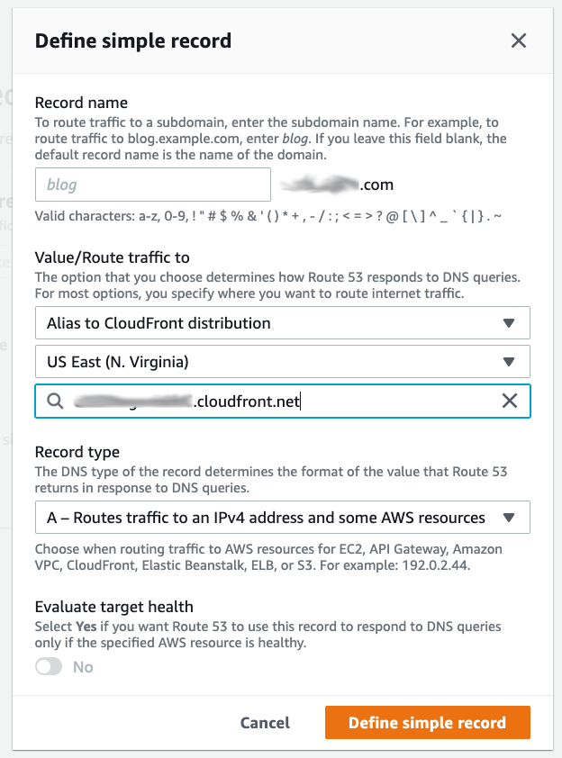 5. On the overview, click on Create records.

## Step 5: Test that Your Website Is Accessible

1. Enter your root domain in a web browser to verify that your website is accessible.

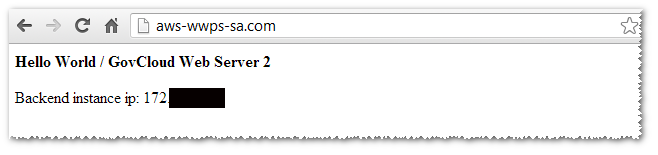

Congratulations! You have successfully pointed your zone apex at your ELB load balancer in the AWS GovCloud (US) Regions.

For more information about Route 53, see the [Route 53 documentation](https://aws.amazon.com/documentation/route53/ "https://aws.amazon.com/documentation/route53/").
