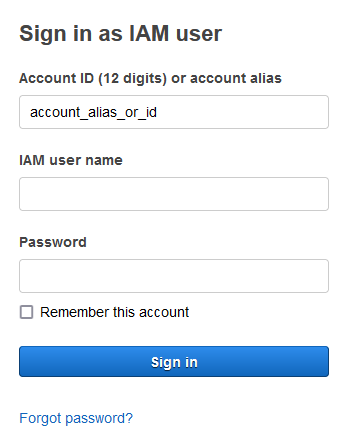
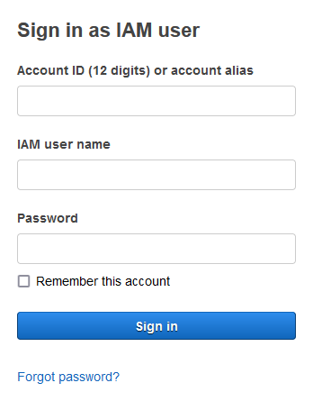

# Signing in to AWS GovCloud (US)

The AWS Management Console provides a web-based user interface that you can use to create and manage your AWS resources. For example, you can start and stop Amazon EC2 instances, create Amazon DynamoDB tables, create Amazon S3 buckets, and so on.

Before you can use the AWS Management Console, you must sign in to your AWS GovCloud (US) account. There are two different types of users in AWS GovCloud (US). You are either the account owner (root user) or you are an IAM user. The root user is created when the AWS GovCloud (US) account is created. IAM users are created by the root user or an IAM administrator within the AWS GovCloud (US) account.

If you do not remember your credentials or have trouble signing in using your credentials, see [Troubleshooting AWS GovCloud (US) sign-in or account issues](govcloud-sign-in-issues.md "govcloud-sign-in-issues.md").

## Sign in as the root user

The AWS Management Console for AWS GovCloud (US) only supports signing in as an IAM user. Signing in to the AWS Management Console for AWS GovCloud (US) as the AWS GovCloud (US) account root user or as the associated standard AWS account
root user is not supported.

For more information, see [AWS Identity and Access Management in AWS GovCloud (US)](govcloud-iam.md "govcloud-iam.md").

For more information about the AWS GovCloud (US) account root user, see [AWS GovCloud (US) account root user](govcloud-account-root-user.md "govcloud-account-root-user.md").

## Sign in as an IAM user

Before you sign in to an AWS GovCloud (US) account as an IAM user, be sure that you have the following required information. If you do not have this information, contact the administrator for the AWS GovCloud (US) account.

###### Requirements

- One of the following:
  - The account alias.
  - The 12-digit AWS GovCloud (US) account ID.

- The user name for your IAM user.
- The password for your IAM user.

If you are a root user or IAM administrator and need to provide the AWS GovCloud (US) account ID or AWS GovCloud (US) account alias to an IAM user, see [Your AWS GovCloud (US) account ID and its alias](govcloud-account-ID-alias.md "govcloud-account-ID-alias.md").

If you are an IAM user, you can log in using either a sign-in URL or the main sign-in page.

###### To sign in to an AWS GovCloud (US) account as an IAM user using an IAM user sign-in URL

1. Open a browser and enter the following sign-in URL, replacing account_alias_or_id with the account alias or account ID provided by your administrator.

```
https://<account_alias_or_id>.signin.amazonaws-us-gov.com
```

2. Enter your IAM user name and password and choose **Sign in**.



###### To sign in to an AWS GovCloud (US) account as an IAM user using the main sign-in page

1. Open [link](https://console.amazonaws-us-gov.com "https://console.amazonaws-us-gov.com").

If you have signed in previously using this browser, your browser might remember the account alias or account ID for the AWS GovCloud (US) account. 2. Enter account alias or account ID, IAM user name and password and choose **Sign in**.


