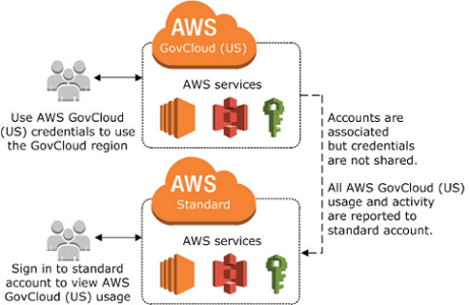

# AWS GovCloud (US) Billing and Payment

All AWS GovCloud (US) activity, usage, and payments are managed through a standard AWS
account. When you sign up for AWS GovCloud (US), your AWS GovCloud (US) account is associated
with your standard AWS account. You can associate only one AWS GovCloud (US) account to one
standard AWS account. If you require multiple AWS GovCloud (US) accounts, you must create a
standard AWS account for each AWS GovCloud (US) account. For more information about Billing and Cost Management, see the [AWS Billing and Cost Management documentation](../../../awsaccountbilling/latest/aboutv2/billing-what-is.md "../../../awsaccountbilling/latest/aboutv2/billing-what-is.md") .

To view account activity and usage reports for the AWS GovCloud (US) account, you must
sign in to the standard AWS account (using credentials from that account). You cannot
view usage and activity from the AWS Management Console for the AWS GovCloud (US) Region.

If you use AWS services in other AWS Regions with the standard AWS account, your account
activity and usage reports are combined. If you want to separate billing and usage
between the two accounts, create a new standard AWS account that you use only to
associate with your AWS GovCloud (US) account.

The following diagram outlines the relationship between AWS GovCloud (US) and standard AWS
accounts:

AWS GovCloud (US) account relationship to standard AWS account

## AWS Cost and Usage Reports

The AWS Cost and Usage Reports (AWS CUR) contains a comprehensive set of cost and usage data.
You can use Cost and Usage Reports to publish your AWS billing reports to an Amazon Simple Storage Service (Amazon S3) bucket that you own.
The CURs contains AWS cost and usage data for both commercial and GovCloud partitions.

## Access cost and usage reports in GovCloud partition

Currently, billing information for GovCloud accounts and regions are only available in the commercial partition.
For organizations that require users to exclusively use AWS GovCloud (US) regions, you can copy CURs stored in an Amazon S3 bucket(s) in commercial region(s) into an AWS GovCloud (US) Amazon S3 bucket.
See [Move data in and out of AWS GovCloud (US) with Amazon S3.](https://aws.amazon.com/blogs/publicsector/move-data-in-out-aws-govcloud-us-amazon-s3/ "https://aws.amazon.com/blogs/publicsector/move-data-in-out-aws-govcloud-us-amazon-s3/")

## Savings plans

Savings plans for GovCloud account and regions need to be purchased in the Standard commercial account.
These plans purchased in the Standard account apply to usage in GovCloud regions.
See [How Amazon Elastic Compute Cloud Differs for AWS GovCloud (US).](govcloud-ec2.md "govcloud-ec2.md")
In addition, GovCloud accounts inherit discount sharing configuration from their associated commercial accounts.
See [Activating shared Reserved Instances and Savings Plans discount sharing.](../../../awsaccountbilling/latest/aboutv2/ri-turn-off.md#ri-turn-on-process "../../../awsaccountbilling/latest/aboutv2/ri-turn-off.md#ri-turn-on-process")
