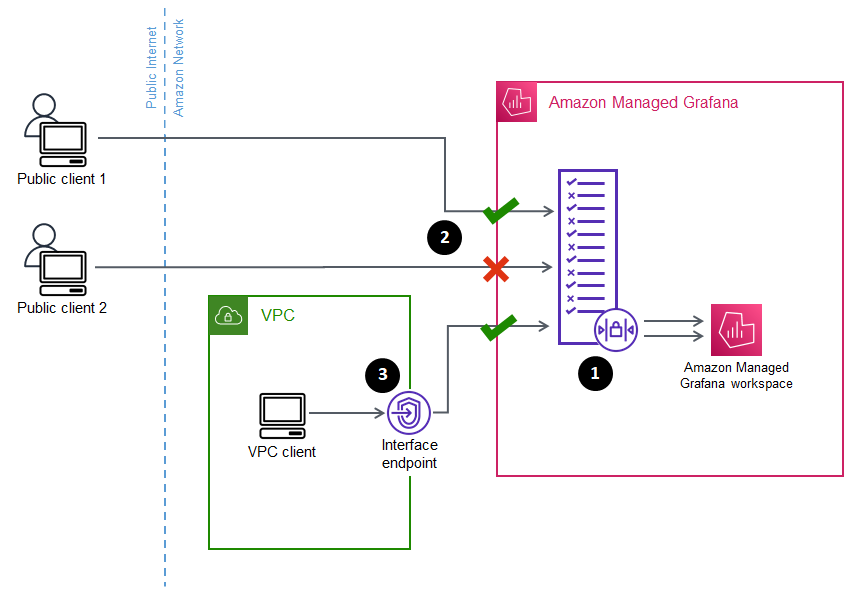

# Configure network access to your Amazon Managed Grafana

workspace

You can control how users and hosts access your Grafana workspaces.

Grafana requires all users to be authenticated and authorized. However, by default,
Amazon Managed Grafana workspaces are open to all network traffic. You can configure network access
control for a workspace, to control what network traffic is allowed to reach it.

You can control traffic to your workspace in two ways.

- **IP Addresses** (prefix lists) – You can
  create a [managed
  prefix list](../../../vpc/latest/userguide/working-with-managed-prefix-lists.md "../../../vpc/latest/userguide/working-with-managed-prefix-lists.md") with IP ranges that are allowed to access workspaces.
  Amazon Managed Grafana supports only public, IPv4 addresses for network access
  control.
- **VPC endpoints** – You can create a list
  of VPC endpoints to your workspaces that are allowed to access a specific
  workspace.
  When you configure network access control, you must include at least one prefix list
  or VPC endpoint.

Amazon Managed Grafana uses the prefix lists and VPC endpoints to decide which requests to the
Grafana workspace are allowed to connect. The following diagram shows this
filtering.

Configuring network access control (**1**) for an
Amazon Managed Grafana workspace specifies which requests should be allowed to access the workspace.
Network access control can allow or block traffic by IP address (**2**), or by which interface endpoint is being used (**3**).

The following section describes how to set up network access control.

## Configuring network access control

You can add network access control to an existing workspace or configure it as
part of the initial creation of the workspace.

**Prerequisites**

To set up network access control you must first create either an interface VPC
endpoint for your workspaces, or at least one IP prefix list for the IP addresses
that you want to allow. You can create both or more than one of both, as
well.

- **VPC endpoint** – You can create an
  interface VPC endpoint that gives access to all of your workspaces. After
  you have created the endpoint, you need the VPC endpoint ID for each
  endpoint you want to allow. VPC endpoint IDs have the format
  `vpce-`1a2b3c4d``.

For information about creating a VPC endpoint for your Grafana workspaces,
see [Interface VPC endpoints](VPC-endpoints.md "VPC-endpoints.md"). To create
a VPC endpoint specifically for your workspaces, use the
`com.amazonaws.`region`.grafana-workspace`
endpoint name.

For VPC endpoints that you give access to your workspace, you can further
limit their access by configuring security groups for the endpoints. To
learn more, see [Associate security groups](../../../vpc/latest/privatelink/interface-endpoints.md#associate-security-groups "../../../vpc/latest/privatelink/interface-endpoints.md#associate-security-groups") and [Security group rules](../../../vpc/latest/userguide/VPC_SecurityGroups.md#SecurityGroupRules "../../../vpc/latest/userguide/VPC_SecurityGroups.md#SecurityGroupRules") in the _Amazon VPC
documentation_.

- **Managed prefix list** (for IP address
  ranges) – to allow IP addresses, you must create one or more prefix
  lists in Amazon VPC with the list of IP ranges to allow. There are a few
  limitations for prefix lists when used for Amazon Managed Grafana:

      + Each prefix list can contain up to 100 IP address ranges.
      + Private IP address ranges (for example, `10.0.0.0/16`
       are ignored. You can include private IP address ranges in a prefix
       list, but Amazon Managed Grafana ignores those when filtering traffic to the
       workspace. To allow those hosts to reach the workspace, create a VPC
       endpoint for your workspaces and give them access.
      + Amazon Managed Grafana only supports IPv4 addresses in prefix lists, not IPv6.
       IPv6 addresses are ignored.

  You create managed prefix lists through the [Amazon VPC Console](https://console.aws.amazon.com/vpc/home?#ManagedPrefixLists "https://console.aws.amazon.com/vpc/home?#ManagedPrefixLists"). After you have
  created the prefix lists, you need the prefix list ID for each list you want
  to allow in Amazon Managed Grafana. Prefix list IDs have the format
  `pl-`1a2b3c4d``.

For more information about creating prefix lists, see [Group CIDR blocks
using managed prefix lists](../../../vpc/latest/userguide/managed-prefix-lists.md "../../../vpc/latest/userguide/managed-prefix-lists.md") in the _Amazon Virtual Private Cloud User
Guide_.

- You must have the necessary permissions to configure or create an
  Amazon Managed Grafana workspace. For example, you could use the AWS managed policy,
  `AWSGrafanaAccountAdministrator`.

After you have the list of IDs for the prefix lists or VPC endpoints that you want
to give access to your workspace, you are ready to create the network access control
configuration.

###### Note

If you enable network access control, but do not add a prefix list to the
configuration, no access to your workspace is allowed, except through the
allowed VPC endpoints.

Similarly, if you enable network access control, but do not add a VPC endpoint
to the configuration, no access to your workspace is allowed, except through the
allowed IP addresses.

You must include at least one prefix list or VPC endpoint in the network
access control configuration, or you would not be able to access your workspace
from anywhere.

###### To configure network access control for a workspace

1. Open the [Amazon Managed Grafana
   console](https://console.aws.amazon.com/grafana/home/ "https://console.aws.amazon.com/grafana/home/").
2. In the left navigation pane, choose **All
   workspaces**.
3. Select the name of the workspace that you want to configure network access
   control.
4. In the **Network access control** tab, under **Network access control**, choose
   **Restricted access** to configure network access
   control.

###### Note

You can access these same options while creating a workspace. 5. From the drop down select whether you are adding a **Prefix
list** or a **VPC endpoint**. 6. Select the VPC endpoint or Prefix list ID that you want to add
(alternatively, you can type the ID that you want to use. You must choose at
least one. 7. To add more endpoints or lists, select **Add new
resource** for each one you want to add.

###### Note

You can add up to 5 prefix lists and 5 VPC endpoints. 8. Choose **Save changes** to complete the setup.

###### Warning

If you have existing users of your workspace, include their IP ranges or VPC
endpoints in the configuration, or they will lose access with a `403
 Forbidden` error. It is recommended that you test existing access
points after setting up or modifying the configuration of network access
control.
