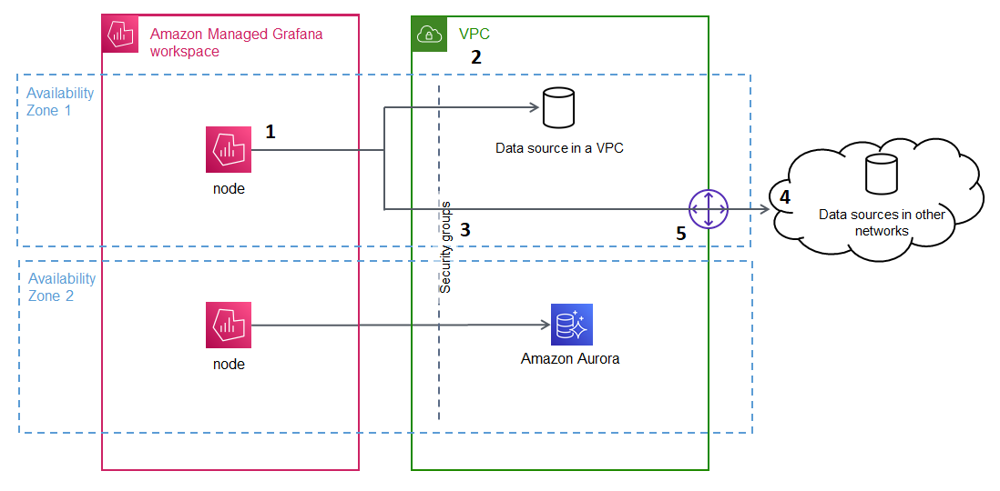

# Connect to data sources or notification channels in

Amazon VPC from Amazon Managed Grafana

By default, traffic from your Amazon Managed Grafana workspace to data sources or notification
channels flows via the public Internet. This limits the connectivity from your Amazon Managed Grafana
workspace to services that are publicly accessible.

###### Note

When you have not configured a private VPC, and Amazon Managed Grafana is connecting to
publicly accessible data sources, it connects to some AWS services in the same
region via AWS PrivateLink. This includes services such as CloudWatch, Amazon Managed Service for Prometheus and
AWS X-Ray. Traffic to those services does not flow via the public Internet.

If you want to connect to private-facing data sources that are within a VPC, or keep
traffic local to a VPC, you can connect your Amazon Managed Grafana workspace to the Amazon Virtual Private Cloud
(Amazon VPC) hosting these data sources. After you configure the VPC data source connection,
all traffic flows via your VPC.

A _virtual private cloud_ (VPC) is a virtual network dedicated to
your AWS account. It is logically isolated from other virtual networks, including
other VPCs and the public internet. Use Amazon VPC to create and manage your VPCs in the
AWS Cloud. Amazon VPC gives you full control over your virtual networking environment,
including resource placement, connectivity, and security. Amazon Managed Grafana data sources, and
other resources, can be created in your VPC. For more information on Amazon VPC, see [What is
Amazon VPC?](../../../vpc/latest/userguide/what-is-amazon-vpc.md "../../../vpc/latest/userguide/what-is-amazon-vpc.md") in the _Amazon Virtual Private Cloud User Guide_.

###### Note

If you want your Amazon Managed Grafana workspace to connect to data outside of the VPC, in
another network or public Internet, you must add routing to the other network. For
information about how to connect your VPC to another network, see [Connect your
VPC to other networks](../../../vpc/latest/userguide/extend-intro.md "../../../vpc/latest/userguide/extend-intro.md") in the _Amazon Virtual Private Cloud User
Guide_.

## How VPC connectivity works

[Amazon VPC](../../../vpc/latest/userguide/what-is-amazon-vpc.md "../../../vpc/latest/userguide/what-is-amazon-vpc.md") gives you complete control over your virtual networking
environment, including creating public-facing and private-facing _subnets_ for your application to connect, and _security groups_ to manage what services or resources
have access to the subnets.

To use Amazon Managed Grafana with resources in a VPC, you must create a connection to that VPC
for the Amazon Managed Grafana workspace. After you set up the connection, Amazon Managed Grafana connects
your workspace to each provided subnet in each Availability Zone in that VPC, and
all traffic to or from the Amazon Managed Grafana workspace flows through the VPC. The following
diagram shows how this connectivity looks, logically.

Amazon Managed Grafana creates a connection (**1**) per subnet
(using an [elastic network interface](../../../AWSEC2/latest/UserGuide/using-eni.md "../../../AWSEC2/latest/UserGuide/using-eni.md"), or ENI) to connect to the VPC (**2**). The Amazon Managed Grafana VPC connection is associated with a set
of security groups (**3**) that control the traffic
between the VPC and your Amazon Managed Grafana workspace. All traffic is routed through the
configured VPC, including alert destination and data source connectivity. To connect
to data sources and alert destinations in other VPCs or the public Internet
(**4**), create a [gateway](../../../vpc/latest/userguide/extend-intro.md "../../../vpc/latest/userguide/extend-intro.md") (**5**) between the other network and your VPC.

## Create a connection to a VPC

This section describes the steps to connect to a VPC from your existing Amazon Managed Grafana
workspace. You can follow these same instructions when creating your workspace. For
more information about creating a workspace, see [Create an Amazon Managed Grafana workspace](AMG-create-workspace.md "AMG-create-workspace.md").

### Prerequisites

The following are prerequisites for establishing a connection to a VPC from an
existing Amazon Managed Grafana workspace.

- You must have the necessary permissions to configure or create an
  Amazon Managed Grafana workspace. For example, you could use the AWS managed
  policy, `AWSGrafanaAccountAdministrator`.
- You must have a VPC setup in your account with at least two
  Availability Zones configured, with one _private
  subnet_ configured for each. You must know the subnet and
  security group information for your VPC.

###### Note

[Local
Zones](../../../local-zones/latest/ug/what-is-aws-local-zones.md "../../../local-zones/latest/ug/what-is-aws-local-zones.md") and [Wavelength Zones](../../../wavelength/latest/developerguide/what-is-wavelength.md "../../../wavelength/latest/developerguide/what-is-wavelength.md") are not supported.

[VPCs
configured](../../../vpc/latest/userguide/create-vpc.md "../../../vpc/latest/userguide/create-vpc.md") with `Tenancy` set to
`Dedicated` are not supported.

###### Important

A minimum of 15 available IP addresses must be in each subnet
connected to your Amazon Managed Grafana workspace. We strongly recommend that
you configure alarms to [monitor IP
usage](../../../vpc/latest/ipam/tracking-ip-addresses-ipam.md "../../../vpc/latest/ipam/tracking-ip-addresses-ipam.md") in your VPC subnets. If the number of available IP
addresses for a subnet falls below 15, you might experience the
following issues:

    + Inability to make configuration changes to your workspace
     until you free up additional IP addresses or attach subnets
     with additional IP addresses
    + Your workspace will not be able to receive security
     updates or patches
    + In rare scenarios, you could experience a complete
     availability loss for the workspace, resulting in
     non-functioning alerts and inaccessible dashboards

- If you are connecting an existing Amazon Managed Grafana workspace that has data
  sources configured, we recommend that you have your VPC configured to
  connect to those data sources before connecting Amazon Managed Grafana to the VPC.
  This includes services such as CloudWatch that are connected through
  AWS PrivateLink. Otherwise, connectivity to those data sources is
  lost.
- If your VPC already has multiple gateways to other networks, you might
  need to set up DNS resolution across the multiple gateways. For more
  information, see [Route 53
  Resolver](../../../Route53/latest/DeveloperGuide/resolver.md "../../../Route53/latest/DeveloperGuide/resolver.md").

### Connecting to a VPC from an existing Amazon Managed Grafana

workspace

The following procedure describes adding an Amazon VPC data source connection to an
existing Amazon Managed Grafana workspace.

###### Note

When you configure the connection to Amazon VPC, it creates an IAM role. With
this role, Amazon Managed Grafana can create connections to the VPC. The IAM role uses
the service-linked role policy,
`AmazonGrafanaServiceLinkedRolePolicy`. To learn more about
service-linked roles, see [Service-linked role permissions for
Amazon Managed Grafana](using-service-linked-roles.md#slr-permissions "using-service-linked-roles.md#slr-permissions").

###### To connect to a VPC from an existing Amazon Managed Grafana workspace

1. Open the [Amazon Managed Grafana
   console](https://console.aws.amazon.com/grafana/home/ "https://console.aws.amazon.com/grafana/home/").
2. In the left navigation pane, choose **All
   workspaces**.
3. Select the name of the workspace that you want to add a VPC data
   source connection.
4. In the **Network access settings** tab, next to
   **Outbound VPC connection**, choose
   **Edit** to create your VPC connection.
5. Choose the **VPC** you want to connect.
6. Under **Mappings**, select the Availability Zones you
   want to use. You must choose at least two.
7. Select at least one _private subnet_ in each
   Availability Zone. The subnets must support IPv4.
8. Select at least one **Security group** for your VPC.
   You can specify up to 5 security groups. Alternately, you can create a
   security group to apply to this connection.
9. Choose **Save changes** to complete the setup.

Now that you have set up your VPC connection, you can add [Connect to data sources](AMG-data-sources.md "AMG-data-sources.md") accessible
from that VPC to your Amazon Managed Grafana workspace.

**Changing outbound VPC settings**

To change your settings, you can return to the **Network access
settings** tab of your workspace configuration, or you can use the
[UpdateWorkspace](../APIReference/API_UpdateWorkspace.md "../APIReference/API_UpdateWorkspace.md") API.

###### Important

Amazon Managed Grafana manages your VPC configuration for you. Do not edit these VPC
settings using the Amazon EC2 console or APIs, or the settings will get out of
sync.
