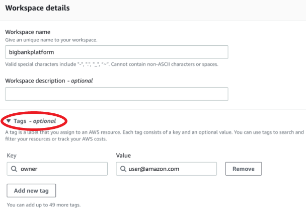

# Create an Amazon Managed Grafana workspace

A _workspace_ is a logical Grafana server. You can have as many as
five workspaces in each Region in your account.

**Necessary permissions**

To create a workspace, you must be signed on to an AWS Identity and Access Management (IAM) principal that
has the **AWSGrafanaAccountAdministrator** policy attached.

To create your first workspace that uses IAM Identity Center for authorization, your IAM principal
must also have these additional policies (or equivalent permissions) attached:

- **AWSSSOMemberAccountAdministrator**
- **AWSSSODirectoryAdministrator**
  For more information, see [Create and manage Amazon Managed Grafana workspaces and users in a single standalone
  account using IAM Identity Center](security_iam_id-based-policy-examples.md#security_iam_id-based-policy-examples-create-workspace-standalone "security_iam_id-based-policy-examples.md#security_iam_id-based-policy-examples-create-workspace-standalone").

## Creating a workspace

The following steps take you through the process of creating a new Amazon Managed Grafana
workspace.

###### To create a workspace in Amazon Managed Grafana

1. Open the Amazon Managed Grafana console at [https://console.aws.amazon.com/grafana/](https://console.aws.amazon.com/grafana/ "https://console.aws.amazon.com/grafana/").
2. Choose **Create workspace**.
3. In the **Workspace details** window, for
   **Workspace name**, enter a name for the
   workspace.

Optionally, enter a description for the workspace.

Optionally, add the tags you want to associate with this workspace. Tags
help identify and organize workspaces and also can be used for controlling
access to AWS resources. For example, you can assign a tag to the
workspace and only a limited groups or roles can have the permission to
access the workspace using the tag. For more information on tag-based access
control, see [Controlling access to AWS resources using tags](../../../IAM/latest/UserGuide/access_tags.md "../../../IAM/latest/UserGuide/access_tags.md") in IAM User
Guide.

 4. Choose a **Grafana version** for the workspace. You can
choose version 8, 9, or 10. To understand the differences between the
versions, see [Differences between Grafana versions](version-differences.md "version-differences.md"). 5. Choose **Next**. 6. For **Authentication access**, select **AWS IAM Identity Center** , **Security Assertion Markup Language (SAML)**,
or both. For more information, see [Authenticate users in Amazon Managed Grafana
workspaces](authentication-in-AMG.md "authentication-in-AMG.md").

    * **IAM Identity Center** — If you select
     IAM Identity Center and you have not already enabled AWS IAM Identity Center in your account,
     you are prompted to enable it by creating your first IAM Identity Center user.
     IAM Identity Center handles user management for access to Amazon Managed Grafana
     workspaces.

    To enable IAM Identity Center, follow these steps:
    1. Choose **Create user**.
    2. Enter an email address, first name, and last name for the user,
     and choose **Create user**. For this tutorial, use
     the name and email address of the account that you want to use to
     try out Amazon Managed Grafana. You will receive an email message prompting you
     to create a password for this account for IAM Identity Center.###### Important

The user that you create does not automatically have access to your
Amazon Managed Grafana workspace. You provide the user with access to the workspace
in the workspace details page in a later step.

    * **SAML** — If you select
     **SAML**, you complete the SAML setup after the
     workspace is created.

7. Choose **Service managed** or **Customer
   managed**.

If you choose **Service managed**, Amazon Managed Grafana
automatically creates the IAM roles and provisions the permissions that
you need for the AWS data sources in this account that you choose to use
for this workspace.

If you want to manage these roles and permissions yourself, choose
**Customer managed**.

If you are creating a workspace in a member account of an organization, to
be able to choose **Service managed** the member account
must be a delegated administrator account in an organization. For more
information about delegated administrator accounts, see [Register a delegated administrator](../../../AWSCloudFormation/latest/UserGuide/stacksets-orgs-delegated-admin.md "../../../AWSCloudFormation/latest/UserGuide/stacksets-orgs-delegated-admin.md"). 8. (Optional) You can choose to connect to an Amazon virtual private cloud
(VPC) on this page, or you can connect to a VPC later. To learn more, see
[Connect to data sources or notification channels in
Amazon VPC from Amazon Managed Grafana](AMG-configure-vpc.md "AMG-configure-vpc.md"). 9. (Optional) You can choose other workspace configuration options on this
page, including the following:

    * Enable [Grafana alerting](alerts-overview.md "alerts-overview.md").
     Grafana alerting allows you to view Grafana alerts and alerts
     defined in Prometheus within a single alerts interface within your
     Grafana workspace.

    In workspaces running version 8 or 9, this will send multiple
     notifications for your Grafana alerts. If you use alerts defined in
     Grafana, we recommend creating your workspace as version 10.4 or
     later.
    * Allow Grafana admins to [manage
     plugins](grafana-plugins.md "grafana-plugins.md") for this workspace. If you don't enable plugin
     management, your admins will not be able to install, uninstall, or
     remove plugins for your workspace. You might be limited to the types
     of data sources and visualization panels you can use with
     Amazon Managed Grafana.

You can also make these configuration changes after creating your
workspace. To learn more about configuring your workspace, see [Configure a Amazon Managed Grafana workspace](AMG-configure-workspace.md "AMG-configure-workspace.md"). 10. (Optional) You can choose to add **Network access
control** for your workspace. To add network access control,
choose **Restricted access**. You can also enable network
access control after you have created your workspace.

For more information about network access control, see [Configure network access to your Amazon Managed Grafana
workspace](AMG-configure-nac.md "AMG-configure-nac.md"). 11. (Optional) By default, Amazon Managed Grafana automatically provides you with encryption at rest and does this using AWS-owned encryption keys. But you have the option to use a customer managed key that you create, own, and manage as an alternative. For more information, see [Encryption at rest](AMG-encryption-at-rest.md "AMG-encryption-at-rest.md"). 12. Choose **Next**. 13. If you chose **Service managed**, choose
**Current account** to have Amazon Managed Grafana automatically
create policies and permissions that allow it to read AWS data only in the
current account.

If you are creating a workspace in the management account or a delegated
administrator account in an organization, you can choose
**Organization** to have Amazon Managed Grafana automatically create
policies and permissions that allow it to read AWS data in other accounts
in the organizational units that you specify. For more information about
delegated administrator accounts, see [Register a delegated administrator](../../../AWSCloudFormation/latest/UserGuide/stacksets-orgs-delegated-admin.md "../../../AWSCloudFormation/latest/UserGuide/stacksets-orgs-delegated-admin.md").

###### Note

Creating resources such as Amazon Managed Grafana workspaces in the management
account of an organization is against AWS security best
practices.

    1. If you chose **Organization**, and you are
     prompted to enable AWS CloudFormation StackSets, choose **Enable
     trusted access**. Then, add the AWS Organizations organizational
     units (OUs) that you want Amazon Managed Grafana to read data from. Amazon Managed Grafana can
     then read data from all accounts in each OU that you choose.
    2. If you chose **Organization**, choose
     **Data sources and notification channels -
     optional**.

14. Select the AWS data sources that you want to query in this workspace.
    Selecting data sources enables Amazon Managed Grafana to create IAM roles and
    permissions that allow Amazon Managed Grafana to read data from these sources. You must
    still add the data sources in the Grafana workspace console.
15. (Optional) If you want Grafana alerts from this workspace to be sent to an
    Amazon Simple Notification Service (Amazon SNS) notification channel, select **Amazon
    SNS**. This enables Amazon Managed Grafana to create an IAM policy to
    publish to the Amazon SNS topics in your account with `TopicName`
    values that start with `grafana`. This does not completely set up
    Amazon SNS as a notification channel for the workspace. You can do that within
    the Grafana console in the workspace.
16. Choose **Next**.
17. Confirm the workspace details, and choose **Create
    workspace**.

The workspace details page appears.

Initially, the **Status** is
**CREATING**.

###### Important

Wait until the status is **ACTIVE** before doing
either of the following:

    * Completing the SAML setup, if you are using SAML.
    * Assigning your IAM Identity Center users access to the workspace, if you are
     using IAM Identity Center.You might need to refresh your browser to see the current

status. 18. If you are using IAM Identity Center, do the following:

    1. In the **Authentication** tab, choose
     **Assign new user or group**.
    2. Select the check box next to the user that you want to grant
     workspace access to, and choose **Assign
     user**.
    3. Select the check box next to the user, and choose **Make
     admin**.

    ###### Important

    Assign at least one user as `Admin` for each
     workspace, in order to sign in to the Grafana workspace console
     to manage the workspace.

19. If you are using SAML, do the following:
    1.  In the **Authentication** tab, under
        **Security Assertion Markup Language (SAML)**,
        choose **Complete setup**.
    2.  For **Import method**, do one of the
        following:
        - Choose **URL** and enter the URL of the
          IdP metadata.
        - Choose **Upload or copy/paste**. If you
          are uploading the metadata, choose **Choose
          file** and select the metadata file. Or, if you
          are using copy and paste, copy the metadata into
          **Import the metadata**.

    3.  For **Assertion attribute role**, enter the name
        of the SAML assertion attribute from which to extract role
        information.
    4.  For **Admin role values**, either enter the user
        roles from your IdP who should all be granted the `Admin`
        role in the Amazon Managed Grafana workspace, or select **I want to
        opt-out of assigning admins to my workspace.**

    ###### Note

    If you choose **I want to opt-out of assigning admins
    to my workspace.**, you won't be able to use the
    console to administer the workspace, including tasks such as
    managing data sources, users, and dashboard permissions. You can
    make administrative changes to the workspace only by using
    Amazon Managed Grafana APIs. 5. (Optional) To enter additional SAML settings, choose
    **Additional settings** and do one or more the
    following. All of these fields are optional.

        * For **Assertion attribute name**, specify
         the name of the attribute within the SAML assertion to use
         for the user full "friendly" names for SAML users.
        * For **Assertion attribute login**,
         specify the name of the attribute within the SAML assertion
         to use for the user sign-in names for SAML users.
        * For **Assertion attribute email**,
         specify the name of the attribute within the SAML assertion
         to use for the user email names for SAML users.
        * For **Login validity duration (in
         minutes)**, specify how long a SAML user's
         sign-in is valid before the user must sign in again. The
         default is 1 day, and the maximum is 30 days.
        * For **Assertion attribute organization**,
         specify the name of the attribute within the SAML assertion
         to use for the "friendly" name for user
         organizations.
        * For **Assertion attribute groups**,
         specify the name of the attribute within the SAML assertion
         to use for the "friendly" name for user groups.
        * For **Allowed organizations**, you can
         limit user access to only the users who are members of
         certain organizations in the IdP. Enter one or more
         organizations to allow, separating them with commas.
        * For **Editor role values**, enter the
         user roles from your IdP who should all be granted the
         `Editor` role in the Amazon Managed Grafana workspace.
         Enter one or more roles, separated by commas.

    6.  Choose **Save SAML configuration**.

20. In the workspace details page, choose the URL displayed under
    **Grafana workspace URL**.
21. Choosing the workspace URL takes you to the landing page for the Grafana
    workspace console. Do one of the following:
    - Choose **Sign in with SAML**, and enter the name
      and password.
    - Choose **Sign in with AWS IAM Identity Center**, and enter the
      email address and password of the user that you created earlier in
      this procedure. These credentials only work if you have responded to
      the email from Amazon Managed Grafana that prompted you to create a password for
      IAM Identity Center.

    You are now in your Grafana workspace, or logical Grafana server.
    You can start adding data sources to query, visualize, and analyze
    data. For more information, see [Use your Grafana
    workspace](AMG-working-with-Grafana-workspace.md "AMG-working-with-Grafana-workspace.md").

For more information on

###### Tip

You can automate the creation of Amazon Managed Grafana workspaces by using CloudFormation. For more
detailed information see [Creating Amazon Managed Grafana resources
with AWS CloudFormation](creating-resources-with-cloudformation.md "creating-resources-with-cloudformation.md").
