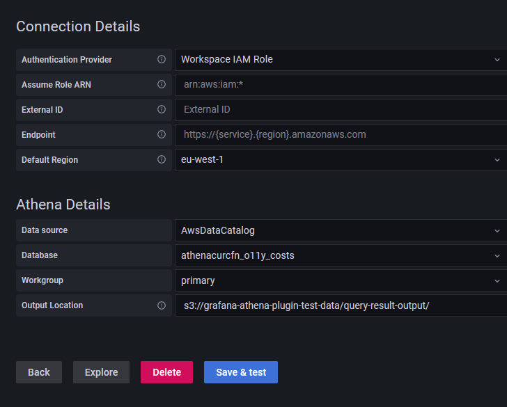

# Manually adding the Athena data

source

## Prerequisites

- The [AWS CLI](../../../cli/latest/userguide/cli-chap-getting-started.md "../../../cli/latest/userguide/cli-chap-getting-started.md") is installed and configured in your
  environment.
- You have access to **Amazon Athena** from your
  account.

###### To manually add the Athena data source:

1. In the Grafana console side menu, pause on the **Configuration** (gear) icon, then choose **Data Sources**.
2. Choose **Add data source**.
3. Choose the **AWS Athena** data source. If
   necessary, you can start typing `Athena` in the
   search box to help you find it.
4. In **Connection Details** menu, configure the
   authentication provider (recommended: **Workspace IAM
   Role**)
5. Select your targeted Athena data source, database, and
   workgroup.

To create a new Athena account, follow the instructions at [Getting started with Athena](../../../athena/latest/ug/getting-started.md "../../../athena/latest/ug/getting-started.md"). 6. If your workgroup doesn't have an output location configured already,
specify an S3 bucket and folder to use for query results. For example,
`s3://grafana-athena-plugin-test-data/query-result-output/` . 7. Select **Save & Test**.
The following is an example of the **Athena Details**
settings.

