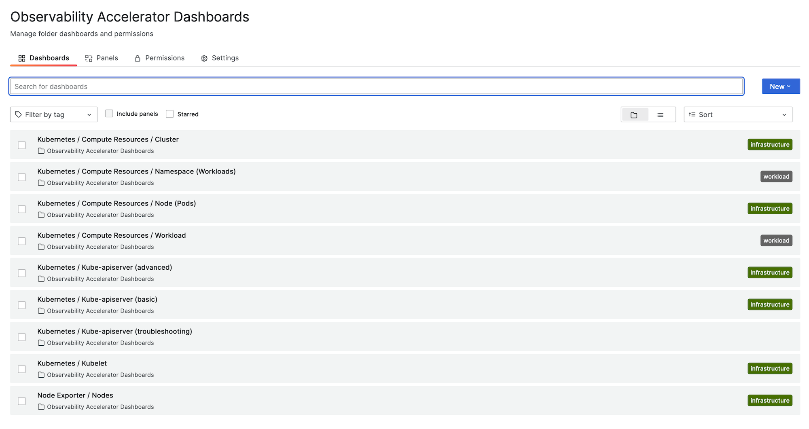
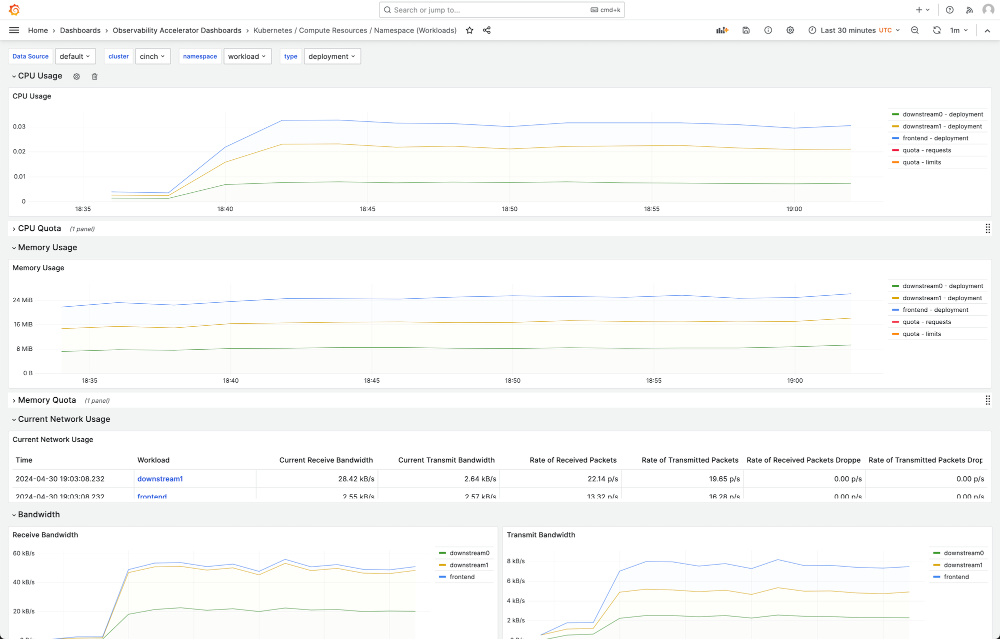
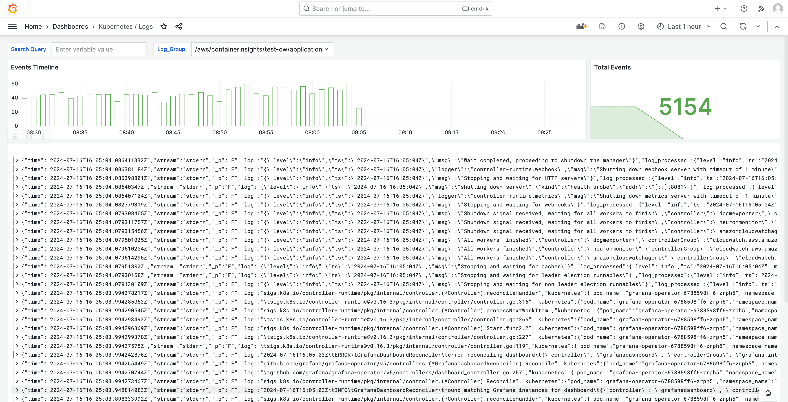

# Solution for Monitoring Amazon EKS infrastructure with

Amazon Managed Grafana

Monitoring Amazon Elastic Kubernetes Service infrastructure is one of the most common scenarios for which
Amazon Managed Grafana are used. This page describes a template that provides you with a solution
for this scenario. The solution can be installed using [AWS Cloud Development Kit (AWS CDK)](../../../cdk/v2/guide/home.md "../../../cdk/v2/guide/home.md") or with
[Terraform](https://www.terraform.io/ "https://www.terraform.io/").

This solution configures:

- Your Amazon Managed Service for Prometheus workspace to store metrics from your Amazon EKS cluster, and creates a
  managed collector to scrape the metrics and push them to that workspace. For more
  information, see [Ingest metrics with AWS managed collectors](../../../prometheus/latest/userguide/AMP-collector.md "../../../prometheus/latest/userguide/AMP-collector.md").
- Gathering logs from your Amazon EKS cluster using a CloudWatch agent. The logs are stored in
  CloudWatch, and queried by Amazon Managed Grafana. For more information, see [Logging for Amazon EKS](../../../prescriptive-guidance/latest/implementing-logging-monitoring-cloudwatch/kubernetes-eks-logging.md "../../../prescriptive-guidance/latest/implementing-logging-monitoring-cloudwatch/kubernetes-eks-logging.md")
- Your Amazon Managed Grafana workspace to pull those logs and metrics, and create dashboards
  and alerts to help you monitor your cluster.
  Applying this solution will create dashboards and alerts that:

- Assess the overall Amazon EKS cluster health.
- Show the health and performance of the Amazon EKS control plane.
- Show the health and performance of the Amazon EKS data plane.
- Display insights on Amazon EKS workloads across Kubernetes namespaces.
- Display resource usage across namespaces, including CPU, memory, disk, and network
  usage.

## About this solution

This solution configures an Amazon Managed Grafana workspace to provide metrics for your Amazon EKS
cluster. The metrics are used to generate dashboards and alerts.

The metrics help you to operate Amazon EKS clusters more effectively by providing insights
into the health and performance of the Kubernetes control and data plane. You can
understand your Amazon EKS cluster from the node level, to pods, down to the Kubernetes
level, including detailed monitoring of resource usage.

The solution provides both anticipatory and corrective capabilities:

- **Anticipatory** capabilities include:
  - Manage resource efficiency by driving scheduling decisions. For
    example, to provide performance and reliability SLAs to your internal
    users of the Amazon EKS cluster you can allocate enough CPU and memory
    resources to their workloads based on tracking historical usage.
  - Usage forecasts: Based on the current utilization of your Amazon EKS
    cluster resources such as nodes, [Persistent Volumes backed by
    Amazon EBS](../../../eks/latest/userguide/ebs-csi.md "../../../eks/latest/userguide/ebs-csi.md"), or [Application Load Balancers](../../../eks/latest/userguide/aws-load-balancer-controller.md "../../../eks/latest/userguide/aws-load-balancer-controller.md") you can plan ahead, for example, for a new product or
    project with similar demands.
  - Detect potential issues early: For example, by analyzing resource
    consumption trends on a Kubernetes namespace level, you can understand
    the seasonality of the workload’s usage.

- **Corrective** capabilities include:
  - Decrease the mean time to detection (MTTD) of issues on the
    infrastructure and the Kubernetes workload level. For example, by
    looking at the troubleshooting dashboard, you can quickly test
    hypotheses about what went wrong and eliminate them.
  - Determine where in the stack a problem is happening. For example,
    the Amazon EKS control plane is fully managed by AWS and certain
    operations such as updating a Kubernetes deployment may fail if the
    API server is overloaded or connectivity is impacted.

The following image shows a sample of the dashboard folder for the
solution.



You can choose a dashboard to see more details, for example, choosing to view the
Compute Resources for workloads will show a dashboard, such as that shown in the
following image.



The metrics are scraped with a 1 minute scrape interval. The dashboards show metrics
aggregated to 1 minute, 5 minutes, or more, based on the specific metric.

Logs are shown in dashboards, as well, so that you can query and analyze logs to find
root causes of issues. The following image shows a log dashboard.



For a list of metrics tracked by this solution, see [List of metrics tracked](#solution-eks-metrics "#solution-eks-metrics").

For a list of alerts created by the solution, see [List of alerts created](#solution-eks-alerts "#solution-eks-alerts").

## Costs

This solution creates and uses resources in your workspace. You will be charged for
standard usage of the resources created, including:

- Amazon Managed Grafana workspace access by users. For more information about pricing, see
  [Amazon Managed Grafana
  pricing](https://aws.amazon.com/grafana/pricing/ "https://aws.amazon.com/grafana/pricing/").
- Amazon Managed Service for Prometheus metric ingestion and storage, including use of the Amazon Managed Service for Prometheus
  agentless collector, and metric analysis (query sample processing). The
  number of metrics used by this solution depends on the Amazon EKS cluster
  configuration and usage.

You can view the ingestion and storage metrics in Amazon Managed Service for Prometheus using CloudWatch For
more information, see [CloudWatch
metrics](../../../prometheus/latest/userguide/AMP-CW-usage-metrics.md "../../../prometheus/latest/userguide/AMP-CW-usage-metrics.md") in the _Amazon Managed Service for Prometheus User Guide_.

You can estimate the cost using the pricing calculator on the [Amazon Managed Service for Prometheus pricing](https://aws.amazon.com/prometheus/pricing/ "https://aws.amazon.com/prometheus/pricing/") page.
The number of metrics will depend on the number of nodes in your cluster, and
the metrics your applications produce.

- CloudWatch Logs ingestion, storage, and analysis. By default, the log retention is set
  to never expire. You can adjust this in CloudWatch. For more information on pricing,
  see [Amazon CloudWatch
  Pricing](https://aws.amazon.com/cloudwatch/pricing/ "https://aws.amazon.com/cloudwatch/pricing/").
- Networking costs. You may incur standard AWS network charges for cross
  availability zone, Region, or other traffic.

The pricing calculators, available from the pricing page for each product, can help
you understand potential costs for your solution. The following information can help
get a base cost, for the solution running in the same availability zone as the Amazon EKS
cluster.

| Product                                                   | Calculator metric                               | Value                                                                                                                |
| --------------------------------------------------------- | ----------------------------------------------- | -------------------------------------------------------------------------------------------------------------------- |
| Amazon Managed Service for Prometheus                     | Active series                                   | 8000 (base)<br>15,000 (per node)                                                                                     |
|                                                           | Avg Collection Interval                         | 60 (seconds)                                                                                                         |
| Amazon Managed Service for Prometheus (managed collector) | Number of collectors                            | 1                                                                                                                    |
|                                                           | Number of samples                               | 15 (base)<br>150 (per node)                                                                                          |
|                                                           | Number of rules                                 | 161                                                                                                                  |
|                                                           | Average rules extraction interval               | 60 (seconds)                                                                                                         |
| Amazon Managed Grafana                                    | Number of active editors/administrators         | 1 (or more, based on your users)                                                                                     |
| CloudWatch (Logs)                                         | Standard Logs: Data ingested                    | 24.5 GB (base)<br>0.5 GB (per node)                                                                                  |
|                                                           | Log Storage/Archival (Standard and Vended Logs) | Yes to store logs: Assuming 1 month retention                                                                        |
|                                                           | Expected Logs Data Scanned                      | Each log insights query from Grafana will scan all log<br>contents from the group over the specified time<br>period. |

These numbers are the base numbers for a solution running EKS with no additional
software. This will give you an estimate of the base costs. It also leaves out
network usage costs, which will vary based on whether the Amazon Managed Grafana workspace,
Amazon Managed Service for Prometheus workspace, and Amazon EKS cluster are in the same availability zone, AWS Region,
and VPN.

###### Note

When an item in this table includes a `(base)` value and a value
per resource (for example, `(per node)`), you should add the base value
to the per resource value times the number you have of that resource. For example,
for **Average active time series**, enter a number
that is `8000 + the number of nodes in your cluster * 15,000`.
If you have 2 nodes, you would enter `38,000`, which is
`8000 + ( 2 * 15,000 )`.

## Prerequisites

This solution requires that you have done the following before using the solution.

1. You must have or **create an Amazon Elastic Kubernetes Service cluster**
   that you wish to monitor, and the cluster must have at least one node. The
   cluster must have API server endpoint access set to include private access
   (it can also allow public access).

The [authentication
mode](../../../eks/latest/userguide/grant-k8s-access.md#set-cam "../../../eks/latest/userguide/grant-k8s-access.md#set-cam") must include API access (it can be set to either `API`
or `API_AND_CONFIG_MAP`). This allows the solution deployment to use
access entries.

The following should be installed in the cluster (true by default when
creating the cluster via the console, but must be added if you create the
cluster using the AWS API or AWS CLI): AWS CNI, CoreDNS and Kube-proxy
AddOns.

_Save the Cluster name to specify later_.
This can be found in the cluster details in the Amazon EKS console.

###### Note

For details about how to create an Amazon EKS cluster, see [Getting started with Amazon EKS](../../../eks/latest/userguide/getting-started.md "../../../eks/latest/userguide/getting-started.md"). 2. You must **create an Amazon Managed Service for Prometheus
workspace** in the same AWS account as your Amazon EKS cluster. For
details, see [Create a
workspace](../../../prometheus/latest/userguide/AMP-create-workspace.md "../../../prometheus/latest/userguide/AMP-create-workspace.md") in the _Amazon Managed Service for Prometheus User Guide_.

_Save the Amazon Managed Service for Prometheus workspace ARN to specify later._ 3. You must **create an Amazon Managed Grafana workspace**
with Grafana version 9 or newer, in the same AWS Region as your Amazon EKS
cluster. For details about creating a new workspace, see [Create an Amazon Managed Grafana workspace](AMG-create-workspace.md "AMG-create-workspace.md").

The workspace role must have permissions to access Amazon Managed Service for Prometheus and Amazon CloudWatch
APIs. The easiest
way to do this is to use [Service-managed
permissions](AMG-manage-permissions.md "AMG-manage-permissions.md") and select Amazon Managed Service for Prometheus and CloudWatch. You can also manually add the
[AmazonPrometheusQueryAccess](../../../prometheus/latest/userguide/security-iam-awsmanpol.md#AmazonPrometheusQueryAccess "../../../prometheus/latest/userguide/security-iam-awsmanpol.md#AmazonPrometheusQueryAccess") and [AmazonGrafanaCloudWatchAccess](security-iam-awsmanpol.md#security-iam-awsmanpol-AmazonGrafanaCloudWatchAccess "security-iam-awsmanpol.md#security-iam-awsmanpol-AmazonGrafanaCloudWatchAccess") policies to your workspace IAM
role.

_Save the Amazon Managed Grafana workspace ID and endpoint to specify
later._ The ID is in the form `g-123example`. The ID and
the endpoint can be found in the Amazon Managed Grafana console. The endpoint is the URL for
the workspace, and includes the ID. For example,
`https://g-123example.grafana-workspace.<region>.amazonaws.com/`. 4. If you are deploying the solution with Terraform, you must create an
**Amazon S3 bucket** that is accessible from your
account. This will be used to store Terraform state files for the
deployment.

_Save the Amazon S3 bucket ID to specify later._ 5. In order to view the Amazon Managed Service for Prometheus alert rules, you must enable [Grafana alerting](v10-alerting-use-grafana-alerts.md "v10-alerting-use-grafana-alerts.md") for the
Amazon Managed Grafana workspace.

Additionally, Amazon Managed Grafana must have the following permissions for
your Prometheus resources. You must add them to either the service-managed or
customer-managed policies described in [Amazon Managed Grafana permissions and policies for AWS data
sources](AMG-manage-permissions.md "AMG-manage-permissions.md").

    * `aps:ListRules`
    * `aps:ListAlertManagerSilences`
    * `aps:ListAlertManagerAlerts`
    * `aps:GetAlertManagerStatus`
    * `aps:ListAlertManagerAlertGroups`
    * `aps:PutAlertManagerSilences`
    * `aps:DeleteAlertManagerSilence`

###### Note

While not strictly required to set up the solution, you must set up user
authentication in your Amazon Managed Grafana workspace before users can access the dashboards
created. For more information, see [Authenticate users in Amazon Managed Grafana
workspaces](authentication-in-AMG.md "authentication-in-AMG.md").

## Using this solution

This solution configures AWS infrastructure to support reporting and monitoring
metrics from an Amazon EKS cluster. You can install it using either [AWS Cloud Development Kit (AWS CDK)](../../../cdk/v2/guide/home.md "../../../cdk/v2/guide/home.md") or with
[Terraform](https://www.terraform.io/ "https://www.terraform.io/").

Using AWS CDK
One way this solution is provided to you is as an AWS CDK application. You will
provide information about the resources you want to use, and the solution will
create the scraper, logs, and dashboards for you.

###### Note

The steps here assume that you have an environment with the AWS CLI,
and AWS CDK, and both [Node.js](https://nodeja.org/ "https://nodeja.org/")
and [NPM](https://docs.npmjs.com/ "https://docs.npmjs.com/") installed. You
will use `make` and `brew` to simplify build
and other common actions.

###### To use this solution to monitor an Amazon EKS cluster with AWS CDK

1. Make sure that you have completed all of the [prerequisites](#solution-eks-prerequisites "#solution-eks-prerequisites") steps.
2. Download all files for the solution from Amazon S3. The files are located at
   `s3://aws-observability-solutions/EKS/OSS/CDK/v3.0.0/iac`, and you
   can download them with the following Amazon S3 command. Run this command from a
   folder in your command line environment.

```
aws s3 sync s3://aws-observability-solutions/EKS/OSS/CDK/v3.0.0/iac/ .
```

You do not need to modify these files. 3. In your command line environment (from the folder where you downloaded the
solution files), run the following commands.

Set up the needed environment variables. Replace
`REGION`, `AMG_ENDPOINT`,
`EKS_CLUSTER`, and `AMP_ARN`
with your AWS Region, Amazon Managed Grafana workspace endpoint (n the form
`http://g-123example.grafana-workspace.us-east-1.amazonaws.com`),
Amazon EKS cluster name, and Amazon Managed Service for Prometheus workspace ARN.

```
export AWS_REGION=`REGION`
export AMG_ENDPOINT=`AMG_ENDPOINT`
export EKS_CLUSTER_NAME=`EKS_CLUSTER`
export AMP_WS_ARN=`AMP_ARN`
```

4. You must create a service account token with ADMIN access for calling
   Grafana HTTP APIs. For details, see [Use service accounts to authenticate with the
   Grafana HTTP APIs](service-accounts.md "service-accounts.md"). You can use the AWS CLI with the following
   commands to create the token. You will need to replace the
   `GRAFANA_ID` with the ID of your Grafana workspace (it
   will be in the form `g-123example`). This key will expire after
   7,200 seconds, or 2 hours. You can change the time
   (`seconds-to-live`), if you need to. The deployment takes under
   one hour.

```
GRAFANA_SA_ID=$(aws grafana create-workspace-service-account \
  --workspace-id `GRAFANA_ID` \
  --grafana-role ADMIN \
  --name grafana-operator-key \
  --query 'id' \
  --output text)

# creates a new token for calling APIs
export AMG_API_KEY=$(aws grafana create-workspace-service-account-token \
  --workspace-id $managed_grafana_workspace_id \
  --name "grafana-operator-key-$(date +%s)" \
  --seconds-to-live 7200 \
  --service-account-id $GRAFANA_SA_ID \
  --query 'serviceAccountToken.key' \
  --output text)
```

Make the API Key available to the AWS CDK by adding it to AWS Systems Manager with
the following command. Replace `AWS_REGION` with
the Region that your solution will run in (in the form
`us-east-1`).

```
aws ssm put-parameter --name "/observability-aws-solution-eks-infra/grafana-api-key" \
    --type "SecureString" \
    --value $AMG_API_KEY \
    --region `AWS_REGION` \
    --overwrite
```

5. Run the following `make` command, which will install any other
   dependencies for the project.

```
make deps
```

6. Finally, run the AWS CDK project:

```
make build && make pattern aws-observability-solution-eks-infra-$EKS_CLUSTER_NAME deploy
```

7. [Optional] After the stack creation is complete, you may use the same environment
   to create more instances of the stack for other Amazon EKS clusters in the same region,
   as long as you complete the other prerequisites for each (including separate
   Amazon Managed Grafana and Amazon Managed Service for Prometheus workspaces). You will need to redefine the
   `export` commands with the new parameters.

When the stack creation is completed, your Amazon Managed Grafana workspace will be populated
with a dashboard showing metrics for your Amazon EKS cluster. It will take a few minutes
for metrics to be shown, as the scraper begins to collect metrics.

Using Terraform
One way this solution is provided to you is as a Terraform solution. You will
provide information about the resources you want to use, and the solution will
create the scraper, logs, and dashboards for you.

###### To use this solution to monitor an Amazon EKS cluster with Terraform

1. Make sure that you have completed all of the [prerequisites](#solution-eks-prerequisites "#solution-eks-prerequisites") steps.
2. Download all files for the solution from Amazon S3. The files are located at
   `s3://aws-observability-solutions/EKS/OSS/Terraform/v3.0.0/`, and you
   can download them with the following Amazon S3 command. Run this command from a
   folder in your command line environment, then change directory to the folder
   from which you will deploy.

```
aws s3 sync s3://aws-observability-solutions/EKS/OSS/Terraform/v3.0.0/ .
cd eks-monitoring
```

You do not need to modify these files. 3. In your command line environment (from the folder where you downloaded the
solution files), run the following commands.

Set up the needed environment variables. Replace
`REGION`, `AMG_ENDPOINT`,
`EKS_CLUSTER`, `AMP_ARN`,
and `S3_ID`,
with the AWS Region where you want new resources deployed (for example,
`us-east-1`), Amazon Managed Grafana workspace endpoint (in the form
`http://g-123example.grafana-workspace.us-east-1.amazonaws.com`),
Amazon EKS cluster name, Amazon Managed Service for Prometheus workspace ARN, and Amazon S3 bucket ID.

```
export TF_VAR_aws_region=`REGION`
export TF_VAR_amg_endpoint=`AMG_ENDPOINT`
export TF_VAR_eks_cluster_name=`EKS_CLUSTER`
export TF_VAR_amp_ws_arn=`AMP_ARN`
export TF_VAR_s3_bucket_id=`S3_ID`
```

4. You must create a service account token with ADMIN access for calling
   Grafana HTTP APIs. For details, see [Use service accounts to authenticate with the
   Grafana HTTP APIs](service-accounts.md "service-accounts.md"). You can use the AWS CLI with the following
   commands to create the token. You will need to replace the
   `GRAFANA_ID` with the ID of your Grafana workspace (it
   will be in the form `g-123example`). This key will expire after
   7,200 seconds, or 2 hours. You can change the time
   (`seconds-to-live`), if you need to. The deployment takes under
   one hour.

```
GRAFANA_SA_ID=$(aws grafana create-workspace-service-account \
  --workspace-id `GRAFANA_ID` \
  --grafana-role ADMIN \
  --name grafana-operator-key \
  --query 'id' \
  --output text)

# creates a new token for running Terraform
export TF_VAR_grafana_api_key=$(aws grafana create-workspace-service-account-token \
  --workspace-id $managed_grafana_workspace_id \
  --name "grafana-operator-key-$(date +%s)" \
  --seconds-to-live 7200 \
  --service-account-id $GRAFANA_SA_ID \
  --query 'serviceAccountToken.key' \
  --output text)
```

###### Note

The first step above, creating a service account for the workspace is
not required if you already have a service account. In this case,
replace the `$GRAFANA_SA_ID` with the ID of
your service account. 5. Run the following `terraform` command to initialize
Terraform with the solution.

```
terraform init -reconfigure \
-backend-config="bucket=${TF_VAR_s3_bucket_id}" \
-backend-config="region=${TF_VAR_aws_region}" \
-backend-config="key=state/${TF_VAR_eks_cluster_name}/terraform.tfstate"
```

6. Finally, deploy the Terraform project:

```
terraform apply
```

When the solution creation is completed, your Amazon Managed Grafana workspace will be populated
with a dashboard showing metrics for your Amazon EKS cluster. It will take a few minutes
for metrics to be shown, as the scraper begins to collect metrics.

## List of metrics tracked

This solution creates a scraper that collects metrics from your Amazon EKS cluster. Those
metrics are stored in Amazon Managed Service for Prometheus, and then displayed in Amazon Managed Grafana dashboards. By default,
the scraper collects all [Prometheus-compatible
metrics](../../../prometheus/latest/userguide/prom-compatible-metrics.md "../../../prometheus/latest/userguide/prom-compatible-metrics.md") that are exposed by the cluster. Installing software in your cluster
that produces more metrics will increase the metrics
collected. If you want, you can reduce the number of metrics by [updating the scraper with a configuration that filters the
metrics](../../../prometheus/latest/userguide/AMP-collector-how-to.md#AMP-collector-configuration "../../../prometheus/latest/userguide/AMP-collector-how-to.md#AMP-collector-configuration").

The following metrics are tracked with this solution, in a base Amazon EKS cluster
configuration with no additional software installed.

| Metric                                                           | Description / Purpose                                                                                                                                                      |
| ---------------------------------------------------------------- | -------------------------------------------------------------------------------------------------------------------------------------------------------------------------- |
| `aggregator_unavailable_apiservice`                              | Gauge of APIServices which are marked as unavailable broken down<br>by APIService name.                                                                                    |
| `apiserver_admission_webhook_admission_duration_seconds_bucket`  | Admission webhook latency histogram in seconds, identified by name<br>and broken out for each operation and API resource and type<br>(validate or admit).                  |
| `apiserver_current_inflight_requests`                            | Maximal number of currently used inflight request limit of this<br>apiserver per request kind in last second.                                                              |
| `apiserver_envelope_encryption_dek_cache_fill_percent`           | Percent of the cache slots currently occupied by cached<br>DEKs.                                                                                                           |
| `apiserver_flowcontrol_current_executing_requests`               | Number of requests in initial (for a WATCH) or any (for a<br>non-WATCH) execution stage in the API Priority and Fairness<br>subsystem.                                     |
| `apiserver_flowcontrol_rejected_requests_total`                  | Number of requests in initial (for a WATCH) or any (for a<br>non-WATCH) execution stage in the API Priority and Fairness<br>subsystem that were rejected.                  |
| `apiserver_flowcontrol_request_concurrency_limit`                | Nominal number of execution seats configured for each priority<br>level.                                                                                                   |
| `apiserver_flowcontrol_request_execution_seconds_bucket`         | The bucketed histogram of duration of initial stage (for a WATCH)<br>or any (for a non-WATCH) stage of request execution in the API<br>Priority and Fairness subsystem.    |
| `apiserver_flowcontrol_request_queue_length_after_enqueue_count` | The count of initial stage (for a WATCH) or any (for a non-WATCH)<br>stage of request execution in the API Priority and Fairness<br>subsystem.                             |
| `apiserver_request`                                              | Indicates an API server request.                                                                                                                                           |
| `apiserver_requested_deprecated_apis`                            | Gauge of deprecated APIs that have been requested, broken out by<br>API group, version, resource, subresource, and<br>removed_release.                                     |
| `apiserver_request_duration_seconds`                             | Response latency distribution in seconds for each verb, dry run<br>value, group, version, resource, subresource, scope and<br>component.                                   |
| `apiserver_request_duration_seconds_bucket`                      | The bucketed histogram of response latency distribution in seconds<br>for each verb, dry run value, group, version, resource, subresource,<br>scope and component.         |
| `apiserver_request_slo_duration_seconds`                         | The Service Level Objective (SLO) response latency distribution in<br>seconds for each verb, dry run value, group, version, resource,<br>subresource, scope and component. |
| `apiserver_request_terminations_total`                           | Number of requests which apiserver terminated in<br>self-defense.                                                                                                          |
| `apiserver_request_total`                                        | Counter of apiserver requests broken out for each verb, dry run<br>value, group, version, resource, scope, component, and HTTP response<br>code.                           |
| `container_cpu_usage_seconds_total`                              | Cumulative cpu time consumed.                                                                                                                                              |
| `container_fs_reads_bytes_total`                                 | Cumulative count of bytes read.                                                                                                                                            |
| `container_fs_reads_total`                                       | Cumulative count of reads completed.                                                                                                                                       |
| `container_fs_writes_bytes_total`                                | Cumulative count of bytes written.                                                                                                                                         |
| `container_fs_writes_total`                                      | Cumulative count of writes completed.                                                                                                                                      |
| `container_memory_cache`                                         | Total page cache memory.                                                                                                                                                   |
| `container_memory_rss`                                           | Size of RSS.                                                                                                                                                               |
| `container_memory_swap`                                          | Container swap usage.                                                                                                                                                      |
| `container_memory_working_set_bytes`                             | Current working set.                                                                                                                                                       |
| `container_network_receive_bytes_total`                          | Cumulative count of bytes received.                                                                                                                                        |
| `container_network_receive_packets_dropped_total`                | Cumulative count of packets dropped while receiving.                                                                                                                       |
| `container_network_receive_packets_total`                        | Cumulative count of packets received.                                                                                                                                      |
| `container_network_transmit_bytes_total`                         | Cumulative count of bytes transmitted.                                                                                                                                     |
| `container_network_transmit_packets_dropped_total`               | Cumulative count of packets dropped while transmitting.                                                                                                                    |
| `container_network_transmit_packets_total`                       | Cumulative count of packets transmitted.                                                                                                                                   |
| `etcd_request_duration_seconds_bucket`                           | The bucketed histogram of etcd request latency in seconds for each<br>operation and object type.                                                                           |
| `go_goroutines`                                                  | Number of goroutines that currently exist.                                                                                                                                 |
| `go_threads`                                                     | Number of OS threads created.                                                                                                                                              |
| `kubelet_cgroup_manager_duration_seconds_bucket`                 | The bucketed histogram of duration in seconds for cgroup manager<br>operations. Broken down by method.                                                                     |
| `kubelet_cgroup_manager_duration_seconds_count`                  | Duration in seconds for cgroup manager operations. Broken down by<br>method.                                                                                               |
| `kubelet_node_config_error`                                      | This metric is true (1) if the node is experiencing a<br>configuration-related error, false (0) otherwise.                                                                 |
| `kubelet_node_name`                                              | The node's name. The count is always 1.                                                                                                                                    |
| `kubelet_pleg_relist_duration_seconds_bucket`                    | The bucketed histogram of duration in seconds for relisting pods<br>in PLEG.                                                                                               |
| `kubelet_pleg_relist_duration_seconds_count`                     | The count of duration in seconds for relisting pods in<br>PLEG.                                                                                                            |
| `kubelet_pleg_relist_interval_seconds_bucket`                    | The bucketed histogram of interval in seconds between relisting in<br>PLEG.                                                                                                |
| `kubelet_pod_start_duration_seconds_count`                       | The count of duration in seconds from kubelet seeing a pod for the<br>first time to the pod starting to run.                                                               |
| `kubelet_pod_worker_duration_seconds_bucket`                     | The bucketed histogram of duration in seconds to sync a single<br>pod. Broken down by operation type: create, update, or sync.                                             |
| `kubelet_pod_worker_duration_seconds_count`                      | The count of duration in seconds to sync a single pod. Broken down<br>by operation type: create, update, or sync.                                                          |
| `kubelet_running_containers`                                     | Number of containers currently running.                                                                                                                                    |
| `kubelet_running_pods`                                           | Number of pods that have a running pod sandbox.                                                                                                                            |
| `kubelet_runtime_operations_duration_seconds_bucket`             | The bucketed histogram of duration in seconds of runtime<br>operations. Broken down by operation type.                                                                     |
| `kubelet_runtime_operations_errors_total`                        | Cumulative number of runtime operation errors by operation<br>type.                                                                                                        |
| `kubelet_runtime_operations_total`                               | Cumulative number of runtime operations by operation type.                                                                                                                 |
| `kube_node_status_allocatable`                                   | The amount of resources allocatable for pods (after reserving some<br>for system daemons).                                                                                 |
| `kube_node_status_capacity`                                      | The total amount of resources available for a node.                                                                                                                        |
| `kube_pod_container_resource_limits (CPU)`                       | The number of requested limit resource by a container.                                                                                                                     |
| `kube_pod_container_resource_limits (Memory)`                    | The number of requested limit resource by a container.                                                                                                                     |
| `kube_pod_container_resource_requests (CPU)`                     | The number of requested request resource by a container.                                                                                                                   |
| `kube_pod_container_resource_requests (Memory)`                  | The number of requested request resource by a container.                                                                                                                   |
| `kube_pod_owner`                                                 | Information about the Pod's owner.                                                                                                                                         |
| `kube_resourcequota`                                             | Resource quotas in Kubernetes enforce usage limits on resources<br>such as CPU, memory, and storage within namespaces.                                                     |
| `node_cpu`                                                       | The CPU usage metrics for a node, including usage per core and<br>total usage.                                                                                             |
| `node_cpu_seconds_total`                                         | Seconds the CPUs spent in each mode.                                                                                                                                       |
| `node_disk_io_time_seconds`                                      | The cumulative amount of time spent performing I/O operations on<br>disk by a node.                                                                                        |
| `node_disk_io_time_seconds_total`                                | The total amount of time spent performing I/O operations on disk<br>by the node.                                                                                           |
| `node_disk_read_bytes_total`                                     | The total number of bytes read from disk by the node.                                                                                                                      |
| `node_disk_written_bytes_total`                                  | The total number of bytes written to disk by the node.                                                                                                                     |
| `node_filesystem_avail_bytes`                                    | The amount of available space in bytes on the filesystem of a node<br>in a Kubernetes cluster.                                                                             |
| `node_filesystem_size_bytes`                                     | The total size of the filesystem on the node.                                                                                                                              |
| `node_load1`                                                     | The 1-minute load average of a node's CPU usage.                                                                                                                           |
| `node_load15`                                                    | The 15-minute load average of a node's CPU usage.                                                                                                                          |
| `node_load5`                                                     | The 5-minute load average of a node's CPU usage.                                                                                                                           |
| `node_memory_Buffers_bytes`                                      | The amount of memory used for buffer caching by the node's<br>operating system.                                                                                            |
| `node_memory_Cached_bytes,`                                      | The amount of memory used for disk caching by the node's operating<br>system.                                                                                              |
| `node_memory_MemAvailable_bytes`                                 | The amount of memory available for use by applications and<br>caches.                                                                                                      |
| `node_memory_MemFree_bytes`                                      | The amount of free memory available on the node.                                                                                                                           |
| `node_memory_MemTotal_bytes`                                     | The total amount of physical memory available on the node.                                                                                                                 |
| `node_network_receive_bytes_total`                               | The total number of bytes received over the network by the<br>node.                                                                                                        |
| `node_network_transmit_bytes_total`                              | The total number of bytes transmitted over the network by the<br>node.                                                                                                     |
| `process_cpu_seconds_total`                                      | Total user and system CPU time spent in seconds.                                                                                                                           |
| `process_resident_memory_bytes`                                  | Resident memory size in bytes.                                                                                                                                             |
| `rest_client_requests_total`                                     | Number of HTTP requests, partitioned by status code, method, and<br>host.                                                                                                  |
| `rest_client_request_duration_seconds_bucket`                    | The bucketed histogram of request latency in seconds. Broken down<br>by verb, and host.                                                                                    |
| `storage_operation_duration_seconds_bucket`                      | The bucketed histogram of duration of storage operations.                                                                                                                  |
| `storage_operation_duration_seconds_count`                       | The count of duration of storage operations.                                                                                                                               |
| `storage_operation_errors_total`                                 | Cumulative number of errors during storage operations.                                                                                                                     |
| `up`                                                             | A metric indicating whether the monitored target (e.g., node) is<br>up and running.                                                                                        |
| `volume_manager_total_volumes`                                   | The total number of volumes managed by the volume manager.                                                                                                                 |
| `workqueue_adds_total`                                           | Total number of adds handled by workqueue.                                                                                                                                 |
| `workqueue_depth`                                                | Current depth of workqueue.                                                                                                                                                |
| `workqueue_queue_duration_seconds_bucket`                        | The bucketed histogram of how long in seconds an item stays in<br>workqueue before being requested.                                                                        |
| `workqueue_work_duration_seconds_bucket`                         | The bucketed histogram of how long in seconds processing an item<br>from workqueue takes.                                                                                  |

## List of alerts created

The following tables list the alerts that are created by this solution. The alerts
are created as rules in Amazon Managed Service for Prometheus, and are displayed in your Amazon Managed Grafana workspace.

You can modify the rules, including adding or deleting rules by [editing the
rules configuration file](../../../prometheus/latest/userguide/AMP-rules-edit.md "../../../prometheus/latest/userguide/AMP-rules-edit.md") in your Amazon Managed Service for Prometheus workspace.

These two alerts are special alerts that are handled slightly differently than
typical alerts. Instead of alerting you to an issue, they give you information
that is used to monitor the system. The description includes details about how to use
these alerts.

| Alert           | Description and usage                                                                                                                                                                                                                                                                                                                                                                                                                                                      |
| --------------- | -------------------------------------------------------------------------------------------------------------------------------------------------------------------------------------------------------------------------------------------------------------------------------------------------------------------------------------------------------------------------------------------------------------------------------------------------------------------------- |
| `Watchdog`      | This is an alert meant to ensure that the entire alerting<br>pipeline is functional. This alert is always firing, therefore it<br>should always be firing in Alertmanager and always fire against a<br>receiver. You can integrate this with your notification mechanism<br>to send a notification when this alert is _not_<br>firing. For example, you could use the<br>\*_DeadMansSnitch_<br>• integration in<br>PagerDuty.                                              |
| `InfoInhibitor` | This is an alert that is used to inhibit info alerts. By<br>themselves, info-level alerts can be very noisy, but they are relevant<br>when combined with other alerts. This alert fires whenever there's a<br>`severity=info` alert, and stops firing when another alert<br>with a severity of `warning` or `critical`<br>starts firing on the same namespace. This alert should be routed to<br>a null receiver and configured to inhibit alerts with<br>`severity=info`. |

The following alerts give you information or warnings about your system.

| Alert                                   | Severity   | Description                                                                |
| --------------------------------------- | ---------- | -------------------------------------------------------------------------- | --------------------------------------------------- |
| `NodeNetworkInterfaceFlapping`          | `warning`  | Network interface is often changing its status                             |
| `NodeFilesystemSpaceFillingUp`          | `warning`  | File system is predicted to run out of space within the next 24<br>hours.  |
| `NodeFilesystemSpaceFillingUp`          | `critical` | File system is predicted to run out of space within the next 4<br>hours.   |
| `NodeFilesystemAlmostOutOfSpace`        | `warning`  | File system has less than 5% space left.                                   |
| `NodeFilesystemAlmostOutOfSpace`        | `critical` | File system has less than 3% space left.                                   |
| `NodeFilesystemFilesFillingUp`          | `warning`  | File system is predicted to run out of inodes within the next 24<br>hours. |
| `NodeFilesystemFilesFillingUp`          | `critical` | File system is predicted to run out of inodes within the next 4<br>hours.  |
| `NodeFilesystemAlmostOutOfFiles`        | `warning`  | File system has less than 5% inodes left.                                  |
| `NodeFilesystemAlmostOutOfFiles`        | `critical` | File system has less than 3% inodes left.                                  |
| `NodeNetworkReceiveErrs`                | `warning`  | Network interface is reporting many receive errors.                        |
| `NodeNetworkTransmitErrs`               | `warning`  | Network interface is reporting many transmit errors.                       |
| `NodeHighNumberConntrackEntriesUsed`    | `warning`  | Number of conntrack entries are getting close to the limit.                |
| `NodeTextFileCollectorScrapeError`      | `warning`  | Node Exporter text file collector failed to scrape.                        |
| `NodeClockSkewDetected`                 | `warning`  | Clock skew detected.                                                       |
| `NodeClockNotSynchronizzing`            | `warning`  | Clock not synchronizing.                                                   |
| `NodeRAIDDegraded`                      | `critical` | RAID Array is degraded                                                     |
| `NodeRAIDDiskFailure`                   | `warning`  | Failed device in RAID array                                                |
| `NodeFileDescriptorLimit`               | `warning`  | Kernel is predicted to exhaust file descriptors limit soon.                |
| `NodeFileDescriptorLimit`               | `critical` | Kernel is predicted to exhaust file descriptors limit soon.                |
| `KubeNodeNotReady`                      | `warning`  | Node is not ready.                                                         |
| `KubeNodeUnreachable`                   | `warning`  | Node is unreachable.                                                       |
| `KubeletTooManyPods`                    | `info`     | Kubelet is running at capacity.                                            |
| `KubeNodeReadinessFlapping`             | `warning`  | Node readiness status is flapping.                                         |
| `KubeletPlegDurationHigh`               | `warning`  | Kubelet Pod Lifecycle Event Generator is taking too long to<br>relist.     |
| `KubeletPodStartUpLatencyHigh`          | `warning`  | Kubelet Pod startup latency is too high.                                   |
| `KubeletClientCertificateExpiration`    | `warning`  | Kubelet client certificate is about to expire.                             |
| `KubeletClientCertificateExpiration`    | `critical` | Kubelet client certificate is about to expire.                             |
| `KubeletServerCertificateExpiration`    | `warning`  | Kubelet server certificate is about to expire.                             |
| `KubeletServerCertificateExpiration`    | `critical` | Kubelet server certificate is about to expire.                             |
| `KubeletClientCertificateRenewalErrors` | `warning`  | Kubelet has failed to renew its client certificate.                        |
| `KubeletServerCertificateRenewalErrors` | `warning`  | Kubelet has failed to renew its server certificate.                        |
| `KubeletDown`                           | `critical` | Target disappeared from Prometheus target discovery.                       |
| `KubeVersionMismatch`                   | `warning`  | Different semantic versions of Kubernetes components<br>running.           |
| `KubeClientErrors`                      | `warning`  | Kubernetes API server client is experiencing errors.                       |
| `KubeClientCertificateExpiration`       | `warning`  | Client certificate is about to expire.                                     |
| `KubeClientCertificateExpiration`       | `critical` | Client certificate is about to expire.                                     |
| `KubeAggregatedAPIErrors`               | `warning`  | Kubernetes aggregated API has reported errors.                             |
| `KubeAggregatedAPIDown`                 | `warning`  | Kubernetes aggregated API is down.                                         |
| `KubeAPIDown`                           | `critical` | Target disappeared from Prometheus target discovery.                       |
| `KubeAPITerminatedRequests`             | `warning`  | The kubernetes apiserver has terminated {{ $value                          | <br>humanizePercentage }} of its incoming requests. |
| `KubePersistentVolumeFillingUp`         | `critical` | Persistent Volume is filling up.                                           |
| `KubePersistentVolumeFillingUp`         | `warning`  | Persistent Volume is filling up.                                           |
| `KubePersistentVolumeInodesFillingUp`   | `critical` | Persistent Volume Inodes is filling up.                                    |
| `KubePersistentVolumeInodesFillingUp`   | `warning`  | Persistent Volume Inodes are filling up.                                   |
| `KubePersistentVolumeErrors`            | `critical` | Persistent Volume is having issues with provisioning.                      |
| `KubeCPUOvercommit`                     | `warning`  | Cluster has overcommitted CPU resource requests.                           |
| `KubeMemoryOvercommit`                  | `warning`  | Cluster has overcommitted memory resource requests.                        |
| `KubeCPUQuotaOvercommit`                | `warning`  | Cluster has overcommitted CPU resource requests.                           |
| `KubeMemoryQuotaOvercommit`             | `warning`  | Cluster has overcommitted memory resource requests.                        |
| `KubeQuotaAlmostFull`                   | `info`     | Namespace quota is going to be full.                                       |
| `KubeQuotaFullyUsed`                    | `info`     | Namespace quota is fully used.                                             |
| `KubeQuotaExceeded`                     | `warning`  | Namespace quota has exceeded the limits.                                   |
| `CPUThrottlingHigh`                     | `info`     | Processes experience elevated CPU throttling.                              |
| `KubePodCrashLooping`                   | `warning`  | Pod is crash looping.                                                      |
| `KubePodNotReady`                       | `warning`  | Pod has been in a non-ready state for more than 15 minutes.                |
| `KubeDeploymentGenerationMismatch`      | `warning`  | Deployment generation mismatch due to possible roll-back                   |
| `KubeDeploymentReplicasMismatch`        | `warning`  | Deployment has not matched the expected number of replicas.                |
| `KubeStatefulSetReplicasMismatch`       | `warning`  | StatefulSet has not matched the expected number of<br>replicas.            |
| `KubeStatefulSetGenerationMismatch`     | `warning`  | StatefulSet generation mismatch due to possible roll-back                  |
| `KubeStatefulSetUpdateNotRolledOut`     | `warning`  | StatefulSet update has not been rolled out.                                |
| `KubeDaemonSetRolloutStuck`             | `warning`  | DaemonSet rollout is stuck.                                                |
| `KubeContainerWaiting`                  | `warning`  | Pod container waiting longer than 1 hour                                   |
| `KubeDaemonSetNotScheduled`             | `warning`  | DaemonSet pods are not scheduled.                                          |
| `KubeDaemonSetMisScheduled`             | `warning`  | DaemonSet pods are misscheduled.                                           |
| `KubeJobNotCompleted`                   | `warning`  | Job did not complete in time                                               |
| `KubeJobFailed`                         | `warning`  | Job failed to complete.                                                    |
| `KubeHpaReplicasMismatch`               | `warning`  | HPA has not matched desired number of replicas.                            |
| `KubeHpaMaxedOut`                       | `warning`  | HPA is running at max replicas                                             |
| `KubeStateMetricsListErrors`            | `critical` | kube-state-metrics is experiencing errors in list<br>operations.           |
| `KubeStateMetricsWatchErrors`           | `critical` | kube-state-metrics is experiencing errors in watch<br>operations.          |
| `KubeStateMetricsShardingMismatch`      | `critical` | kube-state-metrics sharding is misconfigured.                              |
| `KubeStateMetricsShardsMissing`         | `critical` | kube-state-metrics shards are missing.                                     |
| `KubeAPIErrorBudgetBurn`                | `critical` | The API server is burning too much error budget.                           |
| `KubeAPIErrorBudgetBurn`                | `critical` | The API server is burning too much error budget.                           |
| `KubeAPIErrorBudgetBurn`                | `warning`  | The API server is burning too much error budget.                           |
| `KubeAPIErrorBudgetBurn`                | `warning`  | The API server is burning too much error budget.                           |
| `TargetDown`                            | `warning`  | One or more targets are down.                                              |
| `etcdInsufficientMembers`               | `critical` | Etcd cluster insufficient members.                                         |
| `etcdHighNumberOfLeaderChanges`         | `warning`  | Etcd cluster high number of leader changes.                                |
| `etcdNoLeader`                          | `critical` | Etcd cluster has no leader.                                                |
| `etcdHighNumberOfFailedGRPCRequests`    | `warning`  | Etcd cluster high number of failed gRPC requests.                          |
| `etcdGRPCRequestsSlow`                  | `critical` | Etcd cluster gRPC requests are slow.                                       |
| `etcdMemberCommunicationSlow`           | `warning`  | Etcd cluster member communication is slow.                                 |
| `etcdHighNumberOfFailedProposals`       | `warning`  | Etcd cluster high number of failed proposals.                              |
| `etcdHighFsyncDurations`                | `warning`  | Etcd cluster high fsync durations.                                         |
| `etcdHighCommitDurations`               | `warning`  | Etcd cluster has higher than expected commit durations.                    |
| `etcdHighNumberOfFailedHTTPRequests`    | `warning`  | Etcd cluster has failed HTTP requests.                                     |
| `etcdHighNumberOfFailedHTTPRequests`    | `critical` | Etcd cluster has a high number of failed HTTP requests.                    |
| `etcdHTTPRequestsSlow`                  | `warning`  | Etcd cluster HTTP requests are slow.                                       |
| `HostClockNotSynchronizing`             | `warning`  | Host clock not synchronizing.                                              |
| `HostOomKillDetected`                   | `warning`  | Host OOM kill detected.                                                    |

## Troubleshooting

There are a few things that can cause the setup of the project to fail. Be sure to
check the following.

- You must complete all [Prerequisites](#solution-eks-prerequisites "#solution-eks-prerequisites")
  before installing the solution.
- The cluster must have at least one node in it before attempting to create the
  solution or access the metrics.
- Your Amazon EKS cluster must have the `AWS CNI`, `CoreDNS`
  and `kube-proxy` add-ons installed. If they are not installed, the
  solution will not work correctly. They are installed by default, when creating
  the cluster through the console. You may need to install them if the cluster was
  created through an AWS SDK.
- Amazon EKS pods installation timed out. This can happen if there is not enough
  node capacity available. There are multiple causes of these issues,
  including:
  - The Amazon EKS cluster was initialized with Fargate instead of Amazon EC2. This
    project requires Amazon EC2.
  - The nodes are [tainted](../../../eks/latest/userguide/node-taints-managed-node-groups.md "../../../eks/latest/userguide/node-taints-managed-node-groups.md")
    and therefore unavailable.

  You can use `kubectl describe node 
 `NODENAME` | grep Taints` to check the
  taints. Then `kubectl taint node `NODENAME`
`TAINT_NAME`-` to remove the taints.
  Make sure to include the `-` after the taint name.
  - The nodes have reached the capacity limit. In this case you can
    create a new node or increase the capacity.

- You do not see any dashboards in Grafana: using the incorrect Grafana
  workspace ID.

Run the following command to get information about Grafana:

```
kubectl describe grafanas external-grafana -n grafana-operator
```

You can check the results for the correct workspace URL. If it is not the one
you are expecting, re-deploy with the correct workspace ID.

```
Spec:
  External:
    API Key:
      Key:   GF_SECURITY_ADMIN_APIKEY
      Name:  grafana-admin-credentials
    URL:     https://`g-123example`.grafana-workspace.`aws-region`.amazonaws.com
Status:
  Admin URL:  https://`g-123example`.grafana-workspace.`aws-region`.amazonaws.com
  Dashboards:
    ...
```

- You do not see any dashboards in Grafana: You are using an expired API key.

To look for this case, you will need to get the grafana operator and check
the logs for errors. Get the name of the Grafana operator with this command:

```
kubectl get pods -n grafana-operator
```

This will return the operator name, for example:

```
NAME                               READY   STATUS    RESTARTS   AGE
`grafana-operator-1234abcd5678ef90`   1/1     Running   0          1h2m
```

Use the operator name in the following command:

```
kubectl logs `grafana-operator-1234abcd5678ef90` -n grafana-operator
```

Error messages such as the following indicate an expired API key:

```
ERROR   error reconciling datasource    {"controller": "grafanadatasource", "controllerGroup": "grafana.integreatly.org", "controllerKind": "GrafanaDatasource", "GrafanaDatasource": {"name":"grafanadatasource-sample-amp","namespace":"grafana-operator"}, "namespace": "grafana-operator", "name": "grafanadatasource-sample-amp", "reconcileID": "72cfd60c-a255-44a1-bfbd-88b0cbc4f90c", "datasource": "grafanadatasource-sample-amp", "grafana": "external-grafana", "error": "status: 401, body: {\"message\":\"Expired API key\"}\n"}
github.com/grafana-operator/grafana-operator/controllers.(*GrafanaDatasourceReconciler).Reconcile
```

In this case, create a new API key and deploy the solution again. If the
problem persists, you can force synchronization by using the following command
before redeploying:

```
kubectl delete externalsecret/external-secrets-sm -n grafana-operator
```

- _CDK installs_ – Missing SSM parameter. If you see
  an error like the following, run `cdk bootstrap` and try
  again.

```
Deployment failed: Error: aws-observability-solution-eks-infra-`$EKS_CLUSTER_NAME`: SSM
parameter /cdk-bootstrap/`xxxxxxx`/version not found. Has the environment been
bootstrapped? Please run 'cdk bootstrap' (see https://docs.aws.amazon.com/cdk/latest/
guide/bootstrapping.html)
```

- Deployment can fail if the OIDC provider already exists. You will see an
  error like the following (in this case, for CDK installs):

```
| CREATE_FAILED | Custom::AWSCDKOpenIdConnectProvider | OIDCProvider/Resource/Default
Received response status [FAILED] from custom resource. Message returned:
EntityAlreadyExistsException: Provider with url https://oidc.eks.`REGION`.amazonaws.com/id/`PROVIDER ID` already exists.
```

In this case, go to the IAM portal and delete the OIDC provider and try
again.

- _Terraform installs_ – You see an error message that
  includes `cluster-secretstore-sm failed to create kubernetes rest client 
for update of resource` and `failed to create kubernetes rest 
client for update of resource`.

This error typically indicates that the External Secrets Operator is not
installed or enabled in your Kubernetes cluster. This is installed as part of
the solution deployment, but sometimes is not ready when the solution needs
it.

You can verify that it's installed with the following command:

```
kubectl get deployments -n external-secrets
```

If it's installed, it can take some time for the operator to be fully ready
to be used. You can check the status of the needed Custom Resource Definitions
(CRDs) by running the following command:

```
kubectl get crds|grep external-secrets
```

This command should list the CRDs related to the external secrets operator,
including `clustersecretstores.external-secrets.io` and
`externalsecrets.external-secrets.io`. If they are not listed, wait
a few minutes and check again.

Once the CRDs are registered, you can run `terraform apply` again
to deploy the solution.
