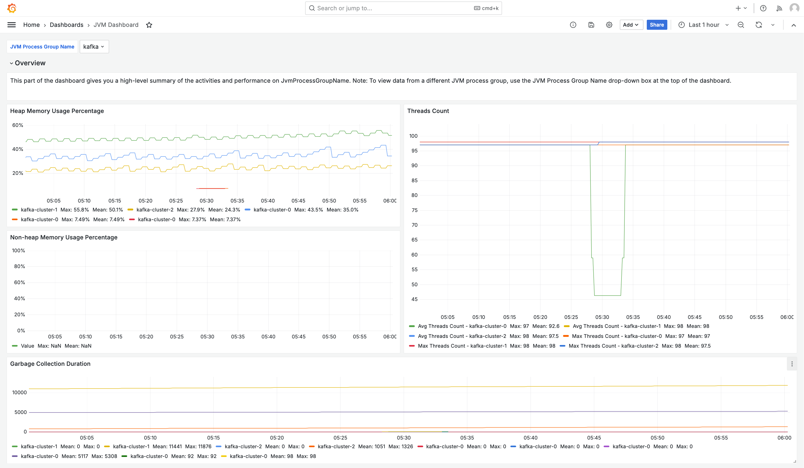

# Solution for monitoring JVM applications with

Amazon Managed Grafana

Applications built with Java Virtual Machines (JVM) have specialized monitoring needs. This
page describes a template that provides a solution for monitoring
JVM-based applications running on your Amazon EKS cluster. The solution can be installed using
[AWS Cloud Development Kit (AWS CDK)](../../../cdk/v2/guide/home.md "../../../cdk/v2/guide/home.md").

###### Note

This solution provides monitoring for a JVM application. If your JVM application is
specifically an Apache Kafka application, you can instead choose to use the [Kafka monitoring solution](solution-kafka.md "solution-kafka.md"), which includes both JVM and
Kafka monitoring.

This solution configures:

- Your Amazon Managed Service for Prometheus workspace to store Java Virtual Machine (JVM) metrics
  from your Amazon EKS cluster.
- Gathering specific JVM metrics using the CloudWatch agent, as well as a
  CloudWatch agent add-on. The metrics are configured to be sent to
  the Amazon Managed Service for Prometheus workspace.
- Your Amazon Managed Grafana workspace to pull those metrics, and create dashboards
  to help you monitor your cluster.

###### Note

This solution provides JVM metrics for your application running on Amazon EKS,
but does not include Amazon EKS metrics. You can additionally use the [Observability solution for monitoring Amazon EKS](solution-eks.md "solution-eks.md") to
see metrics and alerts for your Amazon EKS cluster.

## About this solution

This solution configures an Amazon Managed Grafana workspace to provide metrics for your Java
Virtual Machine (JVM) application. The metrics are used to generate dashboards that
help you to operate
your application more effectively by providing insights into the health and
performance of the application.

The following image shows a sample of one of the dashboards created by this
solution.



The metrics are scraped with a 1 minute scrape interval. The dashboards show metrics
aggregated to 1 minute, 5 minutes, or more, based on the specific metric.

For a list of metrics tracked by this solution, see [List of metrics tracked](#solution-jvm-metrics "#solution-jvm-metrics").

## Costs

This solution creates and uses resources in your workspace. You will be charged for
standard usage of the resources created, including:

- Amazon Managed Grafana workspace access by users. For more information about pricing, see
  [Amazon Managed Grafana
  pricing](https://aws.amazon.com/grafana/pricing/ "https://aws.amazon.com/grafana/pricing/").
- Amazon Managed Service for Prometheus metric ingestion and storage, and metric analysis (query sample
  processing). The number of metrics used by this solution depends on your
  application configuration and usage.

You can view the ingestion and storage metrics in Amazon Managed Service for Prometheus using CloudWatch For
more information, see [CloudWatch
metrics](../../../prometheus/latest/userguide/AMP-CW-usage-metrics.md "../../../prometheus/latest/userguide/AMP-CW-usage-metrics.md") in the _Amazon Managed Service for Prometheus User Guide_.

You can estimate the cost using the pricing calculator on the [Amazon Managed Service for Prometheus pricing](https://aws.amazon.com/prometheus/pricing/ "https://aws.amazon.com/prometheus/pricing/") page.
The number of metrics will depend on the number of nodes in your cluster, and
the metrics your applications produce.

- Networking costs. You may incur standard AWS network charges for cross
  availability zone, Region, or other traffic.

The pricing calculators, available from the pricing page for each product, can help
you understand potential costs for your solution. The following information can help
get a base cost, for the solution running in the same availability zone as the Amazon EKS
cluster.

| Product                               | Calculator metric                       | Value                            |
| ------------------------------------- | --------------------------------------- | -------------------------------- | ---------------------------------------------------------------------------------------------------------------------------------------------------------------------------------------------------------------------------------------------------------------------------------------------------------------------------------------------------------------------------------------------------------------------------------------------------------------------------------------------------------------------------------------------------------------------------------------------------------------------------------------------------------------------------------------------------------------------------------------------------------------------------------------------------------------------------------------------------------------------------------------------------------------------------------------------------------------------------------------------------------------------------------------------------------------------------------------------------------------------------------------------------------------------------------------------------------------------------------------------------------------------------------------------------------------------------------------------------------------------------------------------------------------------------------------------------------------------------------------------------------------------------------------------------------------------------------------------------------------------------------------------------------------------------------------------------------------------------------------------------------------------------------------------------------------------------------------------------------------------------------------------------------------------------------------------------------------------------------------------------------------------------------------------------------------------------------------------------------------------------------------------------------------------------------------------------------------------------------------------------------------------------------------------------------------------------------------------------------------------------------------------------------------------------------------------------------------------------------------------------------------------------------------------------------------------------------------------------------------------------------------------------------------------------------------------------------------------------------------------------------------------------------------------------------------------------------------------------------------------------------------------------------------------------------------------------------------------------------------------------------------------------------------------------------------------------------------------------------------------------------------------------------------------------------------------------------------------------------------------------------------------------------------------------------------------------------------------------------------------------------------------------------------------------------------------------------------------------------------------------------------------------------------------------------------------------------------------------------------------------------------------------------------------------------------------------------------------------------------------------------------------------------------------------------------------------------------------------------------------------------------------------------------------------------------------------------------------------------------------------------------------------------------------------------------------------------------------------------------------------------------------------------------------------------------------------------------------------------------------------------------------------------------------------------------------------------------------------------------------------------------------------------------------------------------------------------------------------------------------------------------------------------------------------------------------------------------------------------------------------------------------------------------------------------------------------------------------------------------------------------------------------------------------------------------------------------------------------------------------------------------------------------------------------------------------------------------------------------------------------------------------------------------------------------------------------------------------------------------------------------------------------------------------------------------------------------------------------------------------------------------------------------------------------------------------------------------------------------------------------------------------------------------------------------------------------------------------------------------------------------------------------------------------------------------------------------------------------------------------------------------------------------------------------------------------------------------------------------------------------------------------------------------------------------------------------------------------------------------------------------------------------------------------------------------------------------------------------------------------------------------------------------------------------------------------------------------------------------------------------------------------------------------------------------------------------------------------------------------------------------------------------------------------------------------------------------------------------------------------------------------------------------------------------------------------------------------------------------------------------------------------------------------------------------------------------------------------------------------------------------------------------------------------------------------------------------------------------------------------------------------------------------------------------------------------------------------------------------------------------------------------------------------------------------------------------------------------------------------------------------------------------------------------------------------------------------------------------------------------------------------------------------------------------------------------------------------------------------------------------------------------------------------------------------------------------------------------------------------------------------------------------------------------------------------------------------------------------------------------------------------------------------------------------------------------------------------------------------------------------------------------------------------------------------------------------------------------------------------------------------------------------------------------------------------------------------------------------------------------------------------------------------------------------------------------------------------------------------------------------------------------------------------------------------------------------------------------------------------------------------------------------------------------------------------------------------------------------------------------------------------------------------------------------------------------------------------------------------------------------------------------------------------------------------------------------------------------------------------------------------------------------------------------------------------------------------------------------------------------------------------------------------------------------------------------------------------------------------------------------------------------------------------------------------------------------------------------------------------------------------------------------------------------------------------------------------------------------------------------------------------------------------------------------------------------------------------------------------------------------------------------------------------------------------------------------------------------------------------------------------------------------------------------------------------------------------------------------------------------------------------------------------------------------------------------------------------------------------------------------------------------------------------------------------------------------------------------------------------------------------------------------------------------------------------------------------------------------------------------------------------------------------------------------------------------------------------------------------------------------------------------------------------------------------------------------------------------------------------------------------------------------------------------------------------------------------------------------------------------------------------------------------------------------------------------------------------------------------------------------------------------------------------------------------------------------------------------------------------------------------------------------------------------------------------------------------------------------------------------------------------------------------------------------------------------------------------------------------------------------------------------------------------------------------------------------------------------------------------------------------------------------------------------------------------------------------------------------------------------------------------------------------------------------------------------------------------------------------------------------------------------------------------------------------------------------------------------------------------------------------------------------------------------------------------------------------------------------------------------------------------------------------------------------------------------------------------------------------------------------------------------- | --------------------------------------------------------------------------------------------------------------------------------------------------------------------------------------------------------------------------------------------------------------------------------------------------------------------------------------------------------------------------------------------------------------------------------------------------------------------------------------------------------------------------------------------------------------------------------------------------------------------------------------------------------------------------------------------------------------------------------------------------------------------------------------------------------------------------------------------------------------------------------------------------------------------------------------------------------------------------------------------------------------------------------------------------------------------------------------------------------------------------------------------------------------------------------------------------------------------------------------------------------------------------------------------------------------------------------------------------------------------------------------------------------------------------------------------------------------------------------------------------------------------------------------------------------------------------------------------------------------------------------------------------------------------------------------------------------------------------------------------------------------------------------------------------------------------------------------------------------------------------------------------------------------------------------------------------------------------------------------------------------------------------------------------------------------------------------------------------------------------------------------------------------------------------------------------------------------------------------------------------------------------------------------------------------------------------------------------------------------------------------------------------------------------------------------------------------------------------------------------------------------------------------------------------------------------------------------------------------------------------------------------------------------------------------------------------------------------------------------------------------------------------------------------------------------------------------------------------------------------------------------------------------------------------------------------------- |
| Amazon Managed Service for Prometheus | Active series                           | 50 (per application pod)         |
|                                       | Avg Collection Interval                 | 60 (seconds)                     |
| Amazon Managed Grafana                | Number of active editors/administrators | 1 (or more, based on your users) | These numbers are the base numbers for a JVM application running on Amazon EKS. This will give you an estimate of the base costs. As you add pods to your application, the costs will grow, as shown. These costs leave out network usage costs, which will vary based on whether the Amazon Managed Grafana workspace, Amazon Managed Service for Prometheus workspace, and Amazon EKS cluster are in the same availability zone, AWS Region, and VPN. ## Prerequisites This solution requires that you have done the following before using the solution. 1. You must have or **create an Amazon Elastic Kubernetes Service cluster** that you wish to monitor, and the cluster must have at least one node. The cluster must have API server endpoint access set to include private access (it can also allow public access). The [authentication mode](../../../eks/latest/userguide/grant-k8s-access.md#set-cam "../../../eks/latest/userguide/grant-k8s-access.md#set-cam") must include API access (it can be set to either `API` or `API_AND_CONFIG_MAP`). This allows the solution deployment to use access entries. The following should be installed in the cluster (true by default when creating the cluster via the console, but must be added if you create the cluster using the AWS API or AWS CLI): Amazon EKS Pod Identity Agent, AWS CNI, CoreDNS, Kube-proxy and Amazon EBS CSI Driver AddOns (the Amazon EBS CSI Driver AddOn is not technically required for the solution, but is required for some JVM applications). _Save the Cluster name to specify later_. This can be found in the cluster details in the Amazon EKS console. ###### Note For details about how to create an Amazon EKS cluster, see [Getting started with Amazon EKS](../../../eks/latest/userguide/getting-started.md "../../../eks/latest/userguide/getting-started.md"). 2. You must be running an application on Java Virtual Machines on your Amazon EKS cluster. 3. You must **create an Amazon Managed Service for Prometheus workspace** in the same AWS account as your Amazon EKS cluster. For details, see [Create a workspace](../../../prometheus/latest/userguide/AMP-create-workspace.md "../../../prometheus/latest/userguide/AMP-create-workspace.md") in the _Amazon Managed Service for Prometheus User Guide_. _Save the Amazon Managed Service for Prometheus workspace ARN to specify later._ 4. You must **create an Amazon Managed Grafana workspace** with Grafana version 9 or newer, in the same AWS Region as your Amazon EKS cluster. For details about creating a new workspace, see [Create an Amazon Managed Grafana workspace](AMG-create-workspace.md "AMG-create-workspace.md"). The workspace role must have permissions to access Amazon Managed Service for Prometheus and Amazon CloudWatch APIs. The easiest way to do this is to use [Service-managed permissions](AMG-manage-permissions.md "AMG-manage-permissions.md") and select Amazon Managed Service for Prometheus and CloudWatch. You can also manually add the [AmazonPrometheusQueryAccess](../../../prometheus/latest/userguide/security-iam-awsmanpol.md#AmazonPrometheusQueryAccess "../../../prometheus/latest/userguide/security-iam-awsmanpol.md#AmazonPrometheusQueryAccess") and [AmazonGrafanaCloudWatchAccess](security-iam-awsmanpol.md#security-iam-awsmanpol-AmazonGrafanaCloudWatchAccess "security-iam-awsmanpol.md#security-iam-awsmanpol-AmazonGrafanaCloudWatchAccess") policies to your workspace IAM role. _Save the Amazon Managed Grafana workspace ID and endpoint to specify later._ The ID is in the form `g-123example`. The ID and the endpoint can be found in the Amazon Managed Grafana console. The endpoint is the URL for the workspace, and includes the ID. For example, `https://g-123example.grafana-workspace.<region>.amazonaws.com/`. ###### Note While not strictly required to set up the solution, you must set up user authentication in your Amazon Managed Grafana workspace before users can access the dashboards created. For more information, see [Authenticate users in Amazon Managed Grafana workspaces](authentication-in-AMG.md "authentication-in-AMG.md"). ## Using this solution This solution configures AWS infrastructure to support reporting and monitoring metrics from a Java Virtual Machine (JVM) application running in an Amazon EKS cluster. You can install it using [AWS Cloud Development Kit (AWS CDK)](../../../cdk/v2/guide/home.md "../../../cdk/v2/guide/home.md"). ###### Note The steps here assume that you have an environment with the AWS CLI, and AWS CDK, and both [Node.js](https://nodeja.org/ "https://nodeja.org/") and [NPM](https://docs.npmjs.com/ "https://docs.npmjs.com/") installed. You will use `make` and `brew` to simplify build and other common actions. ###### To use this solution to monitor an Amazon EKS cluster with AWS CDK 1. Make sure that you have completed all of the [prerequisites](#solution-jvm-prerequisites "#solution-jvm-prerequisites") steps. 2. Download all files for the solution from Amazon S3. The files are located at `s3://aws-observability-solutions/JVM_EKS/OSS/CDK/v1.0.0/iac`, and you can download them with the following Amazon S3 command. Run this command from a folder in your command line environment. `aws s3 sync s3://aws-observability-solutions/JVM_EKS/OSS/CDK/v1.0.0/iac/ .` You do not need to modify these files. 3. In your command line environment (from the folder where you downloaded the solution files), run the following commands. Set up the needed environment variables. Replace `REGION`, `AMG_ENDPOINT`, `EKS_CLUSTER`, and `AMP_ARN` with your AWS Region, Amazon Managed Grafana workspace endpoint (n the form `http://g-123example.grafana-workspace.us-east-1.amazonaws.com`), Amazon EKS cluster name, and Amazon Managed Service for Prometheus workspace ARN. `` export AWS_REGION=`REGION` export AMG_ENDPOINT=`AMG_ENDPOINT` export EKS_CLUSTER_NAME=`EKS_CLUSTER` export AMP_WS_ARN=`AMP_ARN` `` 4. Create annotations that can be used by the solution. You can choose to annotate a namespace, deployment, statefulset, daemonset, or your pods directly. The JSM solution requires two annotations. You will use `kubectl` to annotation your resources with the following commands: ``kubectl annotate `<resource-type>` `<resource-value>` instrumentation.opentelemetry.io/inject-java=true kubectl annotate `<resource-type>` `<resource-value>` cloudwatch.aws.amazon.com/inject-jmx-jvm=true`` Replace `<resource-type>` and `<resource-value>` with the correct values for your system. For example, to annotate your `foo` deployment, your first command would be: `kubectl annotate deployment foo instrumentation.opentelemetry.io/inject-java=true` 5. Create a service account token with ADMIN access for calling Grafana HTTP APIs. For details, see [Use service accounts to authenticate with the Grafana HTTP APIs](service-accounts.md "service-accounts.md"). You can use the AWS CLI with the following commands to create the token. You will need to replace the `GRAFANA_ID` with the ID of your Grafana workspace (it will be in the form `g-123example`). This key will expire after 7,200 seconds, or 2 hours. You can change the time (`seconds-to-live`), if you need to. The deployment takes under one hour. ``# creates a new service account (optional: you can use an existing account) GRAFANA_SA_ID=$(aws grafana create-workspace-service-account \ --workspace-id `GRAFANA_ID` \ --grafana-role ADMIN \ --name grafana-operator-key \ --query 'id' \ --output text) # creates a new token for calling APIs export AMG_API_KEY=$(aws grafana create-workspace-service-account-token \ --workspace-id $managed_grafana_workspace_id \ --name "grafana-operator-key-$(date +%s)" \ --seconds-to-live 7200 \ --service-account-id $GRAFANA_SA_ID \ --query 'serviceAccountToken.key' \ --output text)`` Make the API Key available to the AWS CDK by adding it to AWS Systems Manager with the following command. Replace `AWS_REGION` with the Region that your solution will run in (in the form `us-east-1`). ``aws ssm put-parameter --name "/observability-aws-solution-jvm-eks/grafana-api-key" \ --type "SecureString" \ --value $AMG_API_KEY \ --region `AWS_REGION` \ --overwrite`` 6. Run the following `make` command, which will install any other dependencies for the project. `make deps` 7. Finally, run the AWS CDK project: `make build && make pattern aws-observability-solution-jvm-eks-$EKS_CLUSTER_NAME deploy` 8. [Optional] After the stack creation is complete, you may use the same environment to create more instances of the stack for other JVM applications running on Amazon EKS clusters in the same region, as long as you complete the other prerequisites for each (including separate Amazon Managed Grafana and Amazon Managed Service for Prometheus workspaces). You will need to redefine the `export` commands with the new parameters. When the stack creation is completed, your Amazon Managed Grafana workspace will be populated with a dashboard showing metrics for your application and Amazon EKS cluster. It will take a few minutes for metrics to be shown, as the metrics are collected. ## List of metrics tracked This solution collects metrics from your JVM-based application. Those metrics are stored in Amazon Managed Service for Prometheus, and then displayed in Amazon Managed Grafana dashboards. The following metrics are tracked with this solution. <br>• jvm.classes.loaded <br>• jvm.gc.collections.count <br>• jvm.gc.collections.elapsed <br>• jvm.memory.heap.init <br>• jvm.memory.heap.max <br>• jvm.memory.heap.used <br>• jvm.memory.heap.committed <br>• jvm.memory.nonheap.init <br>• jvm.memory.nonheap.max <br>• jvm.memory.nonheap.used <br>• jvm.memory.nonheap.committed <br>• jvm.memory.pool.init <br>• jvm.memory.pool.max <br>• jvm.memory.pool.used <br>• jvm.memory.pool.committed <br>• jvm.threads.count ## Troubleshooting There are a few things that can cause the setup of the project to fail. Be sure to check the following. <br>• You must complete all [Prerequisites](#solution-jvm-prerequisites "#solution-jvm-prerequisites") before installing the solution. <br>• The cluster must have at least one node in it before attempting to create the solution or access the metrics. <br>• Your Amazon EKS cluster must have the `AWS CNI`, `CoreDNS` and `kube-proxy` add-ons installed. If they are not installed, the solution will not work correctly. They are installed by default, when creating the cluster through the console. You may need to install them if the cluster was created through an AWS SDK. <br>• Amazon EKS pods installation timed out. This can happen if there is not enough node capacity available. There are multiple causes of these issues, including: + The Amazon EKS cluster was initialized with Fargate instead of Amazon EC2. This project requires Amazon EC2. + The nodes are [tainted](../../../eks/latest/userguide/node-taints-managed-node-groups.md "../../../eks/latest/userguide/node-taints-managed-node-groups.md") and therefore unavailable. You can use `kubectl describe node `NODENAME` | grep Taints`to check the taints. Then`kubectl taint node `NODENAME` `TAINT_NAME`-`to remove the taints. Make sure to include the`-` after the taint name. + The nodes have reached the capacity limit. In this case you can create a new node or increase the capacity. <br>• You do not see any dashboards in Grafana: using the incorrect Grafana workspace ID. Run the following command to get information about Grafana: ``` kubectl describe grafanas external-grafana -n grafana-operator ``` You can check the results for the correct workspace URL. If it is not the one you are expecting, re-deploy with the correct workspace ID. ``` Spec: External: API Key: Key:   GF_SECURITY_ADMIN_APIKEY Name:  grafana-admin-credentials URL:     https://`g-123example`.grafana-workspace.`aws-region`.amazonaws.com Status: Admin URL:  https://`g-123example`.grafana-workspace.`aws-region`.amazonaws.com Dashboards: ... ``` <br>• You do not see any dashboards in Grafana: You are using an expired API key. To look for this case, you will need to get the grafana operator and check the logs for errors. Get the name of the Grafana operator with this command: ``` kubectl get pods -n grafana-operator ``` This will return the operator name, for example: ``` NAME                               READY   STATUS    RESTARTS   AGE `grafana-operator-1234abcd5678ef90`  1/1     Running   0          1h2m ``` Use the operator name in the following command: ``` kubectl logs`grafana-operator-1234abcd5678ef90`-n grafana-operator ``` Error messages such as the following indicate an expired API key: ``` ERROR   error reconciling datasource    {"controller": "grafanadatasource", "controllerGroup": "grafana.integreatly.org", "controllerKind": "GrafanaDatasource", "GrafanaDatasource": {"name":"grafanadatasource-sample-amp","namespace":"grafana-operator"}, "namespace": "grafana-operator", "name": "grafanadatasource-sample-amp", "reconcileID": "72cfd60c-a255-44a1-bfbd-88b0cbc4f90c", "datasource": "grafanadatasource-sample-amp", "grafana": "external-grafana", "error": "status: 401, body: {\"message\":\"Expired API key\"}\n"} github.com/grafana-operator/grafana-operator/controllers.(*GrafanaDatasourceReconciler).Reconcile ``` In this case, create a new API key and deploy the solution again. If the problem persists, you can force synchronization by using the following command before redeploying: ``` kubectl delete externalsecret/external-secrets-sm -n grafana-operator ``` <br>• Missing SSM parameter. If you see an error like the following, run`cdk bootstrap` and try again. ``` Deployment failed: Error: aws-observability-solution-jvm-eks-`$EKS_CLUSTER_NAME`: SSM parameter /cdk-bootstrap/`xxxxxxx`/version not found. Has the environment been bootstrapped? Please run 'cdk bootstrap' (see https://docs.aws.amazon.com/cdk/latest/ guide/bootstrapping.html) ``` |
