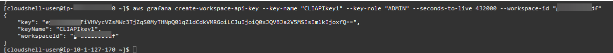

# Use API keys to authenticate with Grafana HTTP

APIs

One way to access Grafana APIs is to use an _API key_, which
is also called an _API token_. To create an API key, use one
of the following procedures. An API key is valid for a limited time that
you specify when you create it, up to 30 days.

###### Topics

- [Creating a Grafana API key to use with Grafana APIs in
  the workspace (Console)](#API_key_console "#API_key_console")
- [Creating an Amazon Managed Grafana workspace API key using
  AWS CLI](#API_key_CLI "#API_key_CLI")

###### Note

In version 9 or newer, using service accounts instead of API keys is preferred.
Service accounts are replacing API keys as the primary way to
authenticate applications that interact with Grafana APIs. Grafana Labs has
announced that API keys will be removed in a future release.

When you create an API key, you specify a _role_ for the key. The role
determines the level of administrative power that users of the key have.

The following tables show the permissions granted to the Admin, Editor, and Viewer roles.
The first table shows general organizational permissions. In this table,
**Full** means the ability to view, edit, add permissions, and delete
permissions. The **Explore** column shows whether the role can use the
_Explore_ view. The **Other** permissions column
shows whether the role has permissions for managing users, teams, plug-ins, and
organizational settings.

| Role       | Dashboards | Playlists | Folders | Explore | Data sources | Other permissions |
| ---------- | ---------- | --------- | ------- | ------- | ------------ | ----------------- |
| **Viewer** | View       | View      | No      | No      | No           | No                |
| **Editor** | Full       | Full      | Full    | Yes     | No           | No                |
| **Admin**  | Full       | Full      | Full    | Yes     | Full         | Full              |

The following table shows the additional dashboard- and folder-level permissions that you
can set. These are different than the Admin, Editor, and Viewer roles.

| Role      | Dashboards           | Folders              | Change permissions |
| --------- | -------------------- | -------------------- | ------------------ |
| **View**  | View                 | View                 | No                 |
| **Edit**  | Create, edit         | View                 | No                 |
| **Admin** | Create, edit, delete | Create, edit, delete | Yes                |

###### Note

A more scoped permission with a lower permission level does not have effect if a more
general rule with more permission exists. For example, if you give a user the
organizational **Editor** role and then assign that user only the
**View** permissions for a dashboard, the more restrictive
**View** permission has no effect because the user has full
**Edit** access because of their **Editor**
role.

## Creating a Grafana API key to use with Grafana APIs in

the workspace (Console)

###### Note

In Amazon Managed Grafana workspaces compatible with Grafana version 10 and above, the
ability to create API keys in the workspace was removed. If your workspace
is a Grafana version 10 workspace, you can only create API keys through the
AWS CLI or API.

API keys removal has been announced by Grafana Labs for a future
release. It is recommended that you use service accounts instead.

###### To create a Grafana API key to use with Grafana APIs in the workspace

console

1. Open the Amazon Managed Grafana console at [https://console.aws.amazon.com/grafana/](https://console.aws.amazon.com/grafana/home/ "https://console.aws.amazon.com/grafana/home/").
2. In the upper left corner of the page, choose the menu icon and then choose
   **All workspaces**.
3. Choose the name of the Amazon Managed Grafana workspace.
4. In the workspace details page, choose the URL displayed under
   **Grafana workspace URL**.
5. In the Grafana console side menu, pause on the **Configuration** (gear) icon, then choose **API
   Keys**.
6. Choose **New API Key**.
7. Enter a unique name for the key.
8. For **Role**, select the access level that the key is to be
   granted. Select **Admin** to allow a user with this key to use
   APIs at the broadest, most powerful administrative level. Select
   **Editor** or **Viewer** to limit the
   key's users to those levels of power. For more information, see the previous
   tables.
9. For **Time to live**, specify how long you want the key to be
   valid. The maximum is 30 days (one month). You enter a number and a letter. The
   valid letters are **s** for seconds, **m** for
   minutes, **h** for hours, **d** for days,
   **w** for weeks, and **M** for month. For
   example, **12h** is 12 hours and **1M** is 1
   month (30 days).

We strongly recommend that you set the key's time to live for a shorter time,
such as a few hours or less. This creates much less risk than having API keys
that are valid for a long time. 10. Choose **Add**. 11. (Optional) You can automate creating API keys with the [Create API Key](Grafana-API-Authentication.md "Grafana-API-Authentication.md") API using
Terraform. For more information on automating API
key creation using Terraform, see [Creating Grafana API Key using Terraform](https://aws-observability.github.io/observability-best-practices/recipes/recipes/amg-automation-tf/ "https://aws-observability.github.io/observability-best-practices/recipes/recipes/amg-automation-tf/").

## Creating an Amazon Managed Grafana workspace API key using

AWS CLI

**To create an Amazon Managed Grafana workspace API key using
AWS CLI**

In the following example, replace the `key_name`,
`key_role`, `seconds_to_live` and
`workspace_id` with your own information. To find out about
the format of the key-name, key-role and seconds-to-live, see [https://docs.aws.amazon.com/grafana/latest/APIReference/API_CreateWorkspaceApiKey.html](../APIReference/API_CreateWorkspaceApiKey.md "../APIReference/API_CreateWorkspaceApiKey.md") in the API guide.

```
aws grafana create-workspace-api-key --key-name "`key_name`" --key-role "`key_role`" --seconds-to-live `seconds_to_live` --workspace-id "`workspace_id`"
```

The following is a sample CLI response:



You can find the `workspace_id` of your workspace by running
the following command:

```
aws grafana list-workspaces
```
