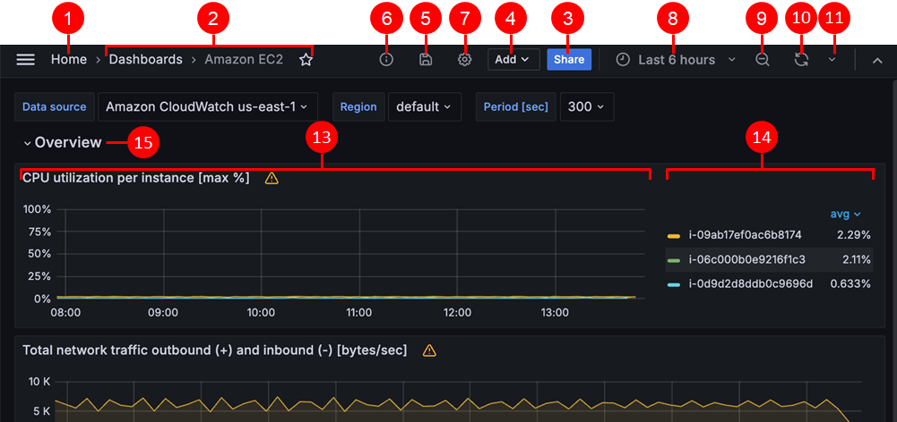

# Using dashboards

This documentation topic is designed
for Grafana workspaces that support **Grafana version
10.x**.

For Grafana workspaces that support Grafana version 9.x, see
[Working in Grafana version 9](using-grafana-v9.md "using-grafana-v9.md").

For Grafana workspaces that support Grafana version 8.x, see
[Working in Grafana version 8](using-grafana-v8.md "using-grafana-v8.md").

This topic provides an overview of dashboard features and shortcuts, and describes how
to use dashboard search.

## Features

You can use dashboards to customize the presentation of your data. The following
image shows the dashboard interface in the Amazon Managed Grafana workspace.

| Feature                                 | Description                                                                                                                                                                                                                                                                                                                                                                                                                 |
| --------------------------------------- | --------------------------------------------------------------------------------------------------------------------------------------------------------------------------------------------------------------------------------------------------------------------------------------------------------------------------------------------------------------------------------------------------------------------------- | ----------------------------------------------------------------------------------------------------------------------------------------------------------------------------------------------------------------------------------------------------------------------------------------------------------------------------------------------------------------------------------------------------------------------------------------------------------------------------------------------------------------------------------------------------------------------------------------------------------------------------------------------------------------------------------------------------------------------------------------------------------------------------------------------------------------------------------------------------------------------------------------------------------------------------------------------------------------------------------------------------------------------------------------------------------------------------------------------------------------------------------------------------------------------------------------------------------------------------------------------------------------------------------------------------------------------------------------------------------------------------------------------------------------------------------------------------------------------------------------------------------------------------------------------------------------------------------------------------------------------------------------------------------------------------------------------------------------------------------------------------------------------------------------------------------------------------------------------------------------------------------------------------------------------- | ------------------------------------------------------------------------------------------------------------------------------------------------------------------------------------------------------------------------------------------------------------------------------------------------------------------------------------------------------------------------------------------------------------------------------------------------------------------------------------------------------------------------------------------------------------------------------------------------------------------------------------------------------------------------------------------------------------------------------------------------------------------------------------------------------------------------------------------------------------------------------------------------------------------------------------------------------------------------------------------------------------------------------------------------------------------------------------------------------------------------------------------------------------------------------------------------------------------------------------------------------------------------------------------------------------------------------------------------------------------------------------------------------------------------------------------------------------------------------------------------------------------------------------------------------------------------------------------------------------------------------------------------------------------------------------------------------------------------------------------------------------------------------------------------------------------------------------------------------------------------------------------------------------------------------------------------------------------------------------------------------------------------------------------------------------------------------------------------------------------------------------------------------------------------------------------------------------------------------------------------------------------------------------------------------------------------------------------------------------------------------------------------------------------------------------------------------------------------------------------------------------------------------------------------------------------------------------------------------------------------------------------------------------------------------------------------------------------------------------------------------------------------------------------------------------------------------------------------------------------------------------------------------------------------------------------------------------------------------------------------------------------------------------------------------------------------------------------------------------------------------------------------------------------------------------------------------------------------------------------------------------------------------------------------------------------------------------------------------------------------------------------------------------------------------------------------------------------------------------------------------------------------------------------------------------------------------------------------------------------------------------------------------------------------------------------------------------------------------------------------------------------------------------------------------------- |
| **1. Home**                             | Select the Grafana home icon to be redirected to the home page configured in the Grafana instance.                                                                                                                                                                                                                                                                                                                          |
| **2. Title**                            | When you select the dashboard title, you can search for dashboards contained in the current folder.                                                                                                                                                                                                                                                                                                                         |
| **3. Sharing a dashboard**              | Use this option to share the current dashboard by link or snapshot. You can also export the dashboard definition from the share modal.                                                                                                                                                                                                                                                                                      |
| **4. Adding a new panel**               | Use this option to add a panel, dashboard row, or library panel to the current dashboard.                                                                                                                                                                                                                                                                                                                                   |
| **5. Save dashboard**                   | Choose the Save icon to save changes to your dashboard.                                                                                                                                                                                                                                                                                                                                                                     |
| **6. Dashboard insights**               | Choose to view analytics about your dashboard, including information about users, activity, and query counts. For more information, see [Assessing dashboard usage](v10-dash-assess-dashboard-usage.md "v10-dash-assess-dashboard-usage.md").                                                                                                                                                                               |
| **7. Dashboard settings**               | Use this option to change the dashboard name, folder, or tags and manage variables and annotation queries. For more information about dashboard settings, see [Modifying dashboard settings](v10-dash-modify-settings.md "v10-dash-modify-settings.md").                                                                                                                                                                    |
| **8. Time picker dropdown**             | Use to select relative time range options and set custom absolute time ranges. You can change the **Timezone** and **fiscal year** settings from the time range controls by clicking the **Change time settings** button. Time settings are saved on a per-dashboard basis.                                                                                                                                                 |
| **9. Zoom out time range**              | Use to zoom out the time range. For more information about how to use time range controls, see [Setting dashboard time range](#v10-dash-setting-dashboard-time-range "#v10-dash-setting-dashboard-time-range").                                                                                                                                                                                                             |
| **10. Refresh dashboard**               | Select to immediately trigger queries and refresh dashboard data.                                                                                                                                                                                                                                                                                                                                                           |
| **11. Refresh dashboard time interval** | Select a dashboard auto refresh time interval.                                                                                                                                                                                                                                                                                                                                                                              |
| **12. View mode**                       | Select to display the dashboard on a large screen such as a TV or a kiosk. View mode hides irrelevant information such as navigation menus.                                                                                                                                                                                                                                                                                 |
| **13. Dashboard panel**                 | The primary building block of a dashboard is the panel. To add a new panel, dashboard row, or library panel, select **Add panel**.  • Library panels can be shared among many dashboards.  • To move a panel, drag the panel header to another location.  • To resize a panel, select and drag the lower right corner of the panel.                                                                                |
| **14. Graph legend**                    | Change series colors, y-axis, and series visibility directly from the legend.                                                                                                                                                                                                                                                                                                                                               |
| **15. Dashboard row**                   | A dashboard row is a logical divider within a dashboard that groups panels together.  • Rows can be collapsed or expanded to hide parts of the dashboard.  • Panels inside a collapsed row do not issue queries.  • Use repeating rows to create rows dynamically based on a template variable. For more information about repeating rows, see [Creating dashboards](v10-dash-creating.md "v10-dash-creating.md"). | ## Keyboard shortcuts Grafana has a number of keyboard shortcuts available. To display all keyboard shortcuts available to you, press **?** or **h** on your keyboard.  • `Ctrl+S` saves the current dashboard.  • `f` opens the dashboard finder/search.  • `d+k` toggles kiosk mode (hides the menu).  • `d+e` expands all rows.  • `d+s` opens dashboard settings.  • `Ctrl+K` opens the command palette.  • `Esc` exits panel when in fullscreen view or edit mode. Also returns you to the dashboard from the dashboard settings. **Focused panel** To use shortcuts targeting a specific panel, hover over a panel with your pointer.  • `e` toggles panel edit view  • `v` toggles panel fullscreen view  • `ps` opens panel share feature  • `pd` duplicates panel  • `pr` removes panel  • `pl` toggles panel legend ## Setting dashboard time range Grafana provides several ways to manage the time ranges of the data being visualized, for dashboard, panels and also for alerting. This section describes supported time units and relative ranges, the common time controls, dashboard-wide time settings, and panel-specific time settings. **Time units and relative ranges** Grafana supports the following time units: `s (seconds)`, `m (minutes)`, `h (hours)`, `d (days)`, `w (weeks)`, `M (months)`, `Q (quarters)`, and `y (years)`. The minus operator enables you to step back in time, relative to the current date and time, or `now`. If you want to display the full period of the unit (day, week, or month), append `/<time unit>` to the end. To view fiscal periods, use `fQ (fiscal quarter)` and `fy (fiscal year)` time units. The plus operator enables you to step forward in time, relative to now. For example, you can use this feature to look at predicted data in the future. The following table provides example relative ranges. |
| Example relative range                  | From                                                                                                                                                                                                                                                                                                                                                                                                                        | To                                                                                                                                                                                                                                                                                                                                                                                                                                                                                                                                                                                                                                                                                                                                                                                                                                                                                                                                                                                                                                                                                                                                                                                                                                                                                                                                                                                                                                                                                                                                                                                                                                                                                                                                                                                                                                                                                                                      |
| ---                                     | ---                                                                                                                                                                                                                                                                                                                                                                                                                         | ---                                                                                                                                                                                                                                                                                                                                                                                                                                                                                                                                                                                                                                                                                                                                                                                                                                                                                                                                                                                                                                                                                                                                                                                                                                                                                                                                                                                                                                                                                                                                                                                                                                                                                                                                                                                                                                                                                                                     |
| Last 5 minutes                          | `now-5m`                                                                                                                                                                                                                                                                                                                                                                                                                    | `now`                                                                                                                                                                                                                                                                                                                                                                                                                                                                                                                                                                                                                                                                                                                                                                                                                                                                                                                                                                                                                                                                                                                                                                                                                                                                                                                                                                                                                                                                                                                                                                                                                                                                                                                                                                                                                                                                                                                   |
| The day so far                          | `now/d`                                                                                                                                                                                                                                                                                                                                                                                                                     | `now`                                                                                                                                                                                                                                                                                                                                                                                                                                                                                                                                                                                                                                                                                                                                                                                                                                                                                                                                                                                                                                                                                                                                                                                                                                                                                                                                                                                                                                                                                                                                                                                                                                                                                                                                                                                                                                                                                                                   |
| This week                               | `now/w`                                                                                                                                                                                                                                                                                                                                                                                                                     | `now/w`                                                                                                                                                                                                                                                                                                                                                                                                                                                                                                                                                                                                                                                                                                                                                                                                                                                                                                                                                                                                                                                                                                                                                                                                                                                                                                                                                                                                                                                                                                                                                                                                                                                                                                                                                                                                                                                                                                                 |
| This week so far                        | `now/w`                                                                                                                                                                                                                                                                                                                                                                                                                     | `now`                                                                                                                                                                                                                                                                                                                                                                                                                                                                                                                                                                                                                                                                                                                                                                                                                                                                                                                                                                                                                                                                                                                                                                                                                                                                                                                                                                                                                                                                                                                                                                                                                                                                                                                                                                                                                                                                                                                   |
| This month                              | `now/M`                                                                                                                                                                                                                                                                                                                                                                                                                     | `now/M`                                                                                                                                                                                                                                                                                                                                                                                                                                                                                                                                                                                                                                                                                                                                                                                                                                                                                                                                                                                                                                                                                                                                                                                                                                                                                                                                                                                                                                                                                                                                                                                                                                                                                                                                                                                                                                                                                                                 |
| This month so far                       | `now/M`                                                                                                                                                                                                                                                                                                                                                                                                                     | `now`                                                                                                                                                                                                                                                                                                                                                                                                                                                                                                                                                                                                                                                                                                                                                                                                                                                                                                                                                                                                                                                                                                                                                                                                                                                                                                                                                                                                                                                                                                                                                                                                                                                                                                                                                                                                                                                                                                                   |
| Previous Month                          | `now-1M/M`                                                                                                                                                                                                                                                                                                                                                                                                                  | `now-1M/M`                                                                                                                                                                                                                                                                                                                                                                                                                                                                                                                                                                                                                                                                                                                                                                                                                                                                                                                                                                                                                                                                                                                                                                                                                                                                                                                                                                                                                                                                                                                                                                                                                                                                                                                                                                                                                                                                                                              |
| This year so far                        | `now/Y`                                                                                                                                                                                                                                                                                                                                                                                                                     | `now`                                                                                                                                                                                                                                                                                                                                                                                                                                                                                                                                                                                                                                                                                                                                                                                                                                                                                                                                                                                                                                                                                                                                                                                                                                                                                                                                                                                                                                                                                                                                                                                                                                                                                                                                                                                                                                                                                                                   |
| This Year                               | `now/Y`                                                                                                                                                                                                                                                                                                                                                                                                                     | `now/Y`                                                                                                                                                                                                                                                                                                                                                                                                                                                                                                                                                                                                                                                                                                                                                                                                                                                                                                                                                                                                                                                                                                                                                                                                                                                                                                                                                                                                                                                                                                                                                                                                                                                                                                                                                                                                                                                                                                                 |
| Previous fiscal year                    | `now-1y/fy`                                                                                                                                                                                                                                                                                                                                                                                                                 | `now-1y/fy`                                                                                                                                                                                                                                                                                                                                                                                                                                                                                                                                                                                                                                                                                                                                                                                                                                                                                                                                                                                                                                                                                                                                                                                                                                                                                                                                                                                                                                                                                                                                                                                                                                                                                                                                                                                                                                                                                                             | ###### Note Grafana Alerting does not support the following syntaxes:  • `now+n` for future timestamps.  • `now-1n/n` for _start of n until end of n_, because this is an absolute timestamp. **Common time range controls** The dashboard and panel time controls have a common user interface. The following describes common time range controls.  • Current time range, also called the _time picker_, shows the time range currently displayed in the dashboard or panel you are viewing. Hover your cursor over the field to see the exact time stamps in the range and their source (such as the local browser time). Click the _current time range_ to change it. You can change the current time using a _relative time range_, such as the last 15 minutes, or an absolute time range, such as `2020-05-14 00:00:00` to `2020-05-15 23:59:59`.  • The **relative time range** can be selected from the **Relative time ranges** list. You can filter the list using the input field at the top. Some examples of time ranges include _Last 30 minutes_, _Last 12 hours_, _Last 7 days_, _Last 2 years_, _Yesterday_, _Day before yesterday_, _This day last week_, _Today so far_, _This week so far_, and _This month so far_.  • **Absolute time range** can be set in two ways: Typing exact time values or relative time values into the **From** and **To** fields and clicking **Apply time range**, or clicking a date or date range from the calendar displayed when you click the **From** or **To** field. To apply your selections, click **Apply time range**. You can also choose from a list of recently used absolute time ranges.  • **Semi-relative time range** can be selected in the absolute time range settings. For example, to show activity since a specific date, you can choose an absolute time for the start time, and a relative time (such as `now`) for the end time. Using a semi-relative time range, as time progresses, your dashboard will automatically and progressively zoom out to show more history and fewer details. At the same rate, as high data resolution decreases, historical trends over the entire time period will become more clear. ###### Note Alerting does not support semi-relative time ranges.  • **Zoom out** by selecting the zoom out icon (or by using Cmd+Z or Ctrl+Z as a keyboard shortcut). This increases the view, showing a larger time range in the dashboard or panel visualization.  • **Zoom in** by selecting a time range you want to view on the graph in the visualization. ###### Note Zooming in is only applicable to graph visualizations. **Refresh dashboards** Click the **Refresh dashboard** icon to immediately run every query on the dashboard and refresh the visualizations. Grafana cancels any pending requests when you trigger a refresh. By default, Grafana does not automatically refresh the dashboard. Queries run on their own schedule according to the panel settings. However, if you want to regularly refresh the dashboard, then click the down arrow next to the **Refresh dashboard** icon and then select a refresh interval. **Control the time range using a URL** You can control the time range of a dashboard by providing the following query parameters in the dashboard URL.  • `from` defines the lower limit of the time range, specified in ms epoch, or relative time.  • `to` defines the upper limit of the time range, specified in ms epoch, or relative time.  • `time` and `time.window` defines a time range from `time-time.window/2` to `time+time.window/2`. Both parameters should be specified in ms. For example `?time=1500000000000&time.window=10000` results in 10s time range from 1499999995000 to 1500000005000. |
