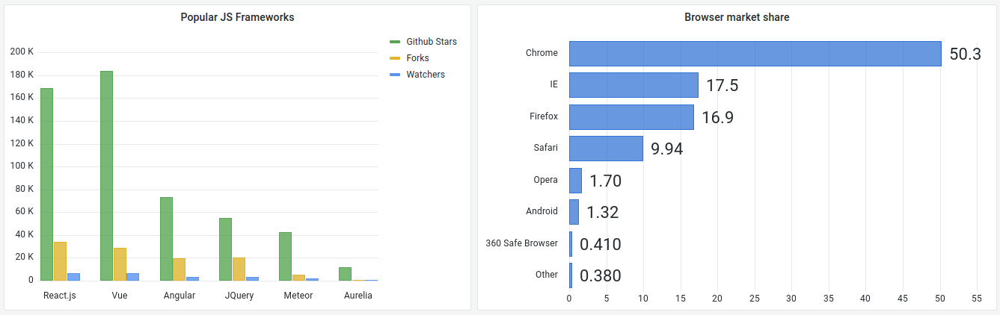

# Bar chart

This documentation topic is designed
for Grafana workspaces that support **Grafana version
10.x**.

For Grafana workspaces that support Grafana version 9.x, see
[Working in Grafana version 9](using-grafana-v9.md "using-grafana-v9.md").

For Grafana workspaces that support Grafana version 8.x, see
[Working in Grafana version 8](using-grafana-v8.md "using-grafana-v8.md").

Bar charts allow you to graph categorical data.

## Supported data formats

Only one data frame is supported and it needs to have at least one string field
that will be used as the category for an X or Y axis and one or more numerical
fields. The following is an example of data formats:

| Browser           | Market share |
| ----------------- | ------------ | ------------------------------------------------------------------------------------------------------------------------------------------------------------------------------------------------------------------------------------------------------------------------------------------------------------------------------------------------------------------------------------------------------------------------------------------------------------------------------------------------------------------------------------------------------------------------------------------------------------------------------------------------------------------------------------------------------------------------------------------------------------------------------------------------------------------------------------------------------------------------------------------------------------------------------------------------------------------------------------------------------------------------------------------------------------------------------------------------------------------------------------------------------------------------------------------------------------------------------------------------------------------------------------------------------------------------------------------------------------------------------------------------------------------------------------------------------------------------------------------------------------------------------------------------------------------------------------------------------------------------------------------------------------------------------------------------------------------------------------------------------------------------------------------------------------------------------------------------------------------------------------------------------------------------------------------------------------------------------------------------------------------------------------------------------------------------------------------------------------------------------------------------------------------------------------------------------------------------------------------------------------------------------------------------------------------------------------------------------------------------------------------------------------------------------------------------------------------------------------------------------------------------------------------------------------------------------------------------------------------------------------------------------------------------------------------------------------------------------------------------------------------------------------------------------------------------------------------------------------------------------------------------------------------------------------------------------------------------------------------------------------------------------------------------------------------------------------------------------------------------------------------------------------------------------------------------------------------------------------------------------------------------------------------------------------------------------------------------------------------------------------------------------------------------------------------------------------------------------------------------------------------------------------------------------------------------------------------------------------------------------------------------------------------------------------------------------------------------------------------------------------------------------------------------------------------------------------------------------------------------------------------------------------------------------------------------------------------------------------------------------------------------------------------------------------------------------------------------------------------------------------------------------------------------------------------------------------------------------------------------------------------------------------------------------------------------------------------------------------------------------------------------------------------------------------------------------------------------------------------------------------------------------------------------------------------------------------------------------------------------------------------------------------------------------------------------------------------------------------------------------------------------------------------------------------------------------------------------------------------------------------------------------------------------------------------------------------------------------------------------------------------------------------------------------------------------------------------------------------------------------------------------------------------------------------------------------------------------------------------------------------------------------------------------------------------------------------------------------------------------------------------------------------------------------------------------------------------------------------------------------------------------------------------------------------------------------------------------------------------------------------------------------------------------------------------------------------------------------------------------------------------------------------------------------------------------------------------------------------------------------------------------------------------------------------------------------------------------------------------------------------------------------------------------------------------------------------------------------------------------------------------------------------------------------------------------------------------------------------------------------------------------------------------------------------------------------------------------------------------------------------------------------------------------------------------------------------------------------------------------------------------------------------------------------------------------------------------------------------------------------------------------------------------------------------------------------------------------------------------------------------------- |
| Chrome            | 50           |
| Internet Explorer | 17.5         | If you have more than one numerical field, the panel shows grouped bars. ### Visualizing time series or multiple result sets If you have multiple time series or tables, you first need to join them using a join, or reduce transform. For example, if you have multiple time series and you want to compare their last and max value, add the **Reduce** transform and specify **Max** and **Last** as options under **Calculations**. ## Bar chart options Use these options to refine your visualization. **Orientation**  • **Auto** – Grafana decides the bar orientation based on the panel dimensions.  • **Horizontal** – Makes the X axis the category axis.  • **Vertical** – Makes the Y axis the category axis. **Rotate x-axis tick labels** When the graph is vertically oriented, this setting rotates the labels under the bars. This setting is useful when bar chart labels are long and overlap. **X-axis tick label maximum length** Sets the maximum length of bar chart labels. Labels longer than the maximum length are truncated with ellipses. **Bar labels minimum spacing** Sets the minimum spacing between bar labels. **Show values** Controls whether values are shown on top of or to the left of bars.  • **Auto** – Values are shown if there is space.  • **Always** – Always show values.  • **Never** – Never show values. **Stacking** Controls bar chart stacking.  • **Off** – Bars will not be stacked.  • **Normal** – Bars will be stacked on top of each other.  • **Percent** – Bars will be stacked on top of each other, and the height of each bar is the percentage of the total height of the stack. **Group width** Controls the width of groups.  • `0 = Minimum width`  • `1 = Maximum width` **Bar width** Controls the width of bars.  • `0 = Minimum width`  • `1 = Maximum width` **Bar radius** Controls the radius of the bars.  • `0 = Minimum radius`  • `0.5 = Maximum radius` **Highlight full area on hover** Controls if the entire surrounding area of the bar is highlighted when you hover over the bar. **Line width** Controls line width of the bars. **Fill opacity** Controls the fill opacity of the bars. **Gradient mode** Sets the mode of the gradient fill. Fill gradient is based on the line color. To change the color, use the standard color scheme field option. Gradient appearance is influenced by the **Fill opacity** setting.  • **None** – no gradient fill. This is the default setting.  • **Opacity** – Transparency of the gradient is calculated based on the values on the y-axis. Opacity of the fill is increasing with the values on the Y-axis.  • **Hue** – Gradient color is generated based on the hue of the line color. **Tooltip mode** When you hover your cursor over the visualization, Grafana can display tooltips. Choose how tooltips behave.  • **Single** – The hover tooltip shows only a single series, the one that you are hovering over on the visualization.  • **All** – The hover tooltip shows all series in the visualization. Grafana highlights the series that you are hovering over in bold in the series list in the tooltip.  • **Hidden** – Do not display the tooltip when you interact with the visualization. ###### Note You can use an override to hide individual series from the tooltip. **Text size** Enter a value to change the size of the text on your bar chart. ## Legend options **Legend mode** Use these settings to define how the legend appears in your visualization. For more information, see [Configure a legend](v10-panels-configure-legend.md "v10-panels-configure-legend.md").  • **List** – Displays the legend as a list. This is a default display mode of the legend.  • **Table** – Displays the legend as a table.  • **Hidden** – Hides the legend. **Legend placement** Choose where to place the legend.  • **Bottom** – Below the graph.  • **Right** – To the right of the graph. **Legend values** Choose series data values or standard calculations to show in the legend. You can have more than one. For more information, see [Configure a legend](v10-panels-configure-legend.md "v10-panels-configure-legend.md"). ## Axis options Use the following field settings to refine how your axes display. Some field options will not affect the visualization until you click outside of the field option box you are editing or press Enter. **Placement** Sets the placement of the Y-axis.  • **Auto** – Grafana automatically assigns Y-axis to the series. When there are two or more series with different units, then Grafana assigns the left axis to the first unit and right to the following units.  • **Left** – Display all Y-axes on the left side.  • **Right** – Display all Y-axes on the right side.  • **Hidden** – Hide all Y-axes. To selectively hide axes, [adding field overrides](v10-panels-configure-overrides.md "v10-panels-configure-overrides.md") that targets specific fields. **Label** Set a Y-axis text label. If you have more than one Y-axis, then you can assign different labels with an override. **Width** Set a fixed width of the axis. By default, Grafana dynamically calculates the width of an axis. By setting the width of the axis, data with different axes types can share the same display proportions. This makes it easier to compare more than one graph’s worth of data because the axes are not shifted or stretched within visual proximity of each other. **Soft min and soft max** Set a soft min or soft max option for better control of Y-axis limits. By default, Grafana sets the range for the Y-axis automatically based on the dataset. Soft min and soft max settings can prevent blips from turning into mountains when the data is mostly flat, and hard min or max derived from standard min and max field options can prevent intermittent spikes from flattening useful detail by clipping the spikes past a defined point. You can set standard min/max options to define hard limits of the Y-axis. For more information, see [Configure standard options](v10-panels-configure-standard-options.md "v10-panels-configure-standard-options.md"). **Display multiple y-axes** In some cases, you may want to display multiple y-axes. For example, if you have a dataset showing both temperature and humidity over time, you may want to show two y-axes with different units for these two series. You can do this by [adding field overrides](v10-panels-configure-overrides.md "v10-panels-configure-overrides.md"). Follow the steps as many times as required to add as many y-axes as you need. |
