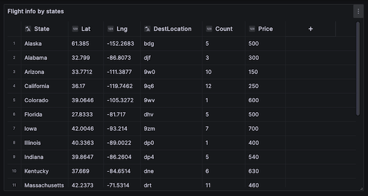

# Datagrid

This documentation topic is designed
for Grafana workspaces that support **Grafana version
10.x**.

For Grafana workspaces that support Grafana version 9.x, see
[Working in Grafana version 9](using-grafana-v9.md "using-grafana-v9.md").

For Grafana workspaces that support Grafana version 8.x, see
[Working in Grafana version 8](using-grafana-v8.md "using-grafana-v8.md").

###### Note

The data grid visualization is currently in preview by Grafana Labs. Support is
limited, and breaking changes might occur before general availability.

Datagrids offer you the ability to create, edit, and fine-tune data within Grafana.
As such, this panel can act as a data source for other panels inside a dashboard.

Through it, you can manipulate data queried from any data source, you can start from
a blank slate, or you can pull data from a dragged and dropped file. You can then use
the panel as a simple tabular visualization, or you can modify the data—and even
remove it altogether—to create a blank slate.

Editing the dataset changes the data source to use the built-in
**Grafana** data source, replacing the old data source settings and
related queries, while also copying the current dataset into the dashboard model.

You can then use the panel as a data source for other panels, by using the built-in
**Dashboard** data source to pull the datagrid data. This provides an
interactive dashboard experience, where you can modify the data and see the changes
reflected in other panels.

For more information about the **Grafana** and
**Dashboard** data sources, see [Special data sources](AMG-data-sources.md#AMG-data-sources-special "AMG-data-sources.md#AMG-data-sources-special").

## Context menu

To provide a more streamlined experience, the datagrid has a context menu that
can be accessed by right-clicking on a cell, column header, or row selector.
Depending on the state of your datagrid, the context menu offers different options
including the following.

- Delete or clear all rows and columns.
- Remove all existing data (rendering your datagrid blank).
- Trigger search functionality, which allows you to find keywords within
  the dataset.

Deleting a row or column will remove the data from the datagrid, while clearing
a row or column will only remove the data from the cells, leaving the row or
column intact.

**Header menu**

You can also access a header menu by choosing the dropdown icon next to the
header title. From here, you can not only delete or clear a column, but also
rename it, freeze it, or convert the field type of the column.

## Selecting series

If there are multiple series, you can set the datagrid to display the preferred
dataset using the **Select series** dropdown in the panel
options.

## Using datagrids

Datagrids offer various ways of interacting with your data. You can edit, move,
clear, and remove rows and columns; use the built-in search functionality to find
specific data; and convert field types or freeze horizontal scroll on a specific
column.

**Adding data**

You can add data to a datagrid by creating a new column or row.

###### To add a new column

1. In an existing panel, choose the **+** button in the
   table header after the last column.
2. Add a name for the new column.
3. Select anywhere outside the field or press `Enter` to save the
   column.

Now you can add data in each cell.

To add a new row, choose a **+** button after the last row.
The button is present in each cell after the last row, and choosing it triggers
the creation of a new row while also activating the cell that you chose.

**Editing data**

You can move columns and rows as needed.

###### To move a column

1. Press and hold the header of the column that needs to be moved.
2. Drag the column to the desired location.
3. Release the column to finalize the move.

To move a row, select and hold the row selector from the number column situated
on the far left side of the grid, and drag it to the desired location. Release the
row to finalize the move.

**Selecting multiple cells**

You can select multiple cells by choosing a single cell, and dragging across
others. This select can be used to copy the data from the selected cells or to
delete them using the `Delete` key.

**Deleting or clearing multiple rows or columns**

To delete or clear multiple rows, you can do the following.

###### To delete or clear multiple rows or columns

1. Hover over the number column (to the left of the first column in the
   grid) to display row checkbox.
2. Select the checkboxes for the rows you want to work with. To select
   multiple consecutive rows, press and hold the `Shift` key while
   clicking the first and last row. To select non-consecutive rows, press and
   hold the `Ctrl` (or `Cmd`) key while clicking the
   desired rows.
3. Right-click (or equiavalent) to access the context menu.
4. Select **Delete rows** or **Clear
   rows**.

The same rules apply to columns by clicking the column headers.

To delete all rows, use the **Select all** checkbox at the top
left corner of the datagrid. This select all rows and allows you to delete them
using the context menu.
