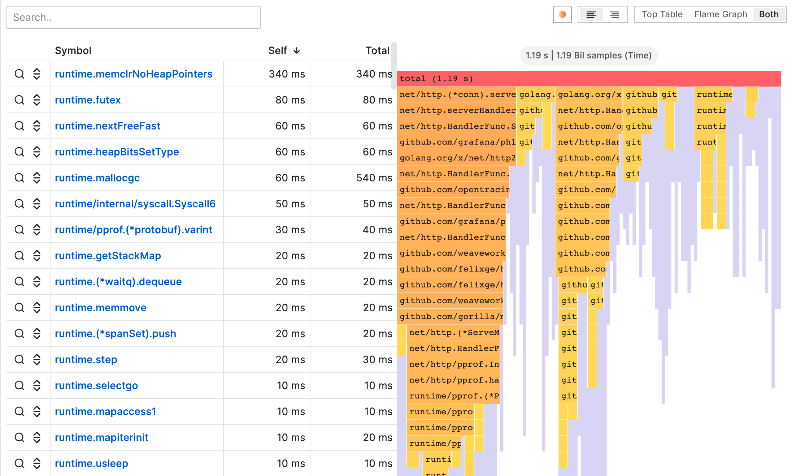

# Flame graph

This documentation topic is designed
for Grafana workspaces that support **Grafana version
10.x**.

For Grafana workspaces that support Grafana version 9.x, see
[Working in Grafana version 9](using-grafana-v9.md "using-grafana-v9.md").

For Grafana workspaces that support Grafana version 8.x, see
[Working in Grafana version 8](using-grafana-v8.md "using-grafana-v8.md").

Flame graphs let you visualize profiling data. Using this visualization, the profile
can be represented as a flame graph, table, or both.

## Flame graph mode

A flame graph takes advantage of the hierarchical nature of profiling data. It
condenses data into a format that allows you to easily see which code paths are
consuming the most system resources, such as CPU time, allocated objects, or space
when measuring memory. Each block in the flame graph represents a function call in a
stack and its width represents its value.

Grayed-out sections are a set of functions that represent a relatively small
value and they are collapsed together into one section for performance reasons.

You can hover over a specific function to view a tooltip that shows you
additional data about that function, like the function's value, percentage of total
value, and the number of samples with that function.

**Drop-down actions**

You can click a function to show a drop-down menu with additional actions:

- **Focus block** – When you choose
  **Focus block**, the block, or function, is set
  to 100% of the flame graph’s width and all its child functions are shown with
  their widths updated relative to the width of the parent function. This makes it
  easier to drill down into smaller parts ofthe flame graph.
- **Copy function name** – When you
  choose **Copy function name**, the full name of the
  function that the block represents is copied.
- **Sandwich view** – The sandwich
  view allows you to show the context of the clicked function.
  It shows all the function’s callers on the top and all the callees at the
  bottom. This shows the aggregated context of the function so if the function
  exists in multiple places in the flame graph, all the contexts are shown and
  aggregated in the sandwich view.

**Status bar**

The status bar shows metadata about the flame graph and currently applied
modifications, like what part of the graph is in focus or what function is shown
in sandwich view. Click the **X** in the status bar pill to
remove that modification.

## Toolbar

**Search**

You can use the search field to find functions with a particular name. All
the functions in the flame graph that match the search will remain colored while
the rest of the functions are grayed-out.

**Color schema picker**

You can switch between coloring functions by their value or by their package
name to visually tie functions from the same package together.

**Text align**

Align text either to the left or to the right to show more important parts of
the function name when it does not fit into the block.

**Visualization picker**

You can choose to show only the flame graph, only table, or both at the same
time.

## Top table mode

The top table shows the functions from the profile in table format. The table has
three columns: symbols, self, and total. The table is sorted by self time by
default, but can be reordered by total time or symbol name by clicking the column
headers. Each row represents aggregated values for the given function if the
function appears in multiple places in the profile.

There are also action buttons on the left for each row. The first button searches
for the function name while second button shows the sandwich view of the
function.

## Data API

In order to render the flame graph, you must format the data frame data using a
[nested set
model](https://wikipedia.org/wiki/Nested_set_model "https://wikipedia.org/wiki/Nested_set_model").

A nested set model ensures each item of the flame graph is encoded just by its
nesting level as an integer value, its metadata, and by its order in the data frame.
This means that the order of items is significant and needs to be correct. The
ordering is a depth-first traversal of the items in the flame graph which recreates
the graph without needing variable-length values in the data frame like in a
children’s array.

Required fields:

| Field name | Type   | Description                                                                                                                   |
| ---------- | ------ | ----------------------------------------------------------------------------------------------------------------------------- |
| level      | number | The nesting level of the item. In other words how many items are between this item and the top item of the flame graph.    |
| value      | number | The absolute or cumulative value of the item. This translates to the width of the item in the graph.                       |
| label      | string | Label to be shown for the particular item.                                                                                    |
| self       | number | Self value which is usually the cumulative value of the item minus the sum of cumulative values of its immediate children. |
