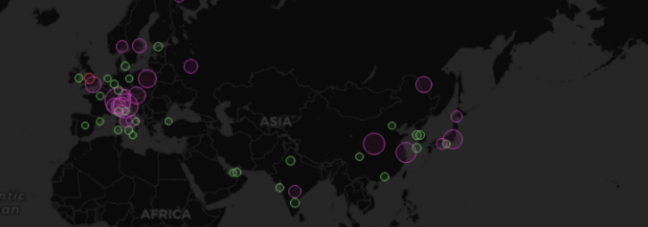
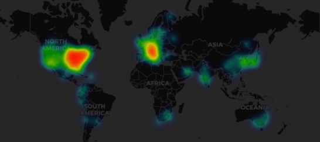
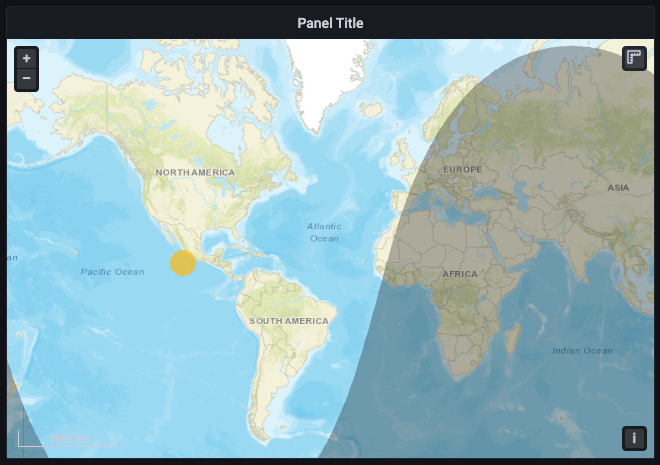
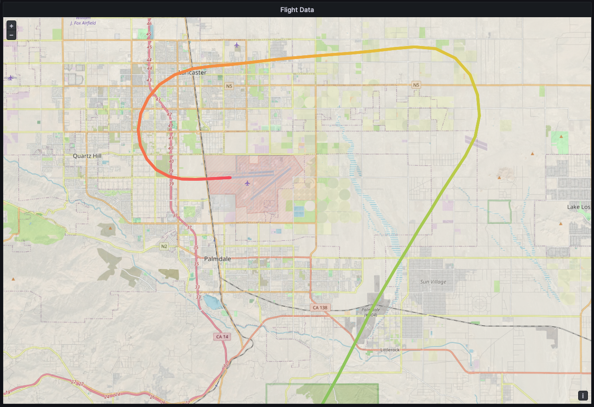
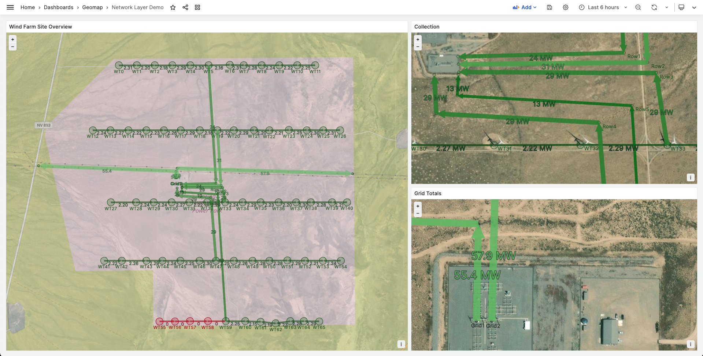

# Geomap

This documentation topic is designed
for Grafana workspaces that support **Grafana version
10.x**.

For Grafana workspaces that support Grafana version 9.x, see
[Working in Grafana version 9](using-grafana-v9.md "using-grafana-v9.md").

For Grafana workspaces that support Grafana version 8.x, see
[Working in Grafana version 8](using-grafana-v8.md "using-grafana-v8.md").

Geomaps allow you to view and customize the world map using geospatial data. You can
configure various overlay styles and map view settings to easily focus on the
important location-based characteristics of the data.

###### Note

You can add your own geospatial data on top of basemap layers provides by AWS.
The basemap layers must all come from [https://tiles.maps.search-services.aws.a2z.com](https://tiles.maps.search-services.aws.a2z.com "https://tiles.maps.search-services.aws.a2z.com").

## Map View

The map view controls the initial view of the map when the dashboard
loads.

**Initial View**

The initial view configures how the GeoMap panel renders when the panel is
first loaded.

- **View** sets the center for the map when the panel
  first loads.
  - **Fit to data** fits the map view based on the
    data extents of Map layers and updates when data changes.
    - **Data** option allows selection of
      extent based on data from _All layers_,
      a single _Layer_, or the _Last
      value_ from a selected layer.
    - **Layer** can be selected if fitting data
      from a single _Layer_ or the
      _Last value_ of a layer.
    - **Padding** sets padding in relative
      percent beyond data extent (not available when looking at
      _Last value_ only).
    - **Max Zoom** sets the maximum zoom level
      when fitting data.

  - **Coordinates** sets the map view based
    on:
    - **Latitude**
    - **Longitude**

  - Default views are also available including:
    - **(0°, 0°)**
    - **North America**
    - **South America**
    - **Europe**
    - **Africa**
    - **West Asia**
    - **South Asia**
    - **South-East Asia**
    - **East Asia**
    - **Australia**
    - **Oceania**

- **Zoom** sets the initial zoom level.

## Map layers

Geomaps support showing multiple layers. Each layer determines how you visualize
geospatial data on top of the base map.

**Types**

There are three map layer types to choose from in the Geomap visualization.

- [Markers layer](#v10-panels-geomap-markers "#v10-panels-geomap-markers") renders a marker at each data point.
- [Heatmap layer](#v10-panels-geomap-heatmap "#v10-panels-geomap-heatmap") visualizes a heatmap of the data.
- [GeoJSON layer](#v10-panels-geomap-geojson "#v10-panels-geomap-geojson") renders static data from a GeoJSON file.
- [Night / Day layer (Alpha)](#v10-panels-geomap-nightday "#v10-panels-geomap-nightday") renders a night or day region.
- [Route layer (preview)](#v10-panels-geomap-route "#v10-panels-geomap-route") render data points as a route.
- [Photos layer (preview)](#v10-panels-geomap-photos "#v10-panels-geomap-photos") renders a photo at each data point.
- [Network layer (preview)](#v10-panels-geomap-network "#v10-panels-geomap-network") visualizes a network graph from the data.

There are also two experimental (or alpha) layer types.

- **Icon at last point (alpha)** renders an icon at the
  last data point.
- **Dynamic GeoJSON (alpha)** styles a GeoJSON file based
  on query results.

###### Note

Layers marked _preview_ or _alpha_ in
public preview. Grafana Labs offers limited support, and breaking changes
might occur prior to the feature being made generally available.

**Layer Controls**

The layer controls allow you to create layers, change their name, reorder and
delete layers.

- **Add layer** creates an additional, configurable data
  layer for the geomap. When you add a layer, you are prompted to select a
  layer type. You can change the layer type at any point during panel
  configuration.
- The layer controls allow you to rename, delete, and reorder the layers
  of the panel.
  - **Edit layer name** (pencil icon) renames the
    layer.
  - **Trash Bin** deletes the layer.
  - **Reorder** (six dots/grab handle) allows you
    to change the layer order. Data on higher layers will appear above
    data on lower layers. The visualization will update the layer order as you
    drag and drop to help simplify choosing a layer order.

You can add multiple layers of data to a single geomap panel in order to create
rich, detailed visualizations.

**Location**

Geomaps needs a source of geographical data. This data comes from a database
query, and there are four mapping options for your data.

- **Auto** automatically searches for location data. Use
  this option when your query is based on one of the following names for data
  fields.
  - _geohash_: `geohash`
  - _latitude_: `latitude`,
    `lat`
  - _longitude_: `longitude`,
    `lng`, `lon`
  - _lookup_: `lookup`

- **Coords** specifies that your query holds coordinate
  data. You will getprompted to select numeric data fields for latitude and
  longitude from your database query.
- **Geohash** specifies that your query holds geohash
  data. You will be prompted to select a string data field for the geohash
  from your database query.
- **Lookup** specifies that your query holds location
  name data that needs to be mapped to a value. You will be prompted to
  select the lookup field from your database query and a gazetteer. The
  gazetteer is the directory that is used to map your queried data to a
  geographical point.

## Markers layer

The markers layer allows you to display data points as different marker shapes
such as circles, squares, triangles, stars, and more.

Markers have many customization options.

- **Size** configures the size of the markers.
  The default is `Fixed size`, which makes all marker sizes the
  same regardless of the data; however, there is also an option to size the
  markers based on the data corresponding to selected field. `Min`
  and `Max` marker size has to be set such that the Marker layer
  can scale within this range.
- **Symbol** allows you to choose the symbol,
  icon, or graphic to aid in providing additional visual context to your
  data. Choose from assets that are included with Grafana such as simple
  symbols or the Unicon library. You can also specify a URL containing an
  image asset. The image must be a scalable vector graphic (SVG).
- **Symbol Vertical Align** configures the
  vertical alignment of the symbol relative to the data point. Note that the
  symbol's rotation angle is applies first around the data point, then the
  vertical alignment is applied relative to the rotation of the symbol.
- **Symbol Horizontal Align** configures the
  horizontal alignment of the symbol relative to the data point. Note that the
  symbol's rotation angle is applies first around the data point, then the
  horizontal alignment is applied relative to the rotation of the symbol.
- **Color** configures the color of the
  markers. The default `Fixed color` sets all markers to a specific
  color. There is also an option to have conditional colors depending on the
  selected field data point values and the color scheme set at the
  **Standard options** section.
- **Fill opacity** configures the transparency
  of each marker.
- **Rotation angle** configures the rotation
  angle of each marker. The default is **Fixed value**,
  which makes all markers rotate to the same angle regardless of the data;
  however, there is also an option to set the rotation of the markers based
  on data corresponding to a selected field.
- **Text label** configures a text label for
  each marker.
- **Show legend** lets you toggle the legend
  for the layers.
- **Display tooltip** lets you toggle tooltips
  for the layer.

## Heatmap layer

The heatmap layer clusters various data points to visualize locations with
different densities.

To add a heatmap layer:

Choose on the dropdown menu under Data Layer and select `Heatmap`.

Similar to `Markers`, you are prompted with options to
determine which data points to visualize and how you want to visualize
them.

- **Weight values** configure the intensity
  of the heatmap clusters. **Fixed value** keeps a constant
  weight value throughout all data points. This value should be in the range
  of 0-1. Similar to Markers, there is an alternate option in the dropdown
  to automatically scale the weight values depending on data values.
- **Radius** configures the size of the
  heatmap clusters.
- **Blur** configures the amount of blur on
  each cluster.
- **Opacity** configures the opacity of each
  cluster.
- **Display tooltip** lets you toggle tooltips
  for the layer.

## GeoJSON layer

The GeoJSON layer allows you to select and load a static GeoJSON file from the
filesystem.

- **GeoJSON URL** provides a choice
  of GeoJSON files that ship with Grafana.
- **Default Style** controls which
  styles to apply when no rules above match.
  - **Color** configures
    the color of the default style
  - **Opacity** configures
    the default opacity

- **Style Rules** apply styles
  based on feature properties
  - **Rule** allows you to
    select a _feature_,
    _condition_, and
    _value_ from the GeoJSON file in
    order to define a rule. The trash bin icon can be used
    to delete the current rule.
  - **Color** configures the color
    of the style for the current rule
  - **Opacity** configures the
    transparency level for the current rule.

- **Add style rule** creates additional
  style rules.
- **Display tooltip** lets you toggle tooltips
  for the layer.

## Night / Day layer (Alpha)

The Night / Day layer displays night and day regions based on the current time
range.

**Options**

- **Show** toggles the time source from panel
  time range.
- **Night region color** picks the color for
  the night region.
- **Display sun** toggles sun icon.
- **Opacity** from 0 (transparent) to 1
  (opaque).
- **Display tooltip** lets you toggle tooltips
  for the layer.

###### Note

For more information, see [Extensions for OpenLayers - DayNight](https://viglino.github.io/ol-ext/examples/layer/map.daynight.html "https://viglino.github.io/ol-ext/examples/layer/map.daynight.html").

## Route layer (preview)

The Route layer renders data points as a route.

###### Note

The Route layer is currently in public preview. Grafana Labs offers
limited support, and breaking changes might occur prior to the feature being
made generally available.

**Options**

- **Size** sets the route thickness. Fixed
  value by default. When field data is selected, you can set the Min and Max
  range in which field data can scale.
- **Color** sets the route color. Set to fixed
  color by default, you can also tie the color to field data.
- **Fill opacity** configures the opacity of
  the route.
- **Text label** configures a text label for
  each route.
- **Arrow** configures the arrow styling to
  display along the route, in order of data.
  - **None**
  - **Forward**
  - **Reverse**

- **Display tooltip** lets you toggle tooltips
  for the layer.

###### Note

For more information, see [Extensions for OpenLayers - Flow Line Style](http://viglino.github.io/ol-ext/examples/style/map.style.gpxline.html "http://viglino.github.io/ol-ext/examples/style/map.style.gpxline.html").

## Photos layer (preview)

The Photos layer renders a photo at each data point.

###### Note

The Photos layer is currently in public preview. Grafana Labs offers
limited support, and breaking changes might occur prior to the feature being
made generally available.

**Options**

- **Image Source Field** lets you select a
  string field containing image data as a Base64 encoded image binary
  (`data:image/png;base64,...`).
- **Kind** sets the frame style around the
  images. Choose from:
  - **Square**
  - **Circle**
  - **Anchored**
  - **Folio**

- **Crop** toggles whether the images are
  cropped to fit.
- **Shadow** toggles a box shadow behind
  the images.
- **Border** sets the border size around
  images.
- **Border color** sets the border color
  around images.
- **Radius** sets the overall size of
  images in pixels.
- **Display tooltip** lets you toggle tooltips
  for the layer.

###### Note

For more information, see [Extensions for OpenLayers - Image Photo Style](http://viglino.github.io/ol-ext/examples/style/map.style.photo.html "http://viglino.github.io/ol-ext/examples/style/map.style.photo.html").

## Network layer (preview)

The Network layer renders a network graph. This layers supports the same data
format supported by the node graph visualization, with the addition of
geospatial data included in the nodes data. The geospatial data is used to locate
and render the nodes on the map.

###### Note

The Network layer is currently in public preview. Grafana Labs offers
limited support, and breaking changes might occur prior to the feature being
made generally available.

###### Note

The Network layer is currently in public preview. Grafana Labs offers
limited support, and breaking changes might occur prior to the feature being
made generally available.

**Options**

- **Arrow** sets the arrow direction to
  display for each edge, with forward meaning source to target. Choose
  from:
  - **None**
  - **Forward**
  - **Reverse**
  - **Both**

- **Show legend** lets you toggle the legend
  for the layer. The legend only supports node data.
- **Display tooltip** lets you toggle tooltips
  for the layer.

**Node styles**

- **Size** configures the size of the nodes.
  The default is **Fixed size**, which makes all node sizes
  the same regardless of the data; however, there is also an option to size
  the nodes based on data corresponding to a selected field.
  **Min** and **Max** node sizes have to be
  set such that the nodes can scale within this range.
- **Color** configures the color of the nodes.
  The default is **Fixed color**, which sets all nodes to a
  specific color. There is also an option to have conditional colors
  depending on the selected field data point values and the color scheme set
  in the **Standard options** section.
- **Symbol** lets you choose the symbol,
  icon, or graphic to aid in providing additional visual context to your
  data. Choose from assets that are included with Grafana, such as simple
  symbols or the Unicon library. You can also specify a URL containing an
  image asset. The image must be a scalable vector graphic (SVG).
- **Fill opacity** configures the transparency
  of each node.
- **Rotation angle** configures the rotation
  angle of each node. The default is **Fixed value**, which
  makes all nodes rotate to the same angle regardless of the data; however,
  there is also an option to set the rotation of the nodes based on data
  corresponding to a selected field.
- **Text label** configures a text label for
  each node.

**Edge styles**

- **Size** configures the line width of the
  edges. The default is **Fixed size**, which makes all edge
  line widths the same regardless of the data; however, there is also an
  option to size the edges based on data corresponding to a selected field.
  **Min** and **Max** edge sizes have to be
  set such that the edges can scale within this range.
- **Color** configures the color of the edges.
  The default is **Fixed color**, which sets all edges to a
  specific color. There is also an option to have conditional colors
  depending on the selected field data point values and the color scheme set
  in the **Standard options** section.
- **Fill opacity** configures the transparency
  of each edge.
- **Text label** configures a text label for
  each edge.

## CARTO layer

CARTO layers are not supported in Amazon Managed Grafana.

## XYZ tile layer

XYZ tile layers are not supported in Amazon Managed Grafana.

## Open Street Map layer

Open Street Map layers (other than the default basedmap) are not supported in
Amazon Managed Grafana.

## ArcGIS layer

ArcGIS layers are not supported in Amazon Managed Grafana.

## Map Controls

The map controls section contains various options for map information
and tool overlays.

**Zoom**

Options for zoom controls.

_Show zoom control_

Displays zoom controls in the upper left corner.

_Mouse wheel zoom_

Turns on or off using the mouse wheel for zooming in or out.

**Show attribution**

Displays attribution for basemap layers on the map.

**Show scale**

Displays scale information in the bottom left corner.

###### Note

Displays units in [m]/[km].

**Show measure tools**

Displays measure tools in the upper right corner. Measurements appear only
when this control is open.

- **Click** to start measuring
- **Continue clicking** to continue
  measurement
- **Double-click** to end measurement

###### Note

When you change measurement type or units, the previous measurement is
removed from the map.

If the control is closed and then re-opened, the most recent measurement
is displayed.

A measurement can be modified by clicking and dragging on it.

_Length_

Get the spherical length of a geometry. This length is the sum of the
great circle distances between coordinates. For multi-part geometries, the
length is the sum of the length of each part. Geometries are assumed to be
in ‘EPSG:3857’.

You can choose the following units for length measurements:

- **Metric (m/km)**
- **Feet (ft)**
- **Miles (mi)**
- **Nautical miles (nmi)**

_Area_

Get the spherical area of a geometry. This area is calculated assuming
that polygon edges are segments of great circles on a sphere. Geometries are
assumed to be in ‘EPSG:3857’.

You can choose the following units for area measurements:

- **Square Meters (m²)**
- **Square Kilometers (km²)**
- **Square Feet (ft²)**
- **Square Miles (mi²)**
- **Acres (acre)**
- **Hectare (ha)**

**Show debug**

Displays debug information in the upper right corner of the map. This can be
useful for debugging or validating a data source.

- **Zoom** displays the current zoom level
  of the map.
- **Center** displays the current
  **longitude**, and **latitude** of the map center.

**Tooltip**

- **None** displays tooltips only when a
  data point is clicked.
- **Details** displays tooltips when a pointer
  hovers over a data point.
