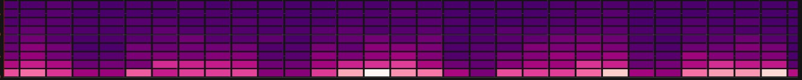

# Heatmap

This documentation topic is designed
for Grafana workspaces that support **Grafana version
10.x**.

For Grafana workspaces that support Grafana version 9.x, see
[Working in Grafana version 9](using-grafana-v9.md "using-grafana-v9.md").

For Grafana workspaces that support Grafana version 8.x, see
[Working in Grafana version 8](using-grafana-v8.md "using-grafana-v8.md").

The Heatmap panel visualization allows you to view histograms over time. For more
information about histograms, refer to [Introduction to histograms
and heatmaps](getting-started-grafanaui.md#introduction-to-histograms-and-heatmaps "getting-started-grafanaui.md#introduction-to-histograms-and-heatmaps").

## Calculate from data

This setting determines if the data is already a calculated heatmap (from the data
source/transformer), or one that should be calculated in the panel.

**X Bucket**

This setting determines how the X-axis is split into buckets. You can specify
a time interval in the **Size** input. For example,
a time range of `1h` makes the cells 1-hour wide
on the X-axis.

**Y Bucket**

This setting determines how the Y-axis is split into buckets.

**Y Bucket scale**

Select one of the following Y-axis value scales:

- **linear** – Linear scale.
- **log (base 2)** – Logarithmic scale with base 2.
- **log (base 10)** – Logarithmic scale with base 10.
- **symlog** – Symlog scale.

## Y Axes

Defines how the Y axis is displayed

**Placement**

- **Left** – On the left
- **Right** – On the right
- **Hidden** – Hidden

**Unit**

Unit configuration

**Decimals**

This setting determines decimal configuration.

**Min/Max value**

This setting configures the axis range.

**Reverse**

When selected, the axis appears in reverse order.

**Display multiple y-axes**

In some cases, you may want to display multiple y-axes. For example, if you have
a dataset showing both temperature and humidity over time, you may want to show two
y-axes with different units for these two series.

You can do this by [adding field
overrides](v10-panels-configure-overrides.md "v10-panels-configure-overrides.md"). Follow the steps as many times as required to add as many y-axes
as you need.

## Colors

The color spectrum controls the mapping between value count (in each bucket) and
the color assigned to each bucket. The leftmost color on the spectrum represents the
minimum count and the color on the right most side represents the maximum count.
Some color schemes are automatically inverted when using the light theme.

You can also change the color mode to Opacity. In this case, the color will not
change but the amount of opacity will change with the bucket count

- **Mode**
  - **Scheme** – Bucket value
    represented by cell color.
    - **Scheme** – If the mode is
      **Scheme**, then select a color scheme.

  - **opacity** – Bucket value represented by
    cell opacity. Opaque cell means maximum value.
    - **Color** – Cell base color.
    - **Scale** – Scale for mapping
      bucket values to the opacity.
      - **linear** – Linear
        scale. Bucket value maps linearly to the opacity.
      - **sqrt** – Power scale.
        Cell opacity calculated as `value ^ k`,
        where `k` is a configured
        **Exponent** value. If exponent is
        less than `1`, you will get a logarithmic
        scale. If exponent is greater than `1`,
        you will get an exponential scale. In case of
        `1`, scale will be the same as linear.

    - **Exponent** – value of the exponent,
      greater than `0`.

**Start/end color from value**

By default, Grafana calculates cell colors based on minimum and maximum bucket
values. With Min and Max you can overwrite those values. Consider a bucket value
as a Z-axis and Min and Max as Z-Min and Z-Max, respectively.

- **Start** – Minimum value using
  for cell color calculation. If the bucket
  value is less than Min, then it is mapped to the “minimum” color.
  The series min value is the default value.
- **End** – Maximum value using
  for cell color calculation. If the bucket
  value is greater than Max, then it is mapped to the “maximum” color.
  The series max value is the default value.

## Cell display

Use these settings to refine your visualization.

## Additional display options

**Tooltip**

- **Show tooltip** – Show heatmap
  tooltip.
- **Show Histogram** – Show a Y-axis
  histogram on the tooltip. A histogram represents the distribution of the
  bucket values for a specific timestamp.
- **Show color scale** – Show a color scale on the
  tooltip. The color scale represents the mapping between bucket value and
  color.

**Legend**

Choose whether you want to display the heatmap legend on the visualization.

**Exemplars**

Set the color used to show exemplar data.
