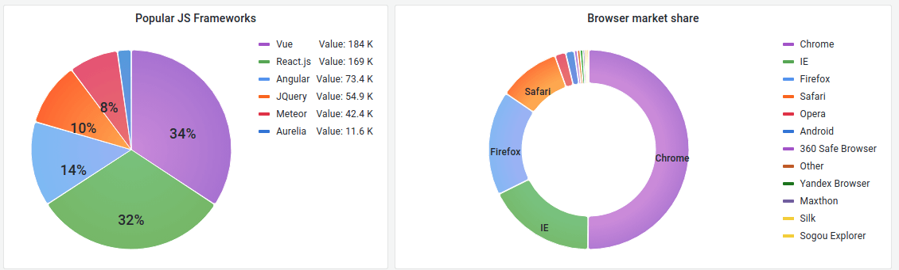

# Pie chart

This documentation topic is designed
for Grafana workspaces that support **Grafana version
10.x**.

For Grafana workspaces that support Grafana version 9.x, see
[Working in Grafana version 9](using-grafana-v9.md "using-grafana-v9.md").

For Grafana workspaces that support Grafana version 8.x, see
[Working in Grafana version 8](using-grafana-v8.md "using-grafana-v8.md").

The pie chart displays reduced series, or values in a series, from one or more
queries, as they relate to each other, in the form of slices of a pie. The arc length,
area and central angle of a slice are all proportional to the slices value, as it
relates to the sum of all values. This type of chart is best used when you want a quick
comparison of a small set of values in an aesthetically pleasing form.

## Value options

Use the following options to refine the value in your visualization.

**Show**

Choose how much information to show.

- **Calculate** – Reduces each value to
  a single value per series.
- **All values** – Displays every value
  from a single series.

**Calculation**

Select a calculation to reduce each series when **Calculate**
has been selected. For information about available calculations, refer to [Calculation types](v10-panels-calculation-types.md "v10-panels-calculation-types.md").

**Limit**

When displaying every value from a single series, this limits the number of values
displayed.

**Fields**

Select at least one field to display in the visualization. Each field name is
available on the list, or you can select one of the following options:

- **Numeric fields** – All fields with
  numerical values.
- **All fields** – All fields that are
  not removed by transformations.
- **Time** – All fields with time
  values.

## Pie chart options

Use these options to refine how your visualization looks.

**Pie chart type**

Select the pie chart display style. Can be either:

- **Pie** – A standard pie chart
- **Donut** – A pie chart with a hole in
  the middle

**Labels**

Select labels to display on the pie chart. You can select more than one.

- **Name** – The series or field name.
- **Percent** – The percentage of the whole.
- **Value** – The raw numerical value.

Labels are displayed in white over the body of the chart by default. You can
select darker chart colors to make them more visible. Long names or numbers might be
clipped.

**Tooltip mode**

When you hover your cursor over the visualization, Grafana can display tooltips.
Choose how tooltips behave.

- **Single** – The hover tooltip shows only a
  single series, the one that you are hovering over on the
  visualization.
- **All** – The hover tooltip shows all series in
  the visualization. Grafana highlights the series that you are hovering over
  in bold in the series list in the tooltip.
- **Hidden** – Do not display the tooltip when you
  interact with the visualization.

Use an override to hide individual series from the tooltip.

## Legend options

Use these settings to define how the legend appears in your visualization. For
more information about the legend, refer to [Configure a legend](v10-panels-configure-legend.md "v10-panels-configure-legend.md").

**Legend visibility**

Use the **Visibility** toggle to show or hide the legend.

**Legend mode**

Set the display mode of the legend.

- **List** – Displays the legend as a list. This is
  the default display mode of the legend.
- **Table** – Displays the legend as a table.

**Legend placement**

Choose where to display the legend.

- **Bottom** – Below the graph.
- **Right** – To the right of the graph.

**Legend values**

Select values to display in the legend. You can select more than one.

- **Percent** – The percentage of the whole.
- **Value** – The raw numerical value.

For more information about the legend, refer to [Configure a legend](v10-panels-configure-legend.md "v10-panels-configure-legend.md").
