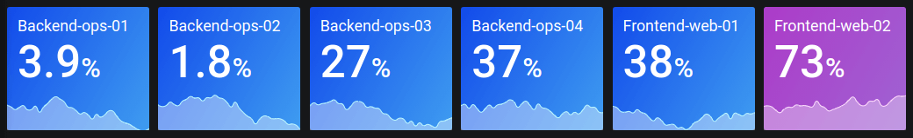

# Stat

This documentation topic is designed
for Grafana workspaces that support **Grafana version
10.x**.

For Grafana workspaces that support Grafana version 9.x, see
[Working in Grafana version 9](using-grafana-v9.md "using-grafana-v9.md").

For Grafana workspaces that support Grafana version 8.x, see
[Working in Grafana version 8](using-grafana-v8.md "using-grafana-v8.md").

Stats show one large stat value with an optional graph sparkline. You can control
the background or value color using thresholds or overrides.

By default, a Stat displays one of the following:

- Just the value for a single series or field.
- Both the value and name for multiple series or fields.
  You can use the **Text mode** to control whether the text is
  displayed or not.

## Automatic layout

adjustment

The panel automatically adjusts the layout depending on available width and height
in the dashboard. It automatically hides the graph (sparkline) if the panel becomes
too small.

## Value options

Use the following options to refine how your visualization displays the
value:

**Show**

Choose how Grafana displays your data.

- **Calculate**

Show a calculated value based on all rows.

    + **Calculation** – Select a reducer
     function that Grafana will use to reduce many fields to a single
     value. For a list of available calculations, see [standard
     calculations](v10-panels-calculation-types.md "v10-panels-calculation-types.md").
    + **Fields** – Select the fields display in
     the visualization.

- **All values**

Show a separate stat for every row. If you select this option, then you
can also limit the number of rows to display.

    + **Limit** – The maximum number of rows to
     display. Default is 5,000.
    + **Fields** – Select the fields display in
     the visualization.

## Stat styles

Style your visualization.

**Orientation**

Choose a stacking direction.

- **Auto** – Grafana selects what it thinks is the
  best orientation.
- **Horizontal** – Bars stretch horizontally, left
  to right.
- **Vertical** – Bars stretch vertically, top to
  bottom.

**Text mode**

You can use the Text mode option to control what text the visualization renders.
If the value is not important, only the name and color is, then change the
**Text mode** to **Name**. The value will still
be used to determine color and is displayed in a tooltip.

- **Auto** – If the data contains multiple series
  or fields, show both name and value.
- **Value** – Show only value, never name. Name is
  displayed in the hover tooltip instead.
- **Value and name** – Always show value and
  name.
- **Name** – Show name instead of value. Value is
  displayed in the hover tooltip.
- **None** – Show nothing (empty). Name and value
  are displayed in the hover tooltip.

**Wide layout**

Set whether wide layout is enabled or not. Wide layout is enabled by
default.

- **On** – Wide layout is turned on.
- **Off** – Wide layout is turned off.

###### Note

This option is only applicable when **Text mode** is set to
**Value and name**. When wide layout is turned on, the value
and name are displayed side-by-side with the value on the right, if the panel
is wide enough. When wide layout is turned off, the value is always rendered
underneath the name.

**Color mode**

Select a color mode.

- **None** – No color is applied to
  the value.
- **Value** – Applies colors to the value and graph
  area.
- **Background Gradient** – Applies color to the
  value, graph area, and background, with a slight background gradient.
- **Background Solid** – Applies color to the
  value, graph area, and background, with a solid background color.

**Graph mode**

Select a graph and sparkline mode.

- **None** – Hides the graph and only shows the
  value.
- **Area** – Shows the area graph below the value.
  This requires that your query returns a time column.

**Text alignment**

Choose an alignment mode.

- **Auto** – If only a single value is shown (no
  repeat), then the value is centered. If multiple series or rows are shown,
  then the value is left-aligned.
- **Center** – Stat value is centered.

**Show percent change**

Set whether percent change is displayed or not. By default it is not shown.

###### Note

This option is not applicable when the **Show** setting,
under **Value options**, is set to **All
values**.

## Text size

Adjust the sizes of the gauge text.

- **Title** – Enter a numeric value for the gauge
  title size.
- **Value** – Enter a numeric value for the gauge
  value size.
