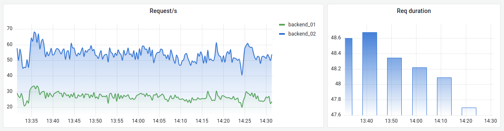

# Time series

This documentation topic is designed
for Grafana workspaces that support **Grafana version
10.x**.

For Grafana workspaces that support Grafana version 9.x, see
[Working in Grafana version 9](using-grafana-v9.md "using-grafana-v9.md").

For Grafana workspaces that support Grafana version 8.x, see
[Working in Grafana version 8](using-grafana-v8.md "using-grafana-v8.md").

Time series visualizations are the default and primary way to visualize time series
data as a graph. They can render series as lines, points, or bars. They're versatile
enough to display almost any time-series data.

###### Note

You can migrate Graph panel visualizations to Time series visualizations. To
migrate, on the **Panel** tab, choose **Time series
visualization**. Grafana transfers all applicable settings.

###### Topics

- [Tooltip options](v10-time-series-panel-tooltip.md "v10-time-series-panel-tooltip.md")
- [Legend options](v10-time-series-panel-legend.md "v10-time-series-panel-legend.md")
- [Graph styles](v10-time-series-graph.md "v10-time-series-graph.md")
- [Axis options](v10-time-series-axis.md "v10-time-series-axis.md")
- [Color options](v10-time-series-color.md "v10-time-series-color.md")
