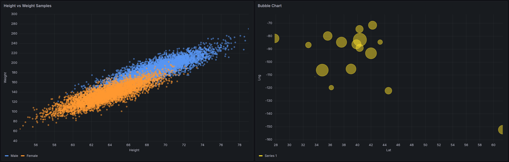

# XY Chart

XY charts provide a way to visualize arbitrary x and y values in a graph so that
you can easily show the relationship between two variables. XY charts are typically
used to create scatter plots. you can also use them to create bubble charts, where
field values determine the size of each bubble.

## Supported data formats

You can use any type of tabular data with at least two numeric fields in an XY
chart. This type of visualization doesn't require time data.

## Panel options

In the **Panel options** section of the panel editor pane, you
set basic options like the panel title and description. You can also configure
repeating panels in this section. For more information, see [Configure panel options](v10-panels-configure-panel-options.md "v10-panels-configure-panel-options.md").

## XY chart options

**Series mapping**

Set how series data is mapped in the chart.

- **Auto** – Automatically generates
  series from all available data frames (or datasets). You can filter to
  select only one frame.
- **Manual** – Explicitly define the
  series by selecting from available data frames.

Depending on your series mapping selection, the **Frame**,
**X-field**, and **Y-field** options differ. The
Auto and Manual series mapping sections describe these different options.

**Auto series mapping options**

When you select **Auto** as your series mapping mode, the
following options are preconfigured, but you can also define them yourself.

- **Frame** – By default an XY chart
  displays all data frames. You can filter to select only one frame.
- **X-field** – Select which field X
  represents. By default,t his is the first number field in each data frame.
- **Y-field** – After the X-field is
  set, by default, all the remaining number fields in the data frame are
  designated as the Y-fields. You can use this option to explicitly choose
  which fields to use for Y.

The series of the chart are generated from the Y-fields. To make changes
to a series in an XY chart, make overrides to the Y-field. Any field you
use in the Size field or Color field doesn't generate a series.

You can also use overrides to exclude Y-fields individually. To do so,
add an override with the following properties for each Y-field you want
removed:

    + Override type: **Fields with name**
    + Override property: **Series > Hide in area**
    + Area: **Viz**

**Manual series mapping options**

When you select **Manual** as your series mode, you can add,
edit, and delete series. To manage a series, select the **Series**
field. To rename the series, select the series name.

In **Manual** mode, you must set the following options:

- **Frame** – Select your data frame or dataset.
  You can add as many frames as you want.
- **X-field** – Select which field X
  represents.
- **Y-field** – Select which field Y
  represents.

**Size field**

Use this option to set which field's values control the size of point in the
chart. This value is relative to the min and max of all the values in the data
frame.

When you select this option, you can then set the min and max point size
options.

**Color field**

Use this option to set which field's values control the color of the points in
the chart. To use the color value options under the **Standard
options**, you must set this field.

Typically, this option is used when you only have one series displayed in the
chart.

**Show**

Set how values are represented in the visualization.

- **Points** – Display values as points. When you
  select this option, the point size option is also displayed.
- **Lines** – Add a line between values. When you
  select this option, the line style and line width options are also
  displayed.
- **Both** – Display both points and lines.

**Point size**

Sets the size of all point in the chart, from one to 100 pixels in diameter. The
default size is five pixels. You can set an override to set the pixel size by
series (Y-field).

**Min/Max point size**

Use these optinos to control the minimum or maximum point size when you've set
the **Size field** option. You can override these options for
specific series.

**Line style**

Set the style of the line. To change the color, use the standard color scheme
field option.

- **Solid** – Display a solid line. This is the
  default setting.
- **Dash** – Display a dashed line. When you choose
  this option, a drop-down list is displayed where you can select the length
  and gap setting for the line dashes. By default, the length and gap are set
  to `10, 10`.
- **Dots** – Display dotted lines. When you choose
  this option, a drop-down list is displayed where you can select dot
  spacing. By default, the dot spacing is set to `0, 10` (the first
  number represents dot length, and is always zero).

**Line width**

Sets the width of the lines, in pixels.

## Tooltip options

Tooltip options control the information overlay that appears when you hover
over data points in the graph.

**Tooltip mode**

- Single – The hover tooltip shows
  only a single series, the one that you are hovering over.
- Hidden – Do not display the tooltip
  when you interact with the visualization.

Use an override to hide individual series from the tooltip.

**Max height**

Set the maximum height of the tooltip box. The defautl is 600 pixels.

## Legend options

Legend options control the series names and statistics that appear under or to
the right of the graph. For more information about the legend, see [Configure a legend](v10-panels-configure-legend.md "v10-panels-configure-legend.md").

**Visibility**

Toggle the switch to turn the legend on or off.

**Mode**

Use these settings to define how the legend appears in your visualization.

- List – Displays the legend as a
  list. This is the default display mode of a legend.
- Table – Displays the legend as a
  table.

**Placement**

Choose where to display the legend.

- Bottom – Below the graph.
- Right – To the right of the
  graph.

**Values**

Choose which of the [standards
calculations](v10-panels-calculation-types.md "v10-panels-calculation-types.md") to show in the legend. You can have more than one.

**Width**

Control how wide the legend is when place to the right side of the visualization.
This option is only displayed if you set the legend placement to
**Right**.

## Axis options

This documentation topic is designed
for Grafana workspaces that support **Grafana version
10.x**.

For Grafana workspaces that support Grafana version 9.x, see
[Working in Grafana version 9](using-grafana-v9.md "using-grafana-v9.md").

For Grafana workspaces that support Grafana version 8.x, see
[Working in Grafana version 8](using-grafana-v8.md "using-grafana-v8.md").

Options under the axis category change how the x- and y-axes are rendered. Some
options don't take effect until you click outside of the field option box you are
editing. You can also press `Enter`.

**Placement (y-axis)**

Select the placement of the Y-axis. The options are:

- **Auto** – Automatically assigns the y-axis
  to the series. When there are two or more series with different units,
  Grafana assigns the left axis to the first unit, and the right axis
  to the units that follow.
- **Left** – Display all y-axes on the
  left side.
- **Right** – Display all y-axes on the
  right side.
- **Hidden** – Hide all axes.

To selectively hide axes, [add
a field override](v10-panels-configure-overrides.md "v10-panels-configure-overrides.md") that targets specific fields.

**Label**

Set a y-axis text label. If you have more than one y-axis, then you can assign
different labels using an override.

**Width**

Set a fixed width of the axis. By default, Grafana dynamically calculates the
width of an axis.

By setting the width of the axis, data with different axes types can share the
same display proportions. This setting makes it easier for you to compare more than
one graph’s worth of data because the axes are not shifted or stretched within
visual proximity to each other.

**Show grid lines**

Set the axis grid line visibility.

- **Auto** – Automatically show grid lines
  based on the density of the data.
- **On** – Always show grid lines.
- **Off** – Never show grid lines.

**Color**

Set the color of the axis.

- **Text** – Set the color based on theme
  text color.
- **Series** – Set the color based on the
  series color.

**Show border**

Set the axis border visibility.

**Scale**

Set how the y-axis values scale.

- **Linear** – Divides the scale into equal
  parts.
- **Logarithmic** – Use a logarithmic scale.
  When you select this option, a list appears for you to choose a binary
  (base 2) or common (base 10) logarithmic scale.
- **Symlog** – Use a symmetrical logarithmic
  scale. When you select this option, a list appears for you to choose a
  binary (base 2) or common (base 10) logarithmic scale. The linear
  threshold option allows you to set the threshold at which the scale
  changes from linear to logarithmic.

_Centered zero_

Sets the y-axis to be centered on zero.

**Soft min and soft max**

Set a **Soft min** or **soft max** option
for better control of y-axis limits. By default, Grafana sets the range for
the y-axis automatically based on the dataset.

Soft min and soft max settings can prevent small variations in the data from
being magnified when it's mostly flat. In contrast, hard min and max values
help prevent obscuring useful detail in the data by clipping intermittent spikes
past a specific point.

To define hard limits of the y-axis, set standard min/max options. For
more information, refer to [Configure standard options](v10-panels-configure-standard-options.md "v10-panels-configure-standard-options.md").

**Transform**

Use this option to transform the series values without affecting the values
shown in the tooltip, context menus, or legend. You have two transform
options:

- **Negative Y transform** – Flip the
  results to negative values on the Y axis.
- **Constant** – Show the first value as
  a constant line.

###### Note

The transform option is only available as an override.

**Display multiple y-axes**

There are some cases where you want to display multiple y-axes. For example,
if you have a dataset showing both temperature and humidity over time, you
could show two y-axes with different units for these two series.

To display multiple y-axes, [add a field override](v10-panels-configure-overrides.md#v10-panels-overrides-add-a-field "v10-panels-configure-overrides.md#v10-panels-overrides-add-a-field"). Follow the steps as many times as required to
add as many y-axes as you need.

## Standard options

**Standard options** in the panel editor let you change how
field data is displayed in your visualization. When you set a standard option, the
change is applied to all fields or series. For more granular control over the
display of fields, refer to [Configure field overrides](v10-panels-configure-overrides.md "v10-panels-configure-overrides.md").

You can cusotmize the following standard options:

- **Field min/max** – Enable **Field
  min/max** to have Grafana calculate the min or max of each field
  individually, based on the minimum or maximum value of the field.
- **Color scheme** – Set single or multiple colors
  for your entire visualization.

For more information, see [Configure standard options](v10-panels-configure-standard-options.md "v10-panels-configure-standard-options.md").

## Data links

Data links allow you to link to other panels, dashboards, and external resources
while maintaining the context of the source panel. You can create links that
include the series name or even the value under the cursor.

For each data link, set the following options:

- **Title**
- **URL**
- **Open in new tab**

For more information, see [Configure data links](v10-panels-configure-data-links.md "v10-panels-configure-data-links.md").

## Field overrides

Overrides allow you to customize visualization settings for specific fields or
series. When you add an override rule, you can target a particular set of fields
and define multiple options for how those fields are displayed.

Choose from one of the following override options:

- **Fields with name** – Select a field from the
  list of all available fields.
- **Fields with name matching regex** – Specify
  fields to override with a regular expression.
- **Fields with type** – Select fields by type,
  such as string, numeric, or time.
- **Fields returned by query** – Select all fields
  returned by a specific query.
- **Fields with values** – Select all fields
  returned by your defined reducer condition, such as
  **Min**, **Max**,
  **Count**, or **Total**.

For more information, see [Configure field overrides](v10-panels-configure-overrides.md "v10-panels-configure-overrides.md").
