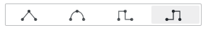

# Graph styles

This documentation topic is designed
for Grafana workspaces that support **Grafana version
10.x**.

For Grafana workspaces that support Grafana version 9.x, see
[Working in Grafana version 9](using-grafana-v9.md "using-grafana-v9.md").

For Grafana workspaces that support Grafana version 8.x, see
[Working in Grafana version 8](using-grafana-v8.md "using-grafana-v8.md").

Use this option to define how to display your time series data. You can use
overrides to combine multiple styles in the same graph.

- **Lines** – Display the time series as
  a line on a graph.
- **Bars** – Display the time series as
  a series of bars on a graph, one for each data point.
- **Points** – Display the time series
  as dots on a graph, one for each data point.

## Bar alignment

Set the position of the bar relative to a data point.where the point would
be drawn on the graph. Because a bar has a width, it can be placed before, after, or
centered on the point. The choices for this option are:

- 

**Before** – The bar is drawn
before the point. The point is placed on the trailing corner of the
bar.

- 

**Center** –
The bar is drawn around the point. The point is placed in the center
of the bar. This is the default.

- 

**After** –
The bar is drawn after the point. the point is placed on the leading
corner of the bar.

## Line width

Line width is a slider that controls the thickness for series lines or the
outline for bars.

## Fill opacity

Sets the opacity of a fill color. Fills are used, for example, to show the
area under the line in a line graph, or as the color of bars in a bar
graph.

## Gradient mode

Gradient mode specifies the gradient fill, which is based on the series color. To
change the color, use the standard color scheme field option. For more information,
see [Color scheme](v10-panels-configure-standard-options.md#v10-panels-standard-options-color-scheme "v10-panels-configure-standard-options.md#v10-panels-standard-options-color-scheme").

The gradient mode options are:

- **None** – No gradient fill. This is the
  default setting.
- **Opacity** – An opacity gradient
  where the opacity of the fill increases as the Y-axis values
  increase.
- **Hue** – A subtle gradient that is based on
  the hue of the series color.
- **Scheme** – A color gradient defined
  by your color scheme. This setting is used for the fill area and the
  line. For more information, see [Color options](v10-time-series-color.md "v10-time-series-color.md").

The gradient appearance is influenced by the **Fill opacity**
setting.

## Show points

You can configure your visualization to add points to line or bars, with the
following options.

- **Auto** – Grafana determines whether to show
  points based on the density of the data. Points are shown when the
  density is low.
- **Always** – Points are shown, regardless of
  the data density.
- **Never** – Do not show points.

## Point size

Sets the size of the points, from 1 to 40 pixels in diameter.

## Line interpolation

Choose how Grafana interpolates the series line.

The options are:

- **Linear** – Points are joined by straight
  lines.
- **Smooth** – Points are joined by curved
  lines that smooths transitions between points.
- **Step before** – The line is displayed as
  steps between points. Points are rendered at the end of the step.
- **Step after** – The line is displayed as
  steps between points. Points are rendered at the beginning of
  the step.

## Line style

Set the style of the line. To change the color, use the standard color scheme
field option.

The choices for line style are:

- **Solid** – Display a solid line. This is
  the default setting.
- **Dash** – Display a dashed line. When you
  choose this option, a list appears for you to select the length and
  gap (length, gap) for the line dashes. Dash spacing is set to 10, 10
  by default.
- **Dots** – Display dotted lines. When you
  choose this option, a list appears for you to select the gap length
  for the dot spacing. Dot spacing is set to 10 by default.

## Connect null values

Choose how null values, which are gaps in the data, appear on the graph.
Null values can be connected to form a continuous line, or set to a
threshold above which gaps in the data are no longer connected.

The choices for how to connect null values are:

- **Never** – Time series data points with
  gaps in the data are never connected.
- **Always** – Time series data points with
  gaps in the data are always connected.
- **Threshold** – Specify a threshold above
  which gaps in the data are no longer connected. This can be useful
  when the connected gaps in the data are of a known size or within
  a known range, and gaps outside the range should no longer be
  connected.

## Disconnect values

Choose whether to add a gap between values in the data that have times
between them above a specified threshold.

The choices for disconnect values are are:

- **Never** – Time series data points are
  never disconnected.
- **Threshold** – Specify a threshold above
  which values in the data are disconnected. This can be useful
  when desired values in the data are of a known size or within a
  known range, and values outside this range should no longer be
  connected.

## Stack series

_Stacking_ allows Grafana to display series on top of
each other. Be cautious when using stacking in the visualization as it can
easily create misleading graphs. To read more about why stacking might not be
the best approach, refer to [The Issue with
Stacking](https://www.data-to-viz.com/caveat/stacking.html "https://www.data-to-viz.com/caveat/stacking.html").

The choices for stacking are:

- **Off** – Turns off series stacking.
- **Normal** – Stacks series on top of each
  other.
- **100%** – Stack by percentage, where all
  series together add up to 100%.

**Stacking series in groups**

You can override the stacking behavior to stack series in groups. For more
information about creating an override, see [Configure field overrides](v10-panels-configure-overrides.md "v10-panels-configure-overrides.md").

###### To stack series in groups

1. Edit the panel and choose **Overrides**.
2. Create a field override for the **Stack series**
   option.
3. In stacking mode, select **Normal**.
4. Name the stacking group in which you want the series to appear.

The stacking group name option is only available when you create
an override.

## Fill below to

The **Fill below to** option fills the area between two
series. This options is only available as a series or field override.

Using this option you can fill the area between two series, rather than from
the series line down to 0. For example, if you had two series called
_Max_ and _Min_, you could select the
_Max_ series and override it to **Fill below
to** the _Min_ series. This would fill only the
area between the two series lines.
