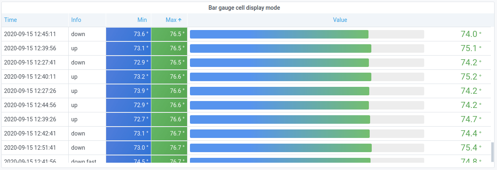

# Visualizations available in Grafana version 12

This documentation topic is designed
for Grafana workspaces that support **Grafana version
12.x**.

For Grafana workspaces that support Grafana version 10.x, see
[Working in Grafana version 10](using-grafana-v10.md "using-grafana-v10.md").

For Grafana workspaces that support Grafana version 9.x, see
[Working in Grafana version 9](using-grafana-v9.md "using-grafana-v9.md").

For Grafana workspaces that support Grafana version 8.x, see
[Working in Grafana version 8](using-grafana-v8.md "using-grafana-v8.md").

Grafana offers a variety of visualizations to support different use cases. This
section of the documentation highlights the built-in visualizations, their options and
typical usage.

A common panel to get started with, and to learn the basics of using panels, is
the [Time series](v12-panels-time-series.md "v12-panels-time-series.md")
panel.

###### Note

If you are unsure which visualization to pick, Grafana can provide visualization
suggestions based on the panel query. When you select a visualization, Grafana will
show a preview with that visualization applied.

- Graphs & charts

  - [Time series](v12-panels-time-series.md "v12-panels-time-series.md") is the
    default and main Graph visualization.
  - [State timeline](v12-panels-state-timeline.md "v12-panels-state-timeline.md") for state
    changes over time.
  - [Status history](v12-panels-status-history.md "v12-panels-status-history.md") for
    periodic state over time.
  - [Bar chart](v12-panels-bar-chart.md "v12-panels-bar-chart.md") shows any
    categorical data.
  - [Histogram](v12-panels-histogram.md "v12-panels-histogram.md") calculates and
    shows value distribution in a bar chart.
  - [Heatmap](v12-panels-heatmap.md "v12-panels-heatmap.md") visualizes data in two
    dimensions, used typically for the magnitude of a phenomenon.
  - [Pie chart](v12-panels-piechart.md "v12-panels-piechart.md") is typically used
    where proportionality is important.
  - [Candlestick](v12-panels-candlestick.md "v12-panels-candlestick.md") is typically
    for financial data where the focus is price/data movement.
  - [Gauge](v12-panels-gauge.md "v12-panels-gauge.md") is the traditional
    rounded visual showing how far a single metric is from a threshold.
  - [Trend](v12-panels-trend.md "v12-panels-trend.md") for datasets that have a
    sequential, numeric x that is not time.
  - [XY Chart](v12-panels-xychart.md "v12-panels-xychart.md") provides a way to
    visualize arbitrary x and y values in a graph.

- Stats & numbers

  - [Stat](v12-panels-stat.md "v12-panels-stat.md") for big stats and optional
    sparkline.
  - [Bar gauge](v12-panels-bar-gauge.md "v12-panels-bar-gauge.md") is a horizontal or
    vertical bar gauge.

- Misc

  - [Table](v12-panels-table.md "v12-panels-table.md") is the main and only
    table visualization.
  - [Logs](v12-panels-logs.md "v12-panels-logs.md") is the main visualization
    for logs.
  - [Node graph](v12-panels-node-graph.md "v12-panels-node-graph.md") for directed
    graphs or networks.
  - [Traces](v12-panels-traces.md "v12-panels-traces.md") is the main
    visualization for traces.
  - [Flame graph](v12-panels-flamegraph.md "v12-panels-flamegraph.md") is the main
    visualization for profiling.
  - [Geomap](v12-panels-geomap.md "v12-panels-geomap.md") helps you visualize
    geospatial data.
  - [Datagrid](v12-panels-datagrid.md "v12-panels-datagrid.md") allows you to create
    and manipulate data, and acts as a data source for other panels.

- Widgets

  - [Dashboard list](v12-panels-dashboard-list.md "v12-panels-dashboard-list.md") can list
    dashboards.
  - [Alert list](v12-panels-alert-list.md "v12-panels-alert-list.md") can list
    alerts.
  - [Text](v12-panels-text.md "v12-panels-text.md") can show markdown and
    html.
  - [News](v12-panels-news.md "v12-panels-news.md") can show RSS feeds.

## Get more

You can add more visualization types by installing panel plugins from the [Find plugins with the plugin catalog](grafana-plugins.md#plugin-catalog "grafana-plugins.md#plugin-catalog").

## Examples

In the following sections you can find visualizations examples.

## Graphs

For time based line, area, and bar charts, we recommend the default [time series](v12-panels-time-series.md "v12-panels-time-series.md") visualization.

For categorical data, use a [bar chart](v12-panels-bar-chart.md "v12-panels-bar-chart.md").

## Big numbers & stats

A [stat](v12-panels-stat.md "v12-panels-stat.md") visualization shows one large stat
value with an optional graph sparkline. You can control the background or value color
using thresholds or color scales.

## Gauge

If you want to present a value as it relates to a min and max value, you have two
options. First a standard radial [gauge](v12-panels-gauge.md "v12-panels-gauge.md"):

Secondly, Grafana also has a horizontal or vertical [bar gauge](v12-panels-bar-gauge.md "v12-panels-bar-gauge.md") with three distinct display modes.

## Table

To show data in a table layout, use a [table](v12-panels-table.md "v12-panels-table.md")
visualization.

## Pie chart

To display reduced series, or values in a series, from one or more queries, as they
relate to each other, use a [pie chart](v12-panels-piechart.md "v12-panels-piechart.md") visualization.

## Heatmaps

To show value distribution over time, use a [heatmap](v12-panels-heatmap.md "v12-panels-heatmap.md") visualization.

## State timeline

A [state timeline](v12-panels-state-timeline.md "v12-panels-state-timeline.md") shows discrete state
changes over time. When used with time series, thresholds are used to turn numerical
values into discrete state regions.

