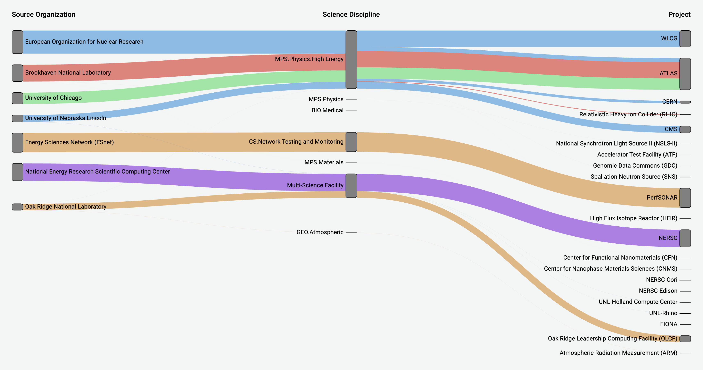

# Sankey panel

This documentation topic is designed
for Grafana workspaces that support **Grafana version
9.x**.

For Grafana workspaces that support Grafana version 10.x, see
[Working in Grafana version 10](using-grafana-v10.md "using-grafana-v10.md").

For Grafana workspaces that support Grafana version 8.x, see
[Working in Grafana version 8](using-grafana-v8.md "using-grafana-v8.md").

The Sankey panel shows Sankey diagrams, which are good for visualizing flow data,
with the width of the flow being proportional to the selected metric. The following
image shows a Sankey diagram with two groups of source and destinations.

**How it works**

The sankey panel requires at least 2 columns of data, a source and destination for
the flows. Your query should group your data into at least two groups. The panel
will draw links from the first column of data points, to the last in order of the
query. The thickness of the links will be proportionate to the value as assigned by
the metric in the query.

**Customizing**

- **Links** – There are currently two
  options for link color: multi or single. It is multi-colored by default. To
  choose a single color for the links, toggle the **Single Link color
  only** option and choose your color from Grafana's color
  picker.
- **Nodes** – You can change the color of
  the rectangular nodes by changing the **Node color**
  option
- **Node Width** – The width of the nodes
  can be adjusted with the **Node Width** slider or entering a
  number in the input box. This number must be an integer.
- **Node Padding** – The vertical padding
  between nodes can be adjusted with the **Node Padding** slider
  or entering a number in the input box. This number must be an integer. If your
  links are too thin, try adjusting this number
- **Headers** – The column headers can be
  changed by using a **Display Name** override in the editor
  panel. They will be the same color you choose for **Text
  color**
- **Sankey Layout** – The layout of the
  Sankey links can be adjusted slightly using the **Layout
  iteration** slider. This number must be an integer and is the
  number of relaxation iterations used to generate the layout.
