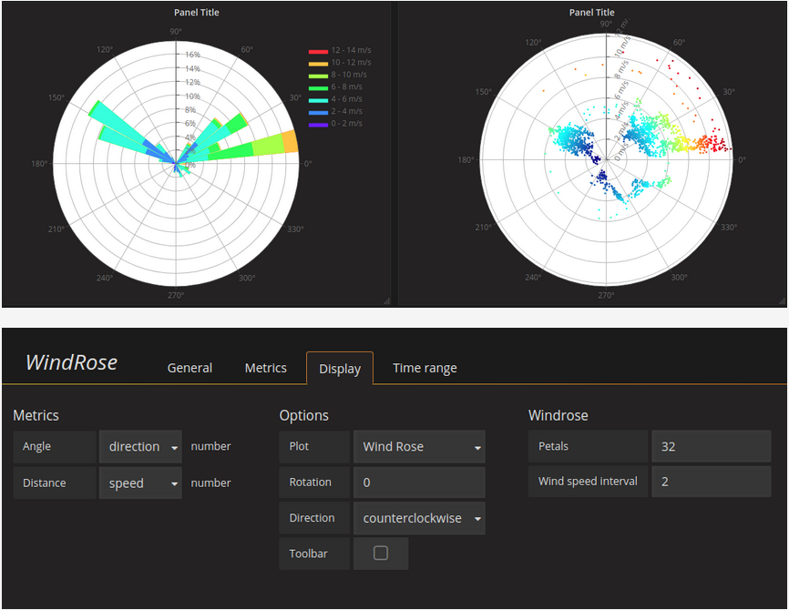

# WindRose

This documentation topic is designed
for Grafana workspaces that support **Grafana version
9.x**.

For Grafana workspaces that support Grafana version 10.x, see
[Working in Grafana version 10](using-grafana-v10.md "using-grafana-v10.md").

For Grafana workspaces that support Grafana version 8.x, see
[Working in Grafana version 8](using-grafana-v8.md "using-grafana-v8.md").

The WindRose panel receives raw time series data converts the data and maps it in a
WindRose chart.

## Options

The WindRose panel supports the following options:

- Axis frequency
- Axis style (degrees or compass)
- Scale (linear, square, log)
