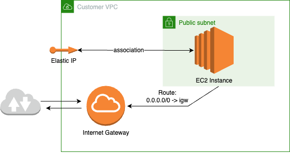
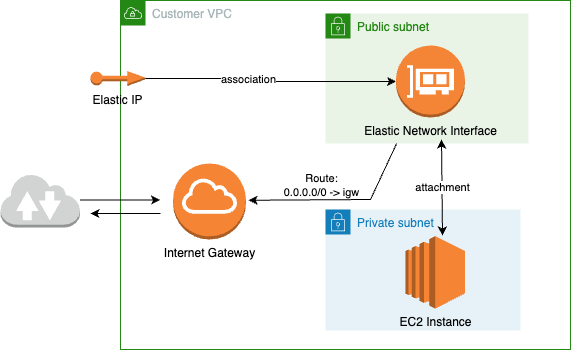

# Agent requirements

###### Note

This AWS Ground Station Agent guide assumes that you have onboarded to Ground Station using the [AWS Ground Station Getting started](../ug/getting-started.md "../ug/getting-started.md") guide.

The AWS Ground Station Agent receiver EC2 instance requires a set of dependent AWS resources to reliably and securely deliver DigIF data to your endpoints.

1. A VPC in which to launch the EC2 receiver.
2. An AWS KMS Key for data encryption/decryption.
3. An SSH key or EC2 Instance Profile configured for [SSM Session Manager](../../../systems-manager/latest/userguide/what-is-systems-manager.md "../../../systems-manager/latest/userguide/what-is-systems-manager.md").
4. Network/Security Group rules to allow the following:
   1. UDP traffic from AWS Ground Station on the ports specified in your dataflow endpoint group.
      The agent reserves a range of contiguous ports used to deliver data to the ingress dataflow endpoint(s).
   2. SSH access to your instance (Note: You can alternatively use AWS Session Manager to access your EC2 instance).
   3. Read access to a publicly accessible S3 bucket for agent management.
   4. SSL traffic on port 443 allowing the agent to communicate with the AWS Ground Station service.
   5. Traffic from the AWS Ground Station managed prefix list `com.amazonaws.global.groundstation`.

Additionally, a VPC configuration including a public subnet is required. Refer to the [VPC User Guide](../../../vpc/latest/userguide/configure-subnets.md "../../../vpc/latest/userguide/configure-subnets.md") for background on subnet configuration.

Compatible configurations:

1. An Elastic IP associated with your EC2 instance in a public subnet.
2. An Elastic IP associated with an ENI in a public subnet, attached to your EC2 instance (in any subnet in the same availability zone as the public subnet).
   You may use the same security group as your EC2 instance or specify one with at least the minimum set of rules consisting of:

- UDP traffic from AWS Ground Station on the ports specified in your dataflow endpoint group.

For example CloudFormation EC2 Data Delivery templates with these resources preconfigured, see
[Public broadcast satellite utilizing AWS Ground Station Agent (wideband)](../ug/examples.md "../ug/examples.md") .

## VPC diagrams

**Diagram: An Elastic IP associated with your EC2 instance in a public subnet**

**Diagram: An Elastic IP associated with an ENI in a public subnet, attached to your EC2 instance in a private subnet**

## Supported operating system

Amazon Linux 2 with 5.10+ kernel.

Supported instances types are listed in [Select Amazon EC2 instance and reserve CPU cores for your architecture](agent-instance-selection.md "agent-instance-selection.md")
