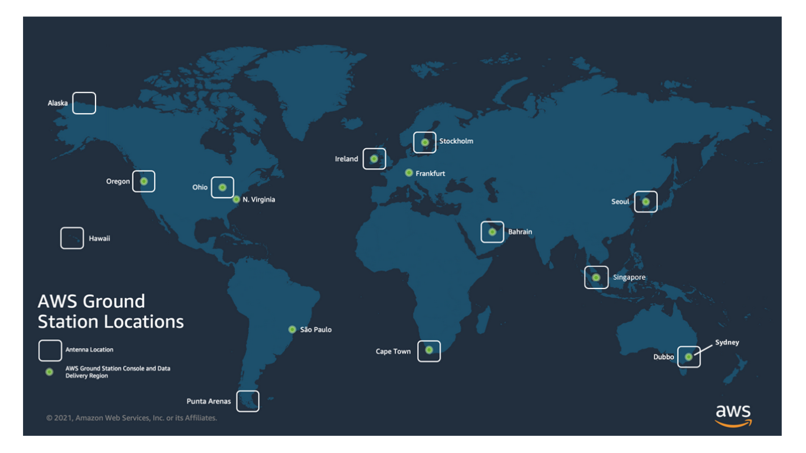

# AWS Ground Station Locations

AWS Ground Station provides a global network of ground stations in close proximity to our global network
of AWS infrastructure regions. You can configure your use of these locations from any
supported AWS Region. This includes the AWS Region in which data is delivered.

## Finding the AWS region for a ground station location

The AWS Ground Station global network includes ground station locations that are not physically located
in the [AWS Region](https://aws.amazon.com/about-aws/global-infrastructure/regions_az/ "https://aws.amazon.com/about-aws/global-infrastructure/regions_az/") to which they are connected.
The list of ground stations that you have access to can be retrieved via the AWS SDK [ListGroundStation](../APIReference/API_ListGroundStations.md "../APIReference/API_ListGroundStations.md") response.
The full list of ground station locations is presented below, with more coming soon. Please
refer to the onboarding guide to add or modify site approvals for your satellites.

| Ground Station Name | Ground Station Location | AWS Region Name           | AWS Region Code | Notes                                   |
| ------------------- | ----------------------- | ------------------------- | --------------- | --------------------------------------- | ----------------------------------------------------------------------------------------------------------------------------------------------------------------------------------------------------------------------------------------------------------------------------------------------------------------------------------------------------------------------------------------------------------------------------------------------------------------------------------------------------------------------------------------------------------------------------------------------------------------------------------------------------------------------------------------------------------------------------------------------------------------------------------------------------------------------------------------------------------------------------------------------------------------------------------------------------------------------------------------------------------------------------- |
| Alaska 1            | Alaska, USA             | US West (Oregon)          | us-west-2       | Not physically located in an AWS region |
| Bahrain 1           | Bahrain                 | Middle East (Bahrain)     | me-south-1      |                                         |
| Cape Town 1         | Cape Town, South Africa | Africa (Cape Town)        | af-south-1      |                                         |
| Dubbo 1             | Dubbo, Australia        | Asia Pacific (Sydney)     | ap-southeast-2  | Not physically located in an AWS region |
| Hawaii 1            | Hawaii, USA             | US West (Oregon)          | us-west-2       | Not physically located in an AWS region |
| Ireland 1           | Ireland                 | Europe (Ireland)          | eu-west-1       |                                         |
| Ohio 1              | Ohio, USA               | US East (Ohio)            | us-east-2       |                                         |
| Oregon 1            | Oregon, USA             | US West (Oregon)          | us-west-2       |                                         |
| Punta Arenas 1      | Punta Arenas, Chile     | South America (São Paulo) | sa-east-1       | Not physically located in an AWS region |
| Seoul 1             | Seoul, South Korea      | Asia Pacific (Seoul)      | ap-northeast-2  |                                         |
| Singapore 1         | Singapore               | Asia Pacific (Singapore)  | ap-southeast-1  |                                         |
| Stockholm 1         | Stockholm, Sweden       | Europe (Stockholm)        | eu-north-1      |                                         | ## AWS Ground Station supported AWS regions You can deliver data and configure your **Contacts** via the AWS SDK or the AWS Ground Station console from supported AWS Regions. You can view the supported regions and their associated endpoints at the [AWS Ground Station endpoints and quotas](../../../general/latest/gr/gs.md "../../../general/latest/gr/gs.md"). ## Digital twin availability [Use the AWS Ground Station digital twin feature](digital-twin.md "digital-twin.md") is available in all [AWS Regions](https://aws.amazon.com/about-aws/global-infrastructure/regional-product-services/ "https://aws.amazon.com/about-aws/global-infrastructure/regional-product-services/") where AWS Ground Station is available. Digital twin ground stations are exact copies of production ground stations with a modifying prefix to Ground Station Name of “Digital Twin ”. For example, "Digital Twin Ohio 1" is a digital twin ground station that is an exact copy of the "Ohio 1" production ground station. |
